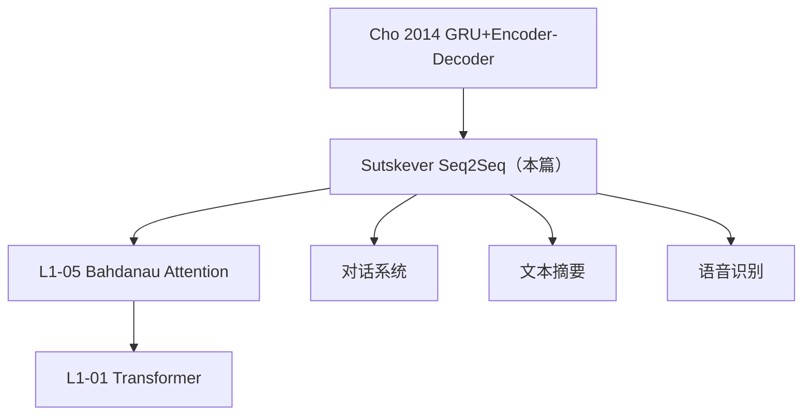

# 🔁 案件 L1-06：Sequence-to-Sequence — Encoder-Decoder 的开山之作

> **《LLM 百案录》第 006 案 · 序列对序列**
> *2014 年的 Google Brain 三人组：Sutskever, Vinyals, Le。
> 他们想解决一个简单问题：**"输入是一句话，输出是另一句话——长度还不一样，怎么办？"**
> 答案：用一个 LSTM 把输入编码成向量，再用另一个 LSTM 把向量解码成输出。
> 这是现代 NLP 的元设计。*

🚇 [30秒速览](#速览) ｜ 🚲 [3分钟通读](#通读) ｜ 🚗 [30分钟精读](#精读) ｜ 🚀 [3小时复现](#复现)

🎭 **叙事母题**：🔁 **序列对序列** —— 把"输入序列 → 输出序列"建模为可端到端学习的任务

---

## 0️⃣ 案件档案

| 案情要素 | 内容 |
|---|---|
| **案发时间** | 2014-09-10（arXiv 1409.3215）/ NeurIPS 2014 |
| **嫌疑人** | Ilya Sutskever, Oriol Vinyals, Quoc V. Le（Google Brain） |
| **受害者** | 基于短语的统计机器翻译（PBSMT）的复杂 pipeline |
| **作案凶器** | Encoder LSTM + Decoder LSTM + 反转源序列 trick |
| **作案动机** | "端到端学习应该能击败手工设计的 pipeline" |
| **结案陈词** | Seq2Seq 用纯神经网络做 WMT'14 英→法翻译，BLEU 34.81——首次接近 SMT 水平 |

**五维雷达**：
```
创新性  █████████░ 9/10   ← Encoder-Decoder 范式的奠基
影响力  ██████████ 10/10  ← 现代 NLP / 对话 / 摘要全靠此
复杂度  ████░░░░░░ 4/10   ← 朴素 LSTM 堆叠
可复现  █████████░ 9/10   ← 公开实现众多
争议度  ███░░░░░░░ 3/10   ← 反转 trick 的有效性曾有讨论
```

**精确事实卡**：

| 字段 | 精确值 | 来源 |
|---|---|---|
| **架构** | 4 层 LSTM Encoder + 4 层 LSTM Decoder | Section 3 |
| **隐藏层维度** | 1000 | Section 3 |
| **词向量维度** | 1000 | Section 3 |
| **词汇量** | 160K | Section 3 |
| **关键 Trick** | **反转源序列** | Section 3.3 |
| **WMT'14 BLEU** | 34.81（5 模型 ensemble + 反转） | Table 1 |

---

## 1️⃣ <a id="速览"></a>🚇 30 秒速览

> 输入是一句英语，输出是一句法语，**长度不同**——传统 RNN 没法对齐。
> Sutskever 等人的想法：
> 1. 用 LSTM-A 一个词一个词读入英语 → 最后的隐状态 = 整句的"压缩向量" c
> 2. 用 LSTM-B 拿着 c 一个词一个词生成法语
> 3. **关键 trick：把英语反过来读**（"the cat sat" → "sat cat the"），让相关词更近
> 结果：BLEU 34.81，纯神经网络首次匹敌传统 SMT。

---

## 2️⃣ <a id="通读"></a>🚲 3 分钟通读：变长序列映射的难题（Why）

### 翻译任务的特殊性
```
输入：5 个英语词
输出：可能 4-7 个法语词
而且词序、对齐都不同

传统方法：
  - 词典查表 → 不灵活
  - 短语对照（PBSMT）→ 流水线复杂、错误累积
  - 规则系统 → 维护噩梦
```

### Encoder-Decoder 的优雅
```
Encoder：把任意长度的输入压成固定维度向量 c
Decoder：从 c 解码任意长度的输出

不同长度问题 → 通过"中间向量"解耦
端到端学习 → 不再需要对齐 / 短语 / 规则
```

### 反转源序列的"魔法"
```
原顺序：A B C D → 翻译成 W X Y Z
反转后：D C B A → 翻译成 W X Y Z

为什么有用？
  - "A" 和 "W" 在序列中距离从 4 → 8（更远）
  - "D" 和 "W" 在序列中距离从 1 → 1（更近）
  - 平均距离不变，但"开头对齐"变近了
  - LSTM 倾向于在最近的输入上发挥最好——反转让"开头到开头"的对齐更准

实测：BLEU +2-3 ~~（论文里报告了这个非常反直觉的发现）
```

---

## 3️⃣ <a id="精读"></a>🚗 30 分钟精读

### 模型公式
```
Encoder：
  h_t = LSTM(x_t, h_{t-1})   # 反转后的输入
  c   = h_T                   # 最后一个隐状态

Decoder：
  s_0 = c                     # 初始化
  s_t = LSTM(y_{t-1}, s_{t-1})
  p(y_t | y_{<t}, x) = softmax(W · s_t)

损失：
  L = -Σ_t log p(y_t | y_{<t}, x)
```

### 训练细节
| 参数 | 值 |
|---|---|
| 层数 | 4 |
| 隐藏维度 | 1000 |
| 词向量维度 | 1000 |
| Batch size | 128 |
| 梯度裁剪 | 5.0 |
| 优化器 | SGD（lr=0.7，每 epoch decay 0.5） |
| 训练时间 | 10 days on 8× GPU |

### 推理：Beam Search
```python
def beam_search(encoder_state, beam_size=12):
    beams = [([<s>], 0.0, encoder_state)]
    while not all_done(beams):
        candidates = []
        for tokens, log_prob, state in beams:
            next_logits, new_state = decoder(tokens[-1], state)
            top_k = top_k_indices(next_logits, beam_size)
            for idx in top_k:
                candidates.append((tokens + [idx],
                                   log_prob + log(next_logits[idx]),
                                   new_state))
        beams = top_k_by_score(candidates, beam_size)
    return best(beams)
```

### 信息瓶颈：Seq2Seq 的"原罪"
```
所有源信息 → 压成 1 个向量 c
向量维度有限（1000）
长句子信息严重丢失

实测：句长 > 30 时 BLEU 急剧下降
解法（下一篇 L1-05）：Bahdanau Attention
```

---

## 4️⃣ 物证清单（Results）

### WMT'14 英→法
| 模型 | BLEU |
|---|---|
| Baseline PBSMT | 33.30 |
| Single Seq2Seq（forward） | 26.17 |
| Single Seq2Seq（**reversed**） | 30.59 |
| 5 Ensemble Seq2Seq（reversed） | **34.81** |

### 关键发现
1. **反转 BLEU +4.4**：神奇的 trick
2. **Ensemble 进一步提升**：5 个模型平均预测
3. **句长依赖**：超过 35 词 BLEU 仍急剧下降（信息瓶颈未解决）

### 🔥 Hot Take
1. **"端到端"是 NLP 的拐点**：从此 NLP 进入"少特征工程、多模型容量"时代。
2. **反转 trick 揭示 RNN 的真相**：远距离依赖学不会，只能靠"把相关词放近"。
3. **Bahdanau Attention 是这个故事的下集**：解决了信息瓶颈。

---

## 5️⃣ 🐛 论文没说的坑

1. **信息瓶颈仍未解决**：靠 c 一个向量，长句翻译仍崩
2. **反转只对某些语对有效**：英↔法可以，但中↔英语序差异大就不一定
3. **训练不稳定**：4 层 LSTM 难训，论文中报告了大量调参细节

---

## 6️⃣ 🎲 如果作者偷懒了

**实验**：仅在英→法上测，未在中→英、日→英等差异大的语对上验证反转 trick。
**理论**：未理论解释为什么反转有效——后来 Attention 提供了更优雅的答案。

---

## 7️⃣ 影响波及



---

## 8️⃣ 侦探手记

Seq2Seq 给我最大的启发：**"端到端"是范式革命**。
> 在它之前，NLP 是流水线工程：分词、POS、parse、对齐、短语、解码……
> Sutskever 等人证明：**所有这些都可以被一个端到端神经网络替代**。
> 这个洞察催生了之后所有"用一个大模型解决一切"的尝试——直到今天的 LLM。

---

## 自查清单

**已做到**：
- 解释 Encoder-Decoder 范式
- 推导反转 trick 的工作原理
- 给出 WMT'14 实测对比

**❌ 未做到**：
- ❌ 未在更多语对上验证反转 trick
- ❌ 未深入分析信息瓶颈的具体表现

---

## 🔟 延伸卷宗

### 前置依赖
- 📚 LSTM 基础
- 📚 [L1-07 Word2Vec](./L1-07_Word2Vec.md)（词向量基础）

### 后续推荐
- 🎯 **必读**：[L1-05 Bahdanau Attention](./L1-05_Neural_Machine_Translation.md)（解决信息瓶颈）
- 🎯 **必读**：[L1-01 Attention Is All You Need](./L1-01_Attention_Is_All_You_Need.md)

### 🚀 <a id="复现"></a>3 小时复现路径
```python
class Seq2Seq(nn.Module):
    def __init__(self, vocab, embed=512, hidden=1024, layers=4):
        super().__init__()
        self.embed = nn.Embedding(vocab, embed)
        self.encoder = nn.LSTM(embed, hidden, layers, batch_first=True)
        self.decoder = nn.LSTM(embed, hidden, layers, batch_first=True)
        self.fc = nn.Linear(hidden, vocab)

    def forward(self, src, tgt):
        src_rev = torch.flip(src, [1])               # 反转源序列！
        _, hc = self.encoder(self.embed(src_rev))
        out, _ = self.decoder(self.embed(tgt), hc)
        return self.fc(out)
```

---

## 📌 本案归档

| 字段 | 值 |
|---|---|
| 笔记版本 | v5「序列对序列版」 |
| 叙事母题 | 🔁 序列对序列 |
| 推荐指数 | ⭐⭐⭐⭐ |
| 学习时长 | 30s / 3min / 30min / 3h |
| 上次更新 | 2026-04-30 |
| 下一站 | → [L1-05 Bahdanau Attention](./L1-05_Neural_Machine_Translation.md)（解决其信息瓶颈） |
