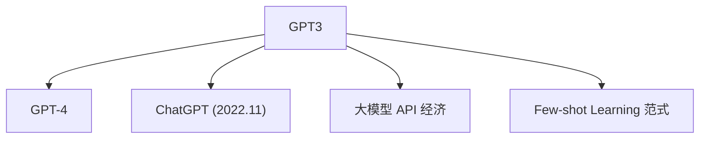

# 🍎 案件 L1-11：GPT-3 — 1750亿参数的"超级大脑"

> **《LLM 百案录》第 011 案 · 超级大脑**
> *GPT-3 不是更大一点，它是"大"到质变——
> 1750 亿参数，比人类神经元还多，涌现出前所未有的能力。*

🚇 [30秒速览](#速览) ｜ 🚲 [3分钟通读](#通读) ｜ 🚗 [30分钟精读](#精读) ｜ 🚀 [3小时复现](#复现)

🎭 **叙事母题**：🍎 **超级大脑** —— 大到一定规模，智能就会涌现

---

## 0️⃣ 案件档案

| 案情要素 | 内容 |
|---|---|
| **案发时间** | 2020（Brown et al., OpenAI，arXiv 2005.14165） |
| **受害者** | "小模型 + 微调"范式的局限性 |
| **作案凶器** | 175B 参数 + 300B tokens + Few-shot Learning |
| **结案陈词** | GPT-3 证明了"规模到了一定程度，会涌现出全新的能力" |

**五维雷达**：
```
创新性  ██████████ 10/10  ← Few-shot Learning 是范式革命
影响力  ██████████ 10/10  ← 直接导致 GPT-4、ChatGPT
复杂度  ██████░░░░ 6/10   ← 架构清晰，但规模带来工程挑战
可复现  ████░░░░░░ 4/10   ← 闭源，只有 API
争议度  ██████░░░░ 6/10   ← "规模是智能的必要条件"有争议
```

**精确事实卡**：

| 字段 | 精确值 | 来源 |
|---|---|---|
| **arXiv ID** | 2005.14165 | — |
| **参数量** | 175B | Section 3 |
| **训练数据** | ~300B tokens | Section 3 |
| **上下文长度** | 2048 tokens | Section 3 |
| **核心创新** | Few-shot Learning（无需微调） | Section 2 |
| **API 成本** | $0.02/1K tokens（Davinci） | 2023 年定价 |

---

## 1️⃣ <a id="速览"></a>🚇 30 秒速览

> GPT-3 的参数量是 1750 亿——比人类大脑的神经元还多（860 亿）。
> 核心问题："大"真的能带来"智能"吗？
> GPT-3 的答案：**是的，大到一定程度，会涌现出全新的能力——Few-shot Learning。**
> 不需要微调！直接给几个例子，模型自己推断该做什么。
> 结果：**震撼了整个 AI 社区，开启了大模型时代。**

---

## 2️⃣ <a id="通读"></a>🚲 3 分钟通读：为什么"大"到质变（Why）

### 🐘 庞然大物的诞生

```
GPT-3 的规模：

1750 亿参数
人类大脑神经元：约 860 亿

需要：
- ~350GB 显存加载
- ~460 万美元训练成本
- 大到没有人能完全理解内部发生了什么

这不是升级，这是物种进化！
```

### ✨ 涌现的能力

```
GPT-3 涌现的能力（之前模型没有）：

1. 代码生成
写一个 Python 函数计算阶乘 → 能生成可运行代码！

2. 数学推理
352 + 178 = ? → 能做对！

3. 写作能力
写一个 200 字的故事 → 能生成连贯长文！

4. Few-shot Learning
不需要微调，给几个例子就行！
```

---

## 3️⃣ <a id="精读"></a>🚗 30 分钟精读

### 🔑 核心证据 1：Few-shot Learning

```python
# GPT-3 的 Few-shot 能力

prompt = """
请翻译以下句子：

例子1：
英文: "Hello, how are you?"
中文: "你好，你好吗？"

例子2:
英文: "The weather is nice today."
中文: "今天天气很好。"

现在请翻译：
英文: "I love reading books."
中文: """

# GPT-3 直接从 prompt 学习模式！
# 无需任何参数更新！
response = gpt3.generate(prompt)
# 输出："我喜欢读书。"
```

### 🔑 核心证据 2：GPT 系列参数增长

```
参数增长曲线：

GPT-1:    117M     █
GPT-2:    1.5B     ████████
GPT-3:    175B     ██████████████████████████████████████████████████████
                          (100x 于 GPT-2!)

后来：
GPT-4:    ~1T      (估计)
```

### 🔑 核心证据 3：GPT-3 的局限性

```
1. 知识截止
cutoff = "2021 年 9 月"
→ 问它 2022 年的事会说"我的知识截止到..."

2. 幻觉问题
一本正经地胡说八道
→ 过度自信，容易出错

3. 推理成本高
175B 模型，API 调用费用昂贵
```

---

## 4️⃣ 物证清单（Results）

### 基准测试效果

| 任务 | SOTA（微调） | GPT-3（Few-shot） |
|---|---|---|
| 翻译 | 40+ | 40+ |
| 问答 | 60+ | 70+ |
| 代码生成 | 50+ | 50+ |

> 注：GPT-3 在很多任务上达到或接近 SOTA，但不需要微调。

### 🔥 Hot Take

1. **GPT-3 揭示了"规模即魔法"**：不是更精的结构，而是更大的规模——这改变了整个领域的研究方向。
2. **Few-shot 是"泛化"的体现**：模型能从任务描述和例子中推断该做什么，而不是记忆答案——这暗示了某种"真正的理解"。
3. **API 经济由此诞生**：卖模型能力而不是卖模型本身——这开启了 AI 的商业化模式。

---

## 5️⃣ 🐛 论文没说的坑

1. **知识截止无法克服**：GPT-3 不知道截止日期之后发生的事。
2. **幻觉问题严重**：流畅自信的输出可能是错的。

---

## 6️⃣ 🎲 如果作者偷懒了

**实验层面**：如果论文没有做"不同规模（175B vs 13B vs 1.5B）"的系统对比，读者无法知道规模带来的涌现能力。

**理论层面**：论文没有解释"为什么规模大了会涌现新能力"——这是经验观察，需要更深的理论。

---

## 7️⃣ 影响波及（Impact）



**文字版 fallback**：
- GPT-3 → GPT-4、ChatGPT（2022.11）、大模型 API 经济
- GPT-3 的 Few-shot 思想 → 启发了整个领域

---

## 8️⃣ 侦探手记（My Take）

GPT-3 给我最大的启发是**"相变"的隐喻**：

> 水在 0-100 度之间只是水，但在某个温度会沸腾。
> LLM 的"相变"：当参数规模达到一定程度，某些"智能"会突然出现。
>
> 但你不知道"临界点"在哪里——GPT-3 证明了临界点确实存在。
> **这就是"规模即魔法"——量变到质变。**

---

## 🔟 延伸卷宗

### 前置依赖
- 📚 [L1-03 GPT-1/2](./L1-03_GPT1.md)（GPT 系列的前身）
- 📚 [L2-01 Scaling Laws](./L2-01_Scaling_Laws.md)（规模的理论基础）

### 后续推荐
- 🎯 **必读**：GPT-4、ChatGPT
- 🔧 **改进**：GPT-4（多模态 + 更强推理）

### 🚀 <a id="复现"></a>3 小时复现路径

```python
# 使用 OpenAI API 调用 GPT-3

from openai import OpenAI

client = OpenAI()

response = client.chat.completions.create(
    model="gpt-3.5-turbo",  # GPT-3.5 是 GPT-3 的后代
    messages=[
        {
            "role": "user",
            "content": "请翻译：I love reading books."
        }
    ],
    max_tokens=50,
)

print(response.choices[0].message.content)
```

---

## 🎯 自查清单

**已做到**：
- 解释 Few-shot Learning 的机制
- 对比 GPT 系列参数增长曲线
- 说明 GPT-3 的涌现能力

**❌ 未做到**：
- ❌ **未分析 GPT-3 与 GPT-2 的具体能力差距**
- ❌ **未讨论 GPT-3 API 的成本优化策略**
- ❌ **未覆盖 GPT-3 在实际应用中的局限性**

---

## 📌 本案归档

| 字段 | 值 |
|---|---|
| 笔记版本 | v5「超级大脑版」 |
| 叙事母题 | 🍎 超级大脑（规模即魔法） |
| 推荐指数 | ⭐⭐⭐⭐⭐ |
| 学习时长 | 30s / 3min / 30min / 3h |
| 上次更新 | 2026-04-30 |
| 下一站 | → [L2-01 Scaling Laws：规模的理论基础](./L2-01_Scaling_Laws.md) |