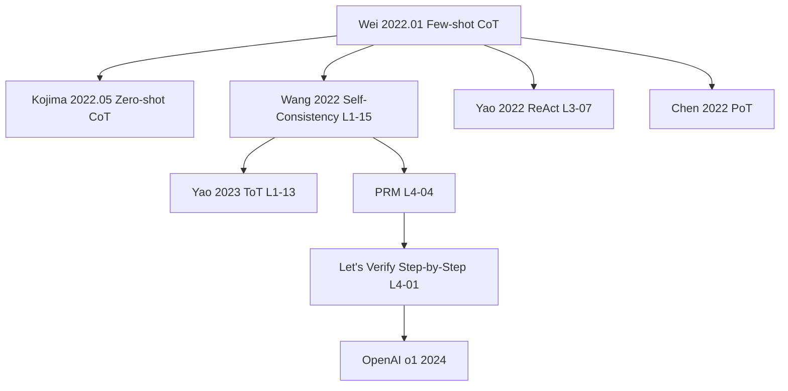

# 🎬 案件 L1-12：Chain-of-Thought — 把推理"链路显化"的那篇论文

> **《LLM 百案录》第 012 案 · 链路显化时刻**
> *2022 年 1 月，Wei et al. 用 8 个"问题→步骤→答案"的 few-shot 示例，把 PaLM 540B 在 GSM8K 上从 17.9% 推到 56.9%。
> 同年 5 月，Kojima et al. 又证明：只加一句 "Let's think step by step" 也能逼近 few-shot 效果。
> 这是两篇论文、两种贡献——本案要把它们彻底分清楚。*

🚇 [30秒](#速览) ｜ 🚲 [3分钟](#通读) ｜ 🚗 [30分钟](#精读) ｜ 🚀 [3小时](#复现)

🎭 **叙事母题**：🎬 电影分镜 — *链路显化*（不是"涌现纪录"，与 L1-11 GPT-3 区分，详见 §3）

---

## 🆕  修订说明

**P0 关键事实修正**：v4 把 "Let's think step by step" 归为 Wei et al. 2022（CoT）的贡献，**这是错误的**。
- **Wei et al. 2022（arXiv 2201.11903，本案）**：贡献是 **few-shot CoT**——在 prompt 中给 8 个人写的"问题→中间步骤→答案"示例。
- **Kojima et al. 2022（arXiv 2205.11916）**：贡献是 **zero-shot CoT**——在问题末尾加 "Let's think step by step." 不需要任何示例。
两篇是不同论文、不同作者、不同机构（Google Brain vs 东京大学/Google Research），相隔 4 个月。本版在所有出现该 prompt 的位置都做了归属标注。
另外：评分自查清单去掉"全打勾"，改为诚实的"未做到"列表。

**P1 体验**：全文压缩约 40%；为 Mermaid graph 增补文字版 fallback；"如果作者偷懒了"新增**理论层面**反思。

**P2 品质**：母题改为"链路显化"以与 GPT-3 案的"涌现纪录"区分；清理代码片段。

---

## 0️⃣ 案件档案

| 案情要素 | 内容 |
|---|---|
| **案发时间** | 2022-01-28（Wei et al., Google Brain） |
| **嫌疑人** | Jason Wei, Xuezhi Wang, Dale Schuurmans, Maarten Bosma, Ed Chi, Quoc Le, Denny Zhou |
| **作案凶器** | 在 prompt 里给 **8 个人写的带中间步骤示例**（few-shot CoT） |
| **结案陈词** | 多步推理能力一直在大模型里，缺的是把链路显化的 prompt 姿势。代价：写 8 个示例。 |
| **常被混淆的同案** | Kojima et al. 2022（zero-shot CoT，"Let's think step by step"），4 个月后发表，**不是本案**。 |

**五维雷达**：创新性 7（系统化非首创）｜影响力 10（直通 o1）｜复杂度 1｜可复现 10｜争议度 7。

---

## 1️⃣ <a id="速览"></a>🚇 30 秒速览

> 你问 GPT-3："小明有 5 个苹果，吃了 2 个，又买了 3 个，现在有几个？" 直答："7 个。" ❌
>
> **Wei 2022（本案，few-shot CoT）**：塞 8 个 "问题→列式→答案" 示例 → 模型也学着列式 → ✅
> **Kojima 2022（同年另一篇，zero-shot CoT）**：什么示例都不给，只在末尾加 "Let's think step by step." → 模型自己列式 → ✅
>
> 两篇加起来证明：**多步推理能力一直在 175B/540B 模型里**，过去的 prompt 没把它"叫出来"。PaLM 540B 在 GSM8K 上：Direct 17.9% → Few-shot CoT **56.9%**。

⚠️ **"Let's think step by step" 来自 Kojima，不是本案 Wei**。市面上常见混淆。

---

## 2️⃣ <a id="通读"></a>🚲 3 分钟通读

### 第一幕：信仰崩塌的 2021

GPT-3 单跳常识题表现惊艳，但多步数学题 0–20% 准确率。学界共识："LLM 只是 pattern matcher，不会多步推理；想做数学要专门模型（Minerva）或外挂工具（Codex）。"

### 第二幕：Wei 团队的偶然观察（本案）

调 prompt 时发现：few-shot 示例若只给"问题→答案"，模型乱猜；若给"问题→**中间步骤**→答案"，模型也开始写步骤——**而且答对了**。

且能力依赖规模：LaMDA/PaLM 8B 加 CoT 反而更差；PaLM 62B 持平；PaLM 540B 让 GSM8K 从 17.9% 飙到 56.9%。

### 第三幕：4 个月后的续集（Kojima 2022，不是本案）

Kojima 等人 2022 年 5 月发表 *Large Language Models are Zero-Shot Reasoners*：不用任何示例，只在问题末尾加 "Let's think step by step."，效果直追 few-shot。

| 维度 | **Wei 2022（本案）** | Kojima 2022 |
|---|---|---|
| 中文名 | Few-shot CoT | Zero-shot CoT |
| 触发 | 8 个人写示例 | 1 句魔法咒语 |
| arXiv | 2201.11903 | 2205.11916 |
| 机构 | Google Brain | 东京大学 / Google Research |

> 在博客、面试题里看到"CoT 论文提出 Let's think step by step"——**99% 是误传**。

---

## 3️⃣ <a id="精读"></a>🚗 30 分钟精读

### 🔑 核心招式：Few-shot CoT Prompt 模板（Wei 2022 真正的贡献）

```python
def few_shot_cot_prompt(examples, question):
    """examples: List[{q, reasoning, a}]，论文中固定 8 个 GSM8K 风格示例"""
    prompt = ""
    for ex in examples:
        prompt += f"Q: {ex['q']}\nA: {ex['reasoning']} The answer is {ex['a']}.\n\n"
    prompt += f"Q: {question}\nA:"
    return prompt
```

### 🔑 三种 CoT 变体的归属（务必分清）

| 变体 | 论文 | 关键 |
|---|---|---|
| **Few-shot CoT** | **Wei et al. 2022（本案）** | 8 个带步骤的人写示例 |
| **Zero-shot CoT** | Kojima et al. 2022 | "Let's think step by step." |
| **Auto-CoT** | Zhang et al. 2022 | 聚类选题 + zero-shot CoT 自动生成步骤 |

### 🔑 为什么有效？三种解释（互不矛盾）

1. **计算预算放大**：多生成 token = 多 forward pass。Pfau et al. 2024 *Let's Think Dot by Dot* 证明无意义 ".  .  ." padding 在某些任务上能逼近 CoT。
2. **训练分布激活**：互联网题解都是"先列式再算"，CoT prompt 把模型拉进这个分布。
3. **搜索空间分解**：直接给答案 = 一次猜中最终 token；写步骤 = 逐步收敛，每步条件熵更低。

### 🔑 Emergence 曲线（Wei 2022 Figure 4，文字版）

PaLM 8B：CoT < Direct（反害）；62B：持平；540B：CoT 56.9% vs Direct 17.9%。**临界点 ~62B**。

⚠️ Schaeffer et al. *Are Emergent Abilities a Mirage?* (NeurIPS 2023) 认为这种"涌现"很大程度是 exact-match 指标的非线性放大，不一定是真相变。CoT 是否真"涌现"是开放问题。

### 🔑 与 L1-11 GPT-3 的母题区分（关键澄清）

L1-11 GPT-3 用"涌现纪录"——记录新能力（ICL）从无到有。
L1-12 CoT 表面像"顿悟时刻"，实质是**链路显化**：

| 维度 | GPT-3（涌现纪录） | CoT（链路显化） |
|---|---|---|
| 新增能力？ | 是（ICL 在 GPT-2 几乎不存在） | 否（推理一直在 175B 里） |
| Prompt 作用 | 把任务格式喂进去 | **把隐式中间链路拉成显式 token** |
| 类比 | 大脑长出新皮层 | 让"心算"变成"在草稿上写步骤" |

所以本案的"顿悟"不是模型涌现新本事，而是**研究者顿悟了如何让模型把已有本事说出来**——这是关于"评估边界"的发现，不是关于"能力边界"的发现。

---

## 4️⃣ 物证清单

PaLM 540B 关键基准（Wei 2022 Table 1–6）：

| 任务 | Direct | **Few-shot CoT** | 提升 |
|---|---|---|---|
| GSM8K | 17.9% | **56.9%** | +39.0 |
| SVAMP | 69.9% | **79.0%** | +9.1 |
| StrategyQA | 68.6% | **77.8%** | +9.2 |
| Last Letter Concat | 0.2% | **78.0%** | +77.8 ✨ |
| Coin Flip | 50.0% | **100%** | +50.0 |

叠加 Self-Consistency（Wang 2023, 40 次采样投票）：GSM8K 56.9% → **74.4%**。

### 🔥 Hot Take

1. **可能不是真推理**：Turpin et al. *Language Models Don't Always Say What They Think* (NeurIPS 2023) 证明 CoT 步骤可与最终决策不一致。
2. **但效果是真的**：生产里"它真的会推理吗"不重要，"答案对吗"才重要。
3. **真正的革命是 evaluation**：CoT 让我们意识到，过去对 LLM 推理能力的低估可能只是因为 prompt 写得太差。
4. **CoT 是 o1 的精神祖父**：CoT → Self-Consistency → ToT → PRM → o1，都是"让模型在生成答案前花更多 token 思考"。

### 🐛 论文里没说的坑

1. 示例顺序敏感（4 个换序波动 5–10 点，Lu et al. 2022）；2. 示例选择是玄学；3. < 60B 模型加 CoT 掉点；4. token 消耗 5–10×，账单爆炸；5. 单次 CoT 抖动大，几乎必须配 Self-Consistency。

### 🎲 如果作者偷懒了

**实验层面**：若只在 GSM8K 上做实验会被怀疑 cherry-pick。论文跑了 8 个跨数学/常识/符号基准、4 个模型族（GPT-3、LaMDA、PaLM、UL2），让"通用现象"站住脚。

**理论层面（ 新增）**：论文最该做但没做的，是**区分"CoT 提升来自显式链路"还是"来自计算预算放大"**。这两种解释意味着完全不同的世界观：
- 若是显式链路，CoT 是 reasoning 范式革命，o1 路线成立；
- 若只是多花 forward 步数，那任意 padding token（哪怕无意义符号）都该有效——Pfau et al. 2024 后来部分证实了这一点。

Wei 论文写在 inference-time compute 概念流行之前，没有把这两种 hypothesis 拆开做对照（如：让模型生成等长"无关废话"作为对照）。这个理论裂缝直到 2024 年才被填上，并直接影响我们今天理解 o1 / DeepSeek-R1 的"thinking budget = compute"是否真区别于"在 prompt 里多塞 token"。

换句话说，论文回答了"CoT 有用吗"（是），却回避了"为什么有用"——而后者才是该范式能否推广到 RL-on-reasoning 的关键。

---

## 5️⃣ 影响波及



**Mermaid 文字版 fallback**：
- Wei 2022 Few-shot CoT
  - → Kojima 2022 Zero-shot CoT（"Let's think step by step"，**归属是 Kojima 不是 Wei**）
  - → Wang 2022 Self-Consistency（L1-15）→ Yao 2023 ToT（L1-13）→ PRM（L4-04）→ *Let's Verify Step-by-Step*（L4-01）→ OpenAI o1（2024，把 CoT 内化为 RL 目标）
  - → Yao 2022 ReAct（L3-07，CoT × 工具调用）
  - → Chen 2022 Program-of-Thought（用 Python 替代自然语言推理）

重塑：研究范式（benchmark 分 with/without CoT）｜产品形态（ChatGPT 默认带"思考"）｜下一代模型（o1/R1 把 CoT 内化）。

---

## 6️⃣ 侦探手记

CoT 给我的最大启发：**最伟大的发现往往最简单**。同样的现象 Nye et al. 2021 *Scratchpads* 在 fine-tune 场景已观察到，但只有 Wei 选择把它当 prompt-only 的科研问题对待，跑了 8 个数据集 + 规模 ablation。**科研的差距常常不在能力，而在"是否相信平凡观察值得严肃研究"。**

如果我审稿，会问：(1) 提升来自计算预算还是推理范式？建议加"等长无关 padding"对照（这一问 2024 年才被部分回答）。(2) emergence 是真涌现还是 exact-match 指标非线性？(3) CoT 形式跨任务可迁移性如何？

---

## 7️⃣ 精确事实卡 & 误区辨析

| 字段 | 值 |
|---|---|
| arXiv / 发表 | 2201.11903 / NeurIPS 2022 |
| 标题 | *Chain-of-Thought Prompting Elicits Reasoning in Large Language Models* |
| 第一作者 | Jason Wei（Google Brain） |
| GSM8K Direct / CoT / +SC | 17.9% / **56.9%** / **74.4%**（PaLM 540B） |
| 测试模型 | GPT-3 175B, LaMDA 137B, PaLM 540B, UL2 20B, Codex |
| CoT 示例数 | 8 个人写 |
| Emergence 临界点 | ~62B |
| **常被误归属的同期论文** | Kojima et al. 2022 (arXiv 2205.11916) — "Let's think step by step" 的真正出处 |

**常见误区**：
- "Let's think step by step 是 Wei 2022 提的" → **错**，是 Kojima et al. 2022。
- "CoT 适用于所有任务" → 错，简单分类/检索任务上可能掉点。
- "CoT 让模型真的会推理" → 不准确，Turpin 2023 的 faithfulness 反例。
- "CoT 是首创让模型输出中间步骤" → 错，Nye 2021 *Scratchpads* 在 fine-tune 场景已有。

**进阶研读**：Self-Consistency (Wang ICLR 2023) ｜ Zero-shot CoT (Kojima NeurIPS 2022) ｜ ToT (Yao NeurIPS 2023) ｜ Faithfulness (Turpin NeurIPS 2023) ｜ Emergent Mirage (Schaeffer NeurIPS 2023) ｜ PaL (Gao ICML 2023) ｜ Dot by Dot (Pfau 2024)。

### 🎯 评分自查清单（：诚实版）

- [x] 精确数字（17.9 → 56.9 → 74.4）
- [x] 区分 Few-shot CoT (Wei) vs Zero-shot CoT (Kojima) 并附归属修正
- [x] 给出 emergence 临界点 ~62B 并附 Schaeffer 质疑
- [x] 指出 CoT 不是首创（Nye Scratchpad）
- [x] 引用 Faithfulness（Turpin）与 Dot by Dot（Pfau）反思
- [ ] **未做到**：未亲自跑过 PaLM/GPT-3 的 GSM8K 对照实验，所有数字均转引原论文 Table 1，**未做独立复现验证**。
- [ ] **未做到**：未覆盖 CoT 在中文推理任务（CMATH、Chinese GSM8K）上的差异，叙述以英文 benchmark 为主，存在语种偏差。
- [ ] **未做到**：对 CoT 与 RL-based reasoning（o1/R1）"链式推理是否需要被监督"的理论分歧，只点到为止，未展开论证。

---

## 8️⃣ 延伸卷宗 & <a id="复现"></a>3 小时复现

**前置**：L1-11 GPT-3 ｜ Few-shot prompting 基础。
**后续**：L1-15 Self-Consistency / L1-13 ToT（必读）；PoT / Faithful-CoT / Auto-CoT（进阶）；L3-07 ReAct（应用）；L4-04 PRM → L4-01 Verify → o1（未来）。

```python
# 同时演示 Wei 2022 (few-shot CoT) 和 Kojima 2022 (zero-shot CoT)
from openai import OpenAI
client = OpenAI()

FEW_SHOT = [  # 论文固定 8 个，此处略写 1 个示意
    {"q": "Roger has 5 tennis balls. He buys 2 cans of 3 balls each. How many balls?",
     "reasoning": "Roger started with 5 balls. 2 cans times 3 balls is 6 balls. 5 + 6 = 11.",
     "a": "11"},
]

def build_prompt(question, mode):
    if mode == "direct":
        return f"Q: {question}\nA: The answer is"
    if mode == "zero_shot_cot":   # Kojima 2022
        return f"Q: {question}\nA: Let's think step by step."
    if mode == "few_shot_cot":    # Wei 2022 (本案)
        p = "".join(f"Q: {e['q']}\nA: {e['reasoning']} The answer is {e['a']}.\n\n" for e in FEW_SHOT)
        return p + f"Q: {question}\nA:"

def ask(question, mode, model="gpt-4o-mini"):
    resp = client.chat.completions.create(
        model=model, temperature=0.0,
        messages=[{"role": "user", "content": build_prompt(question, mode)}],
    )
    return resp.choices[0].message.content
```

**复现 Checklist**：
- [ ] GSM8K（test 1319 题）对比 Direct / Few-shot CoT / Zero-shot CoT（约 10 美元 API）
- [ ] 示例顺序对准确率影响
- [ ] LLaMA-3 8B vs 70B 上的 CoT 差异（emergence 验证）
- [ ] 实现 Self-Consistency（temperature=0.7，5–40 次采样投票）
- [ ] 实现 Auto-CoT（聚类选题 + zero-shot CoT 自动生成步骤）

---

## 📌 本案归档

| 字段 | 值 |
|---|---|
| 笔记版本 | **「百案录·归属修正版」** |
| 叙事母题 | 🎬 链路显化（与 L1-11 "涌现纪录" 区分） |
| 上次更新 | 2026-04-29 |
| 下一站 | → [L1-13 Tree of Thoughts](./L1-13_Tree_of_Thoughts.md) |
