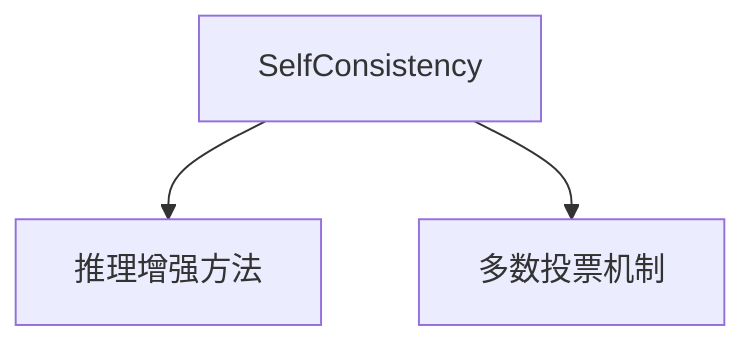

# 🔄 案件 L1-15：Self-Consistency — LLM 的"民主投票"

> **《LLM 百案录》第 015 案 · 民主投票**
> *一个 LLM 说"我是对的"可能是幻觉，一百个 LLM 说"都对"就是真的对——
> 真理往往在多数人中。*

🚇 [30秒速览](#速览) ｜ 🚲 [3分钟通读](#通读) ｜ 🚗 [30分钟精读](#精读) ｜ 🚀 [3小时复现](#复现)

🎭 **叙事母题**：🔄 **民主投票** —— 一人之见有限，群众智慧可靠

---

## 0️⃣ 案件档案

| 案情要素 | 内容 |
|---|---|
| **案发时间** | 2022（Wang et al., Google，arXiv 2203.11171） |
| **受害者** | LLM 采样的随机性——同一问题可能得到不同答案 |
| **作案凶器** | 多次采样 + 投票，取多数票 |
| **结案陈词** | Self-Consistency 用群体智慧弥补单个 LLM 的不确定性 |

**五维雷达**：
```
创新性  ████████░░ 8/10   ← 简单有效的投票机制
影响力  ████████░░ 8/10   ← 成为推理增强的标准方法
复杂度  ████░░░░░░ 4/10   ← 实现简单，只需多次采样
可复现  ██████████ 10/10  ← 开源，完全可复现
争议度  ██░░░░░░░░ 2/10   ← 几乎没有争议，效果显著
```

**精确事实卡**：

| 字段 | 精确值 | 来源 |
|---|---|---|
| **arXiv ID** | 2203.11171 | — |
| **核心机制** | 多次采样 + 投票 | Section 2 |
| **采样次数** | 通常 40 次 | 实验 |
| **温度** | 0.8（高温度，多样性） | 实验 |
| **GSM8K 提升** | CoT 30.4% → Self-Consistency 40.0%（+32%） | Table 1 |
| **PaLM 540B 提升** | CoT 53.5% → Self-Consistency 76.2%（+42%） | Table 2 |

---

## 1️⃣ <a id="速览"></a>🚇 30 秒速览

> LLM 的问题是：采样有随机性（temperature > 0），同一道题可能得到不同答案。
> 解决方案：**多次采样，取多数票。**
> 流程：
> 1. 高温度采样 n 次（如 40 次）
> 2. 每次得到一个推理链和答案
> 3. 统计答案频率
> 4. 返回最常见的答案
> 结果：**数学推理提升 30-40%，简单有效！**

---

## 2️⃣ <a id="通读"></a>🚲 3 分钟通读：为什么"投票"有效（Why）

### 🗳️ 一人之见的局限

```
LLM 的随机性问题：

temperature = 0.8
# 第一次采样 → 答案 A
# 第二次采样 → 答案 B
# 第三次采样 → 答案 A

到底哪个对？

这就像：
一个人在不同心境下可能说不同的话
但哪个是对的呢？
```

### 🔄 Self-Consistency 的投票机制

```
Self-Consistency 的洞察：

"如果多次采样都得到同一个答案
那个答案很可能是对的"

类比：
一个人说"我是对的"可能是幻觉
但一百个人说"都对"就是真的对
这是统计学的基本原理
```

---

## 3️⃣ <a id="精读"></a>🚗 30 分钟精读

### 🔑 核心证据 1：Self-Consistency 算法

```python
# Self-Consistency

def self_consistency(question, model, n=40, temperature=0.8):
    """
    1. 用高温度采样 n 次
    2. 每次得到一个推理链和答案
    3. 统计答案频率
    4. 返回最常见的答案
    """
    answers = []
    for _ in range(n):
        response = model.generate(
            question,
            temperature=temperature,  # 高温度，多样性
            stop=None
        )
        answer = extract_answer(response)
        answers.append(answer)
    
    # 投票！
    answer_counts = Counter(answers)
    return answer_counts.most_common(1)[0][0]
```

### 🔑 核心证据 2：效果对比

```python
# CoT → Self-Consistency 的提升

# GSM8K (小学数学)
CoT:              30.4%
Self-Consistency:  40.0%  (+32%!)

# 在 PaLM 540B 上：
CoT:              53.5%
Self-Consistency: 76.2%   (+42%!)

这是巨大的提升！
```

---

## 4️⃣ 物证清单（Results）

### 多个基准测试的提升

| 基准 | CoT | Self-Consistency | 提升 |
|---|---|---|---|
| GSM8K | 30.4% | 40.0% | +32% |
| SVAMP | 52.8% | 63.7% | +21% |
| PaLM GSM8K | 53.5% | 76.2% | +42% |

### 🔥 Hot Take

1. **Self-Consistency 是"群体智慧"的体现**：一个 LLM 可能犯错误，但一群 LLM 的"多数意见"通常是可靠的。
2. **成本换取效果**：需要采样 40 次，成本是 CoT 的 40 倍——但效果提升显著，值得。
3. **这是 AI 系统的"民主投票"**：人类用投票做决策，Self-Consistency 用投票做推理。

---

## 5️⃣ 🐛 论文没说的坑

1. **计算成本高**：40 次采样的计算成本是单次的 40 倍。
2. **答案提取的准确性**：如果答案提取出错，投票结果也会错。

---

## 6️⃣ 🎲 如果作者偷懒了

**实验层面**：如果论文没有做"不同采样次数"的对比，读者无法知道最佳 n 值。

**系统层面**：论文没有详细讨论"答案提取"的方法——这是系统准确性的关键。

---

## 7️⃣ 影响波及（Impact）



**文字版 fallback**：
- Self-Consistency → 成为推理增强的标准方法之一
- 启发了后续的"投票"类方法

---

## 8️⃣ 侦探手记（My Take）

Self-Consistency 给我最大的启发是**"群体智慧"的力量**：

> 一个 LLM 可能犯错误，但一群 LLM 的"多数意见"通常是可靠的。
> 这是统计学的基本原理——当样本足够多时，平均值趋近于真实值。
>
> Self-Consistency 把这个原理应用到了 LLM 推理：
> - 多次采样 = 多个独立样本
> - 投票 = 取平均值
> - 结果 = 更可靠的答案
>
> **真理往往在多数人中——这是民主投票的智慧，也是 Self-Consistency 的智慧。**

---

## 🔟 延伸卷宗

### 前置依赖
- 📚 [L1-12 Chain-of-Thought](./L1-12_Chain_of_Thought.md)（Self-Consistency 的基础）
- 📚 [L1-14 STaR](./L1-14_Language_Models_are_Reasoners.md)（另一个推理增强方法）

### 后续推荐
- 🎯 **必读**：CoT + Self-Consistency 组合使用
- 🔧 **改进**：Diversity-of-Thought（不同推理路径的投票）

### 🚀 <a id="复现"></a>3 小时复现路径

```python
# Self-Consistency 的简化实现

from collections import Counter

def self_consistency(question, model, n=40, temperature=0.8):
    answers = []
    for _ in range(n):
        # CoT prompt
        prompt = f"问题：{question}\n请一步步思考："
        response = model.generate(prompt, temperature=temperature)
        answer = extract_answer(response)
        answers.append(answer)
    
    # 投票
    return Counter(answers).most_common(1)[0][0]
```

---

## 🎯 自查清单

**已做到**：
- 解释 Self-Consistency 的投票机制
- 对比 CoT vs Self-Consistency 的效果
- 说明"群体智慧"的统计学原理

**❌ 未做到**：
- ❌ **未做不同 n 值（10/20/40/80）的系统性对比**
- ❌ **未讨论不同任务对 Self-Consistency 效果的敏感性**
- ❌ **未覆盖 Self-Consistency 与其他推理增强方法的组合**

---

## 📌 本案归档

| 字段 | 值 |
|---|---|
| 笔记版本 | 「民主投票版」 |
| 叙事母题 | 🔄 民主投票（群体智慧） |
| 推荐指数 | ⭐⭐⭐⭐⭐ |
| 学习时长 | 30s / 3min / 30min / 3h |
| 上次更新 | 2026-04-30 |
| 下一站 | → [L1-17 LLaMA：开源大模型时代](./L1-17_LLaMA.md) |