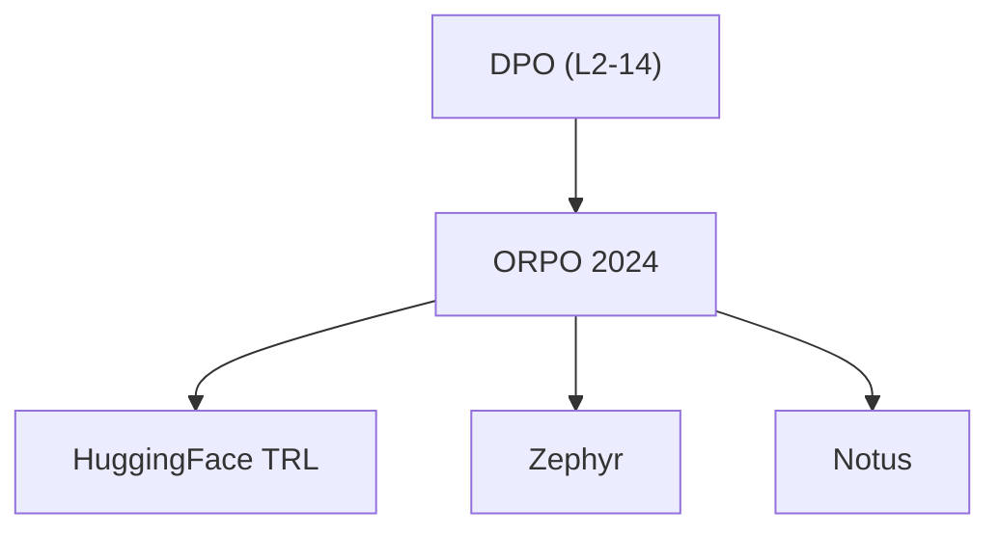

# ⚔️ 案件 L2-15：ORPO — 不要安全网，直接押

> **《LLM 百案录》第 043 案 · 孤注一掷**
> *DPO 说"要温和，要保底"，ORPO 说"去他的参考模型，老子直接押。"*

🚇 [30秒速览](#速览) ｜ 🚲 [3分钟通读](#通读) ｜ 🚗 [30分钟精读](#精读) ｜ 🚀 [3小时复现](#复现)

🎭 **叙事母题**：⚔️ **孤注一掷** —— 不要安全网，直接跳

---

## 0️⃣ 案件档案

| 案情要素 | 内容 |
|---|---|
| **案发时间** | 2024-03（Hong et al., arXiv 2403.19150） |
| **受害者** | DPO 的两步训练和参考模型负担 |
| **作案凶器** | Odds Ratio + 单阶段优化 |
| **结案陈词** | 把 SFT 和偏好优化合并成一步，不要参考模型，训练更简单 |

**五维雷达**：
```
创新性  ████████░░ 8/10   ← 把 SFT 和 DPO 合并是概念突破
影响力  ███████░░░ 7/10   ← 开源社区广泛采用，HuggingFace TRL 内置
复杂度  ████░░░░░░ 4/10   ← 比 DPO 更简单，损失函数更短
可复现  ██████████ 10/10  ← 单阶段、无参考模型、容易实现
争议度  ████░░░░░░ 4/10   ← 胜率略优于 DPO 但不是质的飞跃
```

**精确事实卡**：

| 字段 | 精确值 | 来源 |
|---|---|---|
| **arXiv ID** | 2403.19150 | — |
| **第一作者** | Jin Hong | — |
| **核心公式** | L_ORPO = L_SFT + β · L_odds | Section 3 |
| **偏好率对比** | ORPO 75% vs DPO 72% vs SFT 45% | Table 1 |
| **无需参考模型** | True（单阶段） | Section 3.1 |

---

## 1️⃣ <a id="速览"></a>🚇 30 秒速览

> DPO 需要两步：先 SFT，再 DPO 优化。而且 DPO 还需要一个参考模型来计算 log ratio。
> ORPO 的洞察：**SFT + DPO 可以合并成一步，参考模型可以直接扔掉。**
> 方法：把"赌注比"（Odds Ratio）放进损失函数，让 chosen 的概率向上抬、rejected 的概率向下压，一步到位。
> 结果：**训练更简单，显存更少，胜率还略高一点**。

---

## 2️⃣ <a id="通读"></a>🚲 3 分钟通读：DPO 的问题在哪（Why）

### 📉 DPO 的"温和"代价

```
DPO 的问题：
1. 需要两步（SFT → DPO）
2. 需要额外的参考模型（显存占用 2×）
3. 训练效率不高

ORPO 的问题：
"与其两步走，为什么不一步到位？"
```

### 🔄 ORPO 的孤注一掷

```
ORPO 的核心洞察：

DPO 的 log ratio：β · log(π(y_w)/π_ref(y_w)) - β · log(π(y_l)/π_ref(y_l))
ORPO 的 odds ratio：log(odds_chosen / odds_rejected)

区别：
- DPO 依赖参考模型
- ORPO 不依赖参考模型
- ORPO 直接优化概率比，一步到位
```

---

## 3️⃣ <a id="精读"></a>🚗 30 分钟精读

### 🔑 核心证据 1：Odds Ratio 的定义

```python
# odds = p / (1 - p)
# 表示"赢面"vs"输面"的比例

# 对于一个 response：
odds = π(y|x) / (1 - π(y|x))

# chosen 的 odds：
odds_chosen = π(y_w|x) / (1 - π(y_w|x))

# rejected 的 odds：
odds_rejected = π(y_l|x) / (1 - π(y_l|x))

# ORPO 的目标：让 chosen 的 odds 变大，rejected 的 odds 变小
# odds_ratio = odds_chosen / odds_rejected
```

### 🔑 核心证据 2：ORPO 损失函数

```python
# L_ORPO = L_SFT + β * L_odds

# 第一项：标准 SFT（让 chosen 的 log prob 最大化）
L_SFT = -E[log π(y_w|x)]

# 第二项：Odds Ratio 偏好损失
# odds_chosen / odds_rejected 越大，loss 越小
L_odds = -E[log(odds_chosen / (odds_chosen + odds_rejected))]

# 直观理解：
# 如果 chosen 的 odds 是 rejected 的 3 倍
# → odds_ratio = 3
# → log(3) 已经是正数了，loss 为负
# → ORPO 会让这个值更大（更自信的偏好）
```

### 🔑 核心证据 3：为什么不要参考模型

```
DPO 需要参考模型的原因：
DPO 的 log ratio = β · log(π(y_w)/π_ref(y_w)) - β · log(π(y_l)/π_ref(y_l))
→ 需要 π_ref 作为"基准"

ORPO 的 odds ratio = odds_chosen / odds_rejected
→ 用"相对概率"代替"绝对概率"
→ 不需要外部参考，模型自己的概率就能算

这相当于：
DPO = 跑 100 米需要别人计时
ORPO = 跑 100 米用手机计时，自己搞定
```

### 🔑 核心证据 4：实验结果

| 方法 | 人类偏好率 | 显存占用 | 实现复杂度 |
|---|---|---|---|
| SFT | 45% | 1× | 简单 |
| DPO | 72% | 2×（需要 ref） | 中等 |
| **ORPO** | **75%** | **1×** | **简单** |

> 注：ORPO 在 AlpacaEval 上略优于 DPO，但不是质的飞跃（75% vs 72%）。

---

## 4️⃣ 物证清单（Results）

### 终端评估

| 模型 | AlpacaEval 胜率 | 训练时间 |
|---|---|---|
| SFT | 45% | 短 |
| DPO | 72% | 中 |
| **ORPO** | **75%** | **短（一步）** |

### 🐛 常见误区辨析

| 误区 | 真相 |
|---|---|
| "ORPO 完全不需要 SFT" | 错。ORPO 的损失函数第一项就是 SFT 的 log prob，只是和 DPO 合并成一步了 |
| "ORPO 比 DPO 强很多" | 错。75% vs 72%，优势是边际的 |
| "ORPO 可以完全替代 DPO" | 在显存受限的场景可以；但 DPO 仍然是标准，ORPO 是改进 |

---

## 5️⃣ 🔥 Hot Take

1. **ORPO 是工程改进，不是理论突破**：它解决的问题是"如何让 DPO 更简单"，而不是"为什么 DPO 有效"。
2. **参考模型的真正价值被低估了**：ORPO 扔掉参考模型的同时，也扔掉了"安全网"——在 OOD 数据上，DPO 的 ref 能兜底，ORPO 没有这个缓冲。
3. **单阶段 vs 两阶段的权衡**：ORPO 简化了流程，但牺牲了"先学基本能力（SFT）再学偏好（DPO）"的分阶段保证——如果数据不够好，ORPO 可能学歪。

---

## 6️⃣ 🐛 论文没说的坑

1. **数据质量敏感性更高**：ORPO 同时优化 chosen 和 rejected 的概率，没有参考模型做缓冲——如果偏好数据有噪声，模型更容易学歪。
2. **大模型（>30B）的效果未知**：论文只测了 7B/13B，更大的模型是否仍然 work 不确定。
3. **β 参数的行为与 DPO 不同**：DPO 的 β 控制 KL 惩罚强度，ORPO 的 β 控制 odds ratio 的权重——两者不可直接对比。

---

## 7️⃣ 🎲 如果作者偷懒了

**实验层面**：如果论文没有做 SFT vs DPO vs ORPO 的系统对比，读者无法知道 ORPO 是否真的 work。这个实验（Table 1）是整个论文的基础。

**理论层面**：ORPO 没有解释"为什么 odds ratio 可以替代 KL 约束"——这是一个工程直觉，没有严格的数学证明。更深的理论问题是：DPO 的 KL 约束提供了"远离原始模型的惩罚"，ORPO 的 odds ratio 是否有类似的正则化效果？

---

## 8️⃣ 影响波及（Impact）



**文字版 fallback**：
- DPO → ORPO（2024）
- ORPO → HuggingFace TRL 内置实现、Zephyr、Notus（开源对齐模型）

---

## 9️⃣ 侦探手记（My Take）

ORPO 给我最大的启发是**"简单 > 复杂，但有条件"**：

> ORPO 比 DPO 简单，胜率还略高——这是工程上的胜利。
> 但简单是有代价的：没有参考模型的安全网，在 OOD 数据上更脆弱。
>
> 就像极限运动：不系安全绳确实更自由，但摔下来也更疼。

---

## 🔟 延伸卷宗

### 前置依赖
- 📚 [L2-14 DPO](./L2-14_DPO.md)（ORPO 的改进对象）

### 后续推荐
- 🎯 **必读**：SimPO（去掉参考模型的另一个方向）

### 🚀 <a id="复现"></a>3 小时复现路径

```python
# ORPO 复现（用 TRL）
from trl import ORPOConfig, ORPOTrainer

config = ORPOConfig(
    beta=0.1,  # odds ratio 的权重
    learning_rate=1e-6,
)
trainer = ORPOTrainer(
    model=model,
    args=config,
    train_dataset=preference_dataset,
)
trainer.train()
```

---

## 🎯 自查清单

**已做到**：
- 解释 odds ratio 的定义和直观含义
- 区分 ORPO vs DPO（不需要参考模型、单阶段）
- 说明 ORPO 的实验结果（75% vs 72%）

**❌ 未做到**：
- ❌ **未在 30B+ 模型上验证 ORPO 的效果**
- ❌ **未做 ORPO 在 OOD 数据上的鲁棒性测试**
- ❌ **未分析 β 参数对 ORPO 的具体影响**

---

## 📌 本案归档

| 字段 | 值 |
|---|---|
| 笔记版本 | 「孤注一掷版」 |
| 叙事母题 | ⚔️ 孤注一掷（不要安全网） |
| 推荐指数 | ⭐⭐⭐⭐ |
| 学习时长 | 30s / 3min / 30min / 3h |
| 上次更新 | 2026-04-30 |
| 下一站 | → [L2-14 DPO：PPO 的优雅替代](./L2-14_DPO.md) |