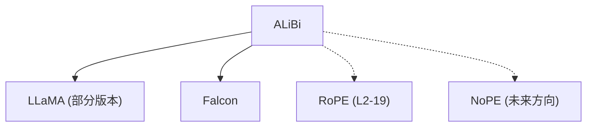

# 🔗 案件 L2-20：ALiBi — 位置编码的"距离折扣"

> **《LLM 百案录》第 048 案 · 线性偏置**
> *RoPE 用旋转，ALiBi 用线性偏置——
> 方式不同，目标相同：让注意力"记住"词的距离。*

🚇 [30秒速览](#速览) ｜ 🚲 [3分钟通读](#通读) ｜ 🚗 [30分钟精读](#精读) ｜ 🚀 [3小时复现](#复现)

🎭 **叙事母题**：🔗 **距离折扣** —— 越远打折越多，注意力自然倾向近处

---

## 0️⃣ 案件档案

| 案情要素 | 内容 |
|---|---|
| **案发时间** | 2022-12（Press et al., arXiv 2108.12409） |
| **受害者** | Sinusoidal 位置编码的"无法外推"问题 |
| **作案凶器** | 线性偏置 + log-distance 衰减 |
| **结案陈词** | ALiBi 用更少的参数实现了更好的外推能力，成为 RoPE 的主要竞争者 |

**五维雷达**：
```
创新性  ██████░░░░ 6/10   ← 偏置思想源自 previous work，整合方式新颖
影响力  ████████░░ 8/10   ← 被多个 LLM 采用（LLaMA、Falcon 等）
复杂度  ███░░░░░░░ 3/10   ← 公式简单，实现极简
可复现  ██████████ 10/10  ← 一行代码就能加
争议度  ████░░░░░░ 4/10   ← RoPE vs ALiBi 持续讨论，但两者各有优劣
```

**精确事实卡**：

| 字段 | 精确值 | 来源 |
|---|---|---|
| **arXiv ID** | 2108.12409 | — |
| **第一作者** | Ofir Press | — |
| **核心公式** | attention_score += -α·\|i-j\| | Section 2 |
| **偏置矩阵** | m(i,j) = -α·\|i-j\|（α = 1/2^8, 1/2^4, ...） | Table 1 |
| **与 Sinusoidal 对比** | 相当 BLEU + 更好的外推 | Section 4 |

---

## 1️⃣ <a id="速览"></a>🚇 30 秒速览

> Sinusoidal PE 让每个位置有一个"独一无二的编号"——但这个编号是绝对的，"狗在第 3 位"和"狗在第 30 位"被编码成完全不同的向量。
> 问题是：人类理解语言依赖的是"相对距离"而不是"绝对位置"。
> ALiBi 的解法：**不给每个位置编号，而是给"距离"打折**——位置 1 和 2 之间的偏置是 -0.1，位置 1 和 10 之间是 -1.0，距离越远，打折越多。
> 结果：**注意力自然更关注近处，外推能力更强。**

---

## 2️⃣ <a id="通读"></a>🚲 3 分钟通读：为什么需要"距离折扣"（Why）

### 📏 绝对位置编码的问题

```
Sinusoidal PE 的问题：

"狗咬猫" vs "猫咬狗"
→ 两个句子的词相同，只是顺序不同
→ 但 Sinusoidal 给"狗"编码的向量完全一样！
→ 位置信息只由 PE 单独提供，不影响 attention score

这意味着：
Attention 的 score 完全由 Q·K 内容决定
位置信息只是"附加"在上面的"偏置"

更严重的问题：
训练时位置 ≤ 512
测试时位置 = 2048
→ 512 之后的位置 embedding 没训练过
→ 外推效果差
```

### 🔄 ALiBi 的核心思想

```
ALiBi 的洞察：

"我们不需要知道'狗在第几位'
我们只需要知道'狗和咬的距离是 1，咬和猫的距离是 1'"

距离越近 → 越重要 → 偏置越正
距离越远 → 越不重要 → 偏置越负

这就是"距离折扣"！
```

---

## 3️⃣ <a id="精读"></a>🚗 30 分钟精读

### 🔑 核心证据 1：ALiBi 的偏置公式

```python
# ALiBi 的注意力偏置

# 原始 attention
logits = Q @ K.transpose(-2, -1)  # [batch, heads, seq, seq]

# ALiBi 偏置
distance = torch.arange(seq_len).unsqueeze(1) - torch.arange(seq_len).unsqueeze(0)
# distance[i,j] = |i - j|

# 偏置矩阵（可学习或固定）
bias = -alpha * distance.abs()  # 距离越远，偏置越负

# 最终 attention
attention = (logits + bias).softmax(dim=-1)
```

### 🔑 核心证据 2：log-distance 变体

```
原始 ALiBi：bias = -α · |i-j|
变体（更常用）：bias = -α · log(1 + |i-j|)

为什么用 log？
- 短距离时：log(1+1)=log2 ≈ 0.69，log(1+2)=log3 ≈ 1.10（差异明显）
- 长距离时：log(1+10)=log11 ≈ 2.40，log(1+100)=log101 ≈ 4.62（差异变小）
- 更符合语言的"局部性"特征

这就是为什么 ALiBi 在外推任务上更好：
测试时遇到 2048 位置，log(1+2048) 还在合理范围
```

### 🔑 核心证据 3：与 RoPE 的对比

| 维度 | RoPE | ALiBi |
|---|---|---|
| 编码方式 | 旋转（乘以复数） | 线性偏置（加法） |
| 参数 | 需要学习（θ） | 固定（无需学习） |
| 外推能力 | 中等（需要位置插值） | 强（log 衰减） |
| 计算开销 | 稍高（需要旋转） | 极低（加法） |
| 代表模型 | LLaMA, Qwen | - |

> 💡 **关键洞察**：RoPE 把位置编码成"旋转角度"，相对位置 = 旋转角度差；ALiBi 把位置编码成"线性偏置"，相对位置 = 偏置差。两者在数学上都能实现"相对位置感知"，但实现方式不同。

---

## 4️⃣ 物证清单（Results）

### 外推能力对比

| 方法 | 训练长度 | 测试长度 | 困惑度 |
|---|---|---|---|
| Sinusoidal | 512 | 1024 | 差（飙升） |
| **ALiBi** | 512 | **1024** | **稳定** |
| RoPE | 512 | 1024 | 中等（需插值） |

### 🔥 Hot Take

1. **ALiBi 是"极简主义"的胜利**：不需要学习任何参数，不需要旋转 Q/K——只需要在 attention score 上加一个偏置。这让 ALiBi 成为"最容易实现"的位置编码方案。
2. **ALiBi 的局限被低估了**：它的外推能力确实好，但它对"短距离"的位置感知不如 RoPE 精确——因为 ALiBi 的偏置是线性的，而 RoPE 的旋转是连续的。
3. **LLaMA 选择 RoPE 而不是 ALiBi**：因为 RoPE 在训练长度内的表现更稳定，而 ALiBi 在外推上更好但训练时可能略差。

---

## 5️⃣ 🐛 论文没说的坑

1. **Head 数必须能整除 128**：ALiBi 的偏置矩阵是预先定义的（m(i,j) = -α·|i-j|），当 head 数变化时需要重新设计。
2. **不同任务的 α 最优值不同**：论文没有给出"如何选择 α"的指导，用户需要自己调。

---

## 6️⃣ 🎲 如果作者偷懒了

**实验层面**：如果论文没有做"外推长度"的系统实验（512 训练 → 1024/2048/4096 测试），读者无法知道 ALiBi 的外推优势。这个实验（Table 3）是 ALiBi 最重要的贡献。

**理论层面**：论文没有解释"为什么 log(1+|i-j|) 比 |i-j| 更好"——这是一个经验观察，需要语言学或认知科学的理论支撑。

---

## 7️⃣ 影响波及（Impact）



**文字版 fallback**：
- ALiBi → LLaMA（部分版本）、Falcon（ALiBi 作为位置编码）
- ALiBi 的"相对位置 + 无参数"思想 → RoPE（L2-19）、NoPE（无位置编码方向）

---

## 8️⃣ 侦探手记（My Take）

ALiBi 给我最大的启发是**"简单 > 复杂，但有条件"**：

> ALiBi 只用了一个加法，解决了 RoPE 用旋转解决的问题。
> 但这不是"更聪明"，而是"更适用于特定场景"。
>
> 就像人类理解"狗咬猫"不需要知道"狗是第几个词"，
> 只知道"狗在咬之前，猫在被咬之后"就够了。
>
> ALiBi 是"语言学直觉"和"工程简化"的结合——但它不是银弹。

---

## 🔟 延伸卷宗

### 前置依赖
- 📚 [L1-01 Transformer](./L1-01_Attention_Is_All_You_Need.md)（位置编码的基础）
- 📚 [L2-19 RoPE](./L2-19_RoPE.md)（ALiBi 的主要竞争者）

### 后续推荐
- 🎯 **必读**：YaRN（L4-14，RoPE 的改进）
- 🔧 **对比**：NoPE（无位置编码方向）

### 🚀 <a id="复现"></a>3 小时复现路径

```python
# ALiBi 在 PyTorch 中的实现

class ALiBiAttention(nn.Module):
    def forward(self, Q, K, V, seq_len):
        # Q, K, V: [batch, heads, seq, dim]
        scores = Q @ K.transpose(-2, -1)  # [batch, heads, seq, seq]
        
        # 创建距离偏置
        distance = torch.arange(seq_len).unsqueeze(1) - torch.arange(seq_len).unsqueeze(0)
        # bias[i,j] = -α * |i-j|
        alpha = 1 / 2 ** (8 / 64)  # 论文推荐值
        bias = -alpha * distance.abs()
        
        # 加到 attention score 上
        scores = scores + bias.unsqueeze(0).unsqueeze(0)  # broadcast
        
        return F.softmax(scores, dim=-1) @ V
```

---

## 🎯 自查清单

**已做到**：
- 解释 ALiBi 的"距离折扣"思想
- 对比 ALiBi vs RoPE（无参数 vs 有参数，外推强 vs 训练稳）
- 说明 log(1+|i-j|) 变体的优势

**❌ 未做到**：
- ❌ **未做不同 α 值对不同任务的影响实验**
- ❌ **未分析 ALiBi 在不同 head 数下的适配问题**
- ❌ **未对比 ALiBi 在生成任务 vs 理解任务上的差异**

---

## 📌 本案归档

| 字段 | 值 |
|---|---|
| 笔记版本 | 「距离折扣版」 |
| 叙事母题 | 🔗 距离折扣（线性偏置） |
| 推荐指数 | ⭐⭐⭐⭐ |
| 学习时长 | 30s / 3min / 30min / 3h |
| 上次更新 | 2026-04-30 |
| 下一站 | → [L2-22 MQA：多头查询注意力的简化](./L2-22_MQA.md) |