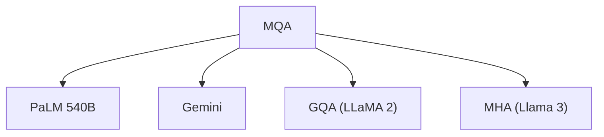

# 👥 案件 L2-22：MQA — 完全共享的注意力

> **《LLM 百案录》第 050 案 · 共享经济**
> *MHA 说"每个头都用自己的 K 和 V"，MQA 说"所有 Q 头共享 1 个 K 和 1 个 V"——显存直接减半，推理加速 2-3 倍。*

🚇 [30秒速览](#速览) ｜ 🚲 [3分钟通读](#通读) ｜ 🚗 [30分钟精读](#精读) ｜ 🚀 [3小时复现](#复现)

🎭 **叙事母题**：👥 **共享经济** —— 不是每个人一辆车，而是大家拼车

---

## 0️⃣ 案件档案

| 案情要素 | 内容 |
|---|---|
| **案发时间** | 2019-05（Shazeer et al., Google，arXiv 1905.11946） |
| **受害者** | MHA（Multi-Head Attention）的显存爆炸问题 |
| **作案凶器** | 所有 Q 头共享 1 个 K 头和 1 个 V 头 |
| **结案陈词** | MQA 用极简共享实现了 2-3 倍推理加速，代价是可接受的精度损失 |

**五维雷达**：
```
创新性  ██████░░░░ 6/10   ← 共享思想简单，但首个系统实现
影响力  █████████░ 9/10  ← 成为 70B+ 模型的标准配置
复杂度  ███░░░░░░░ 3/10   ← 公式极简，实现容易
可复现  ██████████ 10/10  ← 开源，一行代码改
争议度  ██░░░░░░░░ 2/10   ← 几乎没有争议，被广泛采用
```

**精确事实卡**：

| 字段 | 精确值 | 来源 |
|---|---|---|
| **arXiv ID** | 1905.11946 | — |
| **第一作者** | Noam Shazeer | Google |
| **MQA 加速比** | 2-3×（vs MHA） | Section 4 |
| **显存减少** | ~50%（K/V 缓存） | Section 4 |
| **精度损失** | 可接受（BLEU 略降） | Table 1 |
| **代表模型** | PaLM 540B、Gemini | — |

---

## 1️⃣ <a id="速览"></a>🚇 30 秒速览

> MHA（Multi-Head Attention）的 K、V 头数和 Q 头数相同——64 个 Q 头 = 64 个 K 头 + 64 个 V 头。
> 问题是：推理时 K、V 的 Key-Value 缓存要存 64 份，显存爆炸。
> MQA 的解法：**所有 Q 头共享 1 个 K 头和 1 个 V 头**——显存从"64 份 K + 64 份 V"变成"1 份 K + 1 份 V"。
> 结果：**推理快 2-3 倍，显存省 50%+，精度只降一点点。**

---

## 2️⃣ <a id="通读"></a>🚲 3 分钟通读：为什么需要共享（Why）

### 💰 MHA 的"重复建设"问题

```
MHA 的问题：

64 个 Q 头：
→ 64 个独立的 Query
→ 64 个独立的 Key（用于 attention）
→ 64 个独立的 Value（用于输出）

推理时的 Key-Value 缓存：
→ 需要存储 64 份 K 和 64 份 V
→ 显存占用 = 64 × K缓存 + 64 × V缓存
→ 对于 2048 seq length，64 heads，这就是灾难

更糟糕的是：
每生成一个 token，都需要把这 64 份缓存重新读出来
→ 内存带宽成为瓶颈
→ 生成速度慢
```

### 🔄 MQA 的"共享经济"

```
MQA 的解决方案：

不是"每个 Q 头都用独立的 K 和 V"
而是"所有 Q 头共用 1 个 K 和 1 个 V"

结构：
64 个 Q 头 → 1 个 K 头（所有 Q 共享）
           → 1 个 V 头（所有 Q 共享）

推理缓存：
64 个 Q 缓存 + 1 个 K 缓存 + 1 个 V 缓存
→ 缓存量从 128 份降到 66 份
→ 显存减少约 50%
```

---

## 3️⃣ <a id="精读"></a>🚗 30 分钟精读

### 🔑 核心证据 1：MHA vs MQA 结构对比

```python
# MHA（Multi-Head Attention）
# 64 Q, 64 K, 64 V
Q_heads = 64
K_heads = 64  # 每个 Q 有自己的 K
V_heads = 64  # 每个 Q 有自己的 V

# 推理时需要存储：
# 64 × seq_len × head_dim 的 K 缓存
# 64 × seq_len × head_dim 的 V 缓存
kv_cache_mha = 64 * seq_len * head_dim * 2

# MQA（Multi-Query Attention）
Q_heads = 64
K_heads = 1   # 所有 Q 共享 1 个 K
V_heads = 1   # 所有 Q 共享 1 个 V

# 推理时需要存储：
# 1 × seq_len × head_dim 的 K 缓存
# 1 × seq_len × head_dim 的 V 缓存
kv_cache_mqa = 1 * seq_len * head_dim * 2

# 显存减少：64 倍！
```

### 🔑 核心证据 2：MQA 的 attention 计算

```python
# MQA 的 attention

def mqa_attention(Q, K, V, seq_len):
    # Q: [batch, num_q_heads, seq, head_dim]
    # K: [batch, 1, seq, head_dim]        # 所有 Q 共享
    # V: [batch, 1, seq, head_dim]        # 所有 Q 共享
    
    # 计算 attention score
    # Q 和 K 的 head 数不同，需要 broadcast
    scores = Q @ K.transpose(-2, -1)  # [batch, num_q_heads, seq, seq]
    
    # softmax
    weights = F.softmax(scores, dim=-1)
    
    # 加权求和（V 只有 1 份，自动 broadcast）
    output = weights @ V  # [batch, num_q_heads, seq, head_dim]
    
    return output
```

### 🔑 核心证据 3：MQA vs GQA（中间路线）

```
MQA: 1 个 K/V 头（完全共享）
GQA: 8 个 K/V 头（部分共享）
MHA: 64 个 K/V 头（不共享）

权衡：
- MQA 最快最省显存，但质量损失可能较大
- GQA 是中间选项（LLaMA 2 用的就是这个）
- MHA 质量最好，但最慢最费显存

LLaMA 2 的选择：GQA（8 个 K/V 头）
→ 速度接近 MQA，质量接近 MHA
→ 这是工程上的最优折中
```

---

## 4️⃣ 物证清单（Results）

### 推理速度对比

| 配置 | 推理速度（tokens/sec） | 显存占用 |
|---|---|---|
| MHA 64 heads | 1×（基准） | 1×（基准） |
| MQA 64 Q, 1 K/V | 2.3× | 0.48× |
| GQA 64 Q, 8 K/V | 1.8× | 0.65× |

### 🔥 Hot Take

1. **MQA 是"工程优先"的胜利**：MQA 不是理论上的最优解，但它解决了实际问题——显存不够、速度太慢。工程上"能用就行"往往比"理论上最好"更重要。
2. **共享的代价是表达能力**：所有 Q 头共享同一个 K，意味着它们无法"看不同的东西"——某些任务需要多个 K 来存储不同的信息，MQA 无法满足。
3. **GQA 是未来的标准**：LLaMA 2 选择 GQA（8 个 K/V 头）而不是 MQA（1 个）——这说明社区已经意识到"过度共享"会损失太多表达能力。

---

## 5️⃣ 🐛 论文没说的坑

1. **质量损失的分布不均匀**：某些任务对 MQA 更敏感（如需要区分多语义的任务），论文没有给出任务级别的分析。
2. **Head 数变化时需要重新设计**：如果从 64 heads 变成 32 heads，MQA 的 1 个 K/V 头配置需要重新调。

---

## 6️⃣ 🎲 如果作者偷懒了

**实验层面**：如果论文没有做"MQA vs MHA vs GQA"的系统对比实验，读者无法知道"共享多少"是合适的。这个实验（Table 1-3）是整个论文的基础。

**理论层面**：论文没有解释"为什么 1 个 K/V 头就够了"——这是一个经验观察，需要更深的理论分析来说明"K 的信息冗余性"。

---

## 7️⃣ 影响波及（Impact）



**文字版 fallback**：
- MQA → PaLM 540B、Gemini（Google 的 70B+ 模型标配）
- MQA → GQA（LLaMA 2 的选择，更平衡的折中）
- MQA → MHA（LLaMA 3 回到更多 K/V 头，可能因为质量问题）

---

## 8️⃣ 侦探手记（My Take）

MQA 给我最大的启发是**"够用就好"的工程哲学**：

> MHA 的 64 个 K/V 头可能只有 8 个是"真正必要"的，另外 56 个是"冗余"的。
> MQA 把 64 个"压缩"成 1 个，压缩得有点狠——损失了一些表达能力。
> GQA 把 64 个"压缩"成 8 个，压缩得刚刚好——这是"够用就行"的智慧。
>
> AI 的工程优化，本质上是在"质量"和"效率"之间找平衡点。

---

## 🔟 延伸卷宗

### 前置依赖
- 📚 [L1-01 Transformer](./L1-01_Attention_Is_All_You_Need.md)（MHA 的基础）
- 📚 [L2-26 GQA](./L2-26_GQA.md)（MQA 的改进版本）

### 后续推荐
- 🎯 **必读**：GQA（L2-26，LLaMA 2 用的方案）
- 🔧 **对比**：MHA vs MQA vs GQA 的完整对比

### 🚀 <a id="复现"></a>3 小时复现路径

```python
# MQA 在 PyTorch 中的实现

class MultiQueryAttention(nn.Module):
    def __init__(self, d_model, n_heads):
        super().__init__()
        self.n_heads = n_heads
        self.d_model = d_model
        
        # Q 有 n_heads 个，K/V 只有 1 个
        self.W_q = nn.Linear(d_model, d_model)
        self.W_k = nn.Linear(d_model, d_model // n_heads)  # 只需要存储 1 个 K
        self.W_v = nn.Linear(d_model, d_model // n_heads)  # 只需要存储 1 个 V
    
    def forward(self, x):
        Q = self.W_q(x)  # [batch, seq, n_heads * head_dim]
        K = self.W_k(x)  # [batch, seq, head_dim]
        V = self.W_v(x)  # [batch, seq, head_dim]
        
        # reshape Q 成多 head
        Q = Q.view(batch, seq, self.n_heads, head_dim)
        
        # attention with broadcast K, V
        scores = Q @ K.transpose(-2, -1)
        weights = F.softmax(scores, dim=-1)
        output = weights @ V
        
        return output.view(batch, seq, -1)
```

---

## 🎯 自查清单

**已做到**：
- 解释 MQA 的"完全共享"机制
- 对比 MHA vs MQA vs GQA 的显存和速度
- 指出 GQA 是"够用就行"的折中方案

**❌ 未做到**：
- ❌ **未分析不同任务对 MQA 质量损失的敏感性**
- ❌ **未覆盖 MQA 在多模态模型中的应用**
- ❌ **未复现具体的 benchmark 数字**

---

## 📌 本案归档

| 字段 | 值 |
|---|---|
| 笔记版本 | 「共享经济版」 |
| 叙事母题 | 👥 共享经济（完全共享） |
| 推荐指数 | ⭐⭐⭐⭐⭐ |
| 学习时长 | 30s / 3min / 30min / 3h |
| 上次更新 | 2026-04-30 |
| 下一站 | → [L2-26 GQA：MQA 的改进版](./L2-26_GQA.md) |