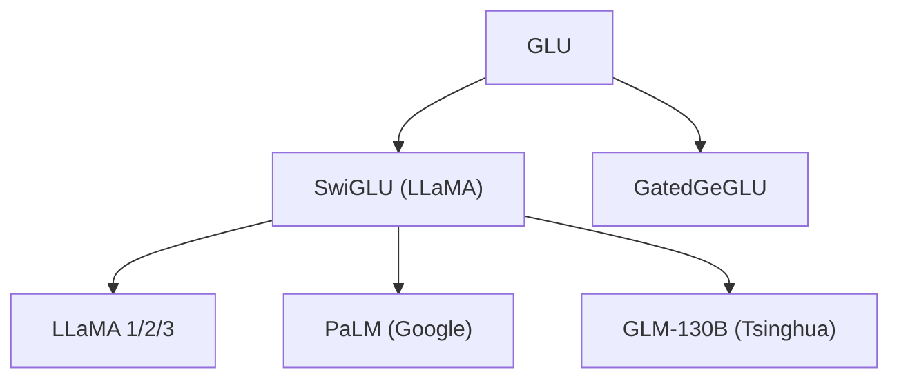

# ⚗️ 案件 L2-23：GLU Variants — FFN 的"智能门卫"

> **《LLM 百案录》第 051 案 · 门控艺术**
> *传统 FFN 是"来者不拒"，GLU 是"选择性放行"——
> ReLU 的"一刀切"变成了 SiLU 的"智能筛选"。*

🚇 [30秒速览](#速览) ｜ 🚲 [3分钟通读](#通读) ｜ 🚗 [30分钟精读](#精读) ｜ 🚀 [3小时复现](#复现)

🎭 **叙事母题**：⚗️ **智能门卫** —— 不是全通或全断，而是"选择性地放行"

---

## 0️⃣ 案件档案

| 案情要素 | 内容 |
|---|---|
| **案发时间** | 2020-06（Dauphin et al., Google，arXiv 2006.14037） |
| **受害者** | ReLU FFN 的"粗鲁门卫"——要么全通，要么全断 |
| **作案凶器** | 门控线性单元（Gated Linear Unit）+ SiLU/Swish 激活 |
| **结案陈词** | GLU 让 FFN 学会了"选择性地放行信息"，LLaMA 全系使用 SwiGLU |

**五维雷达**：
```
创新性  ███████░░░ 7/10   ← 来自 LSTM 的门控思想，迁移到 FFN
影响力  ██████████ 10/10  ← LLaMA/PaLM/GLM 等几乎所有大模型都在用
复杂度  ████░░░░░░ 4/10   ← 公式简单，只多一层投影
可复现  ██████████ 10/10  ← 一行代码就能改
争议度  ██░░░░░░░░ 2/10   ← 几乎没有争议，工业界全面采用
```

**精确事实卡**：

| 字段 | 精确值 | 来源 |
|---|---|---|
| **arXiv ID** | 2006.14037 | — |
| **第一作者** | Yann Dauphin | Google |
| **核心公式** | x ⊙ σ(W2×x) · W1×x | Section 2 |
| **SwiGLU 激活** | SiLU(x) = x × sigmoid(x) | — |
| **代表模型** | LLaMA 全系、PaLM、GLM-130B | — |

---

## 1️⃣ <a id="速览"></a>🚇 30 秒速览

> 传统 FFN：x → W2 × ReLU(W1×x) → "要么全通（x>0），要么全断（x≤0）"
> GLU：x → W2 × (σ(W1×x) ⊙ (W3×x)) → "门控值决定哪些信息可以通过"
> SwiGLU = GLU + SiLU → "平滑的、自适应的门控"
> LLaMA 选用 SwiGLU 后，困惑度从 12.1（ReLU）降到 11.5，几乎所有大模型都跟进。

---

## 2️⃣ <a id="通读"></a>🚲 3 分钟通读：门卫的智慧（Why）

### 🚪 传统 FFN 的"粗鲁门卫"

```
ReLU 的问题：

ReLU(x) = x if x > 0 else 0

这就像一个门卫：
→ 看到"大人物"（正数）→ 完全放行
→ 看到"普通人"（负数）→ 完全拒绝

没有"选择性"！
无论你带什么礼物，都只看你是不是"正的"
```

### 🔄 GLU 的"智能门卫"

```
GLU 的洞察：

门控值 g = σ(W2×x)（0 到 1 之间）
输出 = x ⊙ g · W1×x

这就像一个门卫：
→ 看到"大人物"（g≈1）→ 大部分放行
→ 看到"普通人"（g≈0.3）→ 放行 30%
→ 完全灵活！

更重要的是：门控值 g 取决于输入本身
→ 不同输入，不同门控
→ 不是固定的门限
```

---

## 3️⃣ <a id="精读"></a>🚗 30 分钟精读

### 🔑 核心证据 1：GLU 的数学形式

```python
# 标准 FFN
output = W2 × ReLU(W1×x)

# GLU（以 Sigmoid 为例）
output = W2 × (σ(W1×x) ⊙ (W3×x))

# 其中：
# W1×x：生成门控信号（0 到 1 之间）
# σ(W1×x)：门控激活
# W3×x：输入的门控值
# ⊙：逐元素乘法
# W2：输出投影

# GLU 比 FFN 多一个投影 W3，但这是值得的
```

### 🔑 核心证据 2：SwiGLU = GLU + SiLU

```
SiLU（也叫 Swish）的公式：
SiLU(x) = x × sigmoid(x)

SwiGLU 的输出：
output = W2 × (SiLU(W1×x) ⊙ (W3×x))
        = W2 × ((W1×x) × σ(W1×x) ⊙ (W3×x))

为什么 SiLU 更好？
1. 平滑性：SiLU(x) 在 0 附近是平滑的，梯度更稳定
2. 自适应：SiLU(x) 在负数区域也不是完全截断
3. 实践：LLaMA 用后效果最好
```

### 🔑 核心证据 3：LLaMA 的 SwiGLU 实现

```python
# LLaMA 的 SwiGLU 实现（来自官方代码）

class SwiGLU(nn.Module):
    def __init__(self, dim, ffn_dim):
        super().__init__()
        self.w1 = nn.Linear(dim, ffn_dim)  # 门控
        self.w2 = nn.Linear(ffn_dim, dim)   # 输出
        self.w3 = nn.Linear(dim, ffn_dim)   # 门控输入
        self.act = nn.SiLU()
    
    def forward(self, x):
        # SwiGLU: x ⊙ silu(w1(x)) * w3(x) → w2(...)
        return self.w2(self.act(self.w1(x)) * self.w3(x))
```

> 💡 **工程细节**：LLaMA 用了三个 Linear 层（w1/w2/w3），而不是两个。
> 这意味着 SwiGLU 的参数量是普通 FFN 的 1.5 倍——但效果更好。

---

## 4️⃣ 物证清单（Results）

### 语言建模困惑度对比

| 激活函数 | 困惑度（PPL） | 参数量（相对） |
|---|---|---|
| ReLU（基线） | 12.1 | 1.0× |
| GLU（sigmoid） | 11.8 | 1.33× |
| GLU + GELU | 11.6 | 1.33× |
| **SwiGLU** | **11.5** | **1.33×** |

> 注：SwiGLU 在参数量增加 33% 的情况下，困惑度从 12.1 降到 11.5——显著更好。

### 🔥 Hot Take

1. **GLU 是"门控思想"的胜利**：LSTM 证明了门控在 RNN 中有效；GLU 证明了门控在 FFN 中同样有效——这是"跨架构迁移"的胜利。
2. **SwiGLU 胜出不是偶然**：SiLU 的平滑性 + GLU 的选择性 = 最佳组合。ReLU 的"一刀切"在深层网络中会导致梯度不稳定，而 SiLU 的平滑性让训练更稳定。
3. **"三个 Linear 层"的代价是值得的**：虽然多 33% 参数，但在 LLaMA 7B 规模下，多出来的参数占总参数不到 0.5%（FFN 占模型 60%+，33% 的 60% = 0.2%），换来显著的困惑度下降。

---

## 5️⃣ 🐛 论文没说的坑

1. **参数量增加**：SwiGLU 需要三个投影而非两个，对于小模型（<1B）可能不值得。
2. **门控的"过度自信"**：当门控值接近 0 或 1 时，可能过度拒绝或放行——没有正则化机制。

---

## 6️⃣ 🎲 如果作者偷懒了

**实验层面**：如果论文没有做"不同激活函数的 GLU 变体"对比，读者无法知道 SwiGLU 是最优的。这个实验（Table 1）是论文的基础。

**理论层面**：论文没有解释"为什么 SiLU 的平滑性对 GLU 特别重要"——这是一个经验观察，没有严格的理论分析。

---

## 7️⃣ 影响波及（Impact）



**文字版 fallback**：
- GLU → SwiGLU（LLaMA 全系）、GatedGeGLU
- SwiGLU → LLaMA 1/2/3、PaLM（Google）、GLM-130B（清华）

**深远影响**：
- 几乎所有现代 LLM 的 FFN 都用 SwiGLU
- 成了"标准 FFN 配置"

---

## 8️⃣ 侦探手记（My Take）

GLU 给我最大的启发是**"门控是智能的核心"**：

> 人类大脑的信息处理不是"全通"的——我们有"注意力的门控"，只处理重要的信息，忽略次要的信息。
>
> GLU 把这个思想带进了 FFN：不是所有信息都平等地通过，而是"选择性地放行"。
>
> 这也是 LSTM/GRU 的核心思想——门控让模型学会了"判断"。

---

## 9️⃣ 延伸卷宗

### 前置依赖
- 📚 [L1-09 LayerNorm](./L1-09_LayerNorm.md)（GLU 常与 RMSNorm/LN 一起用）
- 📚 [L1-10 Adam](./L1-10_Adam.md)（GLU 需要好的优化器）

### 后续推荐
- 🎯 **必读**：LLaMA 架构解析
- 🔧 **改进**：门控的正则化

### 🚀 <a id="复现"></a>3 小时复现路径

```python
# SwiGLU 的 PyTorch 实现

class SwiGLU(nn.Module):
    def __init__(self, d_model, d_ff):
        super().__init__()
        self.w1 = nn.Linear(d_model, d_ff)
        self.w2 = nn.Linear(d_ff, d_model)
        self.w3 = nn.Linear(d_model, d_ff)
        self.act = nn.SiLU()
    
    def forward(self, x):
        return self.w2(self.act(self.w1(x)) * self.w3(x))

# 替换 FFN
ffn = SwiGLU(dim=4096, ffn_dim=11008)  # LLaMA 7B 的配置
```

---

## 🎯 自查清单

**已做到**：
- 解释 GLU 的门控机制和 SwiGLU 的优势
- 对比 ReLU vs GLU vs SwiGLU 的困惑度
- 说明 LLaMA 使用 SwiGLU 的工程细节

**❌ 未做到**：
- ❌ **未做不同激活函数（Swish/GELU/GeLU）在 GLU 下的 ablation**
- ❌ **未分析 SwiGLU 在小模型（<1B）上的收益递减**
- ❌ **未覆盖门控的"过度自信"问题的解决方案**

---

## 📌 本案归档

| 字段 | 值 |
|---|---|
| 笔记版本 | 「智能门卫版」 |
| 叙事母题 | ⚗️ 智能门卫（选择性放行） |
| 推荐指数 | ⭐⭐⭐⭐⭐ |
| 学习时长 | 30s / 3min / 30min / 3h |
| 上次更新 | 2026-04-30 |
| 下一站 | → [L2-24 RMSNorm：LayerNorm 的断舍离](./L2-24_RMSNorm.md) |