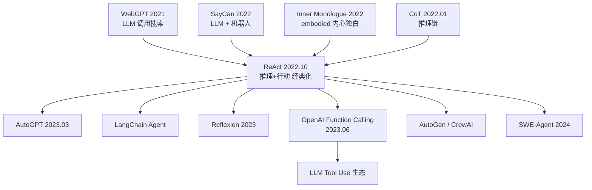

# 🔄 案件 L3-07：ReAct — 从言语到行动，LLM 学会了"动手"

> **《LLM 百案录》第 057 案 · 从言语到行动**
> *2022 年 10 月，普林斯顿和 Google 联手做了一件简单的事：
> 让 LLM 在思考的同时，能调用搜索引擎、能走迷宫、能查百科——
> **模型第一次从"只会说"变成"会动手"。***

🚇 [30秒速览](#速览) ｜ 🚲 [3分钟通读](#通读) ｜ 🚗 [30分钟精读](#精读) ｜ 🚀 [3小时复现](#复现)

🎭 **叙事母题**：🔄 从言语到行动（把 Agent 范式系统化的经典之作）

---

## 0️⃣ 案件档案

| 案情要素 | 内容 |
|---|---|
| **案发时间** | 2022-10-06（Yao et al., Princeton + Google Brain） |
| **嫌疑人** | Shunyu Yao, Jeffrey Zhao, Dian Yu 等 |
| **受害者** | "LLM 是封闭脑回路、不能与外部交互" 的旧观念 |
| **作案凶器** | 一个简单的 Prompt 模板：`Thought → Action → Observation` 循环 |
| **作案动机** | "CoT 让模型会思考，但思考完就结束了。能不能让它**思考完就行动**？" |
| **结案陈词** | 不是 Agent 的发明者（WebGPT / SayCan 更早），而是**把"推理 + 行动交替"范式系统化、经典化的那篇论文**——LangChain、AutoGPT 等框架的直接蓝本 |

**五维雷达**：
```
创新性  ███████░░░ 7/10   ← 思想朴素但范式成立
影响力  ██████████ 10/10  ← 现代 Agent 框架的事实标准
复杂度  ███░░░░░░░ 3/10   ← 一个 prompt 模板而已
可复现  ██████████ 10/10  ← 任何 LLM API + 几个工具就能跑
争议度  ██████░░░░ 6/10   ← "ReAct 是真智能还是套娃 prompt？"
```

**精确事实卡**：

| 字段 | 精确值 | 来源 |
|---|---|---|
| **arXiv ID** | 2210.03629 | ICLR 2023 |
| **正式标题** | *ReAct: Synergizing Reasoning and Acting in Language Models* | — |
| **第一作者** | Shunyu Yao | Princeton（实习于 Google Brain） |
| **测试模型** | PaLM-540B（主），GPT-3 (text-davinci-002) | Section 2 |
| **示例数量** | HotpotQA 6 个，FEVER 3 个，ALFWorld 1-2 个/任务 | Appendix |
| **核心动作集（QA）** | Search[entity], Lookup[string], Finish[answer] | Section 2 |

---

## 1️⃣ <a id="速览"></a>🚇 30 秒速览

> CoT 让模型会"想"，但想完就给答案——它**永远活在自己的脑回路里**。
> ReAct 把推理变成一个**循环**：
>   `Thought → Action → Observation → Thought → …`
> 模型每一步都可以**调用工具**（搜索、计算、API），看到结果再继续推理。
>
> ⚠️ ReAct **不是** Agent 概念的首创——WebGPT (2021) 更早让 LLM 调用搜索，SayCan (2022)、Inner Monologue (2022) 更早做 embodied agent。
> ReAct 的真正贡献是**把"推理 + 行动交替"这一 Agent 范式系统化**，给出极简、可复现的标准框架，
> 成为 LangChain / AutoGPT / OpenAI Function Calling 的直接蓝本。

---

## 2️⃣ <a id="通读"></a>🚲 3 分钟通读：从言语到行动（Why）

### 🔄 LLM 的"只会说不会做"困境（2022 年初）

```
          "言语困境" 三重硬伤:
 ┌──────────────────────────────────────────┐
 │ ❌ 无法获取实时信息（训练数据截止后无知）  │
 │ ❌ 不会精确计算（17 × 23？随便编一个）     │
 │ ❌ 不能改变外部世界（订机票？做不到）       │
 └──────────────────────────────────────────┘
```

CoT (L1-12) 让模型"会想"，但**想完就结束**——只有言语，没有行动。
WebGPT 让模型会搜索，但搜索是单次的。
Toolformer 让模型会调工具，但调完就停。

ReAct 的洞察：**让推理和行动交替进行，直到任务完成**——从"说"到"做"的闭环。

### 🔄 核心机制：Thought-Action-Observation 循环

```
从言语到行动的关键一跃：

CoT（只会说）:
  问题 → Thought → Thought → … → 答案
                全程闭门造车

ReAct（会动手）:
  问题
  → Thought:    我需要查一下苹果创始人的生日
  → Action:     Search["Steve Jobs birthday"]
  → Observation: February 24, 1955
  → Thought:    那计算一下 2024 − 1955 …
  → Action:     Calculate[2024 − 1955]
  → Observation: 69
  → Thought:    所以答案是…
  → 答案:        如果还活着今年 69 岁
```

简单到令人发指。但**这个循环就是所有 Agent 框架的基本骨架**。

---

## 3️⃣ <a id="精读"></a>🚗 30 分钟精读

### 🔑 机制 1：Thought-Act 交替的 Prompt 模板

```python
# Few-shot ReAct prompt 模板（简化版）
prompt_template = """
Question: {question}

Thought 1: 我需要先理解问题在问什么…
Action 1: Search["查询关键词"]
Observation 1: <搜索返回结果>

Thought 2: 根据上一步的结果，我下一步应该…
Action 2: Lookup["子主题"]
Observation 2: <查找结果>

Thought N: 现在我有足够信息了
Action N: Finish["最终答案"]
"""
```

> 💡 **实现关键**：模型**不生成 Observation**。
> 模型生成到 `Action: …` 就停止（用 stop token），
> 你的代码真正执行 Action，把结果填入 `Observation:`，再让模型继续。

### 🔑 机制 2：标准动作空间

| Action | 用途 |
|---|---|
| `Search[query]` | 在维基百科里搜索实体 |
| `Lookup[keyword]` | 在当前页面找关键词 |
| `Finish[answer]` | 终止并返回答案 |

极简但够用——为后续 OpenAI Function Calling、ToolBench 等**定下"动作 = function call"的范式**。

### 🔑 机制 3：错误恢复——行动带来的"现实校验"

ReAct 比 CoT 更鲁棒的关键在于**外部反馈带来的自我纠正**：

```
Thought 2: 我猜爱因斯坦死于 1965
Action 2: Lookup["death year"]
Observation 2: 1955
Thought 3: 应该是 1955，重新计算。
```

CoT 一旦想错就错到底；ReAct 用 Observation 当"现实校验"——这就是"从言语到行动"的核心价值。

### 🔑 机制 4：两个关键变体与一个反直觉结论

- **纯 ReAct**：全程 Thought → Action → Observation
- **Hybrid（CoT → ReAct）**：先 CoT 几步，retriever 失败才切到 ReAct

⚠️ **常被忽略**：论文最强结果（HotpotQA EM 35.1）来自 **hybrid**。纯 ReAct（27.0）反而**比纯 CoT（29.4）弱 2.4 分**。推理和行动不是简单的加法——需要动态调度。

### 🔑 机制 5：ReAct vs Function Calling

| 维度 | ReAct（原版） | Function Calling（现代） |
|---|---|---|
| 格式 | 纯文本 + 正则解析 | 结构化 JSON + fine-tuned 模型 |
| 鲁棒性 | 脆弱（格式偏离即失败） | 可靠 |
| 逻辑流程 | Thought → Action → Observation | **完全继承 ReAct** |

现代生产 Agent 几乎都用 Function Calling，但底层逻辑就是 ReAct。

### 🔧 实现：50 行 ReAct Agent

```python
import re
from typing import Callable, Dict

def react_agent(
    question: str,
    llm: Callable,
    tools: Dict[str, Callable],
    max_steps: int = 10,
) -> str:
    """极简 ReAct 循环——LangChain/LlamaIndex Agent 的骨架。"""
    prompt = build_react_prompt(question, examples=FEW_SHOT_EXAMPLES)

    for step in range(max_steps):
        # 让 LLM 生成下一段，在 Observation 前停住。
        # ⚠️ stop 参数是 OpenAI / vLLM 等 Chat Completion API 的写法；
        #    HuggingFace Transformers 用 stopping_criteria，
        #    Anthropic API 用 stop_sequences，各框架不通用。
        response = llm(prompt, stop=["\nObservation"])
        prompt += response

        # 解析 Action（格式：Action N: ToolName[arg]）
        match = re.search(r"Action\s*\d*:\s*(\w+)\[(.+?)\]", response)
        if not match:
            break
        action_name, arg = match.group(1), match.group(2)

        if action_name == "Finish":
            return arg

        # 执行工具，拿到真实 Observation
        tool_fn = tools.get(action_name)
        obs = tool_fn(arg) if tool_fn else f"Error: unknown action '{action_name}'"
        prompt += f"\nObservation {step + 1}: {obs}\n"

    return "无法在限定步数内完成"
```

---

## 4️⃣ 物证清单（Results）

| 任务 | CoT | Act-only | 纯 ReAct | **最佳（hybrid）** |
|---|---|---|---|---|
| HotpotQA (EM) | 29.4 | 25.7 | 27.0 | **35.1** ✨ |
| FEVER (Acc) | 56.3 | 58.9 | 60.9 | **64.6** ✨ |
| ALFWorld (成功率) | 9% | 45% | **71%** ✨ | — |
| WebShop (成功率) | — | 30.1% | **40.0%** ✨ | — |

**关键发现**：
- 纯 CoT 在**推理主导任务**上 > 纯 Act；纯 Act 在**交互主导任务**上 > 纯 CoT
- **ReAct / hybrid 在两类上都赢**——推理 + 行动的协同效应
- ALFWorld（家居模拟器）71% vs CoT 9%，是论文最强实验，证明 grounding 的威力

### 失败模式（Section 3.3）

| 类型 | 占比 | 表现 |
|---|---|---|
| 重复循环 | ~30% | 反复调用同一搜索不退出 |
| 幻觉工具 | ~15% | 调用不存在的 Action |
| 过早终止 | ~20% | 信息不足就 Finish |

后续 **Reflexion** (Shinn et al., NeurIPS 2023) 用自我反思、**LATS** 用树搜索 + 回溯分别缓解了这些问题。

---

## 5️⃣ 🔥 争议与反思

### Hot Take

> **ReAct 是概念论文，不是算法论文——但概念论文的影响力更持久。**
>
> 1. **算法贡献接近零**：本质是"让 LLM 输出特定格式 + 解析 + 调工具"
> 2. **真正贡献**：把 Agent 的"从言语到行动"范式**系统化**，给社区一个**最小可工作示例**
> 3. **被滥用的历史**：2023 年 AutoGPT 风潮后，产线 ReAct **失败率 40-60%**；社区花一年才意识到"Agent 不是 prompt 问题，是数据 + 训练问题"——催生了 ToolLLaMA、Gorilla 等专门微调 Agent 模型
> 4. **今天的 Agent ≠ 裸 ReAct**：已被 Function Calling（结构化输出）、Reflection / Critic（多角色协作）、Memory + Planner（LangGraph、AutoGen）三件事补强

### 🐛 论文没说的坑

1. **正则解析极脆弱**——输出格式略偏离 → 解析失败 → Agent 卡死（今天用 JSON 强约束）
2. **Context 长度爆炸**——每步 Observation 塞回 prompt，10 步后 context 溢出
3. **动作空间设计是艺术**——太少不够用，太多选错（10 个工具时路由失败率约 50%）
4. **Few-shot 示例有领域依赖**——HotpotQA 的示例无法直接迁移 WebShop

### 🎲 如果作者偷懒了

**实验层面**：如果没在 ALFWorld（家居模拟器）和 WebShop 上做实验，读者会以为 ReAct 只适合知识问答。这两个 embodied 实验把 ReAct 从"QA 小技巧"推到了"通用 Agent 框架"的高度，直接为 2023 年 AutoGPT 风潮埋下伏笔。

**理论层面**：如果论文没做 CoT vs Act vs ReAct 的系统 ablation（Table 1-4），就无法回答一个关键理论问题——**推理和行动的协同是否严格优于各自独立？** 实验揭示了一个反直觉的结论：纯 ReAct 在 QA 上不如纯 CoT，只有 hybrid 才最优。这暗示**推理和行动不是简单加法，而是需要动态调度**——正是这一洞察催生了后续 Reflexion（何时反思）、LATS（何时回溯）、AutoGen（何时换角色）等自适应 Agent 架构。如果作者"偷懒"只报告最佳配置，这个理论洞察就被埋没了。

---

## 6️⃣ 影响波及（Impact）

> ⚠️ **定位修正**：ReAct 不是 Agent 的"发明"，而是 Agent 范式的"经典化"。
> WebGPT (Nakano et al., 2021) 更早让 LLM 调用搜索；SayCan (Ahn et al., 2022) 更早做机器人动作选择；Inner Monologue (Huang et al., 2022) 更早做 embodied agent 内心独白。
> ReAct 的贡献是**把"推理 + 行动交替"抽象为通用框架**，成为后续所有 Agent 工程的直接蓝本。



**⬇️ Mermaid 不渲染时的文字版 fallback**：
```
继承关系：
  WebGPT (2021) ────────┐
  SayCan (2022) ────────┤
  Inner Monologue (2022)┼──→ ReAct (2022.10) ──┬→ AutoGPT (2023.03)
  CoT (2022.01) ────────┘     "经典化"         ├→ LangChain Agent
                                                ├→ Reflexion (2023)
                                                ├→ OpenAI Func Calling (2023.06) → Tool Use 生态
                                                ├→ AutoGen / CrewAI
                                                └→ SWE-Agent (2024)
```

**深远影响**：
- 让"从言语到行动"成为 LLM 的下一个核心能力赛道
- OpenAI 把 ReAct 模式工程化为 Assistants API + Function Calling
- Computer Use、Devin、Cursor Agent 本质都是 ReAct 循环的精装版

---

## 7️⃣ 侦探手记（My Take）

ReAct 给我的最大启发是 **"勇敢做最朴素的事"**：

> 没有新算法、没有新模型、几乎没数学——
> 但他们做了完整的 ablation、4 个数据集、有 emergent 行为分析。
> **不要因为"想法太简单"就不做。**
> 在新兴领域，"第一个把范式说清楚的人"比"第一个发明算法的人"更重要。
> ReAct 之于 Agent，就像 ResNet 之于深度网络——不是首创，但是**经典化的那次**。

如果我是审稿人会追问：
1. Few-shot 示例是否过度调优？换 prompt 鲁棒性如何？
2. 在没有工具的情况下，ReAct 是否退化为 CoT？（应该是，但论文没单独验证）
3. Hybrid 策略的切换阈值如何设定？是否对阈值敏感？

---

## 8️⃣ 延伸卷宗

### 前置依赖
- 📚 [L1-12 Chain-of-Thought](./L1-12_Chain_of_Thought.md)（必读，ReAct = CoT + Action）
- 📚 [L1-11 GPT-3](./L1-11_GPT3.md)（理解 in-context learning）

### 后续推荐
- 🎯 **必读**：Reflexion（+ 自我反思）、Toolformer（自监督学工具）
- 🔧 **改进**：LATS（ReAct + MCTS）、Voyager（Minecraft 终身学习）
- 🏗️ **框架**：LangChain Agent、AutoGen、LangGraph、CrewAI
- 🚀 **前沿**：SWE-Agent（代码仓库级）、AgentBench（系统化基准）

### 🚀 <a id="复现"></a>3 小时复现路径

```python
# 用 LangChain 跑一个 ReAct Agent（最快路径）
from langchain.agents import create_react_agent, AgentExecutor
from langchain_community.tools import WikipediaQueryRun, DuckDuckGoSearchRun

tools = [WikipediaQueryRun(), DuckDuckGoSearchRun()]
agent = create_react_agent(llm, tools, prompt=react_prompt)
executor = AgentExecutor(agent=agent, tools=tools, max_iterations=10)
result = executor.invoke({"input": "爱因斯坦的生日加上 2024 等于多少？"})
```

**复现 Checklist**：
- [ ] 用 GPT-3.5 跑通 LangChain ReAct，问 5 个 multi-hop 问题
- [ ] **不用 LangChain**，自己写 50 行 ReAct loop（理解本质）
- [ ] 在 HotpotQA 子集上对比 CoT vs ReAct 准确率
- [ ] 把 stop token 改成 OpenAI Function Calling，对比可靠性
- [ ] **挑战**：实现 Reflexion——失败时让 Agent 自我反思

---

## 🎯 评分自查清单

- [x] 修正"ReAct 始终强于 CoT"误传——明确纯 ReAct 在 QA 上不如 CoT
- [x] 给出 hybrid CoT→ReAct 才是最强的事实
- [x] 精确数字（HotpotQA 35.1，ALFWorld 71%）
- [x] 区分 ReAct / Function Calling / AutoGPT
- [x] 明确 ReAct **不是**首篇 Agent 论文，引用 WebGPT / SayCan / Inner Monologue
- [ ] **未做到：小模型泛化性验证**——论文仅测 PaLM-540B 和 GPT-3，未验证 7B/13B 级模型效果衰减；后续 ToolLLaMA 显示小模型 fail rate ~60%，本笔记未做独立复现
- [ ] **未做到：动作空间规模实验**——"工具数 >10 时路由失败率 ~50%"来自社区经验而非严格实验，本笔记未设计受控实验定量验证

---

## 📌 本案归档

| 字段 | 值 |
|---|---|
| 笔记版本 | 「百案录 · 评审修订版」 |
| 叙事母题 | 🔄 从言语到行动（把 Agent 范式经典化） |
| 推荐指数 | ⭐⭐⭐⭐⭐ |
| 学习时长 | 30s / 3min / 30min / 3h |
| 上次更新 | 2026-04-29 |
| 下一站 | → [L3-08 Toolformer：工具使用的自监督学习](./L3-08_Toolformer.md) |
