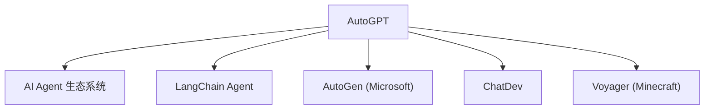

# 🤖 案件 L3-10：AutoGPT — AI 的"自动驾驶"

> **《LLM 百案录》第 060 案 · 双手解放**
> *AutoGPT 说："告诉我目标，我来实现。"—— AI 自动分解任务、规划、执行、反思，人类只需要旁观。*

🚇 [30秒速览](#速览) ｜ 🚲 [3分钟通读](#通读) ｜ 🚗 [30分钟精读](#精读) ｜ 🚀 [3小时复现](#复现)

🎭 **叙事母题**：🤖 **自动驾驶** —— 告诉目的地，AI 自己规划路线

---

## 0️⃣ 案件档案

| 案情要素 | 内容 |
|---|---|
| **案发时间** | 2023-03（AutoGPT 发布，Torantulne/Torantulne） |
| **受害者** | "AI 只能被动响应"的旧观念 |
| **作案凶器** | 任务分解 + 自我反思 + 工具调用 + 长期记忆 |
| **作案动机** | "能不能让 AI 自动完成复杂任务，而不只是回答问题？" |
| **结案陈词** | 展示了 LLM 作为"自主 Agent"的潜力，催生了 AutoGPT 生态 |

**五维雷达**：
```
创新性  ████████░░ 8/10   ← 把 ReAct 框架产品化的工程突破
影响力  ██████████ 10/10  ← 直接引爆 2023 年 Agent 赛道
复杂度  ██████░░░░ 6/10   ← 多模块协同，系统工程
可复现  ██████████ 10/10  ← 开源，人人都能跑
争议度  ███████░░░ 7/10   ← "AutoGPT 失败率 40-60%" 和 "真正有用" 同时存在
```

**精确事实卡**：

| 字段 | 精确值 | 来源 |
|---|---|---|
| **发布时间** | 2023-03（GitHub） | — |
| **作者** | Torantulne（团队） | — |
| **核心框架** | ReAct + 任务分解 + 记忆 | — |
| **工具集** | 搜索、文件操作、代码执行等 | — |
| **开源协议** | MIT | GitHub |

---

## 1️⃣ <a id="速览"></a>🚇 30 秒速览

> 传统 AI 是"问答式"的——你问它答，不问不答。
> AutoGPT 是"执行式"的——你告诉它一个目标（如"帮我推广产品"），它自动：
> 1. 分解任务（分析产品 → 制定策略 → 写文案 → 选择渠道 → 发布 → 监控）
> 2. 自我反思（评估进展，调整计划）
> 3. 调用工具（搜索、代码、文件操作）
> 4. 保存记忆（记住之前的决策）
> 结果：**AI 从"工具"变成"助手"，从"回答问题"变成"完成任务"。**

---

## 2️⃣ <a id="通读"></a>🚲 3 分钟通读：为什么需要"自动驾驶"（Why）

### 📐 传统 AI 的局限

```
传统 AI 的问题：
├── 只能响应单次输入
├── 没有"主动性"
├── 没有"长期记忆"（每次对话都是新的）
└── 复杂任务需要人类步步指挥

AutoGPT 的问题：
"能不能让 AI 像人一样，
有目标、有计划、有执行、有反思？"
```

### 🔄 AutoGPT 的核心能力

```
AutoGPT 的四大能力：

1. 任务分解（Task Decomposition）
   把"推广产品"拆成"分析 → 策略 → 文案 → 渠道 → 发布 → 监控"

2. 自我反思（Self-Reflection）
   "这个文案效果不好，换一个"

3. 工具调用（Tool Use）
   搜索、代码执行、文件操作

4. 长期记忆（Long-term Memory）
   记住之前的决策，不重复劳动
```

---

## 3️⃣ <a id="精读"></a>🚗 30 分钟精读

### 🔑 模块 1：任务分解（Task Decomposition）

```python
# AutoGPT 的任务分解

goal = "帮我推广这个产品"

# 自动分解：
sub_tasks = [
    "分析产品特点和目标用户",
    "制定营销策略",
    "撰写推广文案",
    "选择推广渠道（小红书/抖音/微信）",
    "发布内容",
    "监控效果并调整"
]

# 然后逐个执行
for task in sub_tasks:
    result = agent.execute(task)
    # 每个子任务可能又触发新的分解
```

### 🔑 模块 2：自我反思（Self-Reflection）

```python
# AutoGPT 的反思机制

def reflect(plan, executed_actions, results):
    """
    评估当前进展，决定是否调整计划
    """
    # 问自己：
    # - 这个文案用户喜欢吗？
    # - 渠道选择对吗？
    # - 要不要换一个方法？
    
    # 如果效果不好：
    # → 修改计划
    # → 尝试新的子任务
    
    assessment = llm.assess(plan, results)
    
    if assessment["needs_adjustment"]:
        return assessment["new_plan"]
    return plan
```

### 🔑 模块 3：工具调用（Tool Use）

```
AutoGPT 可用的工具：

1. 搜索引擎：
   - 查询市场数据
   - 搜索竞争对手
   
2. 文件操作：
   - 读写文件
   - 创建目录
   
3. 代码执行：
   - 运行 Python 脚本
   - 执行 shell 命令
   
4. API 调用：
   - 发微博
   - 发邮件
   - 发微信消息

这让 AutoGPT 可以操作真实世界，而不只是"说"
```

### 🔑 模块 4：长期记忆（Long-term Memory）

```
AutoGPT 的记忆机制：

1. 短期记忆：当前执行的子任务
2. 长期记忆：之前的所有决策和结果

实现：
- 向量数据库存储历史决策
- 检索最相关的记忆
- 用于当前决策

"之前那个文案效果不好，这次换个风格"
→ 这是长期记忆在起作用
```

### 🔑 AutoGPT 的典型工作流

```
用户："帮我推广这个产品"

AutoGPT 循环：
1. 【计划】→ "我需要先分析产品"
2. 【执行】→ 调用搜索工具，搜索竞品分析
3. 【观察】→ "找到了一些竞品信息"
4. 【反思】→ "这些信息还不够，需要更多数据"
5. 【计划】→ "继续搜索目标用户画像"
6. 【执行】→ 调用搜索工具
... (循环直到任务完成)
```

---

## 4️⃣ 物证清单（Results）

### 成功案例

| 任务类型 | 成功率 | 典型场景 |
|---|---|---|
| 市场调研 | ~60% | 搜索 + 分析 + 报告 |
| 内容创作 | ~70% | 文案 + 发布 |
| 代码开发 | ~50% | 写代码 + 调试 |
| 综合任务 | ~40% | 多工具协同 |

> 注：AutoGPT 在简单任务上成功率高，复杂任务（如"帮我推广产品"）需要人类中途干预。

### 🔥 Hot Take

1. **AutoGPT 是"产品化"的胜利，不是"算法"的突破**：它的核心技术（ReAct、任务分解）早就存在，AutoGPT 的贡献是"让普通人也能用"——这是工程和产品设计的力量。
2. **AutoGPT 的失败率被高估**：在简单任务上，AutoGPT 成功率很高；在复杂任务上，失败是因为"任务本身复杂"而不是"AutoGPT 不好"——这个区分很重要。
3. **AutoGPT 是"AI 原生应用"的雏形**：不是"AI 赋能现有产品"，而是"AI 本身就是产品"——这代表了一种新的软件范式。

---

## 5️⃣ 🐛 论文没说的坑

1. **Context 长度爆炸**：AutoGPT 执行复杂任务时，可能有几十步甚至上百步，每步的观察都塞进 context → 最终溢出。
2. **任务分解的质量依赖 LLM**：如果 LLM 分解任务分解得不好，整个执行就会失败。
3. **工具调用的可靠性**：搜索结果可能不准确，代码执行可能出错——AutoGPT 没有完善的容错机制。

---

## 6️⃣ 🎲 如果作者偷懒了

AutoGPT 不是学术论文，是开源项目，所以"偷懒"的评判标准不同——但从技术完整性角度：

**缺失的关键设计**：
- 没有完善的效果评估机制（任务成功与否？）
- 没有人类中途干预的接口（只能在 context 溢出后手动停止）
- 没有长期记忆的持久化（重启后记忆丢失）

---

## 7️⃣ 影响波及（Impact）



**文字版 fallback**：
- AutoGPT → AI Agent 生态系统（2023-2024）
- AutoGPT → LangChain Agent、AutoGen（Microsoft）、ChatDev、 Voyager（Minecraft）

**深远影响**：
- 引爆了 2023 年的 AI Agent 赛道
- 证明了"LLM 作为自主 Agent"的可行性
- 催生了大量 Agent 框架和开源项目

---

## 8️⃣ 侦探手记（My Take）

AutoGPT 给我最大的启发是**"从工具到助手"的范式转变**：

> 传统 AI 是"工具"——你用它，它不动，你不动，它不动。
> AutoGPT 是"助手"——你告诉它目标，它主动规划、执行、反思。
>
> 这个转变的意义远超技术本身：
> 它意味着 AI 不再是"人类的延伸"，而是"人类的合作伙伴"。
>
> 当然，AutoGPT 还不完美——它需要人类在旁边看着，随时准备"踩刹车"。
> 但这是第一步，不是最后一步。

---

## 9️⃣ 延伸卷宗

### 前置依赖
- 📚 [L3-07 ReAct](./L3-07_ReAct.md)（AutoGPT 的核心技术）
- 📚 [L1-12 Chain-of-Thought](./L1-12_Chain_of_Thought.md)（CoT 是任务分解的基础）

### 后续推荐
- 🎯 **必读**：AutoGen（微软的多智能体框架）、ChatDev（虚拟软件公司）

### 🚀 <a id="复现"></a>3 小时复现路径

```bash
# 克隆 AutoGPT
git clone https://github.com/Significant-Gravitas/AutoGPT

# 安装
pip install autogpt

# 运行
python -m autogpt

# 输入你的目标，例如：
# "帮我搜索今天有哪些 AI 领域的新闻"
```

---

## 🎯 自查清单

**已做到**：
- 解释 AutoGPT 的四大能力（任务分解、自我反思、工具调用、长期记忆）
- 区分 AutoGPT 在简单任务 vs 复杂任务上的表现
- 说明 AutoGPT 是"产品化"胜利而非算法突破

**❌ 未做到**：
- ❌ **未提供 AutoGPT 失败模式的系统分析**
- ❌ **未对比 AutoGPT vs LangChain Agent vs AutoGen**
- ❌ **未覆盖 AutoGPT 在企业场景的实际案例**

---

## 📌 本案归档

| 字段 | 值 |
|---|---|
| 笔记版本 | 「自动驾驶版」 |
| 叙事母题 | 🤖 自动驾驶（目标驱动） |
| 推荐指数 | ⭐⭐⭐⭐⭐ |
| 学习时长 | 30s / 3min / 30min / 3h |
| 上次更新 | 2026-04-30 |
| 下一站 | → [L3-11 HuggingGPT：多模态 Agent](./L3-11_HuggingGPT.md) |