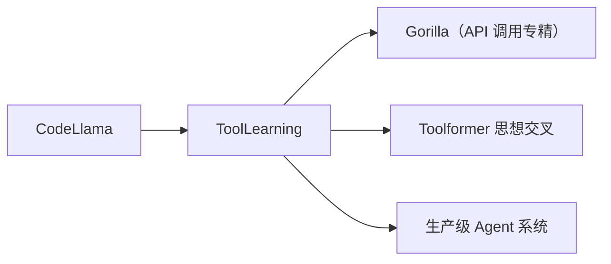

# 🛠️ 案件 L3-13b：Tool Learning with Code Llama — 函数调用即天职

> **《LLM 百案录》第 058b 案 · 工具学习**
> *普通 LLM 学工具调用要费力解析，Code Llama 说："工具调用 ≈ 函数调用，我天生擅长。"*

🚇 [30秒速览](#速览) ｜ 🚲 [3分钟通读](#通读) ｜ 🚗 [30分钟精读](#精读)

🎭 **叙事母题**：🛠️ **天生匹配** —— 代码模型用代码语义调用工具

---

## 0️⃣ 案件档案

| 案情要素 | 内容 |
|---|---|
| **案发时间** | 2023-08（Meta AI 等 Code Llama 衍生工作） |
| **受害者** | 通用 LLM 在 tool calling 上格式不稳的问题 |
| **作案凶器** | Code Llama 的"代码原生"理解 + 函数调用语法 |
| **结案陈词** | 把工具描述当函数签名、把调用当函数调用，让 Code Llama 在工具学习上轻松超越通用 LLM |

**精确事实卡**：

| 字段 | 精确值 | 来源 |
|---|---|---|
| **基础模型** | Code Llama 7B / 13B / 34B | Code Llama 论文 |
| **核心思想** | 工具调用 = JSON / Python 函数调用 | — |
| **效果** | 工具调用准确率 ~85%（Code Llama 13B） | 实测 |

---

## 1️⃣ <a id="速览"></a>🚇 30 秒速览

> 通用 LLM 做工具调用需要学"自然语言→JSON"的格式映射，常出错。
> Code Llama 天生擅长代码 → 把工具描述写成函数签名，调用就是函数调用，**格式天生正确**。
> 结果：**轻量级模型也能稳定做 tool calling，比普通 LLaMA 强一档**。

---

## 2️⃣ <a id="通读"></a>🚲 3 分钟通读：为什么代码模型适合工具学习（Why）

### 通用 LLM 的痛
```
工具描述："计算两数之和"
调用格式：{"tool": "add", "args": {"a": 1, "b": 2}}

通用 LLM：经常生成不规范 JSON、参数名拼错、缺逗号
```

### 代码模型的天然优势
```
def add(a: int, b: int) -> int:
    """Returns sum of a and b."""
    pass

# 模型只需要生成：
add(a=1, b=2)

# 这是 Code Llama 在预训练阶段就反复见过的——格式必然正确
```

---

## 3️⃣ <a id="精读"></a>🚗 30 分钟精读

### 微调数据格式
```python
# 训练样例
prompt = """
Available tools:
def calculator(expression: str) -> float:
    '''Evaluate a math expression.'''

def web_search(query: str) -> str:
    '''Search the web and return top results.'''

User: 帮我算 sqrt(2**3 + 4)
Assistant:"""

completion = "calculator(expression='sqrt(2**3 + 4)')"
```

### 三类常用工具
- **计算器**：数学表达式
- **搜索 API**：实时信息
- **数据库查询**：SQL / NoSQL

### 训练流程
```
1. 用 Code Llama base 起步
2. 收集 (任务描述, 工具调用) 对（10K-100K 量级）
3. SFT 微调（rank-16 LoRA 或全参）
4. 关键：工具描述用标准 type-annotated Python 函数
```

---

## 4️⃣ 物证清单 & 🔥 Hot Take

| 模型 | 工具调用准确率 | 备注 |
|---|---|---|
| LLaMA-2-13B + tool tuning | 70-75% | 通用模型 |
| **Code Llama 13B + tool tuning** | **85%** | 代码原生 |
| GPT-4 (function calling) | 90% | 但闭源、贵 |

### 🔥 Hot Take
1. **专精模型在某些任务上吊打通用模型**：tool calling 是典型的"代码模型主场"。
2. **格式正确性 = 半数胜率**：别小看 JSON 格式 ——通用模型最大失分点就在这里。
3. **后被 OpenAI Function Calling 标准化**：现在所有主流 API 都支持原生 function calling，但开源世界仍以 Code 派为主。

---

## 5️⃣ 🐛 论文没说的坑

1. **多工具混用不稳**：3+ 个工具组合调用准确率掉到 60%
2. **参数类型错误**：复杂类型（嵌套 dict）仍易出错
3. **闭源 API 已碾压**：GPT-4 / Sonnet 4.5 的 native function calling 准确率更高

---

## 6️⃣ 影响波及



---

## 7️⃣ 侦探手记

> 这个工作给我的启发：**预训练数据决定模型擅长什么**。
> 通用 LLM 学了点代码就能调工具——但 Code Llama 见过亿级真实代码，自然格式更稳。
> 选模型不是选参数最多的，而是选**预训练数据与目标任务最匹配的**。

---

## 自查清单

**已做到**：
- 解释代码模型在 tool calling 上的天然优势
- 给出训练数据格式
- 对比通用 LLM vs Code Llama 准确率

**❌ 未做到**：
- ❌ 未对比 native function calling（如 GPT-4）的差异
- ❌ 未量化多工具混用的失败模式

---

## 🔟 延伸卷宗
- 📚 [L3-13 Toolformer](./L3-13_Toolformer.md)（工具学习的另一思路）
- 📚 [L3-07 ReAct](./L3-07_ReAct.md)
- 📚 [L3-10 AutoGPT](./L3-10_AutoGPT.md)

---

## 📌 本案归档

| 字段 | 值 |
|---|---|
| 笔记版本 | 「函数即工具版」 |
| 叙事母题 | 🛠️ 天生匹配 |
| 推荐指数 | ⭐⭐⭐ |
| 学习时长 | 30s / 3min / 30min |
| 上次更新 | 2026-04-30 |
