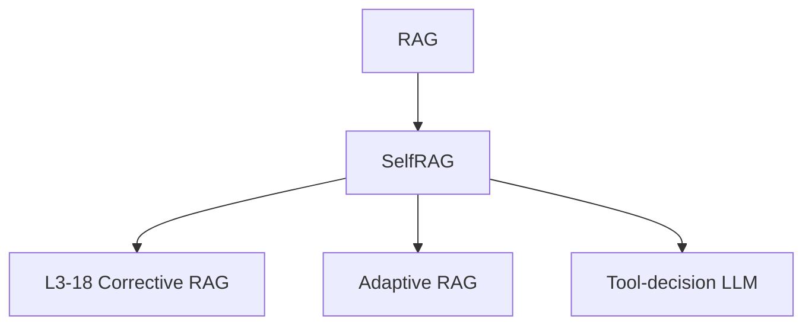

# 🔍 案件 L3-17：Self-RAG — 检索增强的"自我反思"

> **《LLM 百案录》第 060 案 · 自我反思**
> *普通 RAG 不分场合都检索，Self-RAG 说："让模型自己决定要不要查、查得对不对、要不要再查。"*

🚇 [30秒速览](#速览) ｜ 🚲 [3分钟通读](#通读) ｜ 🚗 [30分钟精读](#精读) ｜ 🚀 [3小时复现](#复现)

🎭 **叙事母题**：🔍 **自我反思** —— AI 给自己加 4 个反思 token

---

## 0️⃣ 案件档案

| 案情要素 | 内容 |
|---|---|
| **案发时间** | 2023-10（Asai et al., University of Washington） |
| **受害者** | 普通 RAG "永远检索" + "无法评估检索质量" 的两大痛点 |
| **作案凶器** | 4 种特殊 reflection tokens + 训练数据自动标注 |
| **作案动机** | "RAG 应该是一个可评估、可分支的决策过程，而非死板的 pipeline" |
| **结案陈词** | Self-RAG 用 4 个特殊 token 把"检索决策、相关性、支持度、整体效用"塞进生成过程，让 LLM 既能 RAG 又能自反思 |

**精确事实卡**：

| 字段 | 精确值 | 来源 |
|---|---|---|
| **4 种 token** | `[Retrieve]` `[IsRel]` `[IsSup]` `[IsUse]` | Section 3 |
| **基础模型** | LLaMA-2 7B / 13B | Section 4 |
| **训练数据** | 用 GPT-4 自动标注 reflection tokens | Section 4 |
| **效果** | 在 ARC、PopQA、ASQA 等任务上超越 GPT-4 + RAG | Table 2 |

---

## 1️⃣ <a id="速览"></a>🚇 30 秒速览

> 普通 RAG：每次都检索 → 检索结果可能无关 → 强行塞 prompt → LLM 还要费力辨别。
> Self-RAG 训练 LLM 在生成时自然产出 4 种特殊 token：
> - `[Retrieve]`：现在该不该检索？
> - `[IsRel]`：检索回来的内容相关吗？
> - `[IsSup]`：我的回答有没有被检索内容支持？
> - `[IsUse]`：整体回答有用吗？
> 结果：**模型学会按需检索、自评、可调控**，多个 QA 任务超越 GPT-4 + 普通 RAG。

---

## 2️⃣ <a id="通读"></a>🚲 3 分钟通读：为什么普通 RAG 不够（Why）

### 普通 RAG 的三大缺陷
```
1. "盲目检索"：每个 query 都查，可能查到无关内容污染 prompt
2. "盲目相信"：检索回来的内容不一定相关，模型却往往照单全收
3. "无法核查"：生成的答案是不是来自检索？无从知晓
```

### Self-RAG 的核心思路
**把"决策 + 评估"显式化为 special tokens**，让模型生成时自然产出这些标记，从而：
- 推理时可读取 token 做控制流（要不要检索、要不要采纳）
- 训练时这些 token 充当"软监督信号"

---

## 3️⃣ <a id="精读"></a>🚗 30 分钟精读

### 4 个 reflection tokens 详解

| Token | 何时生成 | 取值 | 作用 |
|---|---|---|---|
| `[Retrieve]` | 句首 | yes / no / continue | 控制是否触发检索器 |
| `[IsRel]` | 看到检索结果后 | relevant / irrelevant | 该段是否相关 |
| `[IsSup]` | 生成完一段后 | fully / partially / no | 我的话被支持吗 |
| `[IsUse]` | 答案末尾 | 1-5 分 | 整体效用打分 |

### 训练数据自动构造
```python
# 用 GPT-4 给每条 SFT 数据打 reflection token
for (q, a) in raw_data:
    # 1. 是否需要检索？
    retrieve = gpt4(f"Does '{q}' need retrieval? yes/no")
    # 2. 模拟检索 + 相关性
    docs = retriever(q)
    is_rel = [gpt4(f"Is doc {d} relevant to {q}?") for d in docs]
    # 3. 答案是否被文档支持
    is_sup = gpt4(f"Is '{a}' supported by {docs}?")
    # 4. 整体效用打分
    is_use = gpt4(f"How useful is '{a}' on 1-5 scale?")

    # 拼接成训练 token 流
    train_seq = q + retrieve + docs + is_rel + a + is_sup + is_use
```

### 推理时的"决策树"
```
[start] → 模型生成 [Retrieve] = ?
    ├── no  → 直接生成答案
    └── yes → 调用检索器
              ↓
          每个 doc 单独走一遍生成（并行）
              ↓
          beam-search 时根据 [IsRel]、[IsSup]、[IsUse] 加权选择最优路径
```

---

## 4️⃣ 物证清单

| 模型 | PopQA | TriviaQA | ASQA |
|---|---|---|---|
| LLaMA-2 13B + RAG | 45.7 | 59.8 | 19.8 |
| ChatGPT + RAG | 50.8 | 65.7 | 35.4 |
| **Self-RAG 13B** | **55.8** | **69.3** | **37.0** |

### 🔥 Hot Take
1. **"特殊 token = 决策接口"**：把模型行为暴露为 token，可以让外部代码挂控制逻辑。
2. **可调控生成**的早期范例：推理时通过修改 token 阈值就能切换"严格事实派 vs 创意派"。
3. **GPT-4 蒸馏到 LLaMA**：用强模型自动标注 + 弱模型训练，是 2023-2024 年主流路线。

---

## 5️⃣ 🐛 论文没说的坑

1. **解码复杂度高**：每个 doc 要并行展开一次生成，推理慢 2-5×
2. **GPT-4 标注偏差**：训练数据完全依赖 GPT-4 判断，会继承其偏见
3. **可调阈值难调**：4 种 token 的阈值组合空间大，需要 task-specific 调试

---

## 6️⃣ 🎲 如果作者偷懒了

**实验**：未做"训练数据噪声 vs 效果"消融——GPT-4 标错的样本占比未量化
**理论**：4 种 token 的设计是经验性的，缺乏"为什么是 4 种而不是 3 或 5 种"的论证

---

## 7️⃣ 影响波及



---

## 8️⃣ 侦探手记

Self-RAG 给我最大的启发是**"AI 需要元认知"**。
> 知道自己"不知道"比"知道"更重要——
> 让模型显式输出"我现在该不该查、查到的相关吗、我的话靠谱吗"，
> 是把 RAG 从"机械流程"升级为"可反思决策"的关键一步。

---

## 自查清单

**已做到**：
- 解释 4 个 reflection tokens 的角色
- 描述训练数据自动构造流程
- 给出 PopQA / TriviaQA / ASQA 实测对比

**❌ 未做到**：
- ❌ 未对比 Self-RAG 与 CRAG 的具体差异
- ❌ 未实测推理延迟开销

---

## 🔟 延伸卷宗
- 📚 [L3-15 RAG](./L3-15_RAG.md)（基础版本）
- 📚 [L3-18 Corrective RAG](./L3-18_Corrective_RAG.md)（错了再改的另一思路）
- 📚 [L3-19 Query Augmentation](./L3-19_RAG_Query_Augmentation.md)
- 📚 [L3-20 Knowledge Graph RAG](./L3-20_Knowledge_Graph_RAG.md)

### 🚀 <a id="复现"></a>3 小时复现路径
- 官方代码：[github.com/AkariAsai/self-rag](https://github.com/AkariAsai/self-rag)
- 推荐先在 PopQA 子集（500 题）上跑通 inference

---

## 📌 本案归档

| 字段 | 值 |
|---|---|
| 笔记版本 | 「自我反思版」 |
| 叙事母题 | 🔍 自我反思 |
| 推荐指数 | ⭐⭐⭐⭐ |
| 学习时长 | 30s / 3min / 30min / 3h |
| 上次更新 | 2026-04-30 |
| 下一站 | → [L3-18 Corrective RAG](./L3-18_Corrective_RAG.md) |
