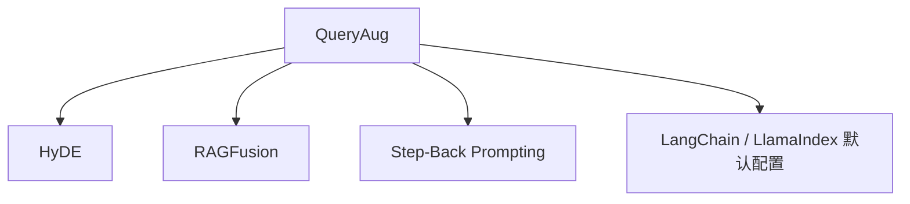

# 🔄 案件 L3-19：RAG Query Augmentation — 用户问题与索引内容的"翻译官"

> **《LLM 百案录》第 062 案 · 桥梁**
> *用户问"那个东西怎么用？"——检索器一脸懵；
> Query Augmentation 说："让我把它翻译成正经检索 query。"*

🚇 [30秒速览](#速览) ｜ 🚲 [3分钟通读](#通读) ｜ 🚗 [30分钟精读](#精读)

🎭 **叙事母题**：🔄 **桥梁** —— 在用户语言和索引语言之间架桥

---

## 0️⃣ 案件档案

| 案情要素 | 内容 |
|---|---|
| **案发时间** | 2023-2024（HyDE / Query Rewriting / RA-Fusion 等多个工作） |
| **受害者** | 自然语言 query 与检索索引（向量 / BM25）的"语义鸿沟" |
| **作案凶器** | LLM 改写 / 扩展 / 假设回答 → 多个增强 query |
| **作案动机** | "检索器看不懂日常语言，但 LLM 看得懂——让 LLM 当翻译官" |
| **结案陈词** | 通过 LLM 把单一 query 转换成多个语义丰富、结构规整的检索 query，提升召回与精度 |

**精确事实卡**：

| 字段 | 精确值 | 来源 |
|---|---|---|
| **HyDE** | 让 LLM 先"假设回答"，用回答检索 | Gao et al., 2022 |
| **Query Rewriting** | 用 RL 训练 query 改写器 | Ma et al., 2023 |
| **Multi-Query (RAG-Fusion)** | 一个问题生成 N 个变体并行检索 | LangChain 实践 |
| **HyDE 提升** | TREC DL 上召回 +10%+ | Original paper |

---

## 1️⃣ <a id="速览"></a>🚇 30 秒速览

> 用户："最近发布的那个国产开源大模型怎么用？"
> 直接扔进向量库 → 召回质量差（没有具体名词、缺乏上下文）。
> Query Augmentation 的解法：让 LLM 先把这个 query 变成：
> - "DeepSeek-R1 安装教程"（具象化）
> - "DeepSeek-R1 inference example"（英译 + 技术化）
> - "国产开源大语言模型对比 2025"（背景扩展）
> 再用这些增强 query 去检索 → 召回质量大幅提升。

---

## 2️⃣ <a id="通读"></a>🚲 3 分钟通读：四种主流策略（Why）

### 1. Query Rewriting（改写）
```
用户原句  →  LLM 改写  →  规范化的检索 query

例：
原：那个新出的能编程的 AI 怎么用？
改：Claude Sonnet 4.5 编程能力使用教程
```

### 2. Query Expansion（扩展）
```
原 query  →  补充同义词、相关概念  →  增强后 query

例：
原：糖尿病饮食
扩：糖尿病 高血糖 饮食 营养 血糖控制 餐单
```

### 3. HyDE: Hypothetical Document Embeddings
```
原 query  →  让 LLM "假设这是答案"生成一段文本  →  用这段文本去检索

例：
原 query: "What is QLoRA?"
LLM 生成假设回答: "QLoRA is a fine-tuning method that quantizes weights to 4-bit..."
用这段文字（不是原 query）去做向量检索 → 召回率显著提升
```

### 4. Multi-Query（RAG-Fusion）
```
原 query  →  生成 N 个变体  →  各自检索  →  Reciprocal Rank Fusion 合并

例：
原：如何减肥？
变体：
  - 健康减脂方法
  - weight loss strategies
  - 科学减重食谱
  - 运动 + 饮食 控制体重
最终结果用 RRF 综合排序
```

---

## 3️⃣ <a id="精读"></a>🚗 30 分钟精读

### HyDE 的工作原理
**关键洞察**：向量库里存的是"答案文档"，不是"问题"——所以用"假设答案"匹配比用"问题"匹配更准。

```python
# 普通 RAG
query_vec = embed("What is QLoRA?")
docs = vector_search(query_vec, k=5)  # 召回率一般

# HyDE
hypothetical = llm("Generate a short hypothetical answer to: What is QLoRA?")
# hypothetical = "QLoRA is a 4-bit quantization method..."
hyde_vec = embed(hypothetical)
docs = vector_search(hyde_vec, k=5)  # 召回率显著提升
```

### RAG-Fusion 的 Reciprocal Rank Fusion
```python
# 对每个变体 query 都得到一个排序列表
rankings = [retriever(q) for q in query_variants]

# RRF 合并
def rrf(rankings, k=60):
    scores = {}
    for ranking in rankings:
        for rank, doc in enumerate(ranking):
            scores[doc] = scores.get(doc, 0) + 1.0 / (k + rank + 1)
    return sorted(scores.items(), key=lambda x: -x[1])
```

### Query Rewriting 的 RL 训练
```
Reward = downstream QA 准确率
LLM 改写器作为 actor
原始 query 作为 state
改写后的 query 作为 action

PPO 训练 → LLM 学会"什么样的改写能提升下游 QA 效果"
```

---

## 4️⃣ 物证清单 & 🔥 Hot Take

| 方法 | 对召回的影响 | 工程成本 | 适用场景 |
|---|---|---|---|
| 直接检索 | baseline | 低 | 索引质量高时 |
| Query Rewriting | +5-10% | 低 | 用户 query 口语化 |
| Query Expansion | +3-5% | 低 | 关键词稀疏 |
| **HyDE** | **+10-15%** | 中 | 长文档检索 |
| **Multi-Query** | **+8-12%** | 高 | 模糊 / 多义 query |

### 🔥 Hot Take
1. **"问题→假设答案"是反直觉但有效**：HyDE 把检索建模为"答案-答案匹配"而非"问题-答案匹配"，更对齐向量空间结构。
2. **Multi-Query 是工业最常用**：因为 LangChain/LlamaIndex 一行代码搞定，效果稳定。
3. **Query 改写是 RL 的好场景**：reward 易得（QA 准确率），action space 自然（语言）。

---

## 5️⃣ 🐛 论文没说的坑

1. **延迟翻倍甚至 N 倍**：Multi-Query 需要 N 次检索 + 1 次 LLM 改写
2. **HyDE 在事实问答上不稳**：LLM 假设回答可能误导检索方向
3. **改写器幻觉**：LLM 可能改出"看起来对但意图变了"的 query

---

## 6️⃣ 🎲 如果作者偷懒了

各方法之间缺乏统一基准对比——选哪个全靠经验和 A/B 测试。

---

## 7️⃣ 影响波及



---

## 8️⃣ 侦探手记

> RAG 的瓶颈很少在"检索器本身"，而在"用户语言 ≠ 索引语言"。
> Query Augmentation 用 LLM 这个"翻译官"补上了这个缺口。
> 在我看来，这是工业 RAG 系统**最具性价比的改进**——不动 LLM、不动索引，加一层 prompt 就好。

---

## 自查清单

**已做到**：
- 列出 4 种主流 Query Augmentation 策略
- 解释 HyDE 的"反直觉"工作原理
- 给出 RRF 的合并公式

**❌ 未做到**：
- ❌ 未对比不同方法在中文场景下的效果
- ❌ 未量化分析延迟与成本

---

## 🔟 延伸卷宗
- 📚 [L3-15 RAG](./L3-15_RAG.md)
- 📚 [L3-17 Self-RAG](./L3-17_Self_RAG.md)
- 📚 [L3-18 Corrective RAG](./L3-18_Corrective_RAG.md)
- 📚 [L3-20 Knowledge Graph RAG](./L3-20_Knowledge_Graph_RAG.md)

### 🚀 实践入口
- LangChain `MultiQueryRetriever`、`HyDE` 类
- LlamaIndex `HyDEQueryTransform`

---

## 📌 本案归档

| 字段 | 值 |
|---|---|
| 笔记版本 | 「桥梁版」 |
| 叙事母题 | 🔄 桥梁 |
| 推荐指数 | ⭐⭐⭐⭐ |
| 学习时长 | 30s / 3min / 30min |
| 上次更新 | 2026-04-30 |
| 下一站 | → [L3-20 Knowledge Graph RAG](./L3-20_Knowledge_Graph_RAG.md) |
