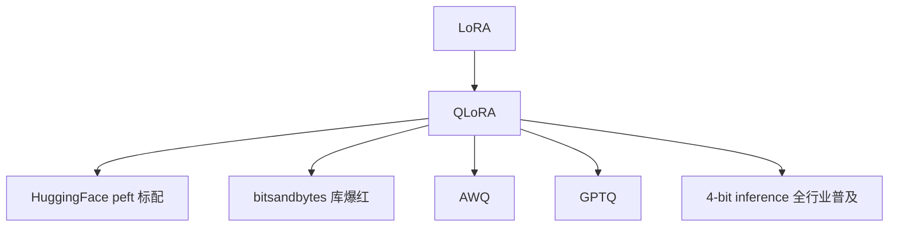

# 🎯 案件 L3-22：QLoRA — 微调的"极限压缩"

> **《LLM 百案录》第 065 案 · 极限压缩**
> *LoRA 已经省 10000× 参数，QLoRA 说："我把权重也压成 4 bit，再省 4×。"*

🚇 [30秒速览](#速览) ｜ 🚲 [3分钟通读](#通读) ｜ 🚗 [30分钟精读](#精读) ｜ 🚀 [3小时复现](#复现)

🎭 **叙事母题**：🎯 **极限压缩** —— 用最少的显存换最大的模型

---

## 0️⃣ 案件档案

| 案情要素 | 内容 |
|---|---|
| **案发时间** | 2023-05（Dettmers et al., University of Washington） |
| **受害者** | 7B / 13B / 65B 模型微调对显存的"刚需" |
| **作案凶器** | NF4 量化 + Double Quantization + Paged Optimizer + LoRA |
| **作案动机** | "LoRA 减少了梯度，但权重还是 fp16——能不能也压一压？" |
| **结案陈词** | QLoRA 把基础模型量化到 4-bit，只在 LoRA 适配器上保留全精度梯度，单卡 24GB 微调 65B |

**五维雷达**：
```
创新性  █████████░ 9/10   ← NF4 是真正的新发明
影响力  ██████████ 10/10  ← 让平民玩家能微调 LLM 的代名词
复杂度  ███████░░░ 7/10   ← 数学不深，但 CUDA 实现复杂
可复现  ██████████ 10/10  ← bitsandbytes + peft 一行代码
争议度  ███░░░░░░░ 3/10   ← 公认杰作
```

**精确事实卡**：

| 字段 | 精确值 | 来源 |
|---|---|---|
| **量化格式** | NF4（4-bit NormalFloat） | Section 3.1 |
| **二次量化** | quantization constants 也压缩 | Section 3.2 |
| **Paged Optimizer** | 防 OOM 时把 optimizer state 暂存 CPU | Section 3.3 |
| **65B 显存** | < 48GB（单卡 A100） | Table 1 |
| **效果** | Guanaco 65B 在 Vicuna benchmark 达到 ChatGPT 99.3% | Table 6 |

---

## 1️⃣ <a id="速览"></a>🚇 30 秒速览

> LoRA 让"可训练参数"小到只有 0.1%，但**基础模型仍是 fp16**——65B 还是要 130GB。
> QLoRA 的解法（三个组件）：
> 1. **NF4**：基于 4-bit 正态浮点数的量化，假设权重服从 N(0,1)，针对性优化
> 2. **Double Quantization**：连量化常数也量化，再省 0.37 bit/param
> 3. **Paged Optimizer**：optimizer state 在 GPU/CPU 间分页，OOM 自动换出
> 4. 配合 LoRA：只在 4-bit 基础模型上加 fp16 LoRA 适配器
> 结果：**65B 模型单卡 48GB 微调，效果几乎不掉**。

---

## 2️⃣ <a id="通读"></a>🚲 3 分钟通读：从 LoRA 到 QLoRA（Why）

### LoRA 的"瓶颈"
```
LoRA 微调 65B：
- 可训练参数：~ 0.1% × 65B = 65M（fp16 → 130MB）
- 但基础模型权重：65B fp16 = 130GB
显存：被基础权重撑死
```

### QLoRA 的洞察
```
"如果基础权重不动，为什么必须 fp16？"

→ 把基础权重量化到 4-bit：65B × 0.5B = 32.5GB
→ LoRA 适配器仍 fp16（要训练）：~ 130MB
→ 总显存：~ 48GB（含 activations + optimizer state）
```

### 为什么是 NF4 而不是普通 4-bit Int？
```
Int4：把 [-max, +max] 均匀分 16 份
问题：神经网络权重多集中在 0 附近，均匀分桶浪费

NF4：基于"权重 ~ N(0, σ²)"假设，按分位数分 16 份
   → 0 附近桶细，远端桶粗
   → 信息保留更好

实测：NF4 比 Int4 perplexity 提升明显
```

---

## 3️⃣ <a id="精读"></a>🚗 30 分钟精读

### NF4 量化具体细节
```python
# 1. 把权重正态化（除以 absmax）
W_norm = W / absmax(W)

# 2. 量化到 NF4 的 16 个分位数
nf4_levels = quantile_normal(16)  # 提前算好的 16 个位置
W_nf4 = nearest(W_norm, nf4_levels)  # 找最近的分位

# 3. 反量化时
W_dequant = W_nf4 * absmax(W)
```

### Double Quantization
```
absmax(W) 这个常数本身也要存（fp32, per block）
QLoRA：把每 256 个 absmax 再量化一次到 fp8
→ 进一步省内存（量化 absmax 的 absmax 用 fp32）
```

### 训练时的前向 / 反向
```
Forward:
  W_4bit → 临时 dequantize 到 fp16
  Y = W_dequant @ X + (LoRA_A @ LoRA_B) @ X

Backward:
  只对 LoRA_A, LoRA_B 计算梯度
  W_4bit 不动（甚至不在反向图里）
```

### Paged Optimizer
```
长上下文训练时，activation 占用陡增 → OOM
QLoRA：optimizer state 用 NVIDIA Unified Memory，
      显存不够时自动 page out 到 CPU 内存
       → 防止训练在最后一刻挂掉
```

---

## 4️⃣ 物证清单

| 模型 | 全精度 fp16 显存 | QLoRA 显存 | MMLU |
|---|---|---|---|
| LLaMA 7B | 28GB | **6GB** | 35.0 |
| LLaMA 13B | 52GB | **9GB** | 47.0 |
| LLaMA 33B | 132GB | **20GB** | 56.6 |
| LLaMA 65B | 260GB | **48GB** | 63.4 |

**Guanaco 65B（QLoRA 微调）在 Vicuna benchmark 上 = ChatGPT 99.3%**

### 🔥 Hot Take
1. **NF4 是真正的发明**：不只是工程 trick，而是 information-theoretic 优化（按分布而非均匀量化）。
2. **QLoRA 是"民主化"分水岭**：单卡 24GB 微调 33B 让独立开发者第一次能玩大模型。
3. **bitsandbytes 是真正的杀手**：没有这个 library 一行代码量化的能力，QLoRA 的影响要小一个量级。

---

## 5️⃣ 🐛 论文没说的坑

1. **推理速度不一定快**：4-bit 推理需要每次 dequantize，吞吐量未必比 fp16 高
2. **量化误差累积**：超长 context 上量化误差会放大
3. **某些层不能量化**：Embedding 层、LayerNorm 通常保持 fp16

---

## 6️⃣ 🎲 如果作者偷懒了

未对比"NF4 vs FP4 vs INT4 vs GPTQ"在更多任务上的差异——只在指令微调上比较。

---

## 7️⃣ 影响波及



---

## 8️⃣ 侦探手记

QLoRA 给我最大的启发是**"组合优化的力量"**：
> NF4 + LoRA + Paged + Double Quant，单看每一项都不是革命性的；
> 组合起来——单卡 48GB 微调 65B，这就是革命。
> **创新不一定是"从零发明"，"找到正确的组合"也是创新**。

---

## 自查清单

**已做到**：
- 解释 NF4 vs Int4 的本质差异（分布感知）
- 描述 Double Quantization 与 Paged Optimizer
- 给出 7B / 13B / 33B / 65B 显存表

**❌ 未做到**：
- ❌ 未深入分析 NF4 的具体分位数计算
- ❌ 未量化对比 QLoRA 与 GPTQ-LoRA 的差异

---

## 🔟 延伸卷宗
- 📚 [L3-21 LoRA](./L3-21_LoRA.md)（必读前置）
- 📚 [L3-23 PEFT Survey](./L3-23_PEFT.md)
- 📚 [L3-25 DoRA](./L3-25_DoRA.md)
- 📚 [L2-28 BFloat16](./L2-28_BFloat16.md)（混合精度基础）

### 🚀 <a id="复现"></a>3 小时复现路径
```python
from peft import LoraConfig, get_peft_model
from transformers import AutoModelForCausalLM, BitsAndBytesConfig
import torch

bnb_config = BitsAndBytesConfig(
    load_in_4bit=True,
    bnb_4bit_quant_type="nf4",
    bnb_4bit_compute_dtype=torch.bfloat16,
    bnb_4bit_use_double_quant=True,
)

model = AutoModelForCausalLM.from_pretrained(
    "meta-llama/Llama-2-7b-hf",
    quantization_config=bnb_config,
    device_map="auto",
)
model = get_peft_model(model, LoraConfig(r=16, lora_alpha=32, target_modules=["q_proj", "v_proj"]))
# 然后正常 train（loss + AdamW）
```

---

## 📌 本案归档

| 字段 | 值 |
|---|---|
| 笔记版本 | 「极限压缩版」 |
| 叙事母题 | 🎯 极限压缩 |
| 推荐指数 | ⭐⭐⭐⭐⭐ |
| 学习时长 | 30s / 3min / 30min / 3h |
| 上次更新 | 2026-04-30 |
| 下一站 | → [L3-23 PEFT Survey](./L3-23_PEFT.md) |
