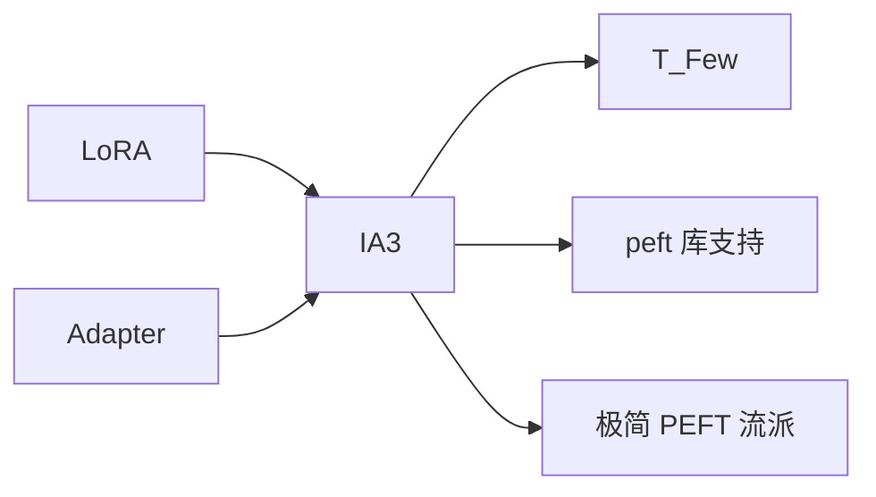

# ⚡ 案件 L3-29：IA³ — PEFT 的"极简主义"

> **《LLM 百案录》第 072 案 · 极致轻量**
> *LoRA 已经够轻，IA³ 说："我连低秩矩阵都不要——只乘三个标量向量。"*

🚇 [30秒速览](#速览) ｜ 🚲 [3分钟通读](#通读) ｜ 🚗 [30分钟精读](#精读)

🎭 **叙事母题**：⚡ **极致轻量** —— 用最少的参数撬动最大的效果

---

## 0️⃣ 案件档案

| 案情要素 | 内容 |
|---|---|
| **案发时间** | 2022-05（Liu et al., NC State / Hyena Labs，T-Few 论文） |
| **受害者** | LoRA / Adapter 的"还能更轻吗？"诘问 |
| **作案凶器** | 三个可学习向量（K 缩放、V 缩放、FFN 中间层缩放） |
| **作案动机** | "用元素级 scaling 替代低秩添加" |
| **结案陈词** | IA³ 仅训练三个 d 维向量，参数量比 LoRA 还小 10×，在 Few-shot 场景超越 LoRA |

**精确事实卡**：

| 字段 | 精确值 | 来源 |
|---|---|---|
| **缩放点** | K, V, FFN 第一线性层输出（hidden state） | Section 3 |
| **可训参数** | 3 × d_model 每层（极少） | Section 3 |
| **代表用法** | T-Few：T0-3B 上做 11 任务 few-shot | Section 4 |
| **效果** | 在 RAFT few-shot benchmark 超越 GPT-3 175B（!） | Table 2 |

> 全名：**I**nfused **A**dapter by **I**nhibiting and **A**mplifying inner **A**ctivations（4 个 A，所以叫 IA³）

---

## 1️⃣ <a id="速览"></a>🚇 30 秒速览

> LoRA：在权重旁加一个 rank-r 矩阵 ΔW = BA。
> IA³：直接乘以一个 d 维向量在 K、V、FFN 上 → 等价于 element-wise scaling。
> 公式：
> - K' = K ⊙ l_k
> - V' = V ⊙ l_v
> - FFN: γ(W_1 x) → γ(W_1 x ⊙ l_ff)，再过 W_2
> 训练参数极少，但 few-shot 效果惊人——T-Few 用 IA³ 让 T0-3B 干翻 GPT-3。

---

## 2️⃣ <a id="通读"></a>🚲 3 分钟通读：为什么这么少的参数有用（Why）

### 直觉
```
神经网络有大量"冗余 attention head"和"冗余 channel"：
  - 有些对当前任务无用 → 学一个小数缩放（甚至 0）来抑制
  - 有些有用 → 学一个 > 1 的标量来放大

IA³ 让模型学会"哪些激活对任务重要" → 简单缩放就能定向调节
```

### 三个缩放点的选择
```
作者实验过很多位置（Q、K、V、FFN 各种），最终选定：
  1. K（控制 attention 对哪些位置敏感）
  2. V（控制 attention 输出哪些信息）
  3. FFN intermediate（控制 FFN 的"门控"）

Q 不缩放是经验选择（实测效果最好）
```

---

## 3️⃣ <a id="精读"></a>🚗 30 分钟精读

### 参数量
```
每层：
  l_k ∈ R^d_k  （d_k = d_model / n_heads × n_heads = d_model）
  l_v ∈ R^d_v
  l_ff ∈ R^d_intermediate

总参数 ≈ 3 × n_layers × d_model × ...
对 T0-3B：约 0.01% 参数
```

### 初始化
```
所有缩放向量初始化为 1（即开始时与原模型行为一致）
学习率比 LoRA 大一些（典型 3e-3 vs 1e-4）
```

### 与 LoRA 的对比
| 维度 | LoRA | IA³ |
|---|---|---|
| 参数量 | rank × 2d | d（更少 10-30×） |
| 计算开销 | 多一次小矩阵乘 | 仅 element-wise mul |
| 推理时是否能 merge | 是（直接加进 W） | 是（W' = W ⊙ l 按行/列） |
| 适合场景 | 通用 | **Few-shot / 极小存储预算** |

---

## 4️⃣ 物证清单 & 🔥 Hot Take

### T-Few 在 RAFT few-shot benchmark
| 模型 | 参数 | 平均得分 |
|---|---|---|
| GPT-3 175B (in-context) | 175B | 62.7 |
| GPT-3.5 in-context | — | — |
| **T0-3B + IA³ (T-Few)** | 3B | **75.8** |

> **3B 模型 + IA³ 微调 → 干翻 175B 的 in-context learning**！

### 🔥 Hot Take
1. **"少即是多"的极致演绎**：参数比 LoRA 少 10×，效果在某些场景反而更好。
2. **强烈的归纳偏置**：IA³ 假设"调节强度"足以胜任很多任务——这个假设居然成立。
3. **In-context vs PEFT 路线之争**：T-Few 用 IA³ 论证了"小模型 + 微调 > 大模型 + few-shot prompt"。

---

## 5️⃣ 🐛 论文没说的坑

1. **任务上限低**：在复杂生成任务上不如 LoRA
2. **训练超参敏感**：lr 调不对完全不收敛
3. **理论解释不完整**：为什么 element-wise scaling 够用？没有严格证明

---

## 6️⃣ 影响波及



---

## 7️⃣ 侦探手记

IA³ 是 PEFT 圈里一个"另辟蹊径"的代表：
> LoRA 派往"加结构"方向走，越加越复杂；
> IA³ 反其道而行——**砍掉所有冗余，只留最简单的 element-wise scaling**。
> 它告诉我们：在追求 SOTA 之前，先问"我真的需要这么多参数吗？"

---

## 自查清单

**已做到**：
- 解释 IA³ 的 K/V/FFN 三个缩放点
- 推导参数量与计算复杂度
- 给出 T-Few 在 RAFT 上的实测

**❌ 未做到**：
- ❌ 未深入分析为什么 Q 不缩放
- ❌ 未对比 IA³ 与 BitFit、(IA)³+LoRA 组合的效果

---

## 🔟 延伸卷宗
- 📚 [L3-21 LoRA](./L3-21_LoRA.md)
- 📚 [L3-23 PEFT Survey](./L3-23_PEFT.md)
- 📚 [L3-26 AdapterHub](./L3-26_AdapterHub.md)

### 🚀 实践入口
HuggingFace `peft` 库 `IA3Config`。

---

## 📌 本案归档

| 字段 | 值 |
|---|---|
| 笔记版本 | 「极致轻量版」 |
| 叙事母题 | ⚡ 极致轻量 |
| 推荐指数 | ⭐⭐⭐ |
| 学习时长 | 30s / 3min / 30min |
| 上次更新 | 2026-04-30 |
| 下一站 | → [L3-30 RLUT](./L3-30_RLUT.md) |
