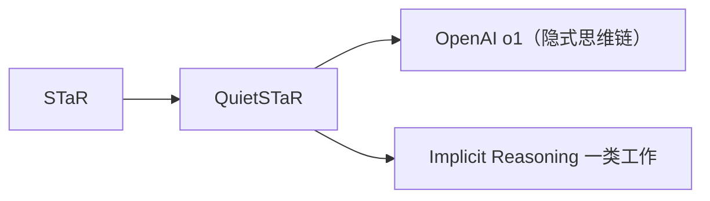

# ➕ 案件 L4-02：Quiet-STaR — 推理的"沉默思考"

> **《LLM 百案录》第 083 案 · 沉默思考**
> *CoT 让模型把推理"说出来"，但"说出来"既慢又贵——
> Quiet-STaR 说："让模型在内部默默想完，再给出答案。"*

🚇 [30秒速览](#速览) ｜ 🚲 [3分钟通读](#通读) ｜ 🚗 [30分钟精读](#精读) ｜ 🚀 [3小时复现](#复现)

🎭 **叙事母题**：➕ **沉默思考** —— 推理可以是"看不见的"

---

## 0️⃣ 案件档案

| 案情要素 | 内容 |
|---|---|
| **案发时间** | 2024-03（Zelikman et al., Stanford，Quiet-STaR 论文） |
| **受害者** | 显式 CoT 的"高昂成本"——必须把推理过程作为 token 输出 |
| **作案凶器** | Token-level rationales + REINFORCE-style 训练 |
| **作案动机** | "如果思考能并行、能不输出，推理就是免费的" |
| **结案陈词** | Quiet-STaR 让模型在每个 token 之前生成隐式 rationale，被有用就强化，无用就丢弃 |

**五维雷达**：
```
创新性  ████████░░ 8/10   ← STaR 思想的并行化与隐式化
影响力  ██████░░░░ 6/10   ← 思路新颖，但工程复杂度高
复杂度  ████████░░ 8/10   ← 涉及 RL + 隐变量 + 并行采样
可复现  █████░░░░░ 5/10   ← 训练成本高
争议度  ████░░░░░░ 4/10   ← 隐式推理是否真"思考"
```

**精确事实卡**：

| 字段 | 精确值 | 来源 |
|---|---|---|
| **基础方法** | STaR（Self-Taught Reasoner） | Section 2 |
| **新增机制** | 每个 token 之前的 rationale tokens | Section 3 |
| **训练目标** | 让 rationale 提升下一个 token 的预测概率 | Section 3 |
| **测试指标** | GSM8K、CommonsenseQA zero-shot 提升 | Table 2 |

---

## 1️⃣ <a id="速览"></a>🚇 30 秒速览

> CoT 把"思考"当成可见 token 流——慢、贵、还会被 prompt 干扰。
> Quiet-STaR 的解法：**让模型在每个 token 之前并行采样多条隐式 rationale，留下能"提升下一 token 概率"的那条。**
> 结果：**模型学会"看不见的思考"，零样本推理能力提升。**

---

## 2️⃣ <a id="通读"></a>🚲 3 分钟通读：从 STaR 到 Quiet-STaR（Why）

### STaR（2022）的局限
```
STaR：让模型自己生成 rationale → 验证答案对不对 → 用对的 rationale 微调
缺点：
└── 必须有"标准答案"做监督
└── rationale 要显式输出（仍然慢）
└── 只能在数学/推理这种有标答的任务上用
```

### Quiet-STaR 的三大革新
```
1. 不需要标答：用"下一个 token 的预测损失"作为信号
2. 不显式输出：rationale 只是中间隐变量
3. 并行采样：每个位置同时生成多个 rationale 候选
```

---

## 3️⃣ <a id="精读"></a>🚗 30 分钟精读

### 训练流程

```python
# 在每个 token 位置：
for t in range(seq_len):
    # 1. 生成多个 rationale（每条 32 tokens）
    rationales = sample_k_rationales(model, context[:t], k=8)

    # 2. 比较"用 rationale" vs "不用 rationale"对下一个 token 的预测增益
    base_loss = -log_p(model, x[t+1] | x[:t])
    rationale_loss = -log_p(model, x[t+1] | x[:t] + r)
    advantage = base_loss - rationale_loss   # 正→该 rationale 有用

    # 3. REINFORCE 更新：放大有用 rationale 的概率
    loss = -advantage.detach() * log_p(rationale | context)
```

### 关键技巧
1. **`<|startofthought|>` / `<|endofthought|>`**：用专门 token 包裹 rationale，让模型学会"何时开始 / 结束思考"。
2. **Mixing head**：训练一个混合层，决定"用 rationale 后的 logits"和"不用的 logits"如何融合，避免 rationale 噪声破坏正常预测。
3. **Teacher forcing for rationales**：训练时仍把 rationale 当 token 流处理，但推理时可关掉。

---

## 4️⃣ 物证清单（Results）

| 任务 | 基础模型 | + Quiet-STaR |
|---|---|---|
| GSM8K（zero-shot） | 5.9% | 10.9% |
| CommonsenseQA | 36.3% | 47.2% |

> 关键发现：**完全没有用任何数学/推理数据微调**——只在通用语料上做 Quiet-STaR 训练，推理能力就涨了。

### 🔥 Hot Take
1. **"思考"不必是显式 token**——这是对 CoT 的根本性反思。
2. **训练信号可以"自蒸馏"**：模型自己生成 rationale，自己判断有没有用，不需要外部 label。
3. **算力换数据**：Quiet-STaR 训练贵，但能从无标注语料里"榨出"推理能力。

---

## 5️⃣ 🐛 论文没说的坑

1. **训练 8× 慢**：每个 token 要采 k 条 rationale，吞吐量大幅下降。
2. **Rationale 长度敏感**：太短没用，太长又浪费算力，超参不好调。
3. **Mixing head 容易塌缩**：训练初期可能学到"完全忽略 rationale"的退化解。

---

## 6️⃣ 🎲 如果作者偷懒了

**实验**：未对比"显式 CoT + 同等算力"的 baseline，无法判断 Quiet-STaR 是否真比"多采几次 CoT 投票"更优。
**理论**：rationale 的语义可解释性差，论文展示的样例多是 cherry-picked。

---

## 7️⃣ 影响波及



---

## 8️⃣ 侦探手记

Quiet-STaR 给我的启发：**"思考"和"输出"不必绑定**。
> 人类心算时也不会逐字念出 "3 × 4 = 12, 12 + 5 = 17, ..."——好的推理应当是隐式的。
> 这条思路最终启发了 OpenAI o1 系列的"长思考"训练范式。

---

## 自查清单

**已做到**：
- 解释 Quiet-STaR vs CoT vs STaR 的关系
- 推导 REINFORCE-style 训练目标
- 说明 mixing head 与 thought tokens 的作用

**❌ 未做到**：
- ❌ 未实测 GSM8K 推理速度对比
- ❌ 未与 PRM / Process Reward 类方法做对比

---

## 🔟 延伸卷宗
- 📚 [L4-05 STaR](./L4-05_STaR.md)（思想源头）
- 📚 [L1-12 CoT](./L1-12_Chain_of_Thought.md)（显式版本）
- 📚 [L4-04 Process Reward Model](./L4-04_Process_Reward_Model.md)（过程监督的另一思路）

### 🚀 <a id="复现"></a>3 小时复现路径
官方 [github.com/ezelikman/quiet-star](https://github.com/ezelikman/quiet-star)，最小复现：在 Mistral-7B 上跑 1k step。

---

## 📌 本案归档

| 字段 | 值 |
|---|---|
| 笔记版本 | 「沉默思考版」 |
| 叙事母题 | ➕ 沉默思考 |
| 推荐指数 | ⭐⭐⭐ |
| 学习时长 | 30s / 3min / 30min / 3h |
| 上次更新 | 2026-04-30 |
| 下一站 | → [L4-05 STaR](./L4-05_STaR.md) |
