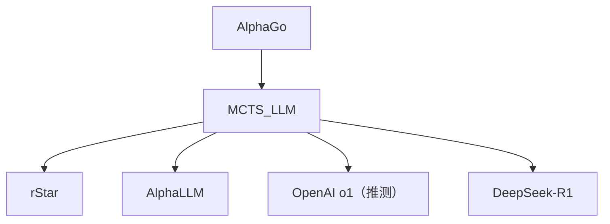

# 🌲 案件 L4-03：MCTS for LLM — 蒙特卡洛树搜索的"AI化"

> **《LLM 百案录》第 084 案 · 树搜索**
> *AlphaGo 用 MCTS 征服围棋，能否用同一把武器征服 LLM 推理？*

🚇 [30秒速览](#速览) ｜ 🚲 [3分钟通读](#通读) ｜ 🚗 [30分钟精读](#精读) ｜ 🚀 [3小时复现](#复现)

🎭 **叙事母题**：🌲 **树搜索** —— 让 AI 系统性地探索可能性空间

---

## 0️⃣ 案件档案

| 案情要素 | 内容 |
|---|---|
| **案发时间** | 2023-2024（多个工作：rStar、AlphaLLM、ReST-MCTS*、TS-LLM 等） |
| **受害者** | 贪心 / 采样解码的"一条道走到黑" |
| **作案凶器** | UCB1 选择 + Rollout 模拟 + 反向传播 |
| **作案动机** | "推理是搜索问题，不是预测问题" |
| **结案陈词** | 把 LLM 推理建模成树搜索：每个节点是一个 partial reasoning，用 PRM 或答案正确率作为价值，用 MCTS 平衡探索与利用 |

**五维雷达**：
```
创新性  ███████░░░ 7/10   ← 经典 RL 算法的 LLM 落地
影响力  ████████░░ 8/10   ← 启发 OpenAI o1 / DeepSeek-R1 等推理模型
复杂度  █████████░ 9/10   ← 树搜索 + 价值函数 + 大模型推理，工程复杂
可复现  █████░░░░░ 5/10   ← 算力消耗高
争议度  █████░░░░░ 5/10   ← "搜索 vs 学习"的路线之争
```

---

## 1️⃣ <a id="速览"></a>🚇 30 秒速览

> 普通 LLM 推理：一次采样一条思维链——错就错了。
> MCTS-LLM 的解法：**把每一步推理变成树节点，用模拟 + 反传找到最有希望的路径。**
> 结果：**复杂数学/规划任务能力显著提升，但推理成本 10-100×。**

---

## 2️⃣ <a id="通读"></a>🚲 3 分钟通读：为什么需要树搜索（Why）

### 标准解码的盲点
```
贪心 / 温度采样：
→ 一条路径走到底
→ 早期错误无法纠正
→ Self-Consistency 只是"多走几条独立路径"，并未真的搜索
```

### MCTS 的四步循环
```
Selection → Expansion → Simulation → Backpropagation
   ↑                                       ↓
   └───────────────  迭代 N 次 ─────────────┘
```
1. **Selection**：从根出发，按 UCB1 选择最值得探索的子节点
2. **Expansion**：用 LLM 生成若干候选下一步
3. **Simulation**：从新节点 rollout 到答案，得到 reward
4. **Backpropagation**：把 reward 沿路径回传，更新所有祖先节点的统计量

---

## 3️⃣ <a id="精读"></a>🚗 30 分钟精读

### UCB1 公式（核心）
$$
\text{UCB}(s, a) = Q(s, a) + c \cdot \sqrt{\frac{\ln N(s)}{N(s, a)}}
$$
- 第一项：当前价值估计（利用）
- 第二项：访问次数越少越倾向访问（探索）
- $c$ 控制探索强度，典型值 1.4

### 价值函数的三种来源
| 方法 | 价值来源 | 代表 |
|---|---|---|
| **答案验证** | rollout 到答案，对错给 0/1 | rStar |
| **PRM 评分** | 过程奖励模型给每步打分 | ReST-MCTS\* |
| **自一致性** | 同一节点出发多次 rollout 的一致性 | AlphaLLM |

### 伪代码
```python
def mcts_solve(problem, n_iter=100):
    root = Node(state=problem)
    for _ in range(n_iter):
        node = select(root)            # UCB1 一路下到 leaf
        children = expand(node, llm)   # LLM 生成 k 个候选下一步
        for c in children:
            reward = simulate(c, llm)  # rollout 到答案 + 验证器打分
            backprop(c, reward)        # 更新祖先节点的 N, Q
    return best_path(root)
```

---

## 4️⃣ 物证清单（Results）

以 rStar（Microsoft, 2024）为例：

| 任务 | LLaMA2-70B（base） | + MCTS |
|---|---|---|
| GSM8K | 56.8% | **88.6%** |
| MATH | 13.0% | **25.6%** |

> rStar 用 7B 模型 + MCTS 达到了 LLaMA2-70B 的水平。

### 🔥 Hot Take
1. **"小模型 + 搜索 ≈ 大模型"**：MCTS 让 7B 打 70B 成为可能，重新定义"算力优化"的方向。
2. **OpenAI o1 的核心可能就是 MCTS**：虽然官方未明说，但"长思考"行为高度疑似树搜索。
3. **推理时计算（test-time compute）**新维度：训练 vs 推理 vs 搜索，三种算力可互相替换。

---

## 5️⃣ 🐛 论文没说的坑

1. **rollout 成本爆炸**：每个节点扩展都要调一次 LLM，单题可能要几百次推理。
2. **价值函数偏差**：PRM/验证器本身有错，MCTS 会"放大错误"。
3. **可解释性差**：选出的路径未必是人类能看懂的"自然推理"。

---

## 6️⃣ 🎲 如果作者偷懒了

**实验**：缺少与"等量算力的纯采样 + Self-Consistency"的对比——MCTS 真的比"采 100 次投票"更好吗？
**理论**：MCTS 的收敛保证只在有限 MDP 下成立，LLM 的状态空间是无穷的，理论保证存疑。

---

## 7️⃣ 影响波及



---

## 8️⃣ 侦探手记

> "推理 = 学习 vs 推理 = 搜索" 是 LLM 时代的根本分歧。
> Transformer 一直是"学习派"——把所有知识压进权重；
> MCTS-LLM 是"搜索派"——承认权重不够，让推理时算力补位。
> 我赌：未来是两者结合——**用搜索生成数据，再蒸馏回模型**（这正是 o1/R1 路线）。

---

## 自查清单

**已做到**：
- 推导 UCB1 公式
- 列出三种价值函数来源
- 给出 rStar 实测数据

**❌ 未做到**：
- ❌ 未对比 ToT（Tree of Thoughts，纯 BFS/DFS）与 MCTS 的差异
- ❌ 未分析 inference time 的具体开销

---

## 🔟 延伸卷宗
- 📚 [L1-13 Tree of Thoughts](./L1-13_Tree_of_Thoughts.md)（启发式树搜索的简化版）
- 📚 [L4-04 Process Reward Model](./L4-04_Process_Reward_Model.md)（MCTS 的价值函数来源）
- 📚 [L4-01 Let's Verify Step by Step](./L4-01_Lets_Verify_Step_by_Step.md)（PRM 的奠基作）

### 🚀 <a id="复现"></a>3 小时复现路径
- rStar：[github.com/zhentingqi/rStar](https://github.com/zhentingqi/rStar)
- 最小例子：用 LLaMA-3-8B + 一个简单 verifier，在 GSM8K 上跑 100 道题。

---

## 📌 本案归档

| 字段 | 值 |
|---|---|
| 笔记版本 | 「树搜索版」 |
| 叙事母题 | 🌲 树搜索 |
| 推荐指数 | ⭐⭐⭐⭐ |
| 学习时长 | 30s / 3min / 30min / 3h |
| 上次更新 | 2026-04-30 |
| 下一站 | → [L4-04 Process Reward Model](./L4-04_Process_Reward_Model.md) |
