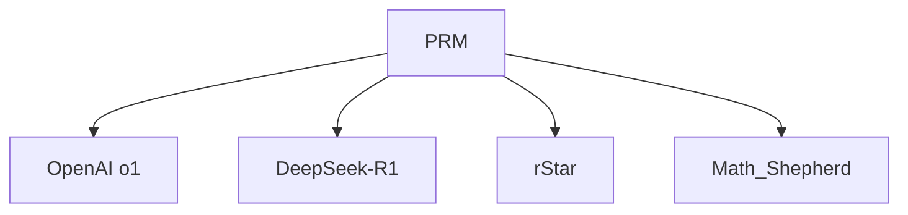

# ⭐ 案件 L4-04：Process Reward Model — 给"过程"打分

> **《LLM 百案录》第 085 案 · 过程打分**
> *Outcome RM 只看答案对错，可"做对题"的方法可能错了——
> Process Reward Model 说："我要给每一步推理打分。"*

🚇 [30秒速览](#速览) ｜ 🚲 [3分钟通读](#通读) ｜ 🚗 [30分钟精读](#精读) ｜ 🚀 [3小时复现](#复现)

🎭 **叙事母题**：⭐ **过程打分** —— 不仅要结果，还要推理可信

---

## 0️⃣ 案件档案

| 案情要素 | 内容 |
|---|---|
| **案发时间** | 2022-2023（OpenAI、DeepMind、Stanford 多家工作） |
| **受害者** | Outcome RM 的"最终答案对就万事大吉"心态 |
| **作案凶器** | 对每一步推理打分的奖励模型 |
| **作案动机** | "答案对，过程错"会教坏模型 |
| **结案陈词** | PRM 给推理过程的每一步打分，奖励"推理本身"而非"答案碰巧对" |

**五维雷达**：
```
创新性  ████████░░ 8/10   ← 把 RLHF 推到 token 级
影响力  █████████░ 9/10   ← OpenAI o1 / DeepSeek 推理模型核心
复杂度  ████████░░ 8/10   ← 标注成本极高
可复现  ████░░░░░░ 4/10   ← 高质量 PRM800K 数据集稀缺
争议度  █████░░░░░ 5/10   ← "过程对"是否能严格定义
```

**精确事实卡**：

| 字段 | 精确值 | 来源 |
|---|---|---|
| **奠基论文** | Let's Verify Step by Step (OpenAI, 2023) | L4-01 |
| **数据集** | PRM800K（80 万步级标注） | OpenAI |
| **对比** | ORM (Outcome RM) vs PRM (Process RM) | Section 3 |
| **效果** | MATH 数据集 78.2% > ORM 72.4% | Table 1 |

---

## 1️⃣ <a id="速览"></a>🚇 30 秒速览

> ORM：模型答对了就 +1，答错就 -1，**不管推理过程怎么走**。
> 问题：模型可能学会"猜答案"或"靠错误推理蒙对"。
> PRM 的解法：**人类标注员对每一步推理打"对/错/中性"标签，训练 step-level 奖励模型。**
> 结果：**MATH 等需要严谨推理的任务上显著超越 ORM。**

---

## 2️⃣ <a id="通读"></a>🚲 3 分钟通读：为什么过程比结果重要（Why）

### 假阳性的危险
```
题目：12 + 7 × 3 = ?
模型推理：
  Step 1: 12 + 7 = 19  ❌（应该先算乘法）
  Step 2: 19 × 3 = 57  ❌
  最终答案：33

ORM：答案 33 ≠ 标答 33（恰好相等？不可能，举例）
PRM：Step 1 已经错了，整条路径打 0 分
```

### PRM 的三大优势
1. **更密集的信号**：每一步都有反馈，比"最后给一个 0/1"信息量大数十倍
2. **更可解释**：能定位错误发生在哪一步
3. **抗 hallucination**：拒绝"答案对但中间编造"的解

---

## 3️⃣ <a id="精读"></a>🚗 30 分钟精读

### 标注协议（OpenAI PRM800K）
```
对每一步打三种标签：
  [POSITIVE] 正确且有进展
  [NEUTRAL]  没错但也没进展（无关步骤）
  [NEGATIVE] 错误（事实错 / 计算错 / 逻辑错）

示例：
  Step 1: "Let x = 5"           → POSITIVE
  Step 2: "Then x² = 25"        → POSITIVE
  Step 3: "x² + x = 30"         → POSITIVE
  Step 4: "So x² + x - 30 = 0"  → POSITIVE
  Step 5: "x = 5 or x = 6"      → NEGATIVE（因式分解错了）
```

### PRM 训练目标
```python
# 给定 (problem, partial_solution, step_label)
# PRM 是个二分类器（或三分类）
loss = CE(prm(problem, steps[:i]), label[i])
```

### 推理时如何用 PRM
1. **Best-of-N + PRM**：采样 N 条 CoT，用 PRM 给每条打总分（最低分步骤 / 平均分），选最高
2. **Beam Search + PRM**：每步保留 PRM 分数最高的 K 个分支
3. **MCTS + PRM**：MCTS 的价值函数（参见 L4-03）
4. **PPO + PRM**：用 PRM 做 reward 做 PPO（OpenAI o1 路线）

---

## 4️⃣ 物证结清单

| 方法 | MATH 准确率 | 备注 |
|---|---|---|
| Base GPT-4 (greedy) | ~50% | 单次贪心 |
| ORM Best-of-1860 | 72.4% | 大量采样 + outcome 选择 |
| **PRM Best-of-1860** | **78.2%** | 同样采样数 + PRM 选择 |
| Human (奥赛选手) | ~90% | 上限 |

### 🔥 Hot Take
1. **PRM 是 RLHF 的"分辨率提升"**：从 sentence-level → step-level，反馈密度 ×10。
2. **PRM800K 是稀缺资源**：高质量数学步骤标注极贵，DeepSeek-R1 用"自动标注"绕过这个瓶颈。
3. **PRM 是 o1 的关键之一**：OpenAI o1 的"长思考"很可能就是 PRM 引导的搜索 + 强化。

---

## 5️⃣ 🐛 论文没说的坑

1. **标注成本爆炸**：80 万步标注 ≈ 数百万美元（专业数学背景标注员）
2. **领域迁移差**：数学题训练的 PRM 用到代码 / 法律推理上效果未知
3. **奖励 hacking 风险**：模型可能学会写"看起来正确"但实际错误的步骤来骗 PRM

---

## 6️⃣ 🎲 如果作者偷懒了

**实验**：未对比"中等质量 PRM" vs "高质量 ORM"在固定算力下的效率
**理论**：缺乏 PRM 与 RL 收敛性的理论分析

---

## 7️⃣ 影响波及



---

## 8️⃣ 侦探手记

PRM 让我意识到：**对齐的核心不是"答案对齐"而是"价值对齐"**。
> 一个学生，每次都能选择题蒙对——你会觉得他真的"会"了吗？
> 同理，LLM 答案对但推理错，绝不是"理解了问题"。
> PRM 是把"理解"这件事在训练信号里显式化的尝试。

---

## 自查清单

**已做到**：
- 解释 PRM vs ORM 的根本差异
- 说明 PRM 的三种标注标签
- 列举 PRM 在搜索 / RL 中的四种用法

**❌ 未做到**：
- ❌ 未对比 PRM800K 与 Math-Shepherd 等自动标注 PRM 的效果差异
- ❌ 未深入分析 PRM 在非数学任务上的可迁移性

---

## 🔟 延伸卷宗
- 📚 [L4-01 Let's Verify Step by Step](./L4-01_Lets_Verify_Step_by_Step.md)（PRM 的奠基论文）
- 📚 [L4-03 MCTS for LLM](./L4-03_MCTS_LLM.md)（PRM 的下游用法之一）
- 📚 [L2-05 InstructGPT / RLHF](./L2-05_InstructGPT_RLHF.md)（ORM 路线的源头）

### 🚀 <a id="复现"></a>3 小时复现路径
- 数据集：[PRM800K](https://github.com/openai/prm800k)
- 最小复现：用 Mistral-7B + LoRA 训练一个 PRM，在 MATH 子集上做 Best-of-32

---

## 📌 本案归档

| 字段 | 值 |
|---|---|
| 笔记版本 | 「过程打分版」 |
| 叙事母题 | ⭐ 过程打分 |
| 推荐指数 | ⭐⭐⭐⭐ |
| 学习时长 | 30s / 3min / 30min / 3h |
| 上次更新 | 2026-04-30 |
| 下一站 | → [L4-05 STaR](./L4-05_STaR.md) |
