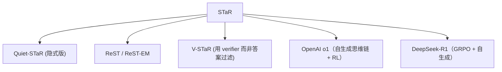

# 🚀 案件 L4-05：STaR — 自训练的"推理引擎"

> **《LLM 百案录》第 086 案 · 自驱动**
> *标注大量推理过程太贵，能否让 LLM 自己生成、自己学习？*

🚇 [30秒速览](#速览) ｜ 🚲 [3分钟通读](#通读) ｜ 🚗 [30分钟精读](#精读) ｜ 🚀 [3小时复现](#复现)

🎭 **叙事母题**：🚀 **自驱动** —— AI 自己造数据教自己

---

## 0️⃣ 案件档案

| 案情要素 | 内容 |
|---|---|
| **案发时间** | 2022-03（Zelikman et al., Stanford / Google） |
| **受害者** | "推理能力必须靠人类标注 CoT 数据"的传统认知 |
| **作案凶器** | Self-generated rationales + answer filtering + bootstrap |
| **作案动机** | "高质量推理标注太少，LLM 必须学会自我蒸馏" |
| **结案陈词** | STaR 让模型自己生成推理 → 只保留导出正确答案的推理 → 用这些数据微调，循环 N 次 |

**精确事实卡**：

| 字段 | 精确值 | 来源 |
|---|---|---|
| **核心循环** | Generate → Filter (by answer) → Fine-tune | Section 3 |
| **Rationalization 技巧** | 答错时给提示重新生成 | Section 4 |
| **基线提升** | GSM8K：6.5% → 10.7%（GPT-J 6B） | Table 1 |
| **后继工作** | Quiet-STaR、ReST-EM、V-STaR | — |

---

## 1️⃣ <a id="速览"></a>🚇 30 秒速览

> 监督微调要大量 (question, rationale, answer) 三元组——人类标注成本极高。
> STaR 的解法：**让模型自己生成 rationale，只用答对的样本来微调，循环放大。**
> 关键 trick：答错时给"提示"（hint）让模型重新生成，确保数据多样性。
> 结果：**6B 模型在 GSM8K 上提升 4×，无需人工标注 rationale。**

---

## 2️⃣ <a id="通读"></a>🚲 3 分钟通读：自举学习的逻辑（Why）

### 一个朴素的想法
```
1. 让模型生成 rationale（思维链）
2. 看答案对不对
3. 把"答对"的 rationale 当训练数据
4. 重新微调模型
5. 回到 1，循环
```
听起来合理，但**纯粹这样会卡住**——模型答不对的题永远学不到。

### Rationalization：突破瓶颈的关键
```
答错的题怎么办？

方法：把"标准答案"作为提示喂给模型
prompt = "Question: ... Answer: 42. Now write the rationale:"

模型在"知道答案"的条件下生成 rationale → 这条 rationale 大概率合理
→ 收集这种"反向工程"出的 rationale 作为训练数据
→ 模型学会"如何想到 42"，下次没有提示也能做对
```

---

## 3️⃣ <a id="精读"></a>🚗 30 分钟精读

### 完整算法
```python
M = base_model
D = labeled_data  # (question, answer) 对
for iteration in range(N):
    # === Generate ===
    correct_examples = []
    for (q, a) in D:
        rationale, predicted = M.generate(q)
        if predicted == a:
            correct_examples.append((q, rationale, a))   # 普通收集

        else:
            # === Rationalization ===
            # 把答案当提示，让模型"反向"生成 rationale
            r2 = M.generate_with_hint(q, hint=a)
            correct_examples.append((q, r2, a))          # 反向工程

    # === Fine-tune ===
    M = fine_tune(M_0, correct_examples)   # 注意：从 base 重训，避免漂移
```

### 三个关键设计
1. **每轮从 base 模型重训**：避免"自我强化的偏见"
2. **温度采样**：生成时用 T=0.7 增加多样性
3. **Rationalization 数据要标注来源**：训练时区分"自然生成"和"hint 提示后生成"

---

## 4️⃣ 物证清单

| 任务 | GPT-J（6B）base | + STaR |
|---|---|---|
| GSM8K（数学） | 3.1% | **10.7%** |
| CommonsenseQA | 72.5% | **72.5%**（提升不明显） |
| Arithmetic | 69.0% | **89.5%** |

> 关键：**STaR 在"硬推理"任务上效果显著**，在"常识题"上提升有限——说明它真正补的是 reasoning chain，不是 knowledge。

### 🔥 Hot Take
1. **数据飞轮的雏形**：模型生成→筛选→训练→更强模型→更好数据，形成正反馈。
2. **Rationalization 是神来之笔**：仅靠"答对的样本"会卡死，给提示反向生成解决了这个问题。
3. **STaR 是 o1 的精神祖父**：自生成数据 + 强化训练 = 后来所有推理模型的基本范式。

---

## 5️⃣ 🐛 论文没说的坑

1. **Filter 的假阳性**：模型可能"猜对答案"——错的 rationale 也被收进训练集
2. **多样性塌缩**：自训练几轮后，rationale 风格变得高度同质
3. **不能从零启动**：base 模型必须有一定推理能力，否则什么都生成不出来

---

## 6️⃣ 🎲 如果作者偷懒了

**实验**：未充分研究"循环次数 N"的边际效益——3 次后是否还有提升？
**理论**：缺乏对"为什么 self-generation + filter 不会过拟合"的理论解释

---

## 7️⃣ 影响波及



---

## 8️⃣ 侦探手记

STaR 是 LLM 时代第一次明确提出"**模型可以教自己**"的 working solution。
> 在它之前，self-training 在 NLP 里被认为是"垃圾进垃圾出"。
> STaR 用一个简单 trick（answer-conditioned rationalization）打破了僵局。
> 今天看，这是通往 o1 / R1 的第一块基石。

---

## 自查清单

**已做到**：
- 解释 STaR 的 Generate-Filter-Finetune 循环
- 说明 Rationalization 的作用与机制
- 给出 GSM8K 上的实测数据

**❌ 未做到**：
- ❌ 未深入对比 STaR vs ReST vs V-STaR 的差异
- ❌ 未量化分析"猜对答案"导致的 filter 噪声

---

## 🔟 延伸卷宗
- 📚 [L4-02 Quiet-STaR](./L4-02_Quiet_STaR.md)（隐式 token 化的进阶）
- 📚 [L1-12 Chain of Thought](./L1-12_Chain_of_Thought.md)（rationale 的概念源头）
- 📚 [L2-18 Self-Rewarding LM](./L2-18_Self_Rewarding_LM.md)（自我奖励的同源思路）

### 🚀 <a id="复现"></a>3 小时复现路径
- 论文：[arxiv.org/abs/2203.14465](https://arxiv.org/abs/2203.14465)
- 最小例子：在 GSM8K 训练集上用 LLaMA-3-8B + LoRA 跑 3 轮 STaR

---

## 📌 本案归档

| 字段 | 值 |
|---|---|
| 笔记版本 | 「自驱动版」 |
| 叙事母题 | 🚀 自驱动 |
| 推荐指数 | ⭐⭐⭐⭐ |
| 学习时长 | 30s / 3min / 30min / 3h |
| 上次更新 | 2026-04-30 |
| 下一站 | → [L4-06 Mamba](./L4-06_Mamba.md) |
