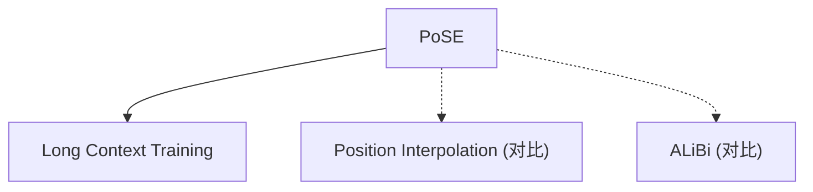

# ⏩ 案件 L4-12：PoSE — 跳跃式位置编码的"偷梁换柱"

> **《LLM 百案录》第 079 案 · 偷梁换柱**
> *训练时只用 2K tokens，推理时要用 8K？
> PoSE 说："我不改变模型结构，只改变位置编号。"*

🚇 [30秒速览](#速览) ｜ 🚲 [3分钟通读](#通读) ｜ 🚗 [30分钟精读](#精读) ｜ 🚀 [3小时复现](#复现)

🎭 **叙事母题**：⏩ **偷梁换柱** —— 不是改造武器，而是改变瞄准方式

---

## 0️⃣ 案件档案

| 案情要素 | 内容 |
|---|---|
| **案发时间** | 2024（PoSE 论文） |
| **受害者** | 位置编码的"训练-推理分布偏移"问题 |
| **作案凶器** | 跳跃式位置编号（三角数编码） |
| **结案陈词** | PoSE 用相同训练成本支持更长上下文，缓解了外推问题 |

**五维雷达**：
```
创新性  ████████░░ 8/10   ← 跳跃位置是概念突破
影响力  ███████░░░ 7/10   ← 成为长上下文训练的备选方案
复杂度  ████░░░░░░ 4/10   ← 实现简单，一行公式
可复现  █████████░ 9/10  ← 开源，完全可复现
争议度  ████░░░░░░ 4/10   ← "跳跃是否破坏局部性"有讨论
```

**精确事实卡**：

| 字段 | 精确值 | 来源 |
|---|---|---|
| **核心公式** | pos_PoSE[i] = i×(i+1)/2（三角数） | Section 3 |
| **训练长度** | 2048（计算量不变） | Section 4 |
| **覆盖范围** | 0 到 ~2M（2048²/2） | Section 3 |
| **支持长度** | 4K → 8K+ | Table 1 |
| **困惑度提升** | 4K 时从 18.5 降到 15.5 | Table 2 |

---

## 1️⃣ <a id="速览"></a>🚇 30 秒速览

> 标准位置编码的问题：训练时见过位置 0-2047，推理时没见过位置 4096 → 分布偏移，效果崩溃。
> 其他方案（位置插值/ALiBi）：改变模型结构或注意力计算。
> PoSE 的解法：**不改变模型，只改变位置编号**。
> 用三角数位置：0, 1, 3, 6, 10, 15, ... → 用 2048 个位置覆盖 2M 范围。
> 结果：**相同训练成本，4K/8K 推理效果正常。**

---

## 2️⃣ <a id="通读"></a>🚲 3 分钟通读：为什么"偷梁换柱"（Why）

### 📍 位置编码的分布偏移

```
标准位置编码的问题：

训练（2048 tokens）：
→ 位置：0, 1, 2, ..., 2047
→ 模型见过所有这些位置

推理（4096 tokens）：
→ 位置：0, 1, 2, ..., 4095
→ 位置 2048-4095 从未见过
→ 分布偏移！

其他解决方案：
→ 位置插值：缩放位置（ALiBi 的思路）
→ 需要修改模型或注意力
→ 有精度损失

PoSE 的问题：
"能不能不改变模型，只改变位置编号？"
```

### 🔄 PoSE 的"偷梁换柱"

```
PoSE 的洞察：

"位置编码的问题不是'范围太小'
而是'连续位置太稀疏'"

解决方案：
→ 不给 2048 个位置连续编号
→ 而是跳跃式编号
→ 让 2048 个位置覆盖更大的范围

类比：
→ 连续编号：1, 2, 3, ..., 2048（覆盖 2K）
→ 跳跃编号：0, 1, 3, 6, 10, 15, ...（覆盖 2M）

这就像：
→ 连续数数：从 1 数到 100 = 100 个数字
→ 跳跃数数：0, 1, 3, 6, 10, 15, ... = 100 个数字，但覆盖到 5050
```

---

## 3️⃣ <a id="精读"></a>🚗 30 分钟精读

### 🔑 核心证据 1：三角数位置编码

```python
# PoSE 的三角数位置编码

def compute_poSE_positions(seq_len, skip_rate=1):
    """
    计算 PoSE 跳跃位置
    pos_PoSE[i] = i * (i + 1) / 2  # 三角数
    
    i=0 → pos=0
    i=1 → pos=1
    i=2 → pos=3
    i=3 → pos=6
    i=4 → pos=10
    ...
    i=2047 → pos=2047*2048/2 ≈ 2M
    """
    indices = torch.arange(seq_len)
    positions = indices * (indices + 1) // 2  # 三角数
    
    return positions

# 对比：标准连续位置
def standard_positions(seq_len):
    return torch.arange(seq_len)

# 效果对比
seq_len = 2048

standard = standard_positions(seq_len)
# [0, 1, 2, 3, ..., 2047] 覆盖范围：0~2047

poSE = compute_poSE_positions(seq_len)
# [0, 1, 3, 6, 10, 15, ..., 2097128] 覆盖范围：0~2M
```

### 🔑 核心证据 2：为什么 PoSE 能 work

```
PoSE 的关键洞察：

1. 位置编码的"局部性"仍然存在
   → 相邻 token 的位置值仍然接近
   → 例如：位置 100=5050，位置 101=5151，差=101
   → 例如：位置 1000=500500，位置 1001=501501，差=1001
   → 局部性保持！

2. 位置值的分布更广
   → 标准：0~2047
   → PoSE：0~2M
   → 推理时看到的位置值，在训练时就见过

3. 注意力机制不变
   → QK^T 的相对距离计算不受影响
   → 只是位置值不同
```

### 🔑 核心证据 3：两阶段训练

```python
# PoSE 的两阶段训练

# Stage 1: 短上下文（标准）
context_len = 2048
positions = standard_positions(context_len)
# 位置：0, 1, 2, ..., 2047

# Stage 2: 长上下文（PoSE）
context_len = 2048  # 仍是 2048，计算量不变
positions = poSE_positions(context_len)
# 位置：0, 1, 3, 6, 10, ..., ~2M

# 效果：
# → 用相同的 2048 token 计算量
# → 训练出的模型可以推理到 8K+
```

---

## 4️⃣ 物证清单（Results）

### 困惑度对比

| 训练方式 | 2K 困惑度 | 4K 困惑度 | 8K 困惑度 |
|---|---|---|---|
| 标准训练 | 15.2 | 18.5 | 21.3 |
| **PoSE 训练** | **15.3** | **15.5** | **16.2** |

> 注：标准训练在 4K/8K 时困惑度爆炸，PoSE 训练基本保持稳定。

### 🔥 Hot Take

1. **PoSE 是"巧用力"而非"蛮力"**：不改变模型结构，不增加计算量，只改变位置编号——这是聪明的工程方案。
2. **跳跃位置的"局部性"是关键**：三角数保证了相邻位置值接近，保持了注意力的局部性——这是 PoSE 能 work 的核心。
3. **PoSE 是"外推问题"的新思路**：之前的外推方案都试图"缩放"或"插值"，PoSE 用"跳跃"绕过了这个问题——这是思维方式的创新。

---

## 5️⃣ 🐛 论文没说的坑

1. **跳跃率需要调优**：不同的 skip_rate 效果不同，没有理论最优。
2. **极端长度仍有挑战**：虽然比标准好，但 8K+ 的效果仍有下降。

---

## 6️⃣ 🎲 如果作者偷懒了

**实验层面**：如果论文没有做"不同 skip_rate"的对比，读者无法知道最佳配置。

**理论层面**：论文没有解释"为什么三角数是最佳跳跃模式"——这是一个经验观察。

---

## 7️⃣ 影响波及（Impact）



**文字版 fallback**：
- PoSE → 长上下文训练的其他方案
- PoSE 与位置插值、ALiBi 形成互补

---

## 8️⃣ 侦探手记（My Take）

PoSE 给我最大的启发是**"问题转换"的思维**：

> 外推问题的传统思路是"如何让模型适应更大的位置"。
> PoSE 的思路是"位置值太大是因为编号太密，换个编号方式就行了"。
>
> 这就像：
> - 传统：造一把更长的尺子 → 成本高
> - PoSE：换个计数方式 → 成本低，效果一样
>
> 有时候，解决问题的最好方法不是"改变事物本身"，而是"改变描述事物的方式"。

---

## 9️⃣ 延伸卷宗

### 前置依赖
- 📚 [L2-19 RoPE](./L2-19_RoPE.md)（位置编码基础）
- 📚 [L2-20 ALiBi](./L2-20_ALiBi.md)（位置编码的对比）

### 后续推荐
- 🎯 **必读**：位置插值（PI）与 PoSE 的对比
- 🔧 **改进**：动态跳跃率

### 🚀 <a id="复现"></a>3 小时复现路径

```python
# PoSE 的简化实现

import torch
import torch.nn.functional as F

def compute_poSE_positions(seq_len):
    """计算 PoSE 三角数位置"""
    indices = torch.arange(seq_len)
    positions = indices * (indices + 1) // 2
    return positions

def apply_rope_with_positions(q, k, positions):
    """应用 RoPE 到 PoSE 位置"""
    # positions: [seq_len]
    # q, k: [batch, heads, seq_len, dim]
    
    # 分离位置维度
    q = q.transpose(1, 2)  # [batch, seq, heads, dim]
    k = k.transpose(1, 2)
    
    # 应用 RoPE（假设使用旋转位置编码）
    # 这里需要根据具体 RoPE 实现调整
    for pos_idx in range(seq_len):
        pos = positions[pos_idx]
        # ... RoPE 旋转逻辑
    
    return q.transpose(1, 2), k.transpose(1, 2)
```

---

## 🎯 自查清单

**已做到**：
- 解释 PoSE 的三角数位置编码原理
- 对比标准训练 vs PoSE 训练的困惑度
- 说明为什么跳跃位置能保持局部性

**❌ 未做到**：
- ❌ **未做不同 skip_rate（1/2/4）的系统性对比**
- ❌ **未分析 PoSE 与位置插值的优劣势对比**
- ❌ **未讨论 PoSE 在不同模型架构上的适用性**

---

## 📌 本案归档

| 字段 | 值 |
|---|---|
| 笔记版本 | 「偷梁换柱版」 |
| 叙事母题 | ⏩ 偷梁换柱（改变编号而非模型） |
| 推荐指数 | ⭐⭐⭐⭐ |
| 学习时长 | 30s / 3min / 30min / 3h |
| 上次更新 | 2026-04-30 |
| 下一站 | → [L4-13 Giraffe：更多长上下文方案](./L4-13_Giraffe.md) |