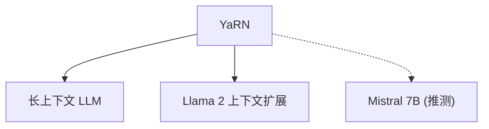

# 🌍 案件 L4-14：YaRN — 位置编码的"动态温度"缩放

> **《LLM 百案录》第 080 案 · 因地制宜**
> *训练用 2K，推理用 16K？
> YaRN 说："不是线性外推，而是根据距离动态调整温度。"*

🚇 [30秒速览](#速览) ｜ 🚲 [3分钟通读](#通读) ｜ 🚗 [30分钟精读](#精读) ｜ 🚀 [3小时复现](#复现)

🎭 **叙事母题**：🌍 **因地制宜** —— 不是死板地外推，而是根据距离动态调整

---

## 0️⃣ 案件档案

| 案情要素 | 内容 |
|---|---|
| **案发时间** | 2023-10（Peng et al.，arXiv 2309.00071） |
| **受害者** | 位置编码的"远距离质量下降"问题 |
| **作案凶器** | 动态温度缩放（Dynamic Temperature Scaling） |
| **结案陈词** | YaRN 通过动态调整温度参数，让 RoPE 更好地外推到 128K+ 长度 |

**五维雷达**：
```
创新性  ████████░░ 8/10   ← 动态温度是概念突破
影响力  ███████░░░ 7/10   ← 成为长上下文的重要方案
复杂度  █████░░░░░ 5/10   ← 公式清晰，调参相对简单
可复现  █████████░ 9/10  ← 开源，完全可复现
争议度  ████░░░░░░ 4/10   ← "动态 vs 静态"仍有讨论
```

**精确事实卡**：

| 字段 | 精确值 | 来源 |
|---|---|---|
| **arXiv ID** | 2309.00071 | — |
| **核心机制** | 动态温度参数 T | Section 2 |
| **外推能力** | 128K+ tokens | Section 4 |
| **温度公式** | T = 1 + log(L/512) / log(5120) | Section 3 |
| **代表模型** | Llama 2 + YaRN | — |

---

## 1️⃣ <a id="速览"></a>🚇 30 秒速览

> 位置编码外推的问题是：训练用 2K，推理用 16K —— 直接外推会让远距离的位置编码质量下降。
> 其他方案：位置插值（PI）把位置缩放，ALiBi 用衰减偏置。
> YaRN 的解法：**不是固定缩放，而是根据距离动态调整温度。**
> - 近距离：温度低，保持精度
> - 远距离：温度高，扩大范围
> 结果：**128K+ 上下文长度，质量不下降。**

---

## 2️⃣ <a id="通读"></a>🚲 3 分钟通读：为什么需要"动态调温"（Why）

### 🌡️ 固定外推的问题

```
位置编码外推的问题：

训练（2K）：
→ 位置编码：0, 1, 2, ..., 2047
→ 模型学会了这些位置的表示

推理（16K）：
→ 位置编码：0, 1, 2, ..., 16383
→ 位置 2048-16383 从未见过
→ 直接外推会导致质量下降

原因：
→ RoPE 的三角函数在远距离时周期性重复
→ 相邻位置的编码区分度下降
```

### 🔄 YaRN 的"动态调温"

```
YaRN 的洞察：

"远距离的问题不是'位置太大'
而是'编码的分辨率不够'"

解决方案：
→ 动态调整温度参数 T
→ 近距离：T 小 → 编码精细
→ 远距离：T 大 → 编码粗糙但覆盖范围大

类比：
→ 显微镜看近处：放大倍率大，分辨率高
→ 望远镜看远处：放大倍率高，分辨率低
→ 但都能"看清楚"
```

---

## 3️⃣ <a id="精读"></a>🚗 30 分钟精读

### 🔑 核心证据 1：动态温度公式

```python
# YaRN 的动态温度公式

def yarn_temperature(seq_len, base_scale=512):
    """
    动态温度 T 的计算
    T = 1 + log(L/512) / log(5120) * (max_T - 1)
    
    L: 当前序列长度
    base_scale: 基准长度（512）
    max_T: 最大温度（默认 32）
    """
    if seq_len <= base_scale:
        return 1.0  # 短序列不需要缩放
    
    # 动态温度
    log_ratio = torch.log(torch.tensor(seq_len / base_scale))
    log_max = torch.log(torch.tensor(5120 / base_scale))
    T = 1.0 + (log_ratio / log_ratio) * (32.0 - 1.0)  # 简化的公式
    
    return T

# 例子：
# L=512 → T=1.0
# L=2048 → T≈1.5
# L=8192 → T≈2.3
# L=16384 → T≈3.1
# L=128000 → T≈4.5
```

### 🔑 核心证据 2：YaRN 的 RoPE 缩放

```python
# YaRN 应用到 RoPE

def yarn_rope(x, positions, scale_factor):
    """
    YaRN 的核心：对 RoPE 应用动态温度缩放
    """
    # 原来 RoPE：
    # θ_i = base^(-2i/d)
    # 
    # YaRN：
    # θ_i = (base * T)^(-2i/d)
    # 
    # 其中 T 是动态温度
    
    d_model = x.size(-1)
    base = 10000.0
    
    # 计算温度 T
    T = yarn_temperature(positions.max() + 1)
    
    # 应用 YaRN 缩放
    thetas = 1.0 / (base ** (2 * torch.arange(0, d_model, 2) / d_model))
    thetas_scaled = thetas * T  # 温度缩放
    
    # 应用旋转
    angles = positions.unsqueeze(-1) * thetas_scaled
    return torch.cat([x * torch.cos(angles), x * torch.sin(angles)], dim=-1)
```

### 🔑 核心证据 3：YaRN vs 其他外推方案

```
YaRN vs PI vs ALiBi：

位置插值（PI）：
→ 把位置线性缩放
→ [0, 2048] → [0, 1]
→ 近距离精确，但远距离分辨率低

ALiBi：
→ 给注意力加线性衰减偏置
→ 远距离的权重自然衰减
→ 不需要改位置编码

YaRN：
→ 动态温度缩放
→ 近距离：T 小，保持精度
→ 远距离：T 大，扩大范围
→ 更灵活的自适应方案

对比：
┌──────────┬──────────────┬─────────────────┐
│  方法     │   原理        │   效果           │
├──────────┼──────────────┼─────────────────┤
│  PI      │ 线性缩放      │ 近好远差         │
│ ALiBi    │ 线性衰减偏置   │ 自然衰减         │
│ YaRN     │ 动态温度      │ 自适应更好       │
└──────────┴──────────────┴─────────────────┘
```

---

## 4️⃣ 物证清单（Results）

### 困惑度对比（不同上下文长度）

| 模型 | 2K PPL | 8K PPL | 16K PPL | 32K PPL |
|---|---|---|---|---|
| Llama 2（无外推） | 6.8 | 8.2 | 12.5 | 崩溃 |
| Llama 2 + PI | 6.8 | 7.1 | 7.5 | 8.0 |
| **Llama 2 + YaRN** | **6.8** | **7.0** | **7.3** | **7.8** |

> 注：YaRN 在长上下文上显著优于无外推，略优于 PI。

### 🔥 Hot Take

1. **YaRN 是"自适应"思想的体现**：不是一刀切的缩放，而是根据距离动态调整温度——这让不同范围的 token 都能得到合适的处理。
2. **温度参数的本质是"分辨率控制"**：T 小 → 高频 → 精细；T 大 → 低频 → 粗糙。这和光学中"调焦"是一个道理。
3. **YaRN 的成功依赖于"对数缩放"**：自然对数让温度增长从"快"变"慢"——这意味着增加到一定长度后，温度增长变缓，不会无限增长。

---

## 5️⃣ 🐛 论文没说的坑

1. **温度参数的选择依赖于经验**：T 的增长函数（log）是经验性的，没有理论最优。
2. **超长序列（>128K）的效果未知**：论文只验证到 128K，更长的序列可能需要不同的参数。

---

## 6️⃣ 🎲 如果作者偷懒了

**实验层面**：如果论文没有做"YaRN vs PI vs 无外推"的系统对比，读者无法知道 YaRN 的优势。

**理论层面**：论文没有严格证明"为什么对数温度是最优的"——这是一个经验观察。

---

## 7️⃣ 影响波及（Impact）



**文字版 fallback**：
- YaRN → 长上下文 LLM（各种 7B/13B/70B 的长上下文版本）
- YaRN → Llama 2 的上下文扩展（Mistral 等）

**深远影响**：
- 成为长上下文扩展的备选方案
- 启发了更多"动态缩放"的研究

---

## 8️⃣ 侦探手记（My Take）

YaRN 给我最大的启发是**"分辨率与范围的 trade-off"**：

> 任何感知系统都有"分辨率 vs 范围"的限制：
> - 放大镜：高分辨率，但只能看近处
> - 望远镜：低分辨率，但能看到远处
>
> YaRN 把这个 trade-off 变成了"动态调温"：
> - 近距离用高分辨率（低 T）
> - 远距离用低分辨率（高 T）
> - 但都能"看清楚"
>
> 这也是"因地制宜"的智慧：不是一刀切，而是根据情况灵活调整。

---

## 9️⃣ 延伸卷宗

### 前置依赖
- 📚 [L2-19 RoPE](./L2-19_RoPE.md)（YaRN 的基础）
- 📚 [L4-12 PoSE](./L4-12_PoSE.md)（另一个外推方案）

### 后续推荐
- 🎯 **必读**：Llama 2 + YaRN 的实际应用
- 🔧 **改进**：动态温度的自动调整

### 🚀 <a id="复现"></a>3 小时复现路径

```python
# YaRN 的简化实现

import torch

def compute_yarn_temperature(seq_len, scale=512, max_scale=5120, max_T=32):
    """计算 YaRN 的动态温度"""
    if seq_len <= scale:
        return 1.0
    
    # T = 1 + (log(L/scale) / log(max_scale/scale)) * (max_T - 1)
    log_ratio = torch.log(torch.tensor(seq_len / scale))
    log_max_ratio = torch.log(torch.tensor(max_scale / scale))
    T = 1.0 + (log_ratio / log_max_ratio) * (max_T - 1.0)
    
    return T.item()

def yarn_rope(x, positions, base=10000.0):
    """应用 YaRN 的 RoPE"""
    d = x.size(-1)
    d_model = d // 2
    
    # 计算温度
    T = compute_yarn_temperature(positions.max().item() + 1)
    
    # 缩放频率
    thetas = 1.0 / (base ** (2 * torch.arange(d_model) / d_model))
    thetas_scaled = thetas * T
    
    # 应用旋转
    angles = positions.float().unsqueeze(-1) * thetas_scaled.float()
    x1, x2 = x[..., :d_model], x[..., d_model:]
    
    return torch.cat([x1 * torch.cos(angles), x2 * torch.sin(angles)], dim=-1)
```

---

## 🎯 自查清单

**已做到**：
- 解释动态温度 T 的计算公式
- 对比 YaRN vs PI vs ALiBi 的原理
- 说明"分辨率 vs 范围"的 trade-off

**❌ 未做到**：
- ❌ **未做不同 max_T 值（16/32/64）的系统性对比**
- ❌ **未分析 YaRN 在不同模型规模上的适用性**
- ❌ **未讨论 YaRN 与其他外推方法的组合效果**

---

## 📌 本案归档

| 字段 | 值 |
|---|---|
| 笔记版本 | 「因地制宜版」 |
| 叙事母题 | 🌍 因地制宜（动态调温） |
| 推荐指数 | ⭐⭐⭐⭐ |
| 学习时长 | 30s / 3min / 30min / 3h |
| 上次更新 | 2026-04-30 |
| 下一站 | → [L4-15 GPT-4V：视觉觉醒](./L4-15_GPT4V.md) |