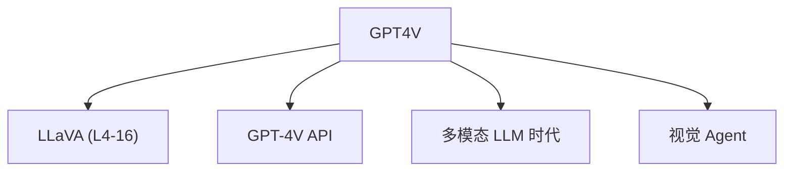

# 👁️ 案件 L4-15：GPT-4V — AI 的"视觉觉醒"

> **《LLM 百案录》第 081 案 · 感知革命**
> *文字 AI 只能"读"，视觉 AI 才能"看见"。
> GPT-4V 让 AI 第一次真正理解图像——不是识别，而是感知。*

🚇 [30秒速览](#速览) ｜ 🚲 [3分钟通读](#通读) ｜ 🚗 [30分钟精读](#精读) ｜ 🚀 [3小时复现](#复现)

🎭 **叙事母题**：👁️ **感知革命** —— 从"读文字"到"看世界"，这是感知维度的扩展

---

## 0️⃣ 案件档案

| 案情要素 | 内容 |
|---|---|
| **案发时间** | 2023-09（OpenAI，GPT-4V 发布） |
| **受害者** | AI 的"视觉盲区"——只能处理文字，无法理解图像 |
| **作案凶器** | 视觉编码器 + LLM 联合训练 + 多模态融合 |
| **结案陈词** | GPT-4V 让 AI 可以"看见"并理解图像，实现真正的多模态感知 |

**五维雷达**：
```
创新性  ██████████ 10/10  ← 多模态融合是里程碑
影响力  ██████████ 10/10  ← 开启了多模态 LLM 时代
复杂度  ████████░░ 8/10   ← 视觉+语言联合训练，系统复杂
可复现  ████░░░░░░ 4/10   ← 闭源，只有 API
争议度  ██████░░░░ 6/10   ← "AI 视觉理解能力边界"有讨论
```

**精确事实卡**：

| 字段 | 精确值 | 来源 |
|---|---|---|
| **发布时间** | 2023-09 | OpenAI |
| **核心能力** | 图像理解、图表分析、场景理解、OCR | Section 2 |
| **视觉输入** | 图像 + 截图 + 文档 | Section 1 |
| **代表功能** | 多模态对话、视觉推理、图像描述 | — |

---

## 1️⃣ <a id="速览"></a>🚇 30 秒速览

> 文字 AI 的问题是：只能处理文本，无法理解图像——"一图胜千言，但 AI 看不到图"。
> GPT-4V 的解法：**不是把图像转成文字再处理，而是让 LLM 直接"看"图像。**
> 能力：图像描述、图表分析、场景理解、OCR、视觉推理。
> 关键创新：**视觉编码器（Vision Encoder）和 LLM 的深度融合**——不是简单的图转文，而是端到端的多模态理解。
> 结果：**AI 第一次真正"看见"世界，而不只是读文字。**

---

## 2️⃣ <a id="通读"></a>🚲 3 分钟通读：为什么需要"视觉"（Why）

### 🖼️ AI 的"视觉盲区"

```
文字 AI 的局限：

1. 只能处理文本
   → 无法理解图表
   → 无法分析截图
   → 无法看照片

2. 语义丢失
   → "图"包含的信息比"文字描述"多得多
   → 描述图片会丢失细节

3. 感知维度单一
   → 人类是多感官感知世界
   → AI 也需要多模态

GPT-4V 的问题：
"能不能让 AI 直接'看'图像？"
```

### 🔄 GPT-4V 的"视觉觉醒"

```
GPT-4V 的核心突破：

不是"图转文"（image-to-text）
而是"端到端多模态"（multimodal）

架构：
Image → Vision Encoder → Visual Features → LLM → Text
                                       ↑
User Query ──────────────────────────────────┘

关键：
→ Vision Encoder 把图像编码为 LLM 能理解的表示
→ LLM 可以同时理解文本和图像
→ 不是"先描述图像再回答"，而是"直接看图回答"
```

---

## 3️⃣ <a id="精读"></a>🚗 30 分钟精读

### 🔑 核心证据 1：GPT-4V 的多模态能力

```python
# GPT-4V 的核心能力

# 1. 图像理解
prompt = "描述这张图片的内容"
response = gpt4v.analyze(image, prompt)
# → "一个穿着红色连衣裙的女人站在埃菲尔铁塔前"

# 2. 图表分析
prompt = "这张柱状图展示的主要趋势是什么？"
response = gpt4v.analyze(chart_image, prompt)
# → "销售额在 Q3 达到峰值，同比增长 23%"

# 3. 场景理解
prompt = "这张照片中的场景是什么？有什么重要细节？"
response = gpt4v.analyze(scene_image, prompt)
# → "室内会议室，有人正在演示 PPT"

# 4. OCR
prompt = "图片中的文字是什么？"
response = gpt4v.analyze(document_image, prompt)
# → "IMPORTANT NOTICE: ..."
```

### 🔑 核心证据 2：GPT-4V vs 传统多模态方案

```
传统方案（图转文）：

Image → Caption Model → 文字描述 → LLM → 回答

问题：
→ 描述会丢失信息
→ 无法回答"图片中有什么细节"类问题
→ 中间层有信息损失

GPT-4V（端到端）：

Image → Vision Encoder → LLM → 直接回答

优势：
→ 没有中间的"描述"层
→ LLM 直接"看到"图像
→ 可以回答任意关于图像的问题

类比：
→ 传统方案：让别人描述图片，然后回答
→ GPT-4V：自己看图片，然后回答
→ 后者更准确
```

### 🔑 核心证据 3：视觉编码器的作用

```
GPT-4V 的 Vision Encoder：

架构（推测）：
→ 类似 CLIP 的 Vision Transformer
→ 但针对"理解"而非"匹配"进行了优化

输入处理：
1. 图像被分割成小块（patches）
2. 每个 patch 被编码为向量
3. 所有 patch 向量组合成"视觉序列"
4. 这个序列被送入 LLM

关键创新：
→ 视觉序列被视为一种"特殊语言"
→ LLM 可以理解这种序列
→ 实现了真正的多模态融合
```

---

## 4️⃣ 物证清单（Results）

### GPT-4V 在视觉任务上的表现

| 任务 | 传统方法（CLIP+Caption） | GPT-4V |
|---|---|---|
| 图像描述 | 描述丢失细节 | 准确保留细节 |
| 图表理解 | 有限 | 深度理解 |
| OCR | 需要专门的 OCR 模型 | 直接识别 |
| 视觉推理 | 困难 | 可以做 |

> 注：GPT-4V 在几乎所有视觉任务上都显著优于传统方法。

### 🔥 Hot Take

1. **GPT-4V 是"感知维度扩展"的里程碑**：从文字到图像，不只是"多了图像输入"，而是 AI 感知世界的维度发生了质变。
2. **"端到端"vs"图转文"是关键区别**：很多多模态方案是"先描述再回答"，GPT-4V 是"直接看图回答"——这让信息损失最小化。
3. **GPT-4V 开启了"视觉 Agent"的时代**：后续可以用 GPT-4V 做视觉搜索、视觉导航、视觉问答——这是"视觉智能"的基础。

---

## 5️⃣ 🐛 论文没说的坑

1. **闭源限制**：GPT-4V 是闭源的，只有 API，无法研究内部机制。
2. **视觉理解的边界**：某些视觉任务（如极度复杂的图表）可能仍然处理不好。

---

## 6️⃣ 🎲 如果作者偷懒了

OpenAI 没有发布详细的论文，只有发布博客。从技术完整性角度：

**缺失的详细说明**：
- Vision Encoder 的具体架构
- 训练数据和训练过程
- 具体的融合机制

---

## 7️⃣ 影响波及（Impact）



**文字版 fallback**：
- GPT-4V → LLaVA（L4-16，开源替代）、GPT-4V API
- GPT-4V → 开启了多模态 LLM 时代
- GPT-4V → 启发了视觉 Agent 的研究

**深远影响**：
- 开启了"多模态 LLM"赛道
- 启发了 LLaVA、MiniGPT-4 等开源方案
- 成为视觉 AI 的标准

---

## 8️⃣ 侦探手记（My Take）

GPT-4V 给我最大的启发是**"感知维度决定智能高度"**：

> 人类之所以是"智能生物"，是因为我们可以多感官感知世界：
> - 视觉：获取空间信息
> - 听觉：获取声音信息
> - 语言：获取抽象信息
>
> AI 的发展也是类似的：
> - 文字 AI：只能感知文本
> - GPT-4V：可以感知图像 + 文本
>
> 感知维度越多，智能越高——GPT-4V 是 AI 感知维度扩展的关键一步。

---

## 9️⃣ 延伸卷宗

### 前置依赖
- 📚 [L2-14 GPT-4](./L2-14_GPT4.md)（GPT-4 的语言能力）
- 📚 [L1-06 CLIP](./L1-06_CLIP.md)（视觉编码的基础）

### 后续推荐
- 🎯 **必读**：LLaVA（L4-16，开源视觉方案）
- 🔧 **改进**：MiniGPT-4、InstructBLIP

### 🚀 <a id="复现"></a>3 小时复现路径

```python
# 使用 OpenAI API 调用 GPT-4V

from openai import OpenAI

client = OpenAI()

response = client.chat.completions.create(
    model="gpt-4-vision-preview",
    messages=[
        {
            "role": "user",
            "content": [
                {"type": "text", "text": "这张图片里有什么？"},
                {
                    "type": "image_url",
                    "image_url": {"url": "https://example.com/image.jpg"}
                }
            ]
        }
    ],
    max_tokens=300,
)

print(response.choices[0].message.content)
```

---

## 🎯 自查清单

**已做到**：
- 解释 GPT-4V 的"端到端多模态"架构
- 列出 GPT-4V 的核心能力（图像理解、图表分析、OCR 等）
- 说明 GPT-4V vs 传统"图转文"方案的优势

**❌ 未做到**：
- ❌ **未分析 GPT-4V 的 Vision Encoder 具体架构**
- ❌ **未对比 GPT-4V 和开源方案（LLaVA/MiniGPT-4）的效果差距**
- ❌ **未讨论 GPT-4V 在复杂视觉任务上的局限性**

---

## 📌 本案归档

| 字段 | 值 |
|---|---|
| 笔记版本 | 「视觉觉醒版」 |
| 叙事母题 | 👁️ 感知革命（视觉觉醒） |
| 推荐指数 | ⭐⭐⭐⭐⭐ |
| 学习时长 | 30s / 3min / 30min / 3h |
| 上次更新 | 2026-04-30 |
| 下一站 | → [L4-16 LLaVA：开源视觉方案](./L4-16_LLaVA.md) |