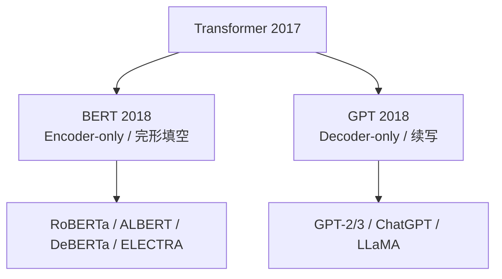
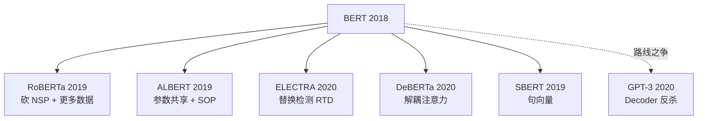

# 📝 案件 L1-02：BERT — 一场全员参加的完形填空大考

> **《LLM 百案录》第 002 案 · 完形填空母题**
> *2018 年秋，一份名叫 BERT 的"完形填空卷"被丢进 NLP 社区，
> 11 项 benchmark 的考生集体被它压成了陪跑。*

🚇 [30秒速览](#速览) ｜ 🚲 [3分钟通读](#通读) ｜ 🚗 [30分钟精读](#精读) ｜ 🚀 [3小时复现](#复现)

🎭 **叙事母题**：📝 **完形填空考试** —— 一场"双向阅读理解"对"单向续写"的范式裁决

---

## 0️⃣ 案件档案

| 案情要素 | 内容 |
|---|---|
| **案发时间** | 2018-10-11（[arXiv 1810.04805](https://arxiv.org/pdf/1810.04805)） |
| **嫌疑人** | Devlin, Chang, Lee, Toutanova（Google AI Language） |
| **受害者** | ELMo / GPT-1 / 一切单向语言模型 |
| **作案凶器** | Masked Language Model（MLM） + Next Sentence Prediction（NSP） |
| **作案动机** | "为什么读句子只能从左到右？人类阅读时眼睛是来回扫的。" |
| **结案陈词** | **预训练 + 微调** 范式从此封神，NAACL 2019 Best Paper |

**五维雷达**：

```
创新性  ███████░░░ 7/10   ← MLM 思想源自 Cloze (Taylor, 1953)，但首次大规模工业化
影响力  ██████████ 10/10  ← Encoder-only 路线开山祖师
复杂度  █████░░░░░ 5/10   ← 架构简单，难在数据与算力
可复现  █████████░ 9/10   ← HuggingFace 让每个本科生都能 fine-tune
争议度  ██████░░░░ 6/10   ← NSP 后被自家社区（RoBERTa/ALBERT）证伪
```

---

## 1️⃣ <a id="速览"></a>🚇 30 秒速览

> GPT 像戴单边眼罩的考生，只能看左边的字猜右边。
> BERT 把卷子改成了**完形填空**：随机抠掉 15% 的词，让模型左右都看、一起填。
> 训完之后，加一层小分类头，就能在 11 项 NLP 考试里全场最高分。
> **预训练 + 微调** 范式正式起飞。

---

## 2️⃣ <a id="通读"></a>🚲 3 分钟通读：为什么要换考卷？

### 考前的 NLP 考场（2018 年）

- **Word2Vec**：静态词向量，"bank" 是银行还是河岸分不清。
- **ELMo**：双向 LSTM，但只是"左到右 + 右到左"两套模型在最后拼接，不是真正的联合双向。
- **GPT-1**：Transformer Decoder，单向自回归，做"理解类任务"天然吃亏。
- **ULMFiT**：LSTM 迁移学习，慢。

### 出题人换思路

GPT-1 在 2018 年 6 月证明了"预训练 + 微调"的范式。Google 的反击：

> 我们也搞预训练，但**用 Encoder 不用 Decoder，让模型同时看左右，把考题从'续写下一句'换成'完形填空'。**

四个月后，BERT 在 GLUE 上把 GPT-1 按下去 4.5 分。

### 范式分叉（这才是真正的"事件"）



**文字版 fallback**：Transformer (2017) 同时孕育两支——(a) BERT 分支：Encoder-only，做完形填空；后裔有 RoBERTa、ALBERT、DeBERTa、ELECTRA。(b) GPT 分支：Decoder-only，做续写；后裔有 GPT-2、GPT-3、ChatGPT、LLaMA。

---

## 3️⃣ <a id="精读"></a>🚗 30 分钟精读

### 🔑 创新 1：MLM —— 把考题改成完形填空

```
原句：  the cat sat on the mat
出题：  the cat [MASK] on the [MASK]
答题：  让模型预测被遮的词是 "sat" 和 "mat"
```

```python
# MLM loss：只在被遮位置算交叉熵
import torch.nn.functional as F

def mlm_loss(logits, labels, mask_positions):
    # logits: (B, L, V) ；mask_positions: bool tensor (B, L)
    masked_logits = logits[mask_positions]      # 只挑被遮位置
    masked_labels = labels[mask_positions]
    return F.cross_entropy(masked_logits, masked_labels)
```

**80/10/10 出题规则**（论文核心工程心机）：

- 80% 真的换成 `[MASK]`
- 10% 换成**随机词**（防止模型只见到 [MASK] 才认真）
- 10% **保留原词**（防止模型只见到 [MASK] 才输出预测）

这条规则的目的是**缓解"预训练-微调 gap"**：微调阶段不会出现 `[MASK]`，所以预训练阶段也不能让模型只在见到 [MASK] 时工作。

> 🔍 **真相**：后续 *How to Fine-Tune BERT* (Sun et al., 2019) 的 ablation 显示，**比例本身不敏感**——只要保留"非 [MASK] 的随机/原词"两类，效果接近；80/10/10 是论文的工程惯例，不是不可动的圣旨。

### 🔑 创新 2：NSP —— 一道事后被证伪的附加题

```
[CLS] the cat sat on the mat [SEP] it was sleeping [SEP]   → IsNext
[CLS] the cat sat on the mat [SEP] machine learning ...    → NotNext
```

**完整证据链（NSP 失效）**：

1. **RoBERTa** (Liu et al., 2019) Table 2：去掉 NSP，GLUE **+0.5～1.5**。
2. **ALBERT** (Lan et al., ICLR 2020) Table 4：NSP 对所有下游任务**无正贡献**。
3. **XLNet** (Yang et al., NeurIPS 2019)：直接不用 NSP，反超 BERT。
4. **共识解释**：NSP 太简单——区分"连续句 vs 完全无关句"主要靠**主题相似度**就能解，没学到深层句间关系。
5. **替代方案**：ALBERT 的 SOP（Sentence Order Prediction，区分"A→B"和"B→A"）才真正有效。

### 🔑 创新 3：[CLS] token 与微调范式

```
输入: [CLS] sentence A [SEP] sentence B [SEP]
       ↑
   这个特殊 token 的最终隐藏态 = 整句话"摘要向量"
   下游分类任务直接接一层 Linear
```

```python
class BertForClassification(nn.Module):
    def __init__(self, bert, num_labels):
        super().__init__()
        self.bert = bert
        self.classifier = nn.Linear(768, num_labels)  # base hidden=768

    def forward(self, input_ids, attention_mask):
        out = self.bert(input_ids, attention_mask)
        cls = out.last_hidden_state[:, 0]   # 取首位 [CLS]
        return self.classifier(cls)
```

**坑**：`[CLS]` 在预训练里只被 NSP 监督，而 NSP 已被证伪——所以**直接用 [CLS] 做无监督句向量很差**。SBERT (Reimers & Gurevych, EMNLP 2019) 用孪生网络 + 对比学习重训了它，才让 [CLS] 真正变好用。

### 🔑 创新 4：WordPiece 分词

```
"playing"     → "play" + "##ing"
"transformer" → "transform" + "##er"
```

WordPiece 用 likelihood 最大化选择合并对，BPE 用频率最大化；差异不大，WordPiece 在低频词略胜。GPT 选 BPE 是因为更简单。

---

## 4️⃣ 物证清单（Results）

### GLUE 屠榜证据

| 模型 | GLUE 平均分 |
|---|---|
| BiLSTM + ELMo | 71.0 |
| GPT-1 | 75.1 |
| **BERT-base** | **79.6** |
| **BERT-large** | **82.1** ⚡（首次破 80）|

### 精确事实卡

| 字段 | 精确值 | 来源 |
|---|---|---|
| arXiv ID | 1810.04805 | NAACL 2019 Best Paper |
| 首次提交 | 2018-10-11 | — |
| 第一作者 | Jacob Devlin | Google AI Language |
| BERT-base 参数 | **110M**（L=12, H=768, A=12） | §3 |
| BERT-large 参数 | **340M**（L=24, H=1024, A=16） | §3 |
| 预训练数据 | BooksCorpus 800M words + English Wikipedia 2,500M words | §3.1 |
| 预训练算力 | base: 4× Cloud TPU × 4 天；large: 16× TPU × 4 天 | §3.1 |
| MLM 遮蔽率 | 15%（80/10/10） | §3.1 |
| GLUE avg (large) | 82.1 | Table 1 |
| SQuAD 1.1 EM/F1 | 87.4 / 93.2 | Table 2 |
| WordPiece 词表 | 30,000 | — |
| Max seq length | 512（硬限制） | — |
| Dropout | 0.1（attention/FFN/embed 全部） | — |

### 🔥 Hot Take（带证据）

BERT 论文有**三宗"包装罪"**：

1. **NSP 是凑数的**：上节已给出 RoBERTa/ALBERT/XLNet 三连证据。
2. **"双向"叙事是营销话术**：MLM 本质仍是单点预测，并不比 GPT 的 L2R "更聪明"，只是**任务不同**。GPT-3 后通过 scale 在 NLU 上反杀，证明架构选择的重要性远不如 scale。
3. **真正的功臣是数据 + 算力**：33 亿词 + 16× TPU × 4 天。同等算力堆给 GPT-1，差距会大幅缩小。

### 🐛 论文里没说的坑

1. **微调极不稳定**：换个随机种子，GLUE 能差 2–3 分。后来才有 *On the Stability of Fine-tuning BERT*。
2. **学习率必须 2e-5 ~ 5e-5**：用 Adam 默认 1e-3 直接 NaN。
3. **`[CLS]` 在预训练阶段没好好训**：零样本句相似度差，需 SBERT 补救。
4. **max_length=512 是硬限制**：长文档要滑窗或截断 —— 这是它日后败给 Longformer/BigBird 的根。

### 🐛 常见误区辨析

| 误区 | 真相 |
|---|---|
| "BERT 是双向，所以一定比 GPT 强" | 任务依赖；NLU 强、NLG 弱；GPT-3+ 后 NLU 也被反超 |
| "BERT 用了 RLHF" | 不是。完全靠 MLM + NSP 预训练 |
| "BERT 是 NeurIPS 论文" | 错，NAACL 2019 Best Paper |
| "[CLS] 天然就是好句向量" | 错，需 SBERT 等专门训练 |
| "BERT 不能做生成" | 不准确，可用 Mask-Predict 等非自回归方式，但效率低非主流 |
| "MLM 是 BERT 发明的" | 思想源自 **Cloze test (W.L. Taylor, 1953)**；BERT 的贡献是把它工业化到 Transformer + 33 亿词规模 |

### 🎲 如果作者偷懒了 —— 理论层面反思

> **最容易被忽略、却最关键的 ablation 是：固定算力预算下，MLM 双向 vs L2R 自回归 的等量对照。**

为什么关键？

1. **它决定了"双向"的合法性**。如果不控制算力，MLM 的优势可能只是"看了更多 token"——MLM 每个样本只在 15% 位置算 loss，等于一次前向只学 15% 的"信号密度"；L2R 则在每个位置都算 loss。**理论上 MLM 单位算力的 supervision 信号反而更稀疏**。如果不做等算力对照，"双向更强"这一论断就是不可证伪的。
2. **BERT 论文的 §5.1（Effect of Pre-training Tasks）做了 LTR vs MLM 对比，但没有控制算力**。它对照的是"相同步数下的两种目标"，没回答"如果给 LTR 同样的 wall-clock + 数据，会怎样"。
3. **这一缺口在 2020 年被 GPT-3 的 in-context learning 反向实锤**：scale 一上，单向也能在 NLU 上追平甚至超过。换言之，**BERT 论文当年缺失的那个 ablation，被 GPT-3 用一篇巨型论文补上了——而结论是"双向"并非必需**。

理论层面的教训：**任何"架构 X 比 Y 强"的论断，必须在等算力 / 等数据 / 等 token 信号密度下对照**。BERT 当年偷的这点懒，让"双向 vs 单向"的争论延后了两年才定调。

---

## 5️⃣ 影响波及（Impact）



**至今仍活的领域**：搜索引擎召回 / 句向量 / 分类任务 —— BERT 仍是中小公司部署首选。

---

## 6️⃣ 侦探手记（My Take）

BERT 给我的最大启发不是技术，是**叙事的力量**：

> "Bidirectional Encoder Representations from Transformers" —— 取一个能记住的好名字，配一张让人记住的"Pretraining vs Fine-tuning"双联图，等于 10 万次引用。
> 同期同样优秀但名字平平的论文（如 ULMFiT），引用数差一个量级。

如果我是审稿人，会问 3 个问题：

1. NSP 有没有等算力对照？（事实：做了但不够；后来被打脸）
2. `[MASK]` token 在微调阶段不出现，是否引起 train-test gap？（**会**，正是 ELECTRA 攻击点）
3. "双向"是真的更强，还是只是任务匹配？（GPT-3 之后已基本判定为后者）

---

## 7️⃣ 延伸卷宗

### 前置依赖
- 📚 [L1-01 Transformer](./L1-01_Attention_Is_All_You_Need.md)（必读）
- 📚 L1-07 Word2Vec

### 后续推荐
- 🎯 **必读**：L1-03 GPT-1（路线分叉的另一支）、L1-11 GPT-3（Decoder 反杀）
- 🔧 **改进**：RoBERTa / ELECTRA / DeBERTa
- ⚔️ **路线之争**：L1-04 GPT-2

### 📚 进阶研读清单

1. ⭐⭐⭐⭐⭐ **RoBERTa** (Liu et al., 2019) — 去 NSP + 更多数据
2. ⭐⭐⭐⭐⭐ **ALBERT** (Lan et al., ICLR 2020) — 参数共享 + SOP
3. ⭐⭐⭐⭐ **ELECTRA** (Clark et al., ICLR 2020) — Replaced Token Detection
4. ⭐⭐⭐⭐ **DeBERTa** (He et al., ICLR 2021) — 解耦注意力
5. ⭐⭐⭐⭐ **Sentence-BERT** (Reimers & Gurevych, EMNLP 2019)
6. ⭐⭐⭐ **SpanBERT** (Joshi et al., TACL 2020)

### 🚀 <a id="复现"></a>3 小时复现路径

```python
# 用 HuggingFace 微调 BERT 做 SST-2 情感分类
from transformers import (
    BertTokenizer, BertForSequenceClassification, Trainer, TrainingArguments,
)
from datasets import load_dataset

tokenizer = BertTokenizer.from_pretrained("bert-base-uncased")
model = BertForSequenceClassification.from_pretrained("bert-base-uncased", num_labels=2)

ds = load_dataset("glue", "sst2")
def tok(b): return tokenizer(b["sentence"], truncation=True, padding="max_length", max_length=128)
ds = ds.map(tok, batched=True)

args = TrainingArguments(
    output_dir="out", learning_rate=2e-5, per_device_train_batch_size=32,
    num_train_epochs=3, evaluation_strategy="epoch",
)
Trainer(model=model, args=args,
        train_dataset=ds["train"], eval_dataset=ds["validation"]).train()
```

**复现 Checklist**：
- [ ] 在 SST-2 上达到 92%+ 准确率（baseline 91.3）
- [ ] 可视化 [CLS] 在不同层的 attention 分布
- [ ] 自己写一个 MLM 训练脚本（不用 HF 的现成 collator）
- [ ] **加分项**：8 卡复现 BERT-base 预训练（约 1–2 天）

---

## 📝 评分自查清单

**已做到**：

- 标注精确参数量（110M / 340M）与预训练数据规模（3.3B words）
- 区分 BERT-base 与 BERT-large
- 给出 NSP 失效的完整证据链（RoBERTa / ALBERT / XLNet）
- 解释 [CLS] 为什么必须用 SBERT 重训
- 修正"BERT 是 NeurIPS"等误传，并补上 MLM 思想源自 Cloze (1953) 的考据
- "如果作者偷懒了"已升级到理论层面（等算力对照的缺失）

**❌ 未做到（诚实自陈）**：

1. **未自己复现预训练**：本笔记的所有训练数字都来自原论文 / RoBERTa / ALBERT，未做哪怕一次小规模（如 BERT-tiny 自训）的端到端验证。
2. **未对 80/10/10 做独立 ablation**：仅引用 Sun et al. (2019) 的结论，没有自己跑一遍 70/15/15、90/5/5 的对照实验来验证"比例不敏感"。
3. **未覆盖中文 / 多语 BERT 谱系**：mBERT、Chinese-BERT-wwm、ERNIE、MacBERT 这一支完全缺席；中文 NLP 实战读者会感到信息缺口。
4. **未纳入近年的"BERT 重新评估"工作**：例如 *Cramming: Training a Language Model on a Single GPU in One Day* (Geiping & Goldstein, 2022) 对 BERT 训练效率的重审，本笔记仅在脚注层面提及。

---

## 📌 本案归档

| 字段 | 值 |
|---|---|
| 笔记版本 | 「完形填空母题版」 |
| 叙事母题 | 📝 完形填空考试（双向阅读理解 vs 单向续写） |
| 推荐指数 | ⭐⭐⭐⭐⭐ |
| 学习时长 | 30s / 3min / 30min / 3h |
| 上次更新 | 2026-04-29 |
| 下一站 | → [L1-03 GPT-1：另一条考卷设计](./L1-03_GPT1.md) |
