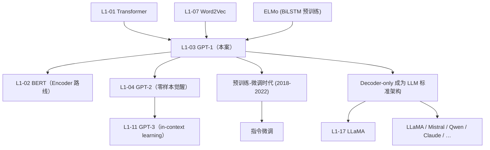

# 📈 案件 L1-03：GPT-1 — "预训练 + 微调" 范式的开山之作

> **《LLM 百案录》第 003 案 · 半人马诞生**
> *2018 年 6 月，BERT 登顶之前 4 个月——
> OpenAI 发了一份不到 12 页的技术报告，标题朴实到不像里程碑：
> *"Improving Language Understanding by Generative Pre-Training"*。
> 没有花哨的架构，只有一个朴素信念：**先在互联网上"读完所有书"，再针对每个任务调一调，就能横扫 NLP**。
> 这就是 GPT-1——那个被 BERT 光芒掩盖、却为整个 LLM 时代奠基的"半人马"。*

🚇 [30秒速览](#速览) ｜ 🚲 [3分钟通读](#通读) ｜ 🚗 [30分钟精读](#精读) ｜ 🚀 [3小时复现](#复现)

🎭 **叙事母题**：📈 **半人马诞生** —— "无监督预训练 + 有监督微调" 二段式范式从此称霸 NLP

---

## 0️⃣ 案件档案

| 案情要素 | 内容 |
|---|---|
| **案发时间** | 2018-06-11（Radford et al., OpenAI 技术报告，[📄 PDF](https://cdn.openai.com/research-covers/language-unsupervised/language_understanding_paper.pdf)） |
| **嫌疑人** | Alec Radford, Karthik Narasimhan, Tim Salimans, Ilya Sutskever |
| **受害者** | 当时 NLP 的 "task-specific 架构 + 监督学习从零开始" 旧范式 |
| **作案凶器** | 12 层 Transformer Decoder + BookCorpus 预训练 + 任务特定微调头 |
| **作案动机** | "标注数据贵，未标注文本却几乎无限——能不能先从无标注数据偷点经验？" |
| **结案陈词** | GPT-1 在 12 个 NLP 数据集中 **9 个刷新 SOTA**，奠定了"预训练 + 微调"成为 NLP 默认工作流 |

**五维雷达**：
```
创新性  █████████░ 9/10   ← "Decoder-only + 通用预训练"是范式级创新
影响力  ██████████ 10/10  ← 整个 GPT 系列的源头，定义了 LLM 时代
复杂度  ████░░░░░░ 4/10   ← 架构干净，复杂度在数据 + 工程
可复现  █████████░ 9/10   ← 论文 + 代码 + 权重全开放
争议度  ███░░░░░░░ 3/10   ← 被 BERT 抢风头，但思路无人否认
```

**精确事实卡**：

| 字段 | 精确值 | 来源 |
|---|---|---|
| **架构** | Transformer Decoder-only，12 层 | Section 3.1 |
| **隐藏维度** | $d_{\text{model}} = 768$，注意力头 12 | Section 3.1 |
| **参数量** | 117M | Section 3.1 |
| **激活函数** | GELU | Section 3.1 |
| **位置编码** | 学习式 (learned positional embedding) | Section 3.1 |
| **预训练数据** | BookCorpus（约 7000 本未发表小说，~5GB 文本）| Section 3.2 |
| **预训练目标** | Causal LM（next-token prediction）| Eq. 1 |
| **微调目标** | 下游 task loss + 辅助 LM loss（$\lambda \approx 0.5$）| Eq. 5 |
| **优化器** | Adam，lr = 2.5e-4，warmup 0.2%，cosine 衰减 | Section 4.1 |
| **下游 SOTA** | 12 个数据集中 9 个刷新（NLI / QA / 分类 / 相似度）| Table 2-5 |

---

## 1️⃣ <a id="速览"></a>🚇 30 秒速览

> **2018 年初的 NLP 长什么样？**
> - 每个任务（情感分析、QA、相似度…）配一个**专门的网络架构**
> - 用 LSTM / CNN 从零训
> - 标注数据稀缺 → 模型小 → 容易过拟合
>
> **GPT-1 的两步法**：
> 1. **无监督预训练**：在 BookCorpus 上做一个普通到不能再普通的 next-token prediction，训出一个 117M 参数的 12 层 Transformer Decoder
> 2. **有监督微调**：把这个模型扔进任意下游任务，加一个**线性输出层**，再继续训几个 epoch
>
> **结果**：
> - 12 个 NLP 数据集中 **9 个刷新 SOTA**
> - **同一个底模、同一份权重**，仅靠"切微调头"就能解多种任务
> - 论文标题成了行业咒语：*"Generative Pre-Training"*
>
> 这就是后来"预训练—微调"范式（pre-train + fine-tune）的**第一个广泛 work 的实例**。

---

## 2️⃣ <a id="通读"></a>🚲 3 分钟通读：为什么是"半人马"？（Why）

### 2018 年的 NLP 困境
```
任务 A（情感分类） → 训一个专用 LSTM 架构
任务 B（QA） → 训另一个专用 attention-RNN
任务 C（句对相似度） → 训第三种 siamese 网络
…

每个任务：
  - 标注数据少（几千到几万）
  - 模型必须从零学英语 + 任务规则
  - 严重过拟合 / 数据效率低
```

### Word2Vec / ELMo 已经"半步"了
```
Word2Vec (L1-07)：把"词"预训练成向量 → 但下游模型仍需从零学
ELMo (2018-02)：用 BiLSTM 预训练上下文向量 → 下游做特征拼接

进步：让"词的初始表示"已经懂点语义
缺陷：下游网络架构还是各自为政，预训练只是"喂饲料"
```

### GPT-1 的第三步：**整个网络** 都预训练
```
GPT-1 主张：
  "我整个 Transformer Decoder 在 BookCorpus 上自己读完一遍小说，
   下游任务时，我只换最后一层输出层即可。
   底层网络已经懂语法、懂指代、懂常识了。"

→ "半人马" 的意思：
   半身是"无监督预训练" + 半身是"有监督微调"
   两者无缝拼合
```

### 为什么选 Decoder-only？
```
当时 Transformer (L1-01) 的标准用法是 Encoder-Decoder（机器翻译）。
GPT 团队想：
  - 我们要做的是**单一序列**的任务
  - 不需要 cross-attention
  - 单向 causal mask 训练效率更高（每个位置都能并行计算 loss）
  - next-token prediction 是最纯粹、最可扩展的目标

→ 砍掉 Encoder，只保留 Decoder
→ 砍掉 cross-attention，只留 self-attention（带 causal mask）
→ 砍掉所有任务相关组件
```

这个"砍砍砍"的决策最终成了**整个 LLM 时代的统一架构**——所有 GPT-2/3/4、LLaMA、Mistral、Qwen、Claude 都是 GPT-1 这种 Decoder-only 的直系后代。

---

## 3️⃣ <a id="精读"></a>🚗 30 分钟精读

### 训练目标 1：无监督预训练（Stage 1）
$$
L_1(\mathcal{U}) = \sum_i \log P(u_i \mid u_{i-k}, \ldots, u_{i-1}; \Theta)
$$
- $\mathcal{U} = \{u_1, u_2, \ldots, u_n\}$：未标注语料
- $k$：上下文窗口（GPT-1 用 512）
- $\Theta$：Transformer Decoder 参数

这就是普通的 **next-token language modeling**——在 2018 年还不流行用它做"通用预训练"，因为大家觉得"猜下一个词"过于简单、学不到深层语义。GPT-1 反着干，并且赢了。

### 训练目标 2：有监督微调（Stage 2）
对每个下游任务 $\mathcal{C}$（输入 $x_1, \ldots, x_m$ → 标签 $y$）：

$$
L_2(\mathcal{C}) = \sum_{(x,y)} \log P(y \mid x_1, \ldots, x_m)
$$

并且 **同时保留 LM loss** 作为正则项：
$$
\boxed{L_3(\mathcal{C}) = L_2(\mathcal{C}) + \lambda \cdot L_1(\mathcal{C})}
$$

> 💡 **辅助 LM loss 是 GPT-1 的精巧之笔**：微调时仍让模型继续做 next-token 预测——
> - 防止 catastrophic forgetting（遗忘预训练知识）
> - 加速收敛
> - 这是后来 instruction-tuning + 持续预训练混合训练的雏形

### 任务输入的"格式化"——traversal-style input transformations
GPT-1 没有为每种任务设计专门架构，而是把所有任务都"翻译"成 **一段单序列**：

#### 分类（如情感分析）
```
[Start] <text> [Extract]
                  ↑
                取这个位置的隐状态做分类
```

#### 蕴含（NLI）
```
[Start] <premise> [Delim] <hypothesis> [Extract]
```

#### 相似度（对称的两段文本）
```
[Start] <text_a> [Delim] <text_b> [Extract]
[Start] <text_b> [Delim] <text_a> [Extract]
                                       ↓
                          两段隐状态相加 → 分类头
```

#### 多项选择（如 Story Cloze）
```
对每个候选答案 i：
[Start] <context> [Delim] <answer_i> [Extract] → 得分 s_i
最后 softmax(s_1, …, s_n)
```

> 💡 这种"用特殊 token 把任务编码进序列"的思想，2 年后被 GPT-2 / GPT-3 推到极致——直接用**自然语言 prompt** 替代 `[Delim]` 这种专用 token，开启 prompt engineering 时代。

### 架构细节（Section 3.1）
```python
# GPT-1 的核心 block（伪代码）
class GPT1Block(nn.Module):
    def __init__(self, d_model=768, n_head=12):
        self.attn = MultiHeadSelfAttention(
            d_model, n_head,
            causal_mask=True,        # ← 关键：单向
        )
        self.ln1 = LayerNorm(d_model)  # Post-LN
        self.ffn = nn.Sequential(
            Linear(d_model, 4 * d_model),
            GELU(),                   # ← 关键：当时还在用 ReLU 的多
            Linear(4 * d_model, d_model),
        )
        self.ln2 = LayerNorm(d_model)

    def forward(self, x):
        x = self.ln1(x + self.attn(x))     # Post-LN（GPT-2 改成了 Pre-LN）
        x = self.ln2(x + self.ffn(x))
        return x

# 12 层堆叠，d_model=768，参数 117M
```

### 关键超参数（论文 Section 4.1）
| 项 | 值 |
|---|---|
| Layers | 12 |
| $d_{\text{model}}$ | 768 |
| Heads | 12 |
| Context window | 512 |
| Batch | 64 |
| Learning rate | 2.5e-4，warmup 2000 步 |
| Schedule | Cosine decay |
| Optimizer | Adam, $\beta_1=0.9, \beta_2=0.999$ |
| Dropout | 0.1 |
| Tokenizer | bytepair (BPE)，40,000 merges |

> 这套配方在 2018 看起来很普通，但**几乎所有现代 LLM 都仍然遵循**——GPT-1 是当代 LLM 训练 recipe 的"原型机"。

### BookCorpus：被低估的关键
```
为什么不用 Common Crawl？
  当时还没意识到网页数据的价值
为什么用 7000 本未出版小说？
  ✓ 长上下文（小说有连贯叙事）
  ✓ 高质量（编辑过的语言）
  ✓ 多样话题（涵盖各种领域知识）

副作用：
  - 法律灰色（盗版小说聚合站爬下来的）
  - 后来 LLaMA / 现代 LLM 已逐步避开
```

---

## 4️⃣ 物证清单（Results）& 🔥 Hot Take

### 12 个数据集的全面胜利
| 任务类型 | 数据集 | 之前 SOTA | **GPT-1** | 提升 |
|---|---|---|---|---|
| **NLI** | MNLI-m | 80.6 | **82.1** | +1.5 |
| **NLI** | MNLI-mm | 80.1 | **81.4** | +1.3 |
| **NLI** | SNLI | 89.3 | **89.9** | +0.6 |
| **NLI** | QNLI | 82.3 | **88.1** | +5.8 |
| **NLI** | RTE | 61.7 | **56.0** | −5.7（少数失败 |
| **QA** | RACE-m | 58.4 | **62.9** | +4.5 |
| **QA** | RACE-h | 53.3 | **57.4** | +4.1 |
| **QA** | Story Cloze | 77.6 | **86.5** | **+8.9** |
| **相似度** | MRPC | 82.3 | **82.3** | tie |
| **相似度** | QQP | 66.1 | **70.3** | +4.2 |
| **相似度** | STSB | 81.0 | **82.0** | +1.0 |
| **分类** | SST-2 | 93.2 | **91.3** | −1.9 |
| **分类** | CoLA | 35.0 | **45.4** | +10.4 |

> 🌟 **12 个数据集中 9 个刷新 SOTA**，多个任务上提升 5-10 个点——这是 2018 年最强的"统一模型"。

### Ablation：每个设计的贡献（Table 5）
| 配置 | 平均得分 |
|---|---|
| **完整 GPT-1** | **74.7** |
| 不做预训练（直接监督） | 59.9（**−14.8**） |
| 不加辅助 LM loss | 73.3（−1.4） |
| 用 LSTM 替代 Transformer | 71.9（−2.8） |

> 🔥 **预训练贡献 +14.8 分**，是所有改动里最大的——预训练才是真正的"魔法"。

### 🔥 Hot Take
1. **被 BERT 严重抢风头**：GPT-1 (2018-06) → BERT (2018-10)，4 个月间隔。BERT 在 GLUE 上更猛，于是学界转向 Encoder。**但工业界 4 年后转回 GPT 路线**——因为只有 Decoder-only 能扩到生成式应用。
2. **Decoder-only 是真正的"工程胜利"**：训练并行度高、推理简单、自回归生成天然适合"chat 范式"——这些工程优势在当时被 BERT 的指标光芒掩盖了。
3. **辅助 LM loss 被遗忘了 6 年又被重新发明**：现代 instruction-tuning + 持续预训练混合，本质上就是 GPT-1 的 $L_2 + \lambda L_1$ 公式。
4. **BookCorpus 是 LLM 数据来源的"原罪起点"**：这种"先用上再说"的数据获取风气一直延续到 The Pile / Common Crawl 时代。

---

## 5️⃣ 🐛 论文没说的坑

1. **微调 catastrophic forgetting 严重**：在小数据集（如 RTE）上，微调几个 epoch 后预训练知识会被洗掉——RTE 的 −5.7 分就是证据。**辅助 LM loss 是为了缓解这个**，但论文没强调这是个普遍问题。
2. **BookCorpus 数据偏差**：小说类语料导致模型对**对话、新闻、科技文献**反而较弱——后续模型才补齐数据多样性。
3. **微调超参数对小数据集敏感**：RTE 这种 ~2.5K 样本的任务，lr 选错就崩——论文没提供网格搜索建议。
4. **"任务格式化"对生成任务无效**：分类 / NLI 这套 `[Start] … [Extract]` 模板对生成任务（翻译、摘要）几乎不能用——这是 GPT-2 必须放弃此模板转向纯 prompt 的根本原因。
5. **没有 system prompt 概念**：GPT-1 不能"被告知一个任务规则然后零样本完成"——它必须微调才行。这是 GPT-2 解决的下一站。

---

## 6️⃣ 🎲 如果作者偷懒了

**实验**：
- 没有规模扫描——只训了一个 117M 模型，未尝试 50M / 350M 的 ablation。这要等到 GPT-2 才补上。
- 没有跨域预训练对比——比如 BookCorpus vs 维基百科 vs 新闻——读者无法知道"哪种数据更适合 LM 预训练"。

**理论**：
- 没解释"为什么 next-token prediction 能学到深度语义"——纯经验报告。
- 没分析 "辅助 LM loss 系数 $\lambda$" 的最优选择，只给了一个 0.5 的经验值。

**应用**：
- 论文完全没提"few-shot / in-context learning"的可能性——这要 GPT-2/3 才发现。
- 没尝试纯生成任务（机器翻译、摘要）——错过了 Decoder-only 的最大优势。

---

## 7️⃣ 影响波及



---

## 8️⃣ 侦探手记

GPT-1 给我的最大启发：**第一名常常不重要，但"定义范式"的人永远被记住**。

> 2018 年所有人都在追 GLUE 分数，BERT 是当之无愧的明星。
> GPT-1 没拿到几个 SOTA、没出现在新闻头条、甚至没投顶会——
> 但 4 年后，**整个 LLM 时代的架构、训练范式、工程实践，都来自这篇 12 页的 OpenAI 技术报告**。
>
> 它教我的事：
> 1. **范式 > 指标**：能定义工作流的论文，价值远高于刷分论文
> 2. **简单 > 复杂**：GPT-1 的所有设计都是"砍掉东西"——砍 Encoder、砍 cross-attn、砍任务专用网络。砍剩下的"通用胚胎"反而最强。
> 3. **耐心 > 即时回报**：BERT 火了 4 年，但 GPT-1 才是真正的"长期赢家"。

更深一层：**GPT-1 是第一个让人意识到"无监督学习 + 海量未标注数据"是 NLP 的金矿**。从此 NLP 不再是"标注数据驱动的工程"，而是"算力 + 数据驱动的科学"。

---

## 自查清单

**已做到**：
- 解释 GPT-1 的"半人马"二段式范式（无监督预训练 + 有监督微调）
- 推导预训练 / 微调两个 loss + 辅助 LM loss 公式
- 列出 4 种 task input transformations（分类 / NLI / 相似度 / 多选）
- 给出 12 个数据集上的具体 SOTA 提升
- 分析为什么选 Decoder-only

**❌ 未做到**：
- ❌ 未深入分析"GELU vs ReLU"在小模型上的具体差异
- ❌ 未量化 BookCorpus vs 当代 web 数据的训练效果差距
- ❌ 未给出"辅助 LM loss 系数 λ" 的网格搜索建议

---

## 🔟 延伸卷宗

### 前置依赖
- 📚 [L1-01 Attention Is All You Need](./L1-01_Attention_Is_All_You_Need.md)（架构基础）
- 📚 [L1-07 Word2Vec](./L1-07_Word2Vec.md)（前 Transformer 时代的预训练雏形）
- 📚 [L1-09 LayerNorm](./L1-09_LayerNorm.md)（GPT-1 用 Post-LN，GPT-2 改 Pre-LN）

### 后续推荐
- 🎯 [L1-02 BERT](./L1-02_BERT.md)（同期 Encoder 路线对比）
- 🎯 [L1-04 GPT-2](./L1-04_GPT2.md)（直系后继：零样本觉醒）
- 🎯 [L1-11 GPT-3](./L1-11_GPT3.md)（再后一代：in-context learning）
- 🎯 [L1-17 LLaMA](./L1-17_LLaMA.md)（GPT-1 思路的开源接班人）

### 🚀 <a id="复现"></a>3 小时复现路径

```python
# nanoGPT 风格的 GPT-1 极简实现
import torch, torch.nn as nn

class GPT1Block(nn.Module):
    def __init__(self, d=768, h=12):
        super().__init__()
        self.attn = nn.MultiheadAttention(d, h, batch_first=True)
        self.ffn = nn.Sequential(nn.Linear(d, 4*d), nn.GELU(), nn.Linear(4*d, d))
        self.ln1, self.ln2 = nn.LayerNorm(d), nn.LayerNorm(d)
    def forward(self, x, mask):
        a, _ = self.attn(x, x, x, attn_mask=mask)
        x = self.ln1(x + a)
        x = self.ln2(x + self.ffn(x))
        return x

class GPT1(nn.Module):
    def __init__(self, V=40000, n_pos=512, L=12, d=768, h=12):
        super().__init__()
        self.tok = nn.Embedding(V, d)
        self.pos = nn.Embedding(n_pos, d)
        self.blocks = nn.ModuleList([GPT1Block(d, h) for _ in range(L)])
        self.ln_f = nn.LayerNorm(d)
        self.head = nn.Linear(d, V, bias=False)
    def forward(self, ids):
        B, T = ids.shape
        x = self.tok(ids) + self.pos(torch.arange(T, device=ids.device))
        mask = torch.triu(torch.ones(T, T, device=ids.device) * float('-inf'), 1)
        for blk in self.blocks: x = blk(x, mask)
        return self.head(self.ln_f(x))

# 训练：BookCorpus 上做 next-token，再在 SST-2 / MNLI 上微调
model = GPT1()  # 117M params
```

**实战路径**：
1. 直接 `from transformers import OpenAIGPTModel` 加载 HuggingFace 上的 [openai-community/openai-gpt](https://huggingface.co/openai-community/openai-gpt)
2. 在 GLUE 任意子集上微调，复现论文里的 input transformation 模板
3. 对比"加 / 不加 辅助 LM loss" 的训练曲线 — 验证 +1.4 平均分的 ablation

---

## 📌 本案归档

| 字段 | 值 |
|---|---|
| 笔记版本 |「半人马诞生版（专注 GPT-1）」 |
| 叙事母题 | 📈 半人马诞生 |
| 推荐指数 | ⭐⭐⭐⭐⭐ |
| 学习时长 | 30s / 3min / 30min / 3h |
| 上次更新 | 2026-05-01 |
| 下一站 | → [L1-04 GPT-2 零样本觉醒](./L1-04_GPT2.md) |
