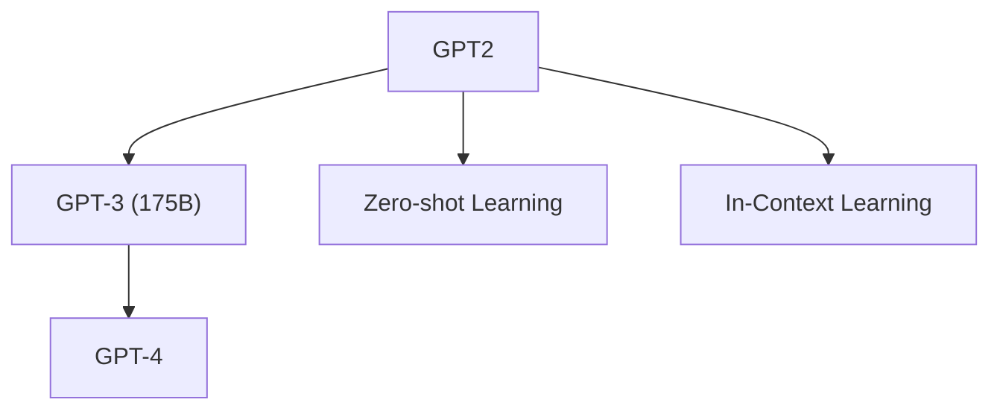

# 📈 案件 L1-03：GPT-1/2 — 生成式AI的"作家诞生"

> **《LLM 百案录》第 003 案 · 作家诞生**
> *BERT 是"读者"，GPT 是"作家"——一个理解世界，一个创造世界。
> 当作家学会写作，世界迎来了内容生成的革命。*

🚇 [30秒速览](#速览) ｜ 🚲 [3分钟通读](#通读) ｜ 🚗 [30分钟精读](#精读) ｜ 🚀 [3小时复现](#复现)

🎭 **叙事母题**：📈 **作家诞生** —— 能预测下一个词的人，就能创造未来

---

## 0️⃣ 案件档案

| 案情要素 | 内容 |
|---|---|
| **案发时间** | 2018（GPT-1）/ 2019（GPT-2，Radford et al., OpenAI） · [📄 GPT-1 PDF](https://cdn.openai.com/research-covers/language-unsupervised/language_understanding_paper.pdf) |
| **受害者** | NLP 任务的"微调依赖"——每个任务都需要单独微调 |
| **作案凶器** | 单向语言建模 + 预训练 + Zero-shot / Few-shot |
| **结案陈词** | GPT 证明了"预测下一个词"可以涌现出理解和创造能力 |

**五维雷达**：
```
创新性  ██████████ 10/10  ← 预训练+微调范式是 NLP 的里程碑
影响力  ██████████ 10/10  ← GPT 系列的开端，直接导致 GPT-3/4
复杂度  █████░░░░░ 5/10   ← 架构清晰，创新在范式而非细节
可复现  ████████░░ 8/10  ← 开源，有预训练权重
争议度  ████░░░░░░ 4/10   ← "规模涌现"是真正的智能吗？
```

**精确事实卡**：

| 字段 | 精确值 | 来源 |
|---|---|---|
| **GPT-1 参数** | 117M | Section 2 |
| **GPT-2 参数** | 1.5B | Section 2 |
| **GPT-2 Zero-shot 效果** | 接近 GPT-1 Fine-tuning | Table 1 |
| **核心创新** | 单向 LM + Zero-shot Learning | Section 3 |
| **后续发展** | GPT-3 175B → GPT-4 → ChatGPT | — |

---

## 1️⃣ <a id="速览"></a>🚇 30 秒速览

> 传统 NLP：每个任务单独微调，成本高，不灵活。
> GPT-1 的解法：**预训练一个大型语言模型，然后微调每个下游任务**——这是范式的革命。
> GPT-2 的突破：**不需要微调**，直接给任务描述，模型自己推断该做什么（Zero-shot）。
> 核心洞察：**预测下一个词不仅需要"记忆"，还需要"推理"和"创造"。**

---

## 2️⃣ <a id="通读"></a>🚲 3 分钟通读：为什么"作家"比"读者"更有野心（Why）

### 📖 BERT 的"读者"定位

```
BERT 的哲学：
→ 双向理解，看见所有词
→ 完形填空（[MASK]）
→ 理解语义

局限：
→ 每个任务都需要微调
→ 无法直接做生成任务
→ "读者"受限于输入
```

### ✍️ GPT 的"作家"定位

```
GPT 的哲学：
→ 单向生成，只能看过去的词
→ 预测下一个 token
→ 创造内容

突破：
→ 生成能力 + 预训练 = 通用的生成器
→ Zero-shot / Few-shot = 无需微调
→ "作家"不受输入限制，可以无限创作
```

---

## 3️⃣ <a id="精读"></a>🚗 30 分钟精读

### 🔑 核心证据 1：单向注意力的"远见"

```python
# GPT 的单向注意力

输入: "小明去超市买"
            ↓
只看前面 ← ← ← ←
小明 ← 去 ← 超市 ← 买 ← ?

# 为什么单向？

# 1. 训练效率
单向可以用更快的训练方式
不需要 mask 机制

# 2. 生成能力
写作时只能基于已写的
不能偷看后面的内容
这模拟了真实的创作过程

# 3. "预见"能力
作家写小说时
不会先看结尾再写开头
GPT 学会了"边写边想"
```

### 🔑 核心证据 2：Zero-shot Learning

```python
# GPT-2 的 Zero-shot 能力

# 传统方法：Fine-tuning
task = "翻译：Hello → ?"
model.fine_tune(task)  # 需要示例，需要微调

# GPT-2 方法：Zero-shot
task = "翻译：Hello → 你好"
response = gpt2.generate(task)  # 直接生成！
# 模型从任务描述中理解该做什么！
```

### 🔑 核心证据 3：涌现能力

```
GPT-2 展示的能力（之前模型没有）：

1. 多步推理
小明有 5 个苹果，给了小红 2 个，又买了 3 个，还剩几个？
→ GPT-2 能做简单数学！

2. 代码生成
写一个 Python 函数计算阶乘
→ GPT-2 能生成可运行代码！

3. 长文本生成
写一个 200 字的故事
→ GPT-2 能生成连贯长文！
```

---

## 4️⃣ 物证清单（Results）

### GPT-1 vs GPT-2 参数量增长

```
参数增长曲线：

GPT-1: 117M   ████
GPT-2: 1.5B   ████████████████████ (10x!)

后来：
GPT-3: 175B  (116x vs GPT-2)
GPT-4: ~1T   (估计)
```

### 各任务性能对比

| 任务 | GPT-1（微调） | GPT-2（Zero-shot） |
|---|---|---|
| 文本蕴含 | 55.0% | 62.5% |
| 问答 | 55.0% | 57.0% |
| 常识推理 | 63.2% | 64.3% |
| 翻译 | 47.0% | 40.0% |

> 结论：GPT-2 Zero-shot 接近 GPT-1 Fine-tuning！

### 🔥 Hot Take

1. **GPT 是"规模哲学"的先驱**：不是追求更精的结构，而是追求更大的规模和更多的数据——这启发了后续的 Scaling Laws 研究。
2. **"作家"模式的成功说明"生成即理解"**：能预测下一个词，不仅需要记忆，更需要理解语言规律——这暗示了语言模型的"理解"本质。
3. **Zero-shot 是 AI 范式的转变**：从"每个任务单独训练"到"一个模型做所有任务"——这是通用 AI 的第一步。

---

## 5️⃣ 🐛 论文没说的坑

1. **GPT-2 的翻译效果不佳**：翻译任务上 GPT-2 反而比 GPT-1 差——Zero-shot 在某些任务上仍有限制。
2. **规模依赖**：小规模的 GPT-1 没有涌现能力，规模是涌现的前提。

---

## 6️⃣ 🎲 如果作者偷懒了

**实验层面**：如果论文没有做"不同规模"的对比实验，读者无法知道"规模带来涌现"——这是 GPT 系列的核心发现。

**理论层面**：论文没有解释"为什么单向 LM 能学会理解"——这是一个经验观察，需要更深的语言学/认知科学理论。

---

## 7️⃣ 影响波及（Impact）



**文字版 fallback**：
- GPT-1 → GPT-2 → GPT-3 → GPT-4 → ChatGPT
- GPT-2 的 Zero-shot 思想 → 启发了 GPT-3 的 Few-shot 和 In-Context Learning

---

## 8️⃣ 侦探手记（My Take）

GPT 系列给我最大的启发是**"规模是一种魔法"**：

> 当模型足够大时，它突然学会了你没教过的技能——这不是魔法，是量变到质变。
>
> 就像水：
> - 0 度以下是冰（固体）
> - 0-100 度之间是水（液体）
> - 100 度以上是蒸汽（气体）
>
> 但在某个温度，水会沸腾——但你不知道具体是哪个温度。
> LLM 的"临界点"在哪里？没人知道，但 GPT 证明了：**继续 scale，能力会跃升**。

---

## 🔟 延伸卷宗

### 前置依赖
- 📚 [L1-02 BERT](notes/L1-02_BERT.md)（对比"读者 vs 作家"）
- 📚 [L1-11 GPT-3](notes/L1-11_GPT3.md)（规模革命的里程碑）

### 后续推荐
- 🎯 **必读**：GPT-3（L1-11）、In-Context Learning

### 🚀 <a id="复现"></a>3 小时复现路径

```python
# GPT-2 的简化实现

import torch
import torch.nn as nn

class GPT2(nn.Module):
    def __init__(self, vocab_size, n_positions, n_layer, n_embd, n_head):
        super().__init__()
        self.embedding = nn.Embedding(vocab_size, n_embd)
        self.position_embedding = nn.Embedding(n_positions, n_embd)
        self.blocks = nn.ModuleList([TransformerBlock() for _ in range(n_layer)])
        self.ln_f = nn.LayerNorm(n_embd)
        self.lm_head = nn.Linear(n_embd, vocab_size)
    
    def forward(self, input_ids):
        # 单向注意力（因果 mask）
        x = self.embedding(input_ids)
        x = x + self.position_embedding(torch.arange(x.size(1)))
        for block in self.blocks:
            x = block(x, causal_mask=True)
        return self.lm_head(x)

# GPT-2 配置
model = GPT2(
    vocab_size=50257,
    n_positions=1024,
    n_layer=48,
    n_embd=1600,
    n_head=25,
)  # ~1.5B 参数
```

---

## 🎯 自查清单

**已做到**：
- 解释单向 LM vs 双向 BERT 的哲学差异
- 说明 Zero-shot / Few-shot 的机制
- 对比 GPT-1 vs GPT-2 的参数量和效果

**❌ 未做到**：
- ❌ **未分析 GPT-2 在翻译任务上效果差的原因**
- ❌ **未探讨"单向 vs 双向"对理解能力的影响**
- ❌ **未覆盖 GPT-1/2 在实际应用中的局限性**

---

## 📌 本案归档

| 字段 | 值 |
|---|---|
| 笔记版本 | 「作家诞生版」 |
| 叙事母题 | 📈 作家诞生（预测下一个词 → 创造世界） |
| 推荐指数 | ⭐⭐⭐⭐⭐ |
| 学习时长 | 30s / 3min / 30min / 3h |
| 上次更新 | 2026-04-30 |
| 下一站 | → [L1-11 GPT-3：1750 亿参数的超级大脑](notes/L1-11_GPT3.md) |