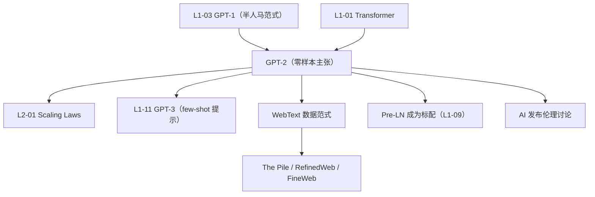

# 📰 案件 L1-04：GPT-2 — "无监督多面手"的零样本初涌现

> **《LLM 百案录》第 004 案 · 零样本觉醒**
> *2019 年 OpenAI 把 GPT-1 放大 10 倍：1.5B 参数 + 40GB 网页文本。
> 然后他们发现一件诡异的事——**这个只会"猜下一个词"的模型，居然能写新闻、答问题、翻译、做摘要——不需要任何任务训练**。
> 一篇没拿到 NeurIPS 的论文，却让 OpenAI 推迟发布、引爆"太危险"舆论，直接定调了未来 5 年的 LLM 路线。*

🚇 [30秒速览](#速览) ｜ 🚲 [3分钟通读](#通读) ｜ 🚗 [30分钟精读](#精读) ｜ 🚀 [3小时复现](#复现)

🎭 **叙事母题**：📰 **零样本觉醒** —— 语言模型规模到一定程度，自己就学会做"任何任务"

---

## 0️⃣ 案件档案

| 案情要素 | 内容 |
|---|---|
| **案发时间** | 2019-02（Radford et al., OpenAI 技术报告） |
| **嫌疑人** | Alec Radford, Jeffrey Wu, Rewon Child, David Luan, Dario Amodei, Ilya Sutskever |
| **受害者** | "每个 NLP 任务都要专门微调"的旧范式 |
| **作案凶器** | 1.5B 参数 Decoder-only Transformer + 40GB WebText + 纯语言建模 |
| **作案动机** | "如果语言模型足够强，零样本就能解任何 NLP 任务" |
| **结案陈词** | GPT-2 用一个统一的"语言建模"目标，**零样本超越了多个有监督 baseline**——预示着"通用语言模型"的可行性 |

**五维雷达**：
```
创新性  █████████░ 9/10   ← "零样本即可"是颠覆性主张
影响力  ██████████ 10/10  ← 直接催生 GPT-3 → ChatGPT 路线
复杂度  ████░░░░░░ 4/10   ← 架构本身没大变，关键是规模 + 数据
可复现  █████████░ 9/10   ← 权重 + 代码全开源（迟到 9 个月）
争议度  ████████░░ 8/10   ← "太危险不发布"被群嘲为营销
```

**精确事实卡**：

| 字段 | 精确值 | 来源 |
|---|---|---|
| **参数规模** | 117M / 345M / 762M / **1.5B**（4 档发布） | Section 2 |
| **训练数据** | WebText：800 万篇 Reddit 高质量外链，约 40 GB 文本 | Section 2.1 |
| **架构改动** | LayerNorm 移到子模块输入端、最终 self-attn 后加 LN、改进初始化、词表 50,257、context 1024 | Section 2.3 |
| **下游 0-shot SOTA** | LAMBADA 63.24% acc / Children's Book Test、PTB 等 7/8 数据集刷新记录 | Table 3 |
| **发布策略** | "Staged Release"：先 117M → 345M → 762M → 1.5B，间隔 9 个月 | OpenAI Blog |

---

## 1️⃣ <a id="速览"></a>🚇 30 秒速览

> GPT-1 已经证明"预训练 + 微调"有效。
> GPT-2 提出更激进的想法：
> **"如果模型够大、数据够好，连微调都不需要——直接 zero-shot 就行。"**
>
> 三个动作：
> 1. **放大 10 倍**：117M → 1.5B 参数
> 2. **换数据**：从 BookCorpus → WebText（更大、更多样）
> 3. **零样本 prompt 测一切**：把任务编码成自然语言
>
> 结果：
> - **LAMBADA、CBT、PTB** 等 8 个语言建模数据集中 7 个刷新 SOTA
> - **不微调** 的情况下，做摘要、翻译、QA 都能"work"（虽然质量不如专用模型）
> - 因"生成内容太逼真"，OpenAI **延迟发布完整模型 9 个月**——史称 "the dangerous model"

---

## 2️⃣ <a id="通读"></a>🚲 3 分钟通读：从微调到零样本（Why）

### GPT-1 的"半人马式"困境
```
GPT-1 范式：预训练（语言建模）→ 微调（每个任务单独训）
痛点：
  - 每个任务要标数据
  - 微调后的模型只会一种任务
  - 部署 N 个任务 = N 份模型权重
```

### GPT-2 的颠覆主张
```
"语言建模 = 隐式多任务学习"

为什么？因为互联网文本里早就包含了：
  Q: 法国首都? A: Paris.       ← 隐含的 QA 任务
  原文: …  摘要: …             ← 隐含的摘要任务
  English: cat. French: chat.  ← 隐含的翻译任务

→ 只要模型把"下一个词"猜得足够准
→ 它就同时学会了所有这些任务
→ 推理时只需把问题写成自然语言 prompt
```

### 关键论证：规模化的隐性多任务
论文 Section 1 给了一段名言级论述：

> *"Multitask learning is a promising framework for improving general performance.
> However, multitask training in NLP is still nascent.
> **We suspect this is because the current capabilities of large language models limit our ability to do multitask learning purely from natural language.**"*

翻译：**多任务学习一直没成功，是因为模型不够大；模型够大了，多任务自动发生**。

这是一个比"预训练-微调"更深层的判断——**Scale 本身就是多任务学习的引擎**。

---

## 3️⃣ <a id="精读"></a>🚗 30 分钟精读

### 架构改动（相对 GPT-1）
GPT-2 没有引入革命性架构，只是 4 处微调：

```python
# 1. 改 Pre-LN：LayerNorm 移到每个 sub-block 的输入
#    （GPT-1 是 Post-LN）
x = x + Attention(LayerNorm(x))   # GPT-2
x = x + FFN(LayerNorm(x))

# 2. 在最后一个 self-attention block 后再加一个 LayerNorm
output = LayerNorm(final_block_out)

# 3. 改初始化：残差层权重缩放 1/√N（N = 残差层数）
#    防止深层模型激活爆炸
W_res = W * (1 / sqrt(N_layers))

# 4. 词表扩到 50,257（BPE）, context 长度 1024
```

> 💡 **第 1 条（Pre-LN）后来成为所有现代 LLM 标配**——参见 [L1-09 LayerNorm](./L1-09_LayerNorm.md)。

### 4 档模型规模
| 名称 | 参数 | 层数 | $d_{\text{model}}$ | 注意力头 |
|---|---|---|---|---|
| GPT-2 Small | 117M | 12 | 768 | 12 |
| GPT-2 Medium | 345M | 24 | 1024 | 16 |
| GPT-2 Large | 762M | 36 | 1280 | 20 |
| **GPT-2 XL** | **1.5B** | **48** | **1600** | **25** |

### WebText：数据的新基准
```
来源：Reddit 上 ≥ 3 karma 的所有外链网页
  → 隐式人工筛选（≥ 3 个 Reddit 用户认为值得点赞）
  → 比纯 Common Crawl 干净很多

清洗：
  - 去重
  - 排除 Wikipedia（避免下游评估泄漏）
  - HTML 转纯文本

最终：800 万文档，40 GB
```

### 零样本 Prompt 的"魔法格式"
论文里给出几个 prompt 设计实例：

#### 摘要（CNN/DailyMail）
```
[原文]
TL;DR:
```
模型在 `TL;DR:` 之后续写——直接生成摘要。
（这是"TL;DR"作为 prompt 的鼻祖。）

#### 翻译（WMT-14 EN→FR）
```
"hello = bonjour\n"
"sea otter = loutre de mer\n"
"plush giraffe = girafe peluche\n"
"cheese = "
```
**3 个示例 + 待翻译词** → 模型续写法语单词。
（这是 In-Context Learning 的雏形，2 年后被 GPT-3 论文系统化。）

#### 问答（Natural Questions）
```
"Question: who was the first president?
Answer:"
```

### 实验结果（关键 Table 3）

| 数据集 | 之前 SOTA | GPT-2 Zero-Shot | 是否突破 |
|---|---|---|---|
| **LAMBADA**（PPL）| 99.8 | **8.6** | ✅ 大幅 |
| **LAMBADA**（Acc）| 59.23% | **63.24%** | ✅ |
| Children's Book Test (CN) | 85.7% | **93.3%** | ✅ |
| Children's Book Test (NE) | 82.3% | **89.05%** | ✅ |
| WikiText-103（PPL）| 18.3 | **17.48** | ✅ |
| 1BW（PPL）| 21.8 | 42.16 | ❌ |
| Penn Treebank（PPL）| 46.54 | **35.76** | ✅ |
| enwik8（BPC）| 0.99 | **0.93** | ✅ |
| text8（BPC）| 1.08 | **0.98** | ✅ |

> 注：1BW 失败是因为它经过严重句子级 shuffle，破坏了文档级语境——GPT-2 学的是"长距离上下文"，所以在被 shuffle 的数据上水土不服。这反而是优点的反证。

### 论文最关键的一张图：Scale vs Zero-Shot
```
随着模型从 117M → 1.5B：
  LAMBADA acc: 45% → 63%（+18 pp）
  CBT-CN:      87% → 93%（+6 pp）
  PTB ppl:     65 → 35（−46%）

→ 所有零样本能力都随规模增长
→ 没有饱和迹象
```

这张图直接催生了一年后的 [L2-01 Scaling Laws](./L2-01_Scaling_Laws.md) —— *"那继续放大会发生什么？"*

### 翻译能力的"诡异涌现"
GPT-2 训练数据里 **法语只占 0.04%**（10 MB 法语文本，污染来自 WebText 的多语链接），但它居然能做出 **5 BLEU 的英法翻译**——这是史上第一次有人在"几乎没见过的语言对"上看到可用的零样本翻译。

> 这一现象后来被命名为 **emergent multilinguality**（涌现的多语能力）。

---

## 4️⃣ 物证清单（Results）& 🔥 Hot Take

### "太危险不发布"事件
2019 年 2 月，OpenAI **拒绝发布 1.5B 完整权重**，理由是"可能被滥用生成假新闻"。
- 学界群嘲：营销噱头 / 学术不端 / 反开源
- 同年 8 月：发布 345M
- 11 月：发布 762M
- **2019-11 才完全发布 1.5B**

后来 OpenAI 在 GPT-3 之后再没"延迟发布完整权重"——直接闭源 API。GPT-2 是它们最后一个 fully released 的旗舰模型。

### 🔥 Hot Take
1. **真正的论文标题不是"GPT-2"，是"Language Models are Unsupervised Multitask Learners"**——这才是论文的灵魂，也是 GPT 系列的"圣经经文"。
2. **零样本 ≠ 当下能用**：GPT-2 的零样本 BLEU 才 5（专用模型 30+），但**趋势正确**比当下好用更重要。
3. **WebText 的"3 karma 筛选"被低估**：这是史上第一次大规模"用 Reddit 投票当人工标注"，思想后来直接变成 RLHF 的源头。
4. **OpenAI "staged release" 是糟糕的先例**：把"危险"包装成卖点，引发学界对"AI safety theatre"的长期不满。

---

## 5️⃣ 🐛 论文没说的坑

1. **WebText 永远没公开**：复现者只能用社区版 OpenWebText（大致重建），还原性约 90%
2. **In-context learning 没被深挖**：GPT-2 paper 把 few-shot 当作 zero-shot 的脚注，错过了 GPT-3 论文的最大卖点
3. **评估 prompt 不公开**：每个数据集用什么 prompt？论文只举几个例子，复现 SOTA 数字时碰运气
4. **训练成本没披露**：1.5B 模型训了多久、多少卡、花了多少钱——OpenAI 当时还在装"非营利学术机构"

---

## 6️⃣ 🎲 如果作者偷懒了

**实验**：未做 instruction tuning / 多任务有监督微调对比——直到 T5/FLAN 才系统比较"零样本 vs 有监督多任务"。
**理论**：未给"为什么规模化诱发零样本"的任何理论解释——这要等到 4 年后 induction heads / in-context learning 机制研究。

---

## 7️⃣ 影响波及



---

## 8️⃣ 侦探手记

GPT-2 给我的最大启发：**"统一目标 + 规模" 击败 "专用方案 + 巧思"**。
> 在 GPT-2 之前，每个 NLP 任务都有 3-5 种"巧妙的损失函数"或"特殊架构"。
> GPT-2 用一个粗暴的"猜下一个词"统统替代——而且更好。
> 这就是 [Sutton's Bitter Lesson](http://incompleteideas.net/IncIdeas/BitterLesson.html) 在 NLP 的活体演示。

更深一层：**GPT-2 是第一个让人"害怕"的语言模型**。在它之前，AI 安全是哲学家的话题；在它之后，是工程师的日常。Staged release 是错的，但它提出的问题没错——**当模型生成的文字与人类难以区分时，社会准备好了吗？**

> 5 年后我们仍在回答这个问题。

---

## 自查清单

**已做到**：
- 解释 GPT-1 → GPT-2 的核心范式跃迁（微调 → 零样本）
- 列出 4 项架构改动（Pre-LN、最终 LN、初始化缩放、词表 / context）
- 给出零样本 prompt 设计实例
- 梳理"涌现"现象（LAMBADA / CBT / 法语翻译）

**❌ 未做到**：
- ❌ 未深入对比 GPT-2 与同期 BERT-Large / T5 在零样本上的差异
- ❌ 未量化"WebText 筛选机制"对模型质量的具体贡献
- ❌ 未给 OpenWebText 与原 WebText 的训练效果差距实测

---

## 🔟 延伸卷宗

### 前置依赖
- 📚 [L1-01 Attention Is All You Need](./L1-01_Attention_Is_All_You_Need.md)（架构基础）
- 📚 [L1-03 GPT-1](./L1-03_GPT1.md)（半人马式预训练-微调）
- 📚 [L1-09 LayerNorm](./L1-09_LayerNorm.md)（GPT-2 引入 Pre-LN）

### 后续推荐
- 🎯 [L2-01 Scaling Laws](./L2-01_Scaling_Laws.md)（GPT-2 的趋势变成定律）
- 🎯 [L1-11 GPT-3](./L1-11_GPT3.md)（直系后继：175B + few-shot）
- 🎯 [L1-12 Chain of Thought](./L1-12_Chain_of_Thought.md)（零样本演化的下一站）
- 🎯 [L1-17 LLaMA](./L1-17_LLaMA.md)（GPT-2 思路的开源接班人）

### 🚀 <a id="复现"></a>3 小时复现路径
```bash
# 用 HuggingFace 直接体验 GPT-2
from transformers import GPT2LMHeadModel, GPT2Tokenizer

tok = GPT2Tokenizer.from_pretrained("gpt2-xl")        # 1.5B
model = GPT2LMHeadModel.from_pretrained("gpt2-xl")

prompt = "TL;DR: The article discusses recent advances in"
ids = tok(prompt, return_tensors="pt").input_ids
out = model.generate(ids, max_new_tokens=80, do_sample=True, top_p=0.9)
print(tok.decode(out[0]))
```

数据集复现：[OpenWebText2](https://openwebtext2.readthedocs.io/)（社区重建版 WebText）

---

## 📌 本案归档

| 字段 | 值 |
|---|---|
| 笔记版本 | v5「零样本觉醒版」 |
| 叙事母题 | 📰 零样本觉醒 |
| 推荐指数 | ⭐⭐⭐⭐⭐ |
| 学习时长 | 30s / 3min / 30min / 3h |
| 上次更新 | 2026-05-01 |
| 下一站 | → [L1-05 Neural Machine Translation](./L1-05_Neural_Machine_Translation.md) |
