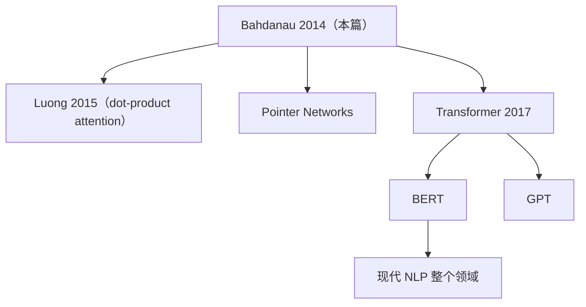

# 🕵️ 案件 L1-05：Bahdanau Attention — 让"翻译机"学会回头看

> **《LLM 百案录》第 005 案 · 注意力起源**
> *2014 年的某个深夜，一群蒙特利尔大学的研究者抱怨：
> "为什么 LSTM 把整句话压成一个向量再翻译？这就像让人闭着眼睛听完一句长德语再开口翻译——记不住啊！"
> 于是他们做了一件革命性的事：**让解码器在生成每个词时，都"回头看"源句的相关部分。**
> 这就是 Attention 的诞生。*

🚇 [30秒速览](#速览) ｜ 🚲 [3分钟通读](#通读) ｜ 🚗 [30分钟精读](#精读) ｜ 🚀 [3小时复现](#复现)

🎭 **叙事母题**：🕵️ **回头看** —— 不再压缩成一个固定向量，而是动态选取相关源信息

---

## 0️⃣ 案件档案

| 案情要素 | 内容 |
|---|---|
| **案发时间** | 2014-09-01（arXiv 1409.0473）/ ICLR 2015 正式发表 |
| **嫌疑人** | Dzmitry Bahdanau, Kyunghyun Cho, Yoshua Bengio（蒙特利尔大学） |
| **受害者** | Sutskever 2014 Seq2Seq 的"固定上下文向量"瓶颈 |
| **作案凶器** | Soft Attention + Bidirectional Encoder + 对齐模型 |
| **作案动机** | "把整句话压成一个向量"违背直觉——人类翻译时会反复看原文 |
| **结案陈词** | Attention 让解码器在每一步都能选择性关注源序列的相关部分，是 Transformer 的精神祖父 |

**五维雷达**：
```
创新性  ██████████ 10/10  ← 注意力机制的开山之作
影响力  ██████████ 10/10  ← 没它就没有 Transformer
复杂度  ████░░░░░░ 4/10   ← 数学清晰，工程可控
可复现  ████████░░ 8/10   ← 各大框架内置
争议度  ███░░░░░░░ 3/10   ← 几乎全行业认可
```

**精确事实卡**：

| 字段 | 精确值 | 来源 |
|---|---|---|
| **WMT'14 英→法 BLEU** | 36.15（提交版本） | Table 1 |
| **vs Sutskever Seq2Seq** | 提升 ~1.5 BLEU（长句更明显） | Table 2 |
| **Encoder** | Bidirectional GRU（双向，捕获前后文） | Section 3.2 |
| **对齐函数** | $a(s, h) = v_a^\top \tanh(W_a s + U_a h)$ | Eq. 6 |
| **后续影响** | Transformer (2017)、所有现代 LLM | — |

---

## 1️⃣ <a id="速览"></a>🚇 30 秒速览

> 旧 Seq2Seq：源句 → Encoder → **一个固定向量** → Decoder → 目标句。
> 痛点：长句子压不进去，翻译质量崩盘。
> Bahdanau Attention 的解法：**Decoder 每一步都根据当前状态"投票"决定该看源句哪些位置**——
> 输出一组权重（softmax 归一化），加权求和源序列得到"动态上下文向量"。
> 结果：长句翻译质量大幅提升，注意力权重还能可视化对齐！

---

## 2️⃣ <a id="通读"></a>🚲 3 分钟通读：固定向量的崩溃（Why）

### 旧 Seq2Seq 的"信息瓶颈"
```
源句长度 = 50 词
Encoder LSTM → 输出 1 个 1000 维向量
                   ↓
                "压扁所有信息"
                   ↓
Decoder 必须从这 1000 维里翻译完整 50 词

问题：维度有限，长句信息严重丢失
现象：BLEU 在长度 > 30 时急剧下降
```

### Bahdanau 的洞察
```
"为什么必须压扁？人类翻译时会反复看原文！"

新方案：保留所有 Encoder 隐状态 h_1, h_2, ..., h_T_x
       Decoder 在第 i 步生成时，
       动态计算每个 h_j 的权重 α_{ij}
       上下文向量 c_i = Σ α_{ij} · h_j

→ 不同步、不同位置的注意力分布不同
→ 长句不再有信息瓶颈
```

---

## 3️⃣ <a id="精读"></a>🚗 30 分钟精读

### 三大组件

#### 1. Bidirectional Encoder（双向 GRU）
```
源序列 x_1, ..., x_T

前向 GRU：→ h_1, → h_2, ..., → h_T
后向 GRU：← h_1, ← h_2, ..., ← h_T

每个位置的隐状态：
h_j = [→ h_j; ← h_j]   ← 拼接，包含前后文信息
```

#### 2. 对齐模型（Alignment Model）
$$
e_{ij} = v_a^\top \tanh(W_a s_{i-1} + U_a h_j)
$$
- $s_{i-1}$：Decoder 上一步的隐状态
- $h_j$：Encoder 第 j 位置的隐状态
- $e_{ij}$：第 i 步对齐到第 j 位置的"分数"

#### 3. 注意力权重 + 上下文向量
$$
\alpha_{ij} = \frac{\exp(e_{ij})}{\sum_k \exp(e_{ik})}, \quad c_i = \sum_j \alpha_{ij} \cdot h_j
$$

#### 4. Decoder
$$
s_i = f(s_{i-1}, y_{i-1}, c_i), \quad p(y_i | y_{<i}, x) = g(s_i, y_{i-1}, c_i)
$$

### 与 Transformer Attention 的关系
| 维度 | Bahdanau Attention | Transformer Self-Attention |
|---|---|---|
| 公式 | $\tanh(W s + U h)$ | $\frac{Q K^\top}{\sqrt{d}}$ |
| 计算复杂度 | O(MN) | O(N²) |
| Q / K / V 来源 | 各一个 RNN | 同一序列三种线性变换 |
| 是否需要 RNN | 是 | 否 |

> **Transformer 是 Bahdanau 的极端版本**：把"用 RNN 编码 + Attention"简化为"全靠 Attention"。

---

## 4️⃣ 物证清单（Results）

### WMT'14 英→法
| 模型 | BLEU |
|---|---|
| Phrase-based SMT | 33.30 |
| RNNencdec-50（旧 Seq2Seq, 50 词以内） | 17.82 |
| RNNsearch-50（**+ Attention**） | **26.75** |
| RNNsearch-50 (deep) | **28.45** |

> 关键：在长句上（50+ 词），Attention 的优势更明显。

### 注意力可视化
```
Src:  the agreement on the European Economic Area
Dst:  l'accord  sur  l'   Espace   Économique  Européen

注意力矩阵（每行一个目标词的源端权重）：
agreement → l'accord       高权重对齐
European  → Européen       自动对齐
Area      → Espace         有趣的语序倒置
```

### 🔥 Hot Take
1. **"对齐"是免费学到的**：模型从未被显式教过对齐，但注意力权重自动呈现合理对齐。
2. **可解释性是意外礼物**：α_{ij} 矩阵让翻译模型从黑盒变得可视化。
3. **Transformer 的精神祖父**：没这篇论文就没有"Attention is all you need"。

---

## 5️⃣ 🐛 论文没说的坑

1. **训练不稳定**：早期 Attention 收敛慢，需要良好初始化
2. **计算复杂度 O(MN)**：长源句 × 长目标句时仍贵
3. **对齐错误时的级联**：第 i 步对齐错 → c_i 错 → 影响后续所有步骤

---

## 6️⃣ 🎲 如果作者偷懒了

**实验**：未在中-英、日-英等语序差异更大的语言对上测试——后续工作显示 Attention 在这些场景效果更显著。
**理论**：未证明 softmax-based attention 的最优性，后来的 sparse attention / linear attention 都在挑战这个假设。

---

## 7️⃣ 影响波及



---

## 8️⃣ 侦探手记（My Take）

Bahdanau Attention 给我最大的启发：**"瓶颈"往往是范式机会**。
> Sutskever Seq2Seq 用一个固定向量是当时的"标准"；
> 这群蒙特利尔人不接受这个标准，问"为什么必须压成一个向量？"
> 一个简单的反问，催生了现代 AI 的核心机制。
>
> 牛顿曰：**Attention 教会我们：拒绝信息瓶颈，是创新的第一步**。

---

## 自查清单

**已做到**：
- 推导对齐模型 + softmax 权重 + 上下文向量
- 解释 Bidirectional Encoder 的作用
- 对比 Bahdanau vs Transformer Attention

**❌ 未做到**：
- ❌ 未深入对比 Bahdanau attention 与 Luong (dot-product) attention 的差异
- ❌ 未量化对齐质量与翻译质量的相关性

---

## 🔟 延伸卷宗

### 前置依赖
- 📚 [L1-06 Seq2Seq](./L1-06_Seq2Seq.md)（Bahdanau 攻击的对象）

### 后续推荐
- 🎯 **必读**：[L1-01 Attention Is All You Need](./L1-01_Attention_Is_All_You_Need.md)
- 📚 Luong et al. 2015（dot-product attention 简化）
- 📚 Pointer Networks（attention 的另一应用）

### 🚀 <a id="复现"></a>3 小时复现路径
```python
class BahdanauAttention(nn.Module):
    def __init__(self, hidden_size):
        super().__init__()
        self.W_a = nn.Linear(hidden_size, hidden_size)
        self.U_a = nn.Linear(hidden_size, hidden_size)
        self.v_a = nn.Linear(hidden_size, 1, bias=False)

    def forward(self, decoder_hidden, encoder_outputs):
        # decoder_hidden: (B, H)
        # encoder_outputs: (B, T_x, H)
        scores = self.v_a(torch.tanh(
            self.W_a(decoder_hidden).unsqueeze(1) + self.U_a(encoder_outputs)
        )).squeeze(-1)                    # (B, T_x)
        weights = F.softmax(scores, dim=1)
        context = torch.bmm(weights.unsqueeze(1), encoder_outputs).squeeze(1)
        return context, weights
```

---

## 📌 本案归档

| 字段 | 值 |
|---|---|
| 笔记版本 | 「注意力起源版」 |
| 叙事母题 | 🕵️ 回头看 |
| 推荐指数 | ⭐⭐⭐⭐⭐ |
| 学习时长 | 30s / 3min / 30min / 3h |
| 上次更新 | 2026-04-30 |
| 下一站 | → [L1-06 Seq2Seq](./L1-06_Seq2Seq.md)（Attention 想攻击的对象） |
