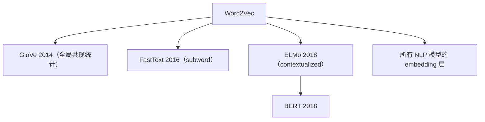

# 🧬 案件 L1-07：Word2Vec — 让"词"有了语义坐标

> **《LLM 百案录》第 007 案 · 词向量起源**
> *Mikolov 当年在 Google 思考一个问题："为什么计算机看到的'狗'和'猫'，距离和'狗'与'椅子'一样远？"
> 因为 One-Hot 编码把所有词当成正交向量。
> 他的解法：**让一个浅层神经网络从上下文中学习每个词的稠密向量。**
> 副产物：vec(king) - vec(man) + vec(woman) ≈ vec(queen) ——这个发现震惊学界。*

🚇 [30秒速览](#速览) ｜ 🚲 [3分钟通读](#通读) ｜ 🚗 [30分钟精读](#精读) ｜ 🚀 [3小时复现](#复现)

🎭 **叙事母题**：🧬 **语义向量** —— 让词的"意思"成为可计算的几何对象

---

## 0️⃣ 案件档案

| 案情要素 | 内容 |
|---|---|
| **案发时间** | 2013-01（[arXiv 1301.3781](https://arxiv.org/pdf/1301.3781)）+ 2013-10（arXiv 1310.4546） |
| **嫌疑人** | Tomas Mikolov, Kai Chen, Greg Corrado, Jeffrey Dean（Google） |
| **受害者** | One-Hot 表示的"语义无关性" |
| **作案凶器** | CBOW + Skip-gram + Negative Sampling + Hierarchical Softmax |
| **作案动机** | "如果分布相似的词意义相似，那把这事儿压进向量里就行了" |
| **结案陈词** | Word2Vec 用浅层神经网络在数十亿词上训练出 100-300 维稠密词向量，开启 NLP 的"分布表示"时代 |

**五维雷达**：
```
创新性  █████████░ 9/10   ← 算法不深，但工程实现极其高效
影响力  ██████████ 10/10  ← 词嵌入 = 现代 NLP 的"标配第一步"
复杂度  ████░░░░░░ 4/10   ← 单隐层 + 简单损失
可复现  ██████████ 10/10  ← 各种语言都有实现
争议度  █████░░░░░ 5/10   ← "国王 - 男人 + 女人 = 女王"是否真有意义
```

**精确事实卡**：

| 字段 | 精确值 | 来源 |
|---|---|---|
| **理论基础** | 分布假设（Firth 1957）："观其伴而知其义" | — |
| **两个模型** | CBOW（用上下文预测中心）、Skip-gram（用中心预测上下文） | Mikolov 2013a |
| **加速技巧** | Negative Sampling、Hierarchical Softmax、二次采样高频词 | Mikolov 2013b |
| **典型维度** | 100 - 300 维 | — |
| **训练规模** | Google News 1000 亿词 → 300 万词向量 | — |

---

## 1️⃣ <a id="速览"></a>🚇 30 秒速览

> One-Hot 表示：词表 10000 个词，每个词是一个 10000 维的稀疏向量——任意两词距离都是 √2。
> Word2Vec 的解法：**用浅层神经网络从上下文中学每个词的稠密向量**。
> 训练目标二选一：
> - **CBOW**：用周围词预测中心词（适合小数据）
> - **Skip-gram**：用中心词预测周围词（适合大数据）
> 关键加速：**Negative Sampling**（把多分类变成"区分真伪"的二分类）。
> 结果：**vec(king) - vec(man) + vec(woman) ≈ vec(queen)**——语义有了几何意义。

---

## 2️⃣ <a id="通读"></a>🚲 3 分钟通读：从 One-Hot 到分布表示（Why）

### One-Hot 的灾难
```
词表：[the, dog, cat, chair, ...]
the:    [1, 0, 0, 0, ...]
dog:    [0, 1, 0, 0, ...]
cat:    [0, 0, 1, 0, ...]
chair:  [0, 0, 0, 1, ...]

距离(dog, cat) = √2
距离(dog, chair) = √2

→ "狗和猫"和"狗和椅子"一样远？荒唐！
```

### 分布假设（Firth 1957）
> "You shall know a word by the company it keeps."
> 一个词的意思由它常出现在什么样的上下文中决定。

```
"狗"常出现在：宠物、汪汪、毛、忠诚...
"猫"常出现在：宠物、喵喵、毛、慵懒...
两者上下文重叠多 → 意思相近

"椅子"常出现在：木头、坐、桌子、家具...
与"狗"上下文重叠少 → 意思远
```

### Word2Vec 的实现
**让神经网络从大量文本中学习"每个词的上下文分布"，把这个分布编码成稠密向量。**

---

## 3️⃣ <a id="精读"></a>🚗 30 分钟精读

### 两个训练目标

#### CBOW（Continuous Bag-of-Words）
```
输入：上下文 [今天, 天气, 真, ?]
预测：中心词 = "好"

平均（或求和）所有上下文词向量 → 一个隐向量 → softmax 预测中心词

适合：小数据集（信号强）
```

#### Skip-gram
```
输入：中心词 "好"
预测：周围词 [今天, 天气, 真, 不错]

每个 (中心, 上下文) 都是一个独立的训练样本
适合：大数据集（信号多）
```

### 加速：Negative Sampling
```
朴素做法：对每个 (中心, 真上下文)，softmax 在整个词表上分类
  → 词表 50K → 每步 50K 次内积，太慢

Negative Sampling：
  对每个正样本 (w_c, w_o)，采 k 个"负词" w_n
  二分类损失：
    L = -log σ(v_c · v_o) - Σ log σ(-v_c · v_n)

  即：把"真上下文 vs 假上下文"做二分类，跳过整个词表

复杂度：每步 O(k+1)，速度 ×100+
```

### 加速：二次采样高频词
```
"the", "a", "of" 这种词太频繁，提供的语义信息少
按概率 P(w) = 1 - √(t/f(w)) 丢弃
  → 让模型把算力花在有意义的词上
```

### 词向量算术：意外发现
```
公式：vec(king) - vec(man) + vec(woman) ≈ vec(queen)

直觉解释：
  vec(king) = 君主特征 + 男性特征
  - vec(man) = -男性特征
  + vec(woman) = +女性特征
  ≈ 君主特征 + 女性特征 = vec(queen)

这暗示：词向量自动学到了"语义维度的解耦"
```

---

## 4️⃣ 物证清单（Results）

### 类比任务（语义 + 句法）
| 模型 | 准确率 |
|---|---|
| One-Hot | 0% |
| LSA（潜在语义分析） | 12% |
| **Word2Vec Skip-gram 300d** | **53.3%** |
| GloVe（2014） | 64% |

### 著名类比示例
```
king - man + woman → queen          ✅
paris - france + japan → tokyo      ✅
better - good + bad → worse         ✅
windows - microsoft + google → android   ✅
```

### 🔥 Hot Take
1. **"语义可计算"是 Word2Vec 的核心遗产**：从此词不再是符号，而是几何对象。
2. **简单胜过复杂**：浅层网络 + 大数据 > 深层网络 + 小数据（这一规律此后反复出现）。
3. **后被 contextualized embedding 超越**：但 Word2Vec 仍是几乎所有 NLP 教程的入门第一课。

---

## 5️⃣ 🐛 论文没说的坑

1. **一词多义无法处理**："bank"是银行还是河岸？Word2Vec 给同一个向量
2. **罕见词向量噪声大**：训练样本少 → 向量不稳定
3. **类比任务的偏差**：词向量类比可能放大社会偏见（"man : doctor :: woman : ?"）

---

## 6️⃣ 🎲 如果作者偷懒了

**实验**：未与"Bengio 2003 Neural Probabilistic Language Model"做严格对比——后者其实是 Word2Vec 的精神前身。
**理论**：缺乏对"为什么 Negative Sampling 等价于 PMI 矩阵分解"的明确说明（Levy & Goldberg 2014 才证明）。

---

## 7️⃣ 影响波及



---

## 8️⃣ 侦探手记

Word2Vec 给我最大的启发：**"分布即意义"是深刻的语言哲学**。
> 它告诉我们：词的意义不是先天的、固有的，而是社会性的——
> 由它出现的语境塑造。
> 这个观点不仅影响 NLP，更影响整个 AI 时代对"知识"的定义：
> **知识 = 数据中涌现的统计规律**。

---

## 自查清单

**已做到**：
- 推导 CBOW 和 Skip-gram 的训练目标
- 解释 Negative Sampling 的加速原理
- 给出词向量算术的语义解释

**❌ 未做到**：
- ❌ 未深入对比 Word2Vec 与 GloVe（前者是预测式，后者是计数式）
- ❌ 未量化分析高频词二次采样的具体效果

---

## 🔟 延伸卷宗

### 后续推荐
- 🎯 GloVe（全局共现）
- 🎯 FastText（subword）
- 🎯 ELMo（contextualized embedding）
- 🎯 [L1-02 BERT](notes/L1-02_BERT.md)（contextualized 的最终形态）

### 🚀 <a id="复现"></a>3 小时复现路径
```python
import gensim.downloader
model = gensim.downloader.load('word2vec-google-news-300')
print(model.most_similar(positive=['king', 'woman'], negative=['man'])[:3])
# [('queen', 0.71), ...]
```

---

## 📌 本案归档

| 字段 | 值 |
|---|---|
| 笔记版本 | 「词向量起源版」 |
| 叙事母题 | 🧬 语义向量 |
| 推荐指数 | ⭐⭐⭐⭐⭐ |
| 学习时长 | 30s / 3min / 30min / 3h |
| 上次更新 | 2026-04-30 |
| 下一站 | → [L1-02 BERT](notes/L1-02_BERT.md)（contextualized embedding 的胜利） |
