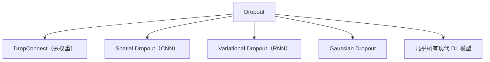

# 🎲 案件 L1-08：Dropout — 用"随机罢工"驯服过拟合

> **《LLM 百案录》第 008 案 · 随机抗过拟合**
> *Hinton 当年观察到：神经网络容易"死记硬背"训练数据，泛化差。
> 他想到一个反直觉的解法：**训练时随机让一半神经元"停工"。**
> 听起来像在破坏模型，但实际上让模型变得更鲁棒——
> 这是一个奖励"冗余"而非"专精"的机制。*

🚇 [30秒速览](#速览) ｜ 🚲 [3分钟通读](#通读) ｜ 🚗 [30分钟精读](#精读) ｜ 🚀 [3小时复现](#复现)

🎭 **叙事母题**：🎲 **随机抗过拟合** —— 训练时让神经元随机失活，逼出冗余与鲁棒

---

## 0️⃣ 案件档案

| 案情要素 | 内容 |
|---|---|
| **案发时间** | 2012（Hinton et al., [arXiv 1207.0580](https://arxiv.org/pdf/1207.0580)）+ 2014（Srivastava et al., JMLR 正式版） |
| **嫌疑人** | Hinton, Srivastava, Krizhevsky, Sutskever, Salakhutdinov（多伦多大学） |
| **受害者** | 深度网络的过拟合 + 集成学习的高昂训练成本 |
| **作案凶器** | 训练时以概率 p 随机置零神经元输出 |
| **作案动机** | "如果训练时强制让神经元间不依赖，就能学到更鲁棒的特征" |
| **结案陈词** | Dropout 是廉价的近似集成学习——同一个网络相当于训练了 2^N 个共享参数的子网络 |

**五维雷达**：
```
创新性  █████████░ 9/10   ← 简单 idea，深刻直觉
影响力  ██████████ 10/10  ← 几乎所有 DL 模型都用过
复杂度  ███░░░░░░░ 3/10   ← 几行代码搞定
可复现  ██████████ 10/10  ← 框架内置
争议度  ████░░░░░░ 4/10   ← BatchNorm 出现后曾有"该不该用"的讨论
```

**精确事实卡**：

| 字段 | 精确值 | 来源 |
|---|---|---|
| **训练时** | 每个神经元以概率 p 被置零，剩余按 1/(1-p) 缩放（Inverted Dropout） | Section 4 |
| **测试时** | 不 dropout，使用全部神经元 | Section 4 |
| **典型 p** | 隐藏层 0.5、输入层 0.2 | Section 5 |
| **MNIST 提升** | 1.6% → 1.05% 错误率 | Table 2 |

---

## 1️⃣ <a id="速览"></a>🚇 30 秒速览

> 神经网络容易"协同适应"——某些神经元只在和特定其他神经元配合时才有用。
> 这种"小团体"在训练集上有效，到测试集就失灵。
> Dropout 的解法：**训练时每个神经元都有 p 的概率被随机置零**——
> 没人能依赖任何具体的"队友"，必须学会单独有用、组合也有用。
> 等价：训练 2^N 个共享参数的子网络，测试时它们集成。
> 结果：MNIST 错误率从 1.6% → 1.05%，CIFAR-10、ImageNet 都显著提升。

---

## 2️⃣ <a id="通读"></a>🚲 3 分钟通读：从过拟合到 Dropout（Why）

### 过拟合的机理：协同适应
```
没有 Dropout 时：
  神经元 A 学到了 feature1
  神经元 B 学到了 feature2
  神经元 C 学到了"如果 A 和 B 都触发，则输出 X"

  → C 高度依赖 A、B 的"组合"
  → 训练集的某个特殊组合让 C 完美工作
  → 但测试集稍变，A、B 触发模式变了 → C 失灵
```

### 集成学习的灵感
```
Bagging：训练 K 个模型，预测时投票
  → 显著提升泛化
  → 但训练 K 个深度网络成本巨大

Dropout 的洞察：
  在一个网络里同时"训练"很多子网络
  每个 mini-batch 随机选一个子网络训练
  推理时让所有子网络"共同投票"
```

### 为什么 Inverted Dropout
```
朴素做法：训练时随机置零，测试时所有神经元都激活
  → 测试时输出期望值变大（多了 1-p 倍）
  → 需要额外缩放

Inverted Dropout：训练时随机置零并按 1/(1-p) 缩放
  → 训练和测试的输出期望相同
  → 测试时无需任何修改（更工程友好）
```

---

## 3️⃣ <a id="精读"></a>🚗 30 分钟精读

### 训练 vs 推理
```python
def dropout(x, p, training):
    if training:
        mask = (torch.rand_like(x) > p).float()
        return x * mask / (1 - p)         # Inverted Dropout
    else:
        return x                          # 推理：全保留
```

### 集成学习的等价性
$$
\mathbb{E}_{\text{mask}}[f(x; \mathbf{m})] \approx f(x; \mathbb{E}[\mathbf{m}])
$$
- 左：所有子网络的预测平均
- 右：使用全部神经元（缩放后）的单次预测
- Dropout 让两者近似相等

> 这意味着推理时一次前向 ≈ 2^N 个子网络的集成预测。

### 经验法则
| 层 | 推荐 p |
|---|---|
| 输入层 | 0.2 |
| 隐藏层 | 0.5 |
| 输出层 | 0（不要） |

### 与其他正则化的关系
```
L2 正则化：限制权重大小（"压制能力"）
Dropout：增加冗余（"压制依赖"）

L2 + Dropout 通常叠加用，互不冲突。
```

### Dropout 与 BatchNorm 的微妙关系
```
现象：Dropout + BN 一起用时，方差偏移
解决：
  - 在 BN 之后用 Dropout，不要在之前
  - 或用 LayerNorm 代替 BN（Transformer 选择）
```

---

## 4️⃣ 物证清单（Results）

### MNIST
| 模型 | 错误率 |
|---|---|
| MLP 无正则化 | 1.6% |
| MLP + L2 | 1.4% |
| **MLP + Dropout (p=0.5)** | **1.05%** |
| Dropout + L2 | 1.0% |

### CIFAR-10
| 模型 | 错误率 |
|---|---|
| Plain CNN | 15.3% |
| + BatchNorm | 11.5% |
| + Dropout | 12.8% |
| **BN + Dropout** | **9.1%** |

### 🔥 Hot Take
1. **简单到爆但极有效**：3 行代码（mask, scale, return）改变了深度学习。
2. **集成学习的"廉价版"**：理论上做到了 2^N 模型集成的效果。
3. **Transformer 时代仍在用**：但通常 p=0.1 而非 0.5——大模型本身就有正则化效果。

---

## 5️⃣ 🐛 论文没说的坑

1. **训练慢**：每个 mini-batch 只更新一部分神经元，等效梯度噪声大
2. **某些任务有害**：GAN 的判别器、批量很小时
3. **RNN 用法特殊**：标准 Dropout 在每个时间步独立丢弃 → 噪声累积，需要 Variational Dropout

---

## 6️⃣ 🎲 如果作者偷懒了

**实验**：早期论文未充分对比 Dropout 与 Bagging 的等价性的实验验证。
**理论**：缺乏 Dropout 在非线性网络中的严格理论分析（Wager 2013 等后续工作补充了部分）。

---

## 7️⃣ 影响波及



---

## 8️⃣ 侦探手记

Dropout 给我的启发：**有时候"添乱"是为了"更稳"**。
> 完美的训练环境会培养出脆弱的网络；
> 适度的随机扰动反而让模型学会鲁棒特征。
> 这条原则后来在很多地方反复出现：data augmentation、weight noise、SAM（Sharpness-Aware Minimization）……
> Dropout 是这一思想的开山之作。

---

## 自查清单

**已做到**：
- 推导 Inverted Dropout 的缩放公式
- 解释"协同适应"与集成学习的等价
- 给出经验法则与典型应用

**❌ 未做到**：
- ❌ 未深入对比 DropConnect / Variational Dropout 的差异
- ❌ 未涉及 Dropout 在大模型时代的微妙退化（小 p、特定层）

---

## 🔟 延伸卷宗

### 后续推荐
- 🎯 BatchNorm（2015，互补的正则化）
- 🎯 [L1-09 LayerNorm](notes/L1-09_LayerNorm.md)（Transformer 时代的归一化）
- 🎯 Variational Dropout（用于 RNN）
- 🎯 [L1-01 Attention Is All You Need](notes/L1-01_Attention_Is_All_You_Need.md)（Transformer 中 dropout 的位置）

### 🚀 <a id="复现"></a>3 小时复现路径
```python
class MLP(nn.Module):
    def __init__(self):
        super().__init__()
        self.fc1 = nn.Linear(784, 1024)
        self.dropout = nn.Dropout(0.5)
        self.fc2 = nn.Linear(1024, 10)

    def forward(self, x):
        x = F.relu(self.fc1(x))
        x = self.dropout(x)        # PyTorch 自动判断 train/eval
        return self.fc2(x)
```

---

## 📌 本案归档

| 字段 | 值 |
|---|---|
| 笔记版本 | 「随机抗过拟合版」 |
| 叙事母题 | 🎲 随机抗过拟合 |
| 推荐指数 | ⭐⭐⭐⭐⭐ |
| 学习时长 | 30s / 3min / 30min / 3h |
| 上次更新 | 2026-04-30 |
| 下一站 | → [L1-09 LayerNorm](notes/L1-09_LayerNorm.md)（另一种正则化思想） |
