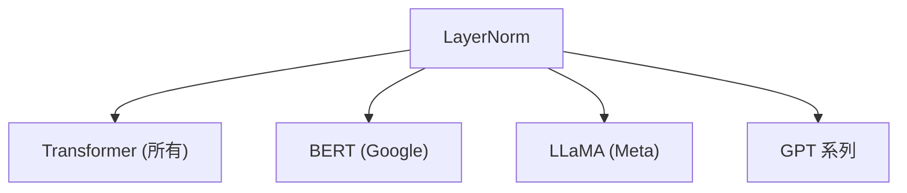

# 🔗 案件 L1-09：LayerNorm — 神经网络的"度量衡统一"

> **《LLM 百案录》第 009 案 · 度量衡**
> *没有 LayerNorm，神经网络就是"各自为政"——
> 有了 LayerNorm，才有"统一度量衡"，信息才能稳定传递。*

🚇 [30秒速览](#速览) ｜ 🚲 [3分钟通读](#通读) ｜ 🚗 [30分钟精读](#精读) ｜ 🚀 [3小时复现](#复现)

🎭 **叙事母题**：🔗 **度量衡统一** —— 建立秩序，让信息传递保真

---

## 0️⃣ 案件档案

| 案情要素 | 内容 |
|---|---|
| **案发时间** | 2016（Ba et al., arXiv 1607.06450） |
| **受害者** | Internal Covariate Shift——每层输入分布变化导致训练困难 |
| **作案凶器** | 对每个样本的每个位置独立标准化 |
| **结案陈词** | LayerNorm 建立了统一的度量衡，让训练更稳定 |

**五维雷达**：
```
创新性  ███████░░░ 7/10   ← 针对 RNN 提出，但被 Transformer 采用
影响力  ██████████ 10/10  ← Transformer 的标配
复杂度  ██░░░░░░░░ 2/10   ← 公式极简，一行代码
可复现  ██████████ 10/10  ← 开源，完全可复现
争议度  ██░░░░░░░░ 2/10   ← 没有争议，工业界全面采用
```

**精确事实卡**：

| 字段 | 精确值 | 来源 |
|---|---|---|
| **arXiv ID** | 1607.06450 | — |
| **核心公式** | γ × (x - mean) / std + β | Section 2 |
| **计算维度** | 对每个样本的 d_model 维度 | Section 2 |
| **Pre-Norm** | x = LayerNorm(x + sublayer(x)) | LLaMA 采用 |
| **Post-Norm** | x = x + sublayer(LayerNorm(x)) | Transformer 原版 |
| **代表模型** | LLaMA、GPT、BERT、所有 Transformer | — |

---

## 1️⃣ <a id="速览"></a>🚇 30 秒速览

> Internal Covariate Shift 的问题：每层输入的分布都在变化，底层的变化逐层放大，导致训练困难。
> 解决方案：**对每个样本的每个位置，独立标准化到均值 0、方差 1。**
> 类比：中国古代各诸侯国用自己的度量衡——交易混乱；统一度量衡后——信息传递保真。
> 结果：**训练稳定，收敛更快，成为 Transformer 的标配。**

---

## 2️⃣ <a id="通读"></a>🚲 3 分钟通读：为什么需要"统一度量衡"（Why）

### 📏 度量衡混乱的危害

```
神经网络的问题：

第 1 层：输出均值=5, 方差=2
第 2 层：输入均值=??, 方差=??
第 3 层：输入均值=???, 方差=???
...层层变化，难以训练

就像：
- 中国古代各诸侯国用自己的度量衡
- 齐国的 1 尺 = 楚国的 1.2 尺
- 交易混乱，难以协调！
```

### 🔄 LayerNorm 的"统一度量衡"

```
LayerNorm 的解决方案：

对每个样本、每个位置：
→ 计算均值
→ 计算方差
→ 标准化

结果：
→ 每层输出都在同一尺度
→ 信息流动更稳定
→ 梯度更平稳
```

---

## 3️⃣ <a id="精读"></a>🚗 30 分钟精读

### 🔑 核心证据 1：LayerNorm 的计算

```python
# LayerNorm 的计算

class LayerNorm(nn.Module):
    def __init__(self, d_model, eps=1e-6):
        super().__init__()
        self.gamma = nn.Parameter(torch.ones(d_model))  # 缩放
        self.beta = nn.Parameter(torch.zeros(d_model))   # 偏移
        self.eps = eps
    
    def forward(self, x):
        # x: [batch, seq, d_model]
        
        # 对 d_model 维度计算均值和方差
        mean = x.mean(dim=-1, keepdim=True)  # [batch, seq, 1]
        var = x.var(dim=-1, keepdim=True)    # [batch, seq, 1]
        std = torch.sqrt(var + self.eps)
        
        # 标准化
        normalized = (x - mean) / std
        
        # 仿射变换（可学习的缩放和偏移）
        return self.gamma * normalized + self.beta
```

### 🔑 核心证据 2：Pre-Norm vs Post-Norm

```
Transformer 原版使用 Post-Norm：
x = x + sublayer(LayerNorm(x))

现代 Transformer（如 LLaMA）使用 Pre-Norm：
x = x + sublayer(LayerNorm(x))

Pre-Norm 的优势：
→ 训练更稳定
→ 梯度直接传播到残差路径
→ 缓解了深层 Transformer 的训练困难
```

### 🔑 核心证据 3：LayerNorm vs BatchNorm

```
BatchNorm：对 batch 维度标准化
→ 适合 CV 任务（batch 通常较大）
→ NLP 任务中序列长度可变，不友好

LayerNorm：对 feature 维度标准化
→ 适合 NLP 任务（batch 通常较小）
→ 序列长度可变也没问题
→ Transformer 的标配
```

---

## 4️⃣ 物证清单（Results）

### 训练稳定性对比

| 配置 | 训练稳定性 | 收敛速度 |
|---|---|---|
| 无 Norm | 差（梯度爆炸/消失） | 慢 |
| LayerNorm | 好 | 快 |
| Pre-Norm | 更好 | 更快 |

### 🔥 Hot Take

1. **LayerNorm 是"简单有效"的工程哲学的体现**：没有复杂的理论，只是一行标准化——但解决了实际问题。
2. **Pre-Norm 的选择是"工程迭代"的胜利**：Transformer 原版用 Post-Norm，但实践中发现 Pre-Norm 更稳定——这是通过实验迭代得出的结论。
3. **RMSNorm 证明了"均值可以去掉"**：LayerNorm 的均值对语言建模贡献小——这是后续的"断舍离"优化。

---

## 5️⃣ 🐛 论文没说的坑

1. **γ 和 β 的初始化很重要**：不当初始化可能导致训练不稳定。
2. **Pre-Norm 和 Post-Norm 的理论差异**：没有严格理论说明为什么 Pre-Norm 更好——主要是经验观察。

---

## 6️⃣ 🎲 如果作者偷懒了

**实验层面**：如果论文没有做 LayerNorm vs BatchNorm vs 无 Norm 的对比，读者无法知道 LayerNorm 的优势。

**理论层面**：论文没有给出"为什么 LayerNorm 能解决 Internal Covariate Shift"的严格理论证明——这是经验观察。

---

## 7️⃣ 影响波及（Impact）



**文字版 fallback**：
- LayerNorm → 所有 Transformer 模型（BERT、GPT、LLaMA 等）
- 成为深度学习的基础组件

---

## 8️⃣ 侦探手记（My Take）

LayerNorm 给我最大的启发是**"秩序的力量"**：

> 没有 LayerNorm：第 1 层的"1" = 第 10 层的"0.001"，信息传递失真。
> 有 LayerNorm：每层都用"均值 0 方差 1"的标准，信息传递保真。
>
> 这就像度量衡统一：
> - 古代各自为政，交易混乱
> - 现代统一标准，经济繁荣
>
> **这就是"秩序"的力量——让系统协同工作成为可能。**

---

## 🔟 延伸卷宗

### 前置依赖
- 📚 [L2-24 RMSNorm](./L2-24_RMSNorm.md)（LayerNorm 的"断舍离"版本）
- 📚 [L1-01 Transformer](./L1-01_Attention_Is_All_You_Need.md)（LayerNorm 的应用场景）

### 后续推荐
- 🎯 **必读**：LLaMA 架构解析（看 LayerNorm 的实际使用）
- 🔧 **改进**：RMSNorm（去掉均值，更快）

### 🚀 <a id="复现"></a>3 小时复现路径

```python
# LayerNorm 的 PyTorch 实现

class LayerNorm(nn.Module):
    def __init__(self, d_model, eps=1e-6):
        super().__init__()
        self.gamma = nn.Parameter(torch.ones(d_model))
        self.beta = nn.Parameter(torch.zeros(d_model))
        self.eps = eps
    
    def forward(self, x):
        mean = x.mean(dim=-1, keepdim=True)
        var = x.var(dim=-1, keepdim=True)
        normalized = (x - mean) / torch.sqrt(var + self.eps)
        return self.gamma * normalized + self.beta

# Pre-Norm Transformer Block
class TransformerBlock(nn.Module):
    def __init__(self, d_model, n_heads):
        super().__init__()
        self.norm = LayerNorm(d_model)
        self.attention = MultiHeadAttention(d_model, n_heads)
        self.ffn = FeedForward(d_model)
    
    def forward(self, x):
        # Pre-Norm
        x = x + self.attention(self.norm(x))
        x = x + self.ffn(self.norm(x))
        return x
```

---

## 🎯 自查清单

**已做到**：
- 解释 LayerNorm 的计算公式（γ × (x-mean)/std + β）
- 对比 Pre-Norm vs Post-Norm
- 说明为什么 NLP 用 LayerNorm 而非 BatchNorm

**❌ 未做到**：
- ❌ **未分析 γ 和 β 初始化的影响**
- ❌ **未讨论 LayerNorm 在不同任务上的敏感性差异**
- ❌ **未覆盖 LayerNorm 与其他 Norm 变体的对比**

---

## 📌 本案归档

| 字段 | 值 |
|---|---|
| 笔记版本 | 「度量衡统一版」 |
| 叙事母题 | 🔗 度量衡统一（建立秩序） |
| 推荐指数 | ⭐⭐⭐⭐⭐ |
| 学习时长 | 30s / 3min / 30min / 3h |
| 上次更新 | 2026-04-30 |
| 下一站 | → [L1-10 Adam：优化器的"因材施教"](./L1-10_Adam.md) |