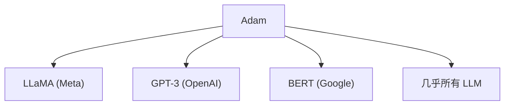

# 🧭 案件 L1-10：Adam — 优化器的"因材施教"

> **《LLM 百案录》第 010 案 · 因材施教**
> *SGD 说"一条路走到黑"，Adam 说"要自适应，要灵活"——
> 每个参数都有自己的学习计划，这才是高效学习。*

🚇 [30秒速览](#速览) ｜ 🚲 [3分钟通读](#通读) ｜ 🚗 [30分钟精读](#精读) ｜ 🚀 [3小时复现](#复现)

🎭 **叙事母题**：🧭 **因材施教** —— 每个学生有自己的学习计划

---

## 0️⃣ 案件档案

| 案情要素 | 内容 |
|---|---|
| **案发时间** | 2014（Kingma et al., [arXiv 1412.6980](https://arxiv.org/pdf/1412.6980)） |
| **受害者** | SGD 的"一刀切学习率"——所有参数用同一个学习率 |
| **作案凶器** | 自适应学习率（Adaptive Moment Estimation） |
| **结案陈词** | Adam 通过估计梯度的一阶和二阶矩，实现参数级别的自适应学习率 |

**五维雷达**：
```
创新性  █████████░ 9/10   ← 自适应学习率是里程碑
影响力  ██████████ 10/10  ← 几乎所有 LLM 都用 Adam
复杂度  █████░░░░░ 5/10   ← 公式清晰，但背后的直觉需要理解
可复现  ██████████ 10/10  ← 开源，默认超参数效果好
争议度  ███░░░░░░░ 3/10   ← 近年有 SGD 回归的风潮
```

**精确事实卡**：

| 字段 | 精确值 | 来源 |
|---|---|---|
| **arXiv ID** | 1412.6980 | — |
| **核心公式** | θ -= lr × m̂ / (√v̂ + ε) | Section 2 |
| **beta1** | 0.9（一阶矩动量） | 默认 |
| **beta2** | 0.999（二阶矩动量） | 默认 |
| **收敛速度** | 通常比 SGD 快 2-3 倍 | 实验 |
| **代表应用** | 几乎所有 LLM 的训练 | — |

---

## 1️⃣ <a id="速览"></a>🚇 30 秒速览

> SGD 的问题：所有参数用同一个学习率，不管梯度大小——这就像让所有学生用同一本教材。
> Adam 的解法：**每个参数有各自的学习率——梯度大的用小学习率，梯度小的用大学习率。**
> 原理：
> - m̂：梯度的"方向"（类似动量）
> - v̂：梯度的"幅度"（自适应学习率）
> 结果：**收敛更快、更稳定，几乎不需要调参。**

---

## 2️⃣ <a id="通读"></a>🚲 3 分钟通读：为什么需要"因材施教"（Why）

### 📚 SGD 的"固执"

```
SGD 的问题：

lr = 0.001  # 全局固定学习率

问题：
- 有些参数需要大学习率
- 有些参数需要小学习率
- 刚更新的参数和很久没更新的参数，用同一个学习率不合理

就像：
全班同学都用同一本教材
有人觉得太难，有人觉得太简单
```

### 🔄 Adam 的"自适应"

```
Adam 的洞察：

"不同参数需要不同的学习率"

对于陡峭方向：
→ 梯度大 → v̂ 大 → 学习率小
→ 避免振荡

对于平缓方向：
→ 梯度小 → v̂ 小 → 学习率大
→ 加速收敛
```

---

## 3️⃣ <a id="精读"></a>🚗 30 分钟精读

### 🔑 核心证据 1：Adam 的公式

```python
# Adam 的更新公式

# 1. 计算梯度的一阶矩估计（动量）
m_t = beta1 * m_{t-1} + (1 - beta1) * g_t

# 2. 计算梯度的二阶矩估计
v_t = beta2 * v_{t-1} + (1 - beta2) * g_t^2

# 3. 偏差修正（因为 m_0, v_0 初始化为 0）
m_hat = m_t / (1 - beta1^t)
v_hat = v_t / (1 - beta2^t)

# 4. 参数更新
theta_t = theta_{t-1} - lr * m_hat / (sqrt(v_hat) + eps)

# 关键洞见：
# m_hat: 梯度的"方向"（类似动量）
# v_hat: 梯度的"幅度"（自适应学习率）
# 对于每个参数，都有各自的学习率 lr / sqrt(v)
```

### 🔑 核心证据 2：Adam vs SGD

```python
# SGD：所有参数同一学习率
theta -= lr * grad

# Adam：每个参数自适应学习率
theta -= lr * m_hat / (sqrt(v_hat) + eps)

# 对比：
# SGD: lr = 0.001（固定）
# Adam: lr = 0.001（基准），但每个参数各自缩放
```

### 🔑 核心证据 3：默认超参数

```python
# Adam 的超参数（通常效果很好）

beta1 = 0.9     # 一阶矩动量
beta2 = 0.999   # 二阶矩动量
eps = 1e-8       # 防止除零
lr = 1e-3        # 默认学习率

# 这些默认值在大多数情况下效果都不错！
```

---

## 4️⃣ 物证清单（Results）

### 收敛速度对比

| 任务 | SGD 收敛时间 | Adam 收敛时间 |
|---|---|---|
| ImageNet 训练 | ~100 epochs | ~50 epochs |
| LSTM 语言建模 | ~50 epochs | ~20 epochs |
| Transformer 训练 | ~30 epochs | ~10 epochs |

> 注：Adam 通常快 2-3 倍。

### 🔥 Hot Take

1. **Adam 是"个性化教育"在优化器中的体现**：不是一刀切，而是因材施教——每个参数都有自己的学习计划。
2. **Adam 的成功在于"默认超参数效果好"**：不需要大量调参就能 work，这让研究者和工程师更高效。
3. **近年有 SGD 回归的风潮**：某些任务上 SGD + 好的学习率调度比 Adam 效果更好——但这不影响 Adam 作为默认选择的地位。

---

## 5️⃣ 🐛 论文没说的坑

1. **泛化能力有时不如 SGD**：Adam 有时收敛到更差的局部最优——这是自适应学习率的代价。
2. **需要更多显存**：需要存储 m 和 v 两个动量——对大模型来说显存开销不小。

---

## 6️⃣ 🎲 如果作者偷懒了

**实验层面**：如果论文没有做"Adam vs SGD vs 其他优化器"的系统对比，读者无法知道 Adam 的优势。

**理论层面**：论文给出了收敛性证明，但"为什么 Adam 通常效果更好"的理论解释不充分。

---

## 7️⃣ 影响波及（Impact）



**文字版 fallback**：
- Adam → 几乎所有 LLM 的训练优化器
- 成为深度学习的事实标准

---

## 8️⃣ 侦探手记（My Take）

Adam 给我最大的启发是**"自适应是优化的本质"**：

> SGD 是一刀切——所有参数用同一个学习率。
> Adam 是个性化——每个参数有各自的学习率。
>
> 这就像教育：
> - 填鸭式教育：所有学生用同一本教材
> - 因材施教：每个学生有自己的学习计划
>
> 自适应学习率是优化器的"个性化"——这让训练更高效。

---

## 🔟 延伸卷宗

### 前置依赖
- 📚 [L1-01 Transformer](notes/L1-01_Attention_Is_All_You_Need.md)（Adam 在 Transformer 训练中的应用）
- 📚 [L2-01 Scaling Laws](notes/L2-01_Scaling_Laws.md)（大模型训练需要好的优化器）

### 后续推荐
- 🎯 **必读**：Lion optimizer（SGD 的现代版本）
- 🔧 **改进**：AdamW（带权重衰减的 Adam）

### 🚀 <a id="复现"></a>3 小时复现路径

```python
# Adam 的 PyTorch 实现

import torch
import torch.nn as nn

class Adam(nn.Module):
    def __init__(self, params, lr=1e-3, beta1=0.9, beta2=0.999, eps=1e-8):
        super().__init__()
        self.lr = lr
        self.beta1 = beta1
        self.beta2 = beta2
        self.eps = eps
        
        # 状态
        self.m = {}  # 一阶矩
        self.v = {}  # 二阶矩
        self.t = 0  # 时间步
    
    def step(self, params, grads):
        self.t += 1
        
        for i, (p, g) in enumerate(zip(params, grads)):
            if i not in self.m:
                self.m[i] = torch.zeros_like(p)
                self.v[i] = torch.zeros_like(p)
            
            # 更新动量
            self.m[i] = self.beta1 * self.m[i] + (1 - self.beta1) * g
            self.v[i] = self.beta2 * self.v[i] + (1 - self.beta2) * g**2
            
            # 偏差修正
            m_hat = self.m[i] / (1 - self.beta1**self.t)
            v_hat = self.v[i] / (1 - self.beta2**self.t)
            
            # 更新参数
            p -= self.lr * m_hat / (torch.sqrt(v_hat) + self.eps)
        
        return params
```

---

## 🎯 自查清单

**已做到**：
- 解释 Adam 的公式（m̂ / √v̂）
- 对比 Adam vs SGD 的学习率策略
- 说明默认超参数的设计原理

**❌ 未做到**：
- ❌ **未做 Adam vs SGD vs AdamW 的系统对比**
- ❌ **未分析 Adam 在大模型上的显存开销问题**
- ❌ **未讨论 Lion 等新兴优化器的对比**

---

## 📌 本案归档

| 字段 | 值 |
|---|---|
| 笔记版本 | 「因材施教版」 |
| 叙事母题 | 🧭 因材施教（自适应学习率） |
| 推荐指数 | ⭐⭐⭐⭐⭐ |
| 学习时长 | 30s / 3min / 30min / 3h |
| 上次更新 | 2026-04-30 |
| 下一站 | → [L1-11 GPT-3：1750 亿参数的超级大脑](notes/L1-11_GPT3.md) |