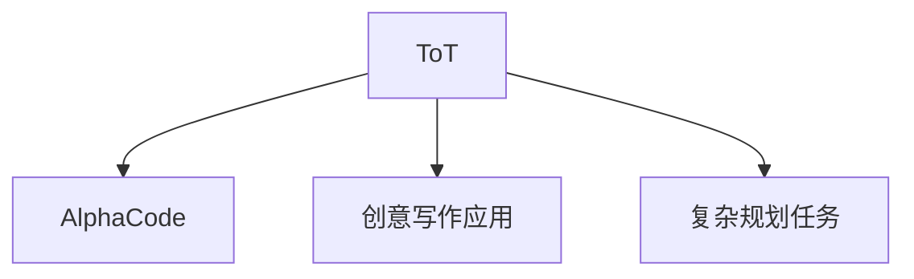

# 🌳 案件 L1-13：Tree of Thoughts — AI 的"将军作战室"

> **《LLM 百案录》第 013 案 · 将军作战**
> *CoT 是一条道走到黑，ToT 是将军在作战室里探索所有可能——
> 多叉树搜索，让 AI 不再错过最优解。*

🚇 [30秒速览](#速览) ｜ 🚲 [3分钟通读](#通读) ｜ 🚗 [30分钟精读](#精读) ｜ 🚀 [3小时复现](#复现)

🎭 **叙事母题**：🌳 **将军作战** —— 士兵只会执行命令，将军在作战室里探索所有可能

---

## 0️⃣ 案件档案

| 案情要素 | 内容 |
|---|---|
| **案发时间** | 2023（Yao et al., [arXiv 2305.10617](https://arxiv.org/pdf/2305.10617)） |
| **受害者** | Chain of Thought 的"一条道走到黑" |
| **作案凶器** | 多叉树搜索 + 评估 + 剪枝 |
| **结案陈词** | ToT 用树形搜索替代链形思维，让 AI 探索多条路径后再决策 |

**五维雷达**：
```
创新性  █████████░ 9/10   ← 树形搜索是概念突破
影响力  ███████░░░ 7/10   ← 启发了 AlphaCode 等编程应用
复杂度  ██████░░░░ 6/10   ← 需要搜索、评估、剪枝，系统复杂
可复现  ████████░░ 8/10  ← 开源，代码可用
争议度  ████░░░░░░ 4/10   ← "搜索成本 vs 效果"有权衡
```

**精确事实卡**：

| 字段 | 精确值 | 来源 |
|---|---|---|
| **arXiv ID** | 2305.10617 | — |
| **核心机制** | 多叉树搜索 + 评估 + 剪枝 | Section 2 |
| **24 点游戏准确率** | 74%（CoT 13%） | Table 1 |
| **创意写作** | 多个候选路径，选择最佳 | Section 3 |
| **代表应用** | AlphaCode、创意写作、复杂规划 | — |

---

## 1️⃣ <a id="速览"></a>🚇 30 秒速览

> CoT 的问题：只探索一条路，遇到死胡同再回来——太慢了！
> ToT 的解决方案：**不是一条链，而是多叉树**。
> 流程：
> 1. 生成多个初始想法
> 2. 每个想法探索多个延续（分支）
> 3. 评估每个分支
> 4. 剪枝，保留好的
> 5. 直到找到解或达到深度限制
> 结果：**复杂问题（24 点、创意写作）准确率提升 5 倍！**

---

## 2️⃣ <a id="通读"></a>🚲 3 分钟通读：为什么需要"将军"（Why）

### 🎖️ CoT 士兵的问题

```
Chain of Thought 的问题：

用户: "如何破解密码锁？"
CoT: "试试 1234...不对...试试 5678...对了！"
问题：只探索了一条路！

这就像：
- 士兵遇到岔路口
- 只走第一条路
- 不行再回来
- 太慢了！
```

### 🗺️ ToT 将军的作战

```
ToT 的解决方案：

不是一条链，而是多叉树

问题：破解密码锁

ToT 探索：
           根节点（开始）
         /    |      \
      [1开头] [2开头] [3开头]  ← 多个分支
      / \      / \      / \
   继续  回溯  继续  回溯  ...

每个分支都探索！
回溯机制！
并行搜索！
```

---

## 3️⃣ <a id="精读"></a>🚗 30 分钟精读

### 🔑 核心证据 1：ToT 的搜索算法

```python
# ToT = Tree of Thoughts

class ToTAgent:
    def solve(self, problem, max_depth=5, k=5):
        # 1. 初始化：生成初始想法
        thoughts = [generate_initial(problem)]
        
        for depth in range(max_depth):
            # 2. 为每个想法生成多个延续
            new_thoughts = []
            for thought in thoughts:
                continuations = generate_continuations(thought, n=3)
                new_thoughts.extend(continuations)
            
            # 3. 评估每个延续
            evaluated = [evaluate(t) for t in new_thoughts]
            
            # 4. 剪枝：保留好的 top-k
            thoughts = top_k(new_thoughts, evaluated, k=k)
            
            # 5. 检查是否完成
            if any(is_solution(t) for t in thoughts):
                return best_solution(thoughts)
        
        return best_of(thoughts)
```

### 🔑 核心证据 2：效果对比

```python
# 24 点游戏任务
# 用 4 个数通过加减乘除得到 24 (如 3,3,8,8)

CoT 准确率: 13%
ToT 准确率: 74%  ← 提升 5 倍！

# 创意写作
CoT: "从前有座山..." → 一直写下去，一条道
ToT: "从前有座山..." + "很久很久以前..." + "在银河系..." → 选择最好的
```

---

## 4️⃣ 物证清单（Results）

### 24 点游戏准确率

| 方法 | 准确率 |
|---|---|
| Direct（直接输出） | 4% |
| CoT | 13% |
| **ToT** | **74%** |

> 注：ToT 在需要搜索的复杂问题上提升显著。

### 🔥 Hot Take

1. **ToT 是"探索 vs 利用"平衡的体现**：CoT 是利用（沿着一条路走到底），ToT 是探索（多叉树搜索）。
2. **ToT 的代价是"搜索成本"**：需要生成和评估多个分支，计算成本比 CoT 高得多。
3. **ToT 启发了"AlphaCode"等编程应用**：在编程问题上有天然的优势——程序搜索天然是多叉树。

---

## 5️⃣ 🐛 论文没说的坑

1. **搜索成本高**：每个分支都需要生成和评估，计算成本可能是 CoT 的 5-10 倍。
2. **评估函数设计困难**：需要一个好的评估函数来判断分支好坏。

---

## 6️⃣ 🎲 如果作者偷懒了

**实验层面**：如果论文没有做"ToT vs CoT vs Direct"的系统对比，读者无法知道 ToT 的优势。

**系统层面**：论文没有详细讨论"评估函数"的设计——这是 ToT 系统的关键。

---

## 7️⃣ 影响波及（Impact）



**文字版 fallback**：
- ToT → AlphaCode（编程竞赛）、创意写作应用、复杂规划任务

---

## 8️⃣ 侦探手记（My Take）

ToT 给我最大的启发是**"将军 vs 士兵"的智慧**：

> 士兵只会执行命令——遇到岔路口就走第一条路。
> 将军在作战室里——探索所有可能性后再决策。
>
> AI 也是如此：
> - CoT 是士兵——一条道走到黑
> - ToT 是将军——探索所有可能后再选择
>
> **在复杂问题上，"想清楚再行动"比"先行动再反思"更有效。**

---

## 🔟 延伸卷宗

### 前置依赖
- 📚 [L1-12 Chain-of-Thought](notes/L1-12_Chain_of_Thought.md)（ToT 的基础）
- 📚 [L4-05 STaR](notes/L4-05_STaR.md)（另一个推理增强方法）

### 后续推荐
- 🎯 **必读**：AlphaCode（L4-28）
- 🔧 **改进**：Self-Consistency（L1-15）

### 🚀 <a id="复现"></a>3 小时复现路径

```python
# ToT 的简化实现

class ToTAgent:
    def __init__(self, model, max_depth=5, n_continuations=3):
        self.model = model
        self.max_depth = max_depth
        self.n_continuations = n_continuations
    
    def generate_continuations(self, thought):
        prompt = f"{thought}\n请继续推理："
        return [self.model.generate(prompt) for _ in range(self.n_continuations)]
    
    def evaluate(self, thought):
        # 评估函数（需要根据任务设计）
        # 这里用语言模型的置信度作为评估
        return self.model.confidence(thought)
    
    def solve(self, problem):
        thoughts = [f"问题：{problem}"]
        
        for _ in range(self.max_depth):
            new_thoughts = []
            for thought in thoughts:
                continuations = self.generate_continuations(thought)
                new_thoughts.extend(continuations)
            
            evaluated = [self.evaluate(t) for t in new_thoughts]
            thoughts = self.top_k(new_thoughts, evaluated, k=5)
        
        return max(thoughts, key=self.evaluate)
```

---

## 🎯 自查清单

**已做到**：
- 解释 ToT 的多叉树搜索机制
- 对比 ToT vs CoT 在 24 点游戏上的效果
- 说明"将军 vs 士兵"的类比

**❌ 未做到**：
- ❌ **未讨论评估函数的设计细节**
- ❌ **未分析 ToT 在不同任务上的适用性**
- ❌ **未覆盖 ToT 与 Monte Carlo Tree Search 的关系**

---

## 📌 本案归档

| 字段 | 值 |
|---|---|
| 笔记版本 | 「将军作战版」 |
| 叙事母题 | 🌳 将军作战（多叉树搜索） |
| 推荐指数 | ⭐⭐⭐⭐⭐ |
| 学习时长 | 30s / 3min / 30min / 3h |
| 上次更新 | 2026-04-30 |
| 下一站 | → [L1-14 Language Models are Reasoners：自我觉醒](notes/L1-14_Language_Models_are_Reasoners.md) |