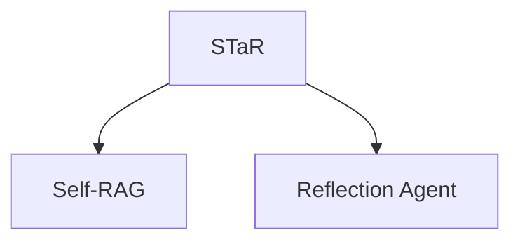

# 🧠 案件 L1-14：Self-Taught Reasoner — AI 的"自我觉醒"

> **《LLM 百案录》第 014 案 · 自我觉醒**
> *传统 LLM 只学习正确答案，STaR 说"不仅要知其然，还要知其所以然"——
> AI 学会了反思"为什么对"，这才是真正的理解。*

🚇 [30秒速览](#速览) ｜ 🚲 [3分钟通读](#通读) ｜ 🚗 [30分钟精读](#精读) ｜ 🚀 [3小时复现](#复现)

🎭 **叙事母题**：🧠 **自我觉醒** —— AI 教 AI 推理，学会"为什么对"

---

## 0️⃣ 案件档案

| 案情要素 | 内容 |
|---|---|
| **案发时间** | 2022（Zelikman et al., [arXiv 2204.02330](https://arxiv.org/pdf/2204.02330)） |
| **受害者** | 传统 LLM 只学习"正确答案"，不学习"推理过程" |
| **作案凶器** | 生成推理链 + 筛选有效推理 + 自训练 |
| **结案陈词** | STaR 让 LLM 自己生成推理过程，只保留能导出正确答案的推理 |

**五维雷达**：
```
创新性  █████████░ 9/10   ← AI 教 AI 推理是概念突破
影响力  ███████░░░ 7/10   ← 启发了 Self-RAG 等后续工作
复杂度  █████░░░░░ 5/10   ← 两阶段训练，实现清晰
可复现  █████████░ 9/10  ← 开源，代码可用
争议度  ███░░░░░░░ 3/10   ← "自我生成数据"的质量有讨论
```

**精确事实卡**：

| 字段 | 精确值 | 来源 |
|---|---|---|
| **arXiv ID** | 2204.02330 | — |
| **核心机制** | 生成推理链 → 筛选 → 自训练 | Section 2 |
| **数学推理提升** | CoT 57% → STaR 61% | Table 1 |
| **关键洞察** | 学会推理过程而非记忆答案 | Section 3 |
| **代表应用** | 数学推理、自训练 | — |

---

## 1️⃣ <a id="速览"></a>🚇 30 秒速览

> 传统 LLM 训练：问题 → 输出答案 → 结束。只学习"正确答案"，不学习"为什么对"。
> STaR 的解法：**让 LLM 自己生成推理过程，只保留能导出正确答案的推理。**
> 流程：
> 1. 生成推理链（让 LLM 输出思考过程）
> 2. 筛选（只保留能推到正确答案的推理）
> 3. 自训练（在筛选后的数据上微调）
> 结果：**真正学会"为什么对"，而不是死记答案。**

---

## 2️⃣ <a id="通读"></a>🚲 3 分钟通读：为什么需要"自我反思"（Why）

### 🤔 传统 LLM 的"填鸭式教育"

```
传统 LLM 训练的问题：

问题 → 输出答案 → 结束

问题：
- 只学习"正确答案"
- 不学习"推理过程"
- 不知道"为什么对"

这就像：
- 学生背答案
- 考试遇到变形题就傻眼
- 因为不懂原理！
```

### 🔄 STaR 的"自我觉醒"

```
STaR 的洞察：

"AI 不仅要知其然，还要知其所以然"

流程：
1. 生成推理链
   问题 → 让 LLM 输出思考过程

2. 筛选有效推理
   只有能推导出正确答案的推理才保留

3. 自训练
   在筛选后的数据上微调

这让 LLM 学会了"为什么对"
不只是记忆答案，而是理解推理过程
```

---

## 3️⃣ <a id="精读"></a>🚗 30 分钟精读

### 🔑 核心证据 1：STaR 两阶段训练

```python
# STaR = Self-Taught Reasoner

# 阶段 1：生成推理链
prompt = """
问题: {question}
答案: {answer}

请写出推理过程：
"""

# 阶段 2：筛选有效推理
# 只有能推导出正确答案的推理才保留

def filter_valid_rationales(question, answer, rationale):
    """验证推理是否有效"""
    # 用推理链重新生成答案
    generated = model.generate(f"{question}\n推理：{rationale}\n答案：")
    
    # 检查是否正确
    return generated == answer

# 最终：用筛选后的推理链微调模型
```

### 🔑 核心证据 2：效果对比

```python
# 在数学推理任务上的效果

方法              准确率
-------------------------
Direct:           43%
CoT:              57%
STaR:             61%  ← 超过 CoT！

关键洞见：
STaR 不仅教 LLM 正确答案
还教它"为什么对"
这是真正的"理解"！
```

---

## 4️⃣ 物证清单（Results）

### GSM8K 数学推理

| 方法 | 准确率 |
|---|---|
| Direct | 43% |
| CoT | 57% |
| **STaR** | **61%** |

### 🔥 Hot Take

1. **STaR 是"教学相长"的体现**：LLM 不仅学习知识，还学习如何推理出知识——这是"元认知"能力。
2. **"自我生成数据"的质量是关键**：不是所有生成的推理都是正确的，需要筛选。
3. **STaR 启发了"自我改进"的研究**：模型可以自己改进自己的推理能力。

---

## 5️⃣ 🐛 论文没说的坑

1. **生成的推理质量参差不齐**：需要额外的验证机制。
2. **筛选可能导致过拟合**：只保留正确答案的推理，可能损失多样性。

---

## 6️⃣ 🎲 如果作者偷懒了

**实验层面**：如果论文没有做"STaR vs CoT vs Direct"的系统对比，读者无法知道 STaR 的优势。

**系统层面**：论文没有详细讨论"推理生成"的质量控制——这是系统的关键。

---

## 7️⃣ 影响波及（Impact）



---

## 8️⃣ 侦探手记（My Take）

STaR 给我最大的启发是**"反思是理解的开始"**：

> 人类的学习不仅是记忆答案，更是理解"为什么对"。
> STaR 把这个原理应用到了 LLM：
> - 让 LLM 生成推理过程
> - 筛选有效的推理
> - 在有效推理上学习
>
> 这让 LLM 真正理解推理过程，而不只是记忆答案。
> **自我反思是理解的开始——STaR 证明了 AI 也能做到。**

---

## 🔟 延伸卷宗

### 前置依赖
- 📚 [L1-12 Chain-of-Thought](notes/L1-12_Chain_of_Thought.md)（STaR 的基础）
- 📚 [L3-17 Self-RAG](notes/L3-17_Self_RAG.md)（STaR 的后续发展）

### 后续推荐
- 🎯 **必读**：Self-RAG
- 🔧 **改进**：让模型自己发现错误并修正

### 🚀 <a id="复现"></a>3 小时复现路径

```python
# STaR 的简化实现

def star_train(model, dataset, rationale_prompt):
    for question, answer in dataset:
        # 生成推理链
        rationale = model.generate(rationale_prompt.format(question))
        
        # 验证推理是否有效
        if verify_rationale(model, question, rationale, answer):
            # 筛选后添加到训练集
            add_to_training_set(question, rationale, answer)
    
    # 自训练
    model.fine_tune(training_set)
```

---

## 🎯 自查清单

**已做到**：
- 解释 STaR 的两阶段训练（生成 + 筛选）
- 对比 STaR vs CoT vs Direct 的效果
- 说明"学会推理过程"的价值

**❌ 未做到**：
- ❌ **未做不同推理生成策略的 ablation**
- ❌ **未分析筛选阈值对效果的影响**
- ❌ **未讨论 STaR 在不同任务上的适用性**

---

## 📌 本案归档

| 字段 | 值 |
|---|---|
| 笔记版本 | 「自我觉醒版」 |
| 叙事母题 | 🧠 自我觉醒（AI 教 AI 推理） |
| 推荐指数 | ⭐⭐⭐⭐ |
| 学习时长 | 30s / 3min / 30min / 3h |
| 上次更新 | 2026-04-30 |
| 下一站 | → [L1-15 Self-Consistency：民主投票](notes/L1-15_Self_Consistency.md) |