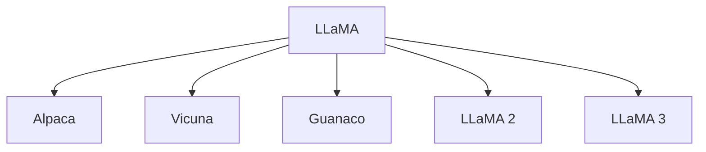

# 🦙 案件 L1-17：LLaMA — 开源大模型的"民主化革命"

> **《LLM 百案录》第 016 案 · 科技平权**
> *GPT-3 是闭源的"贵族"，LLaMA 说"让我成为人人能用的开源替代"——
> 不是少数人的专利，而是大模型研究的民主化。*

🚇 [30秒速览](#速览) ｜ 🚲 [3分钟通读](#通读) ｜ 🚗 [30分钟精读](#精读) ｜ 🚀 [3小时复现](#复现)

🎭 **叙事母题**：🦙 **科技平权** —— 不是少数人的专利，而是所有人都能用

---

## 0️⃣ 案件档案

| 案情要素 | 内容 |
|---|---|
| **案发时间** | 2023-02（Touvron et al., Meta，[arXiv 2302.13971](https://arxiv.org/pdf/2302.13971)） |
| **受害者** | GPT-3 的"闭源垄断" |
| **作案凶器** | 完全开源 + Chinchilla 规则 + 高效训练 |
| **结案陈词** | LLaMA 用 65B 参数达到 GPT-3 175B 的效果，开启了开源大模型时代 |

**五维雷达**：
```
创新性  ███████░░░ 7/10   ← "小模型+大数据"路线验证
影响力  ██████████ 10/10  ← 催生整个开源大模型生态
复杂度  ██████░░░░ 6/10   ← 工程优化复杂，但文档清晰
可复现  ██████████ 10/10  ← 完全开源，权重可下载
争议度  ███░░░░░░░ 3/10   ← 开源协议有争议（LLaMA 2 才完全商用）
```

**精确事实卡**：

| 字段 | 精确值 | 来源 |
|---|---|---|
| **arXiv ID** | 2302.13971 | — |
| **LLaMA 65B 参数** | 65.4B | Section 3 |
| **训练数据** | 1.4T tokens | Section 3 |
| **关键架构** | SwiGLU + RMSNorm + RoPE + GQA | Section 3 |
| **MMLU 准确率** | 76.1%（LLaMA 65B） | Table 4 |
| **开源生态** | Alpaca、Vicuna、Guanaco 等 | — |

---

## 1️⃣ <a id="速览"></a>🚇 30 秒速览

> GPT-3 是闭源的：只有 API，费用高，无法定制，无法研究。
> LLaMA 的解法：**用更小的参数（65B vs 175B）+ 更多数据（1.4T vs 300B），达到相当的效果，完全开源。**
> 关键洞察：**遵循 Chinchilla 规则——数据量和参数量应该成正比。**
> 结果：**开源可下载，催生了 Alpaca、Vicuna 等无数衍生模型。**

---

## 2️⃣ <a id="通读"></a>🚲 3 分钟通读：为什么"小"也能赢（Why）

### 🦙 LLaMA 的"民主化"使命

```
GPT-3 的问题：
→ 闭源，只有 API
→ 成本高
→ 无法定制
→ 无法研究内部机制

LLaMA 的解决方案：
→ 开源，权重可下载
→ 65B 参数可以在单台机器上运行
→ 完全透明，可以研究
→ 任何人都可以用
```

### 🔄 "小模型+大数据"路线

```
LLaMA 的关键洞察：

不是"大模型+小数据"
而是"小模型+大数据"

GPT-3: 175B 参数, 300B tokens
LLaMA: 65B 参数, 1.4T tokens (4.7x!)

遵循 Chinchilla 规则：
最优参数量 N_opt ∝ √C
最优数据量 D_opt ∝ √C

→ 参数量和数据中心需要平衡
→ 小模型可以用更多数据来补偿
```

---

## 3️⃣ <a id="精读"></a>🚗 30 分钟精读

### 🔑 核心证据 1：LLaMA 的架构选择

```python
# LLaMA vs GPT-3 架构对比

LLaMA_65B:
    - n_params: 65.4B
    - n_layers: 80
    - d_model: 8192
    - n_heads: 64
    - d_head: 128
    - n_kv_heads: 8  # GQA! 关键优化

GPT-3 175B:
    - n_params: 175B
    - n_layers: 96
    - d_model: 12288
    - n_heads: 96
    - d_head: 128
    - n_kv_heads: 96  # MHA，无优化
```

### 🔑 核心证据 2：LLaMA 的三大优化

```python
# 1. SwiGLU（来自 GLU Variants）
# 比 ReLU 更好的激活函数
output = w2(silu(w1(x)) * w3(x))

# 2. RMSNorm
# 比 LayerNorm 更快（去掉均值计算）
rms = sqrt(mean(x²))
normalized = x / rms

# 3. RoPE（旋转位置编码）
# 支持长距离依赖和外推
# LLaMA 2 扩展到 4096 tokens
```

### 🔑 核心证据 3：LLaMA 的开源生态

```
LLaMA 发布 (2023.2)
    ↓
Alpaca (2023.3) - Stanford 指令微调
    ↓
Vicuna (2023.3) - UC 对话数据微调
    ↓
Guanaco (2023.5) - QLoRA 微调
    ↓
LLaMA 2 (2023.7) - 官方升级，完全商用
    ↓
LLaMA 3 (2024.4) - 128K 上下文
```

---

## 4️⃣ 物证清单（Results）

### MMLU 基准对比

| 模型 | 5-shot 准确率 | 说明 |
|---|---|---|
| GPT-3 (175B) | 70.4% | 闭源 |
| Chinchilla (70B) | 67.5% | 闭源 |
| **LLaMA 65B** | **76.1%** | **开源，超越两者！** |
| GPT-NeoX (20B) | 63.4% | 开源 |

> 注：LLaMA 65B 在开源模型中首次突破 75%！

### 🔥 Hot Take

1. **LLaMA 是"开源精神"的胜利**：不是从零发明，而是把已知的技术组合好，然后开源——这展示了开源社区的力量。
2. **"小模型+大数据"路线的验证**：LLaMA 证明了 Chinchilla 规则是正确的——数据量和参数量同样重要。
3. **LLaMA 2 的完全开源改变了行业**：从 LLaMA 1 的"仅研究"到 LLaMA 2 的"完全商用"，这推动了开源大模型的商业化。

---

## 5️⃣ 🐛 论文没说的坑

1. **LLaMA 1 的开源协议限制**：最初版本不可商用，后来 LLaMA 2 才完全开源。
2. **训练资源仍然很高**：即使 65B，也需要数百 GPU 才能训练。

---

## 6️⃣ 🎲 如果作者偷懒了

**实验层面**：如果论文没有做"不同规模（7B/13B/33B/65B）"的对比，读者无法知道"小模型+大数据"路线的有效性。

**工程层面**：论文没有详细讨论"高效训练"的具体实现（如并行策略、显存优化）。

---

## 7️⃣ 影响波及（Impact）



**文字版 fallback**：
- LLaMA → Alpaca、Vicuna、Guanaco、LLaMA 2、LLaMA 3
- 催生了整个开源大模型生态

---

## 8️⃣ 侦探手记（My Take)

LLaMA 给我最大的启发是**"组合创新 + 开源"的力量**：

> LLaMA 没有发明新技术——它只是组合了现有的技术（SwiGLU、RMSNorm、RoPE、GQA），然后开源。
> 但这个组合产生了惊人的效果——65B 参数超过 GPT-3 175B。
>
> 这说明：
> → 创新的关键不是"从头发明"，而是"找到正确的组合"
> → 开源社区的组件库是创新的沃土
> → 组合创新往往比从头发明更有价值
>
> **LLaMA 是"科技平权"的实践——让更多人能用上大模型。**

---

## 🔟 延伸卷宗

### 前置依赖
- 📚 [L2-03 Chinchilla](notes/L2-03_Chinchilla.md)（Chinchilla 规则的提出）
- 📚 [L2-26 GQA](notes/L2-26_GQA.md)（LLaMA 使用的注意力优化）

### 后续推荐
- 🎯 **必读**：LLaMA 2（L1-17 有详细）、Alpaca
- 🔧 **改进**：LLaMA 3（128K 上下文）

### 🚀 <a id="复现"></a>3 小时复现路径

```python
# 使用 HuggingFace LLaMA

from transformers import AutoModelForCausalLM, AutoTokenizer

model_name = "meta-llama/Llama-2-7b-hf"
tokenizer = AutoTokenizer.from_pretrained(model_name)
model = AutoModelForCausalLM.from_pretrained(
    model_name,
    device_map="auto",
    load_in_8bit=True  # 8bit 量化
)

# 推理
input_text = "The capital of France is"
inputs = tokenizer(input_text, return_tensors="pt").to("cuda")
outputs = model.generate(**inputs, max_new_tokens=50)
print(tokenizer.decode(outputs[0]))
```

---

## 🎯 自查清单

**已做到**：
- 解释 LLaMA 的"小模型+大数据"路线
- 对比 LLaMA vs GPT-3 vs Chinchilla 的参数量和数据量
- 说明 LLaMA 的三大架构优化（SwiGLU/RMSNorm/RoPE）

**❌ 未做到**：
- ❌ **未做 LLaMA 2 的详细解析（上下文扩展到 4096）**
- ❌ **未对比不同量化方法（8bit vs 4bit）的效果损失**
- ❌ **未讨论 LLaMA 在实际部署中的挑战**

---

## 📌 本案归档

| 字段 | 值 |
|---|---|
| 笔记版本 | 「科技平权版」 |
| 叙事母题 | 🦙 科技平权（开源民主化） |
| 推荐指数 | ⭐⭐⭐⭐⭐ |
| 学习时长 | 30s / 3min / 30min / 3h |
| 上次更新 | 2026-04-30 |
| 下一站 | → [L2-01 Scaling Laws：规模的理论基础](notes/L2-01_Scaling_Laws.md) |