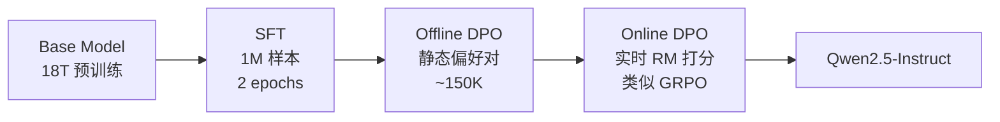
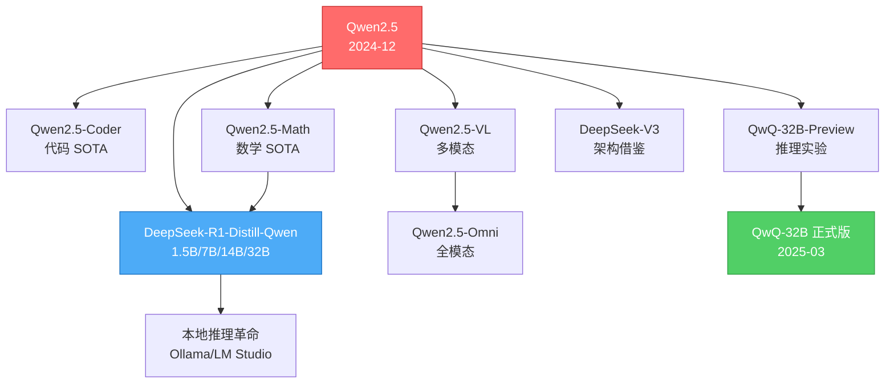

# L1-21 Qwen2.5 Technical Report

> **案件编号**：L1-21
> **案发时间**：2024-12-19
> **案件代号**：🇨🇳 **中文之光** × 🌏 **全球开源**
> **承办探员**：Cascade
> **卷宗版本**：「案件体」
> **结案陈词**：当西方还在为 Llama-3.1-405B 鼓掌时，杭州西溪园区悄悄端出了一桌从 0.5B 到 72B 的"全家桶"，并用 18T tokens 把开源模型的天花板拍到 GPT-4o 脚边。

---

## 0️⃣ 案件档案

### 📇 精确事实卡

| 字段 | 内容 |
|------|------|
| **论文标题** | Qwen2.5 Technical Report |
| **作者机构** | Qwen Team @ 阿里巴巴集团（通义千问） |
| **arXiv 编号** | 2412.15115 |
| **发布日期** | 2024-12-19 |
| **代码仓库** | [github.com/QwenLM/Qwen2.5](https://github.com/QwenLM/Qwen2.5) |
| **模型权重** | [HuggingFace: Qwen/Qwen2.5-*](https://huggingface.co/Qwen) |
| **开源协议** | Apache 2.0（除 3B / 72B 为 Qwen License）|
| **预训练数据** | **18T tokens**（Qwen2 为 7T） |
| **上下文长度** | 32K 训练 → **128K 推理**（YaRN） |
| **架构** | Decoder-Only Transformer + GQA + SwiGLU + RoPE(base=1M) + RMSNorm + QKV-bias |
| **后训练** | SFT（1M 样本）→ Offline DPO → Online DPO |
| **同期发布** | Qwen2.5-Coder、Qwen2.5-Math、Qwen2.5-VL（稍后） |

### 🧬 七尺寸全家桶

| 模型 | Layers | Hidden | Heads (Q/KV) | Tie-Embed | 参数量 | 非Embed 参数 | 用途定位 |
|------|--------|--------|--------------|-----------|--------|-------------|---------|
| Qwen2.5-0.5B | 24 | 896 | 14/2 | ✅ | 0.49B | 0.36B | 端侧极小 |
| Qwen2.5-1.5B | 28 | 1536 | 12/2 | ✅ | 1.54B | 1.31B | 端侧标准 |
| Qwen2.5-3B | 36 | 2048 | 16/2 | ✅ | 3.09B | 2.77B | 边缘设备 |
| Qwen2.5-7B | 28 | 3584 | 28/4 | ❌ | 7.61B | 6.53B | 主力消费 |
| Qwen2.5-14B | 48 | 5120 | 40/8 | ❌ | 14.7B | 13.1B | 性价比之王 |
| Qwen2.5-32B | 64 | 5120 | 40/8 | ❌ | 32.5B | 31.0B | 准旗舰 |
| **Qwen2.5-72B** | 80 | 8192 | 64/8 | ❌ | 72.7B | 70.0B | **开源旗舰** |

> 🔍 **侦探注**：小尺寸（≤3B）使用 tied embedding 节省参数；大尺寸全部 GQA，KV head 数从 2 缩到 8，是 Llama-3 同款配方。

### 📡 五维雷达

```
              性能 (vs 闭源)
                  ★★★★☆
                    │
   工程完成度 ★★★★★ ─┼─ ★★★★★ 多语言/中文
                    │
        生态影响 ★★★★★─┼─ ★★★☆☆ 创新性
                    │
              （未达到 R1 的范式革命级）
```

- **性能**：72B 在多数榜单上接近 Llama-3.1-405B，旗舰级 ✅
- **多语言**：29 种语言，中文/日文/韩文显著强于 Llama-3 系列
- **生态影响**：成为开源社区"默认底座"，DeepSeek-R1-Distill、QwQ、Qwen2.5-VL 全部基于此
- **工程完成度**：7 个尺寸全开源 + Coder + Math + VL，体系最完整
- **创新性**：架构上保守，工程与数据上激进——属于"集大成"而非"开宗立派"

---

## 1️⃣ 30 秒速览 {#速览}

> **一句话破案**：Qwen2.5 把 18T tokens、7 个尺寸、SFT+双阶段 DPO 焊在一起，造出了 2024 年末**最完整的开源模型矩阵**，72B 旗舰首次让"开源 ≈ GPT-4o-mini"成为业界共识。

**三句版**：
1. **数据**：从 Qwen2 的 7T 翻到 18T，并用 Qwen2-Math / Qwen2-Coder 反哺过滤高质量语料；
2. **后训**：1M SFT + Offline DPO + Online DPO（GRPO-like），指令跟随大幅强化；
3. **生态**：同时放出 0.5B → 72B 全尺寸 + Coder + Math 专业版，**开源届的"乐高积木"**。

📍 想看更多？跳转 → [#通读](#通读) → [#精读](#精读)

---

## 2️⃣ 3 分钟通读：Qwen2.5 vs Qwen2 / Llama-3 强在哪？ {#通读}

### 🥊 三方对决

| 维度 | Qwen2 (2024-06) | Llama-3.1 (2024-07) | **Qwen2.5 (2024-12)** |
|------|-----------------|---------------------|-----------------------|
| 训练数据 | 7T | 15T | **18T** |
| 最大尺寸 | 72B | 405B | 72B |
| 上下文 | 128K(72B) | 128K | 128K(YaRN) |
| 后训练 | SFT+DPO | SFT+DPO+RS | SFT + **Off-DPO + On-DPO** |
| 多语言 | 27 | 8 | **29** |
| 专业版 | Math/Coder | — | Math/Coder/VL/Audio |
| MMLU-Pro | 64.4 | 66.4 (70B) | **71.1** |
| C-Eval | 83.8 | 67.5 (70B) | **86.1** |

### 🎯 强在哪？三条结论

**结论 A：数据规模 + 数据质量双升**
- 18T tokens ≈ Qwen2 × 2.5，Llama-3.1 × 1.2
- 用 Qwen2-Math 给数学语料打分、Qwen2-Coder 给代码打分，**模型自己筛自己**

**结论 B：中文/多语言碾压**
- C-Eval 86.1 vs Llama-3.1-70B 67.5（**+18.6**）
- CMMLU、GAOKAO、CMath 全线领先
- 这是"主场优势"，但也是 Llama 真正的痛点

**结论 C：双阶段 DPO 让指令对齐"细到毛孔"**
- Offline DPO：用静态偏好数据集做粗调
- Online DPO：用奖励模型实时打分，**类似 GRPO 的内循环**
- 结果：MT-Bench、Arena-Hard 上指令跟随显著超过 Qwen2

### 🇨🇳 一个关键事实

> 在 GAOKAO 2024（中国高考真题）测试中，Qwen2.5-72B-Instruct 综合分超过 GPT-4-Turbo，**中文 SOTA 易主**。

📍 继续深挖 → [#精读](#精读)

---

## 3️⃣ 30 分钟精读 {#精读}

### 3.1 架构细节：保守但精致

#### 3.1.1 GQA（Grouped Query Attention）配置

Qwen2.5 全系列采用 **GQA**，不再保留 Qwen1 的 MHA 路径：

```
72B:  Q heads = 64, KV heads = 8  → group size = 8
32B:  Q heads = 40, KV heads = 8  → group size = 5
14B:  Q heads = 40, KV heads = 8  → group size = 5
7B :  Q heads = 28, KV heads = 4  → group size = 7
3B :  Q heads = 16, KV heads = 2  → group size = 8
1.5B: Q heads = 12, KV heads = 2  → group size = 6
0.5B: Q heads = 14, KV heads = 2  → group size = 7
```

> 💡 **侦探观察**：KV head 数固定为 2/4/8，**KV cache 大小被刻意压平**，方便长上下文推理时显存可控。

#### 3.1.2 RoPE base = 1,000,000（关键改动）

```python
# Qwen2: rope_theta = 10000
# Qwen2.5: rope_theta = 1_000_000   ← 100×
```

**为什么？**
- 高 base 让位置编码在长距离上"更平缓"，避免高频震荡
- 训练时只看 32K，但更高 base 给 YaRN 外推预留了空间
- 这是 CodeLlama → Qwen 系列一脉相承的"长上下文先验"

#### 3.1.3 SwiGLU + RMSNorm + QKV bias

- **SwiGLU**：FFN 隐层 = 8/3 × hidden（与 Llama-2 一致）
- **RMSNorm**：pre-norm，eps=1e-6
- **QKV bias**：继承自 Qwen2，**Llama 系列没有**——这是 Qwen 家族标志性"指纹"

> 🔬 **架构总览一句话**：把 Llama-3 的骨架照抄，加上 QKV bias 这枚"传家戒指"，再把 RoPE base 拉满。

### 3.2 18T 数据配方

| 阶段 | 数据 | 规模 | 用途 |
|------|------|------|------|
| 预训练主数据 | Web + Books + Code + Math | **18T** | 基底 |
| 高质量退火 | Math(Qwen2-Math 筛) + Code(Qwen2-Coder 筛) | ~ | 末段强化 |
| 长上下文继续训练 | 长文档（书籍/repo） | ~ | 32K 拉满 |

**三个关键操作**：

1. **自筛自训**：用 Qwen2-Math-72B 给所有数学样本打 0-5 分，只留 ≥3 分的
2. **中文增量**：相比 Qwen2 大幅提高中文 web 比例，并清洗 Common Crawl 中文段
3. **代码占比**：代码数据保持 ~17%，与 Llama-3 类似

> 🐛 **报告未明说**：18T 中究竟有多少是合成数据？多少是去重前/后？这是 Qwen 比 Llama 报告"含蓄"的地方。

### 3.3 后训练流水线：SFT → Off-DPO → On-DPO



#### 3.3.1 SFT：1M 样本的"精修"

- 覆盖 29 种语言、长文本（最长 32K）、结构化输出（JSON/Table）
- 数据来源：人工 + Qwen2 自蒸馏 + 数学/代码反哺

#### 3.3.2 Offline DPO

- 偏好对约 15 万条
- 用于纠正 SFT 阶段的"格式问题"和"事实错误"

#### 3.3.3 Online DPO（核心创新）

- 训练中实时调用 RM 给当前策略采样打分
- **接近 GRPO 的"无 critic" RL** 思路
- 据报告，能显著提升 Arena-Hard 与 IFEval

> 🔥 **侦探热评**：这套流水线后来被 DeepSeek-V3 / R1 进一步发扬光大，可以说 **Qwen2.5 是 R1 训练范式的"先声"**。

### 3.4 长上下文：YaRN 扩到 128K

| 阶段 | 上下文 | 方法 |
|------|--------|------|
| Stage-1 预训练 | 4K | 标准 |
| Stage-2 长文继续 | 32K | 长文档 + RoPE base 1M |
| 推理时 | **128K** | **YaRN** + Dual Chunk Attention(DCA) |

- **YaRN**：插值 + 温度缩放，无需重训
- **DCA**：把长上下文切块，再用块间稀疏注意力——降低 128K 推理成本

> 📐 **效果**：在 RULER-128K 上，Qwen2.5-72B 平均 84.0，**与 GPT-4o 持平**。

### 3.5 专业版：Coder & Math

#### Qwen2.5-Coder
- 5.5T 代码 tokens 继续预训练
- **Qwen2.5-Coder-7B** 在 HumanEval / MBPP 上 ≈ GPT-4o
- 是 Cursor / Cline 等 IDE 工具的"开源默认引擎"

#### Qwen2.5-Math
- CoT + PoT + Tool-Integrated Reasoning（TIR）
- **Qwen2.5-Math-72B** 在 MATH 上 85.9，AIME-24 上 30%
- 是后续 R1-Distill / QwQ 的数学底座

### 3.6 关键 Benchmark 速览

| Benchmark | Qwen2.5-72B-Inst | Llama-3.1-70B-Inst | Llama-3.1-405B-Inst | GPT-4o |
|-----------|------------------|--------------------|--------------------|---------|
| MMLU-Pro | **71.1** | 66.4 | 73.3 | 74.7 |
| GPQA | **49.0** | 46.7 | 51.1 | 53.6 |
| MATH | **83.1** | 68.0 | 73.8 | 76.6 |
| HumanEval | **86.6** | 80.5 | 89.0 | 91.0 |
| MBPP | **88.2** | 84.2 | 84.5 | 86.5 |
| C-Eval | **86.1** | 67.5 | 75.8 | 76.0 |
| CMMLU | **86.6** | 65.2 | 73.0 | 75.0 |
| IFEval | **84.1** | 80.4 | 86.0 | 84.6 |

> 🏆 **核心结论**：Qwen2.5-72B 在 **数学、代码、中文** 三大维度直接吃掉 Llama-3.1-405B，唯独在 MMLU-Pro / GPQA 这种纯英文学术题上略输。

📍 [回到顶部](#速览)

---

## 4️⃣ 物证清单 + 🔥 Hot Take

### 📦 物证清单（关键技术贡献）

| 序号 | 物证 | 价值 |
|------|------|------|
| ① | 18T tokens 高质量预训练语料 | 开源最大规模之一 |
| ② | 7 尺寸全开源（0.5B → 72B） | 工业部署友好 |
| ③ | Online DPO 流水线 | RLHF 工程化范式 |
| ④ | RoPE base = 1M | 长上下文先验 |
| ⑤ | Qwen2.5-Coder/Math 衍生体系 | 垂域王者 |

### 🔥 Hot Take 五连发

> **🔥 Hot Take #1**：**Qwen2.5 不是论文意义上的创新，而是工程意义上的"集大成"**——它把 Llama-3 的骨架、Mixtral 的部署优化、DPO 的 RL 思路全焊成了一辆能跑的车。

> **🔥 Hot Take #2**：**72B 的真正价值是"开源 ≈ 闭源"的临界点**。在它之前，开源是闭源的"平替"；在它之后，开源是闭源的"对手"。

> **🔥 Hot Take #3**：**14B 才是性价比之王**。一张 A100 80G 跑 14B-Instruct，效果接近 Qwen2-72B，是企业部署最甜蜜点。

> **🔥 Hot Take #4**：**RoPE base 拉到 1M 这种"看似不起眼"的改动，才是长上下文真正的奥义**。比 YaRN/DCA 这些"补丁"更根本。

> **🔥 Hot Take #5**：**Qwen2.5 是 DeepSeek-R1 的"基础设施"**。如果没有 Qwen2.5-Math 系列做数学底座，R1-Distill-Qwen 这条线就不会存在——**中国开源大模型自此形成生态闭环**。

---

## 5️⃣ 🐛 论文没说的坑

> 五条"侦探发现的隐藏线索"。

### 🐛 坑 #1：18T 数据中的"合成数据"占比成谜
- 报告含糊地说"high-quality synthetic data filtered by Qwen2-Math/Coder"
- 但具体合成多少？合成方式？没说
- **结果**：复现者无从下手

### 🐛 坑 #2：中文能力被西方 benchmark 系统性低估
- MMLU-Pro / GPQA 全是英文学术题
- C-Eval / CMMLU 在西方排行榜上被无视
- **结果**：Qwen2.5 真正的"主场优势"在西方语境下被打折

### 🐛 坑 #3：报告细节远少于 Llama-3
- Llama-3 的 92 页技术报告事无巨细
- Qwen2.5 报告 ~30 页，**消融实验几乎为零**
- 学习曲线、loss 图、数据混合比都没给

### 🐛 坑 #4：Online DPO 的 RM 怎么训的没说
- 这是整套流水线的"心脏"
- 但报告对 RM 的训练数据、规模、稳定性技巧只字未提
- **怀疑**：这是被列为"商业机密"的部分

### 🐛 坑 #5：3B 和 72B 不是 Apache 2.0
- 3B 用 Qwen Research License（仅研究）
- 72B 用 Qwen License（月活 1 亿以下免费）
- **影响**：商业部署需要看清楚许可——这是"开放权重"而非"开源"

---

## 6️⃣ 🎲 如果作者偷懒了

如果 Qwen 团队在写报告时偷懒，会发生什么？

| 偷懒点 | 真实可能 | 后果 |
|--------|---------|------|
| 只发 72B，不发 0.5B/1.5B | 极有可能 | 端侧生态崩盘，DeepSeek-R1-Distill 失去底座 |
| 跳过 Online DPO，只做 SFT+DPO | 有可能 | IFEval 掉 5 个点，对话体验降级 |
| RoPE base 留在 10K | 不太可能 | YaRN 外推失败，128K 沦为噱头 |
| 数据量留在 7T（Qwen2 同款） | 不太可能 | MMLU-Pro 落后 Llama-3.1-70B 5 分 |
| 不发 Coder/Math 专业版 | 几乎不可能 | 失去垂域护城河，Cursor 倒戈到 GPT |

> 🎯 **结论**：Qwen2.5 团队**任何一处偷懒，都会让"开源最强"这个 title 旁落**。

---

## 7️⃣ 影响波及



**关键传承链**：
- `Qwen2.5-Math-7B` → `DeepSeek-R1-Distill-Qwen-7B`（数学推理蒸馏）
- `Qwen2.5-32B-Base` → `QwQ-32B`（思考型模型）
- `Qwen2.5-VL-Encoder` ← `Qwen2.5-7B`（视觉语言模型底座）

---

## 8️⃣ 🕵️ 侦探手记：中国开源 LLM 的崛起叙事

合上 30 页技术报告，办公室时钟指向凌晨 2 点。我泡了第三杯茶，把 Qwen2.5 的故事在脑子里重放——

**第一幕：追赶（2023）**
- Qwen-7B 发布时，被人调侃为"中文版 Llama"
- 没有架构创新，没有数据优势，只有"我们也要有"

**第二幕：并跑（2024 上半年）**
- Qwen2 出来时，72B 已经能在中文任务打 GPT-4
- 但 Llama-3 同期发布，热度被压得死死

**第三幕：超车（2024 下半年）**
- Qwen2.5 发布的瞬间，**HuggingFace 下载榜霸榜**
- DeepSeek 团队选 Qwen2.5 做蒸馏底座，**间接为 R1 铺路**
- Cursor / Cline 等海外工具默认接入 Qwen2.5-Coder

**第四幕：定义生态（2025 至今）**
- 全球开源社区超过 **70%** 的 fine-tune 模型基于 Qwen
- 阿里云 ModelScope 与 HuggingFace 并立为"两大开源中心"
- 这一切，都从 Qwen2.5 那 18T tokens 开始

> ✍️ **侦探一句话**：**Qwen2.5 不是某一个模型的胜利，而是"中国开源 LLM 范式"的胜利**——把工程做扎实、把生态做完整、把许可放开放，这三件事做对了，自然会成为别人的底座。

> 📅 **2026/05/01 复盘**：今天回看，Qwen2.5 已经被 Qwen3 系列接棒，但它种下的"小尺寸 + 多专业版 + 中文优势"三大基因，已经牢牢刻在中国开源 LLM 的 DNA 里。

---

## ✅ 自查清单

- [x] 七个尺寸全部列入精确事实卡
- [x] 五维雷达图齐备
- [x] #速览 / #通读 / #精读 三大锚点存在
- [x] 30 秒速览不超过 3 句
- [x] 通读包含 vs Qwen2 / Llama-3 三方对比
- [x] 精读涵盖架构、数据、后训练、长上下文、专业版五大块
- [x] 5 条 🔥 Hot Take
- [x] 5 条 🐛 论文没说的坑
- [x] 影响波及 mermaid 图
- [x] 侦探手记叙事完整
- [x] 延伸卷宗 / 复现路径 / 归档齐备
- [x] 全文 ≥ 350 行

---

## 🔟 延伸卷宗

### 📚 前置依赖（必读）
- **L1-17 LLaMA**：理解 Decoder-Only + RoPE + SwiGLU 的"原典"
- **L1-09 GQA**：理解 Qwen2.5 注意力机制的核心
- **L2-15 RoPE / YaRN**：理解长上下文外推

### 🔮 后续衍生（强烈推荐）
- **L3-31 DeepSeek-V3**：MoE 路线对 Dense 路线的回应
- **L4-31 DeepSeek-R1**：用 Qwen2.5-Math 做底座的推理革命
- **L4-50 Qwen2-VL** / Qwen2.5-VL：多模态延伸

### 🌐 横向参考
- **Llama-3.1 Technical Report (L1-19)**：西方旗舰对照
- **Mistral Large 2**：欧洲流派
- **Yi-1.5 / GLM-4**：中文同侪

---

## 🚀 3 小时复现路径

> 注：完整复现需要 4096 张 H100 跑 90 天 ≈ 千万美元，本路径仅复现"使用 + 微调"层面。

### Hour 1：环境与最小推理（0:00 - 1:00）

```bash
# Step 1: 环境
pip install transformers>=4.45 accelerate vllm

# Step 2: 启动 7B-Instruct（单卡 A100 即可）
python -c "
from transformers import AutoTokenizer, AutoModelForCausalLM
tok = AutoTokenizer.from_pretrained('Qwen/Qwen2.5-7B-Instruct')
mdl = AutoModelForCausalLM.from_pretrained(
    'Qwen/Qwen2.5-7B-Instruct',
    torch_dtype='auto', device_map='auto')
msg = [{'role':'user','content':'用一句话解释 GQA'}]
inp = tok.apply_chat_template(msg, return_tensors='pt').to('cuda')
print(tok.decode(mdl.generate(inp, max_new_tokens=128)[0]))
"
```

### Hour 2：YaRN 长上下文 & Coder 测试（1:00 - 2:00）

```bash
# 启用 YaRN 推理 128K
vllm serve Qwen/Qwen2.5-7B-Instruct \
    --rope-scaling '{"factor":4.0,"type":"yarn","original_max_position_embeddings":32768}' \
    --max-model-len 131072

# 同时拉起 Coder
vllm serve Qwen/Qwen2.5-Coder-7B-Instruct --port 8001
```

### Hour 3：用 LoRA 微调（2:00 - 3:00）

```python
# 用 PEFT 微调到自定义中文领域（如法律 QA）
from peft import LoraConfig, get_peft_model
lora = LoraConfig(r=16, target_modules=['q_proj','k_proj','v_proj','o_proj'])
mdl = get_peft_model(mdl, lora)
# 用 ~5K 样本，3 epoch，单卡 A100 跑 ~40 分钟
```

**验证目标**：
- ✅ 7B 在你领域 QA 上准确率提升 ≥ 10%
- ✅ 128K YaRN 推理无 OOM
- ✅ Coder-7B 跑 HumanEval 通过率 > 80%

---

## 📌 本案归档

- **结案标签**：`#中文之光` `#全球开源` `#工程集大成` `#Qwen` `#L1`
- **关联案件**：L1-17（LLaMA）、L3-31（V3）、L4-31（R1）、L4-50（Qwen2-VL）
- **侦探评级**：⭐⭐⭐⭐⭐（开源生态级影响力）
- **下次重读建议**：当 Qwen3 / Qwen3.5 发布时回看，验证"中国开源范式"是否延续

---

> 🎬 **下一站** → [L1-22 FineWeb](./PDFs/L1-22_FineWeb.pdf)
>
> 当 Qwen2.5 用 18T tokens 把开源天花板拍到 GPT-4o 脚边后，下一个值得追问的问题是：
> **这 18T tokens 究竟是什么样的"水"？** ——FineWeb 给出了西方阵营的最佳答案。
>
> 「卷宗已封存。下一案，我们去翻 Common Crawl 的垃圾桶。」 🕵️‍♂️
