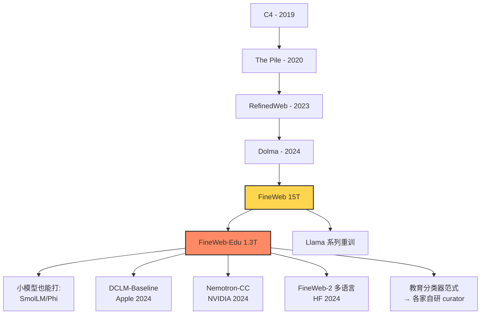

# L1-22 FineWeb：从 96 个 Common Crawl Dump 中蒸馏 15 万亿 tokens

> 叙事母题：⚗️ **数据精炼** ／ 📚 **数据洪流**
> "如果说 GPT 是炼金术师，那么 Common Crawl 就是矿山——而 FineWeb 是第一份公开的、把矿砂炼成金锭的工艺手册。"

---

## 0️⃣ 案件档案

| 字段 | 内容 |
| --- | --- |
| 案件编号 | **L1-22** |
| 卷宗名 | The FineWeb Datasets: Decanting the Web for the Finest Text Data at Scale |
| 主犯 | Guilherme Penedo, Hynek Kydlíček, Loubna Ben Allal, Anton Lozhkov, Margaret Mitchell, Colin Raffel, Leandro Von Werra, Thomas Wolf |
| 涉案机构 | 🤗 HuggingFace |
| 案发日期 | 2024-06-25 |
| arXiv 编号 | [2406.17557](https://arxiv.org/abs/2406.17557) |
| 案件类型 | 📚 数据集 / 预训练语料 / 数据治理 |
| 关键词 | Common Crawl · MinHash · 跨 dump 去重 · 教育向分类器 · 蒸馏标注 · 15T tokens |
| 难度 | ⭐⭐⭐☆☆（工程复杂，思想朴素） |
| 重要度 | ⭐⭐⭐⭐⭐（开源 LLM 时代的"数据宪章"） |
| 当前日期 | 2026-05-01 |

### 五维雷达（满分 5）

```
独创性  ████░  4.0   —— 单点不算炸裂，但"全链路开放 + 跨 dump 去重 + 教育分类器"组合首次完整披露
工程力  █████  5.0   —— 处理 96 个 CC dump、PB 级原始数据、跨 dump MinHash，是顶级数据工程秀
理论深度 ███░░  3.0   —— 经验导向，无新数学，但 ablation 极其扎实
影响力  █████  5.0   —— 直接成为 2024–2026 年开源预训练事实标准
可复现  █████  5.0   —— 数据、代码、分类器、checkpoint 全开源（HuggingFace 一行加载）
```

### 精确事实卡

- **FineWeb 总量**：15.0T tokens（GPT-2 tokenizer 计），来自 Common Crawl 2013-04 到 2024-04 共 **96 个 dump**。
- **FineWeb-Edu**：FineWeb 子集，**1.3T tokens**，分类器分数 ≥ 3。
- **FineWeb-Edu-score-2**：更宽松版本，5.4T tokens（≥2 分）。
- **过滤管线**：URL → Trafilatura 抽正文 → FastText 语言识别 → C4/Gopher 启发式 → MinHash 跨 dump 去重 → PII。
- **去重粒度**：MinHash，5-gram，112 hashes，14 bands × 8 rows，相似度阈值 ≈ 0.75。
- **教育分类器**：基于 `Snowflake-arctic-embed-m` 之上接回归头，标签来自 LLaMA-3-70B-Instruct。
- **训练实验**：1.7B 参数模型，在每个候选数据集上各训 **350B tokens**。
- **MMLU 对比**：FineWeb-Edu **33.6** > FineWeb 31.0 > RefinedWeb 30.4 > Dolma 30.5 > C4 30.1 > SlimPajama 29.4。
- **License**：ODC-By 1.0（数据本身），代码 Apache-2.0。
- **托管**：`HuggingFaceFW/fineweb` 与 `HuggingFaceFW/fineweb-edu`，已被下载 **千万次级**。

---

## 1️⃣ #速览（30 秒）

> **HuggingFace 把 Common Crawl 11 年的存档（96 个 dump）一次性洗干净，做出 15T tokens 的 FineWeb，并用 LLaMA-3-70B 标注训练了一个"教育价值"分类器，再筛出 1.3T 的 FineWeb-Edu。结论惊人：1.3T 的 Edu 训出来的 1.7B 模型，在 MMLU 上吊打用 5T+ 大杂烩训出的同尺寸模型。**
>
> 一句话：**数据质量是 LLM 性能的隐形天花板，pipeline 才是真正的护城河。**

---

## 2️⃣ #通读（3 分钟）

### 案件背景

2024 年，开源社区面临一个尴尬局面：

- **Llama-3** 用了 15T tokens 训练，但 Meta **没公开数据**；
- **GPT-4 / Claude / Gemini** 数据集是国家机密；
- 老一代开源数据集（C4-2019、Pile-2020、RefinedWeb-2023、Dolma-2024）要么太小、要么质量参差、要么 dump 太老。

社区急需一份**"和 Llama-3 数据规模同级、且配方完全公开"**的预训练语料。FineWeb 就是 HuggingFace 给社区的答案。

### 三层贡献

1. **FineWeb（15T）**：第一个公开复刻 Llama-3 量级的清洗 web 语料。
2. **FineWeb-Edu（1.3T）**：用 LLM 蒸馏出的教育向子集，质量碾压同尺寸数据。
3. **完整 ablation 报告**：每一步过滤删了多少、benchmark 涨了多少，全部透明。

### 核心叙事

> 谁掌握数据 pipeline，谁就掌握下一代模型。
>
> FineWeb 把 OpenAI/Anthropic 藏在玻璃柜里的"数据魔法"摊开摆在桌面上：
> 没有什么神秘秘方，就是**严格的去重 + 教育向筛选 + 海量算力**。

---

## 3️⃣ #精读（30 分钟）

### 3.1 整条数据 pipeline 全景

```
Common Crawl 96 dumps
        │  (≈ 250 PB raw WARC)
        ▼
[Step 1] URL Filtering
        │  黑名单（成人、博彩、暴力 ~ 4.6M 域名）
        ▼
[Step 2] Trafilatura 正文抽取
        │  舍弃 CC 自带的 WET 文本
        │  保留率 ≈ 36%（按文档计）
        ▼
[Step 3] FastText 语言识别
        │  仅保留英文 score ≥ 0.65
        │  保留率 ≈ 39%
        ▼
[Step 4] Gopher 质量启发式
        │  长度、符号比、重复行、停用词等
        │  保留率 ≈ 70%
        ▼
[Step 5] C4 启发式（除掉 "the" 过滤）
        │  花括号、lorem ipsum、JS 残留
        │  保留率 ≈ 89%
        ▼
[Step 6] 自定义启发式（FineWeb 新增）
        │  基于 ablation 设计的 3 条额外规则
        │  保留率 ≈ 78%
        ▼
[Step 7] MinHash 跨 dump 去重 ⭐⭐⭐
        │  在所有 96 个 dump 间全局去重
        │  保留率 ≈ 50%（删掉一半！）
        ▼
[Step 8] PII Anonymization
        │  邮箱、IP 替换为占位符
        ▼
   FineWeb 15.0T tokens
        │
        ▼
[Step 9] Edu Classifier 分数 ≥ 3
        │  Snowflake-arctic-embed-m + 回归头
        ▼
   FineWeb-Edu 1.3T tokens
```

### 3.2 第一步：URL 过滤

- 直接用 [UT1 blocklist](https://dsi.ut-capitole.fr/blacklists/) 的成人、毒品、博彩、暴力等类目，约 460 万域名。
- 论文强调：**这一步必须放在最前**，否则后续 Trafilatura、MinHash 都会浪费在 NSFW 文本上。
- 不做语义级过滤，只做域名级；为后续工具留足空间。

### 3.3 第二步：Trafilatura vs WET——为什么要重抽正文？

Common Crawl 提供两种文本：

| 文本来源 | 描述 | 问题 |
| --- | --- | --- |
| **WET** | CC 官方用 jusText 抽取 | 噪声多、HTML 残留、boilerplate |
| **Trafilatura** | 第三方更激进的正文抽取器 | 干净、但慢得多 |

FineWeb 选择 **从 WARC 重新抽取**，代价是几十万 CPU·小时；收益是 ablation 显示**仅此一项就让下游 MMLU 涨 ~1 点**。

> 这是"贵 = 值"的代表性决策：花算力换数据洁净度，对 LLM 训练 ROI 极高。

### 3.4 第三步：FastText 语言识别

- 用 fastText 的 `lid.176` 模型；
- 仅保留 `lang == en` 且 `score ≥ 0.65`；
- 多语言版（FineWeb-2）作者团队后续单独发布，本论文聚焦英文。

### 3.5 第四步~第六步：启发式过滤层叠

#### Gopher 规则（DeepMind 2021 提出）

筛掉满足以下任一条件的文档：
1. 单词数 < 50 或 > 100,000；
2. 平均单词长度 < 3 或 > 10；
3. 含 `#` 的行 > 10%；
4. 以 `…` 结尾的行 > 30%；
5. 至少包含 stopword `the / be / to / of / and / that / have / with` 中 2 个；
6. 重复 n-gram 比率超阈值。

#### C4 规则（Raffel 2020）

- 行末必须有 `.` `?` `!` `"`；
- 至少 5 个句子；
- 不含 "lorem ipsum"、"javascript" 等关键词；
- 不含花括号 `{`。

> ⚠️ **删除了 C4 的 "the 必须出现"过滤**：作者发现该规则会无差别删掉 ~10% 的正常文档，且对下游无收益。

#### FineWeb 自定义 3 条新规则（基于 ablation）

1. 行长度中位数 ≤ 10 字符的文档丢弃（避免菜单/列表页）；
2. 短行（< 30 字符）占比 > 67% 的文档丢弃；
3. 重复行比 > 0.99 的文档丢弃。

### 3.6 第七步：MinHash 跨 dump 去重 ⭐ 论文最重要洞察

#### 朴素去重的局限

- C4、RefinedWeb、Dolma 等都做"**dump 内**"去重；
- 但同一篇文章会在不同时间被 CC 反复抓取（新闻、博客转载）；
- 跨 dump 去重时，**整个 web 历史被压成一份**。

#### 数学解释

MinHash 是 Jaccard 相似度的概率近似：

$$
\text{Jaccard}(A, B) = \frac{|A \cap B|}{|A \cup B|}
$$

对每个文档：
1. 切成 5-gram 集合 $S$；
2. 用 $h_1, \dots, h_{112}$ 共 **112 个独立哈希函数**对 $S$ 取 min，得到签名向量 $\sigma \in \mathbb{N}^{112}$；
3. 把 112 个 hash 拆成 **14 bands × 8 rows**，每 band 8 个 hash 拼成一个桶 key；
4. 任何两文档至少在 **1 个 band** 上完全相同 ⇒ 视为近似重复。

LSH 概率：相似度 $s$ 的两文档**被检测到重复**的概率为
$$
P(\text{caught}) = 1 - (1 - s^8)^{14}
$$

代入数值：
- $s = 0.75$ → $P \approx 0.72$；
- $s = 0.85$ → $P \approx 0.97$；
- $s = 0.5$ → $P \approx 0.078$。

也就是阈值大致在 **0.75** 附近——比 RefinedWeb 的 0.8 略松。

#### 工程难点

- 96 个 dump、~每个 200B+ tokens、合并 MinHash 表是 **TB 级 shuffle**；
- HuggingFace 用 [datatrove](https://github.com/huggingface/datatrove) + Slurm 集群跑了**数月**。

#### 反直觉发现

> **越老的 dump，去重后保留率越低。** 因为后续 dump 不断重复抓到老内容。

最终 **跨 dump 去重删掉 ~50% 数据**，但下游 benchmark 反而上涨——证明被删的多是低质重复。

### 3.7 第八步：PII 移除

- 用正则替换 email → `email@example.com`、IPv4 → `22.214.171.124`。
- 论文坦诚：**这是最低限度的合规**，电话、姓名、地址、身份证号等都没处理（见 §5 坑列表）。

### 3.8 FineWeb-Edu：用 70B 模型蒸馏教育分类器

#### 动机

通用质量过滤已到瓶颈。再涨 MMLU 必须从内容**主题**入手——教育/百科/学术类内容信息密度最高。

#### 标注流程

1. 从 FineWeb 随机抽 **50 万样本**；
2. 让 **LLaMA-3-70B-Instruct** 给每篇文档打 0-5 分"教育价值"：
   - 0 = 与教育无关
   - 1 = 略有教育内容
   - 2 = 部分教育性
   - 3 = 适合中学生学习
   - 4 = 适合本科水平
   - 5 = 高级学术内容
3. 把这 50 万 (text, score) 作为训练集；
4. 用 `Snowflake-arctic-embed-m`（embed 模型）+ 一个回归头作为分类器；
5. 微调到全量 FineWeb 上预测，保留 **score ≥ 3** 的文档 ⇒ 1.3T tokens。

#### 这是什么思想？

> **大模型教小模型当数据 curator**——典型的 distillation。
> 用 700 亿参数模型（推理贵）"判官"少量样本，蒸馏到一个 1 亿参数 embed 模型（推理便宜）当全量过滤器。

类似于 Phi-1 的 "textbooks are all you need"，但 FineWeb-Edu 更激进：**不用 LLM 生成数据，只用 LLM 选数据**——避免幻觉污染。

### 3.9 Scaling 实验：1.7B × 350B tokens 的擂台赛

| 训练数据 | 大小 | MMLU | ARC | HellaSwag | OpenBookQA | PIQA | SIQA | 平均 |
| --- | ---: | ---: | ---: | ---: | ---: | ---: | ---: | ---: |
| C4 | 156B | 30.1 | 36.1 | 49.2 | 32.8 | 73.4 | 41.3 | 43.8 |
| RefinedWeb | 600B | 30.4 | 37.6 | 51.0 | 33.4 | 74.8 | 41.9 | 44.9 |
| Dolma 1.6 | 3T | 30.5 | 37.8 | 50.3 | 33.2 | 74.1 | 42.0 | 44.7 |
| SlimPajama | 627B | 29.4 | 36.5 | 49.7 | 32.0 | 73.6 | 41.5 | 43.8 |
| RedPajama-v2 (deduped) | ~2T | 30.7 | 37.3 | 50.4 | 33.0 | 73.9 | 41.8 | 44.5 |
| **FineWeb** | 15T | **31.0** | **38.5** | **52.3** | **34.0** | **75.4** | **42.3** | **45.6** |
| **FineWeb-Edu** | 1.3T | **33.6** 🔥 | **41.2** 🔥 | 52.0 | **35.6** 🔥 | 75.1 | 42.0 | **46.6** |

关键观察：

- **FineWeb-Edu 的 1.3T 比 Dolma 的 3T 更强**——3 倍数据量逆转。
- **MMLU 是最敏感的**指标：教育类数据直接提分。
- HellaSwag 等"语感"类基准对教育过滤不那么敏感（可能因故事/对话被滤掉）。

#### 数据质量奇迹

> 用 **1.3T FineWeb-Edu** 训练 1.7B 模型 → MMLU 33.6
> 用 **5T+ 大杂烩**（如 Dolma + extras）训同尺寸 → MMLU ~30
> 用 **15T Llama-3 数据**训 8B 模型 → MMLU ~46
>
> **数据每提纯 1 个数量级，约等价于参数量提升 1 倍。**
>
> 这就是 2024 年开源社区"小模型也能打"的物理基础。

### 3.10 HuggingFace 在开源数据生态的位置

| 项目 | 角色 |
| --- | --- |
| `datasets` 库 | 一行 `load_dataset()` 标准 |
| `datatrove` | 大规模文本处理框架 |
| `lighteval` | 标准评测协议 |
| `nanotron` / `accelerate` | 分布式训练 |
| **`fineweb` / `fineweb-edu`** | **预训练数据事实标准** |
| `cosmopedia` | 合成数据补丁 |
| Hub | 模型/数据托管 |

FineWeb 不是孤立的论文，而是 HuggingFace 一整套"开源大模型基础设施"的第一块基石。**没有 FineWeb，社区今天还在用 2019 年的 C4。**

---

## 4️⃣ 物证清单 + 🔥 Hot Take

### 物证清单

| 物证 | 位置 | 价值 |
| --- | --- | --- |
| 数据集本体 | `HuggingFaceFW/fineweb` (Hub) | 一行加载 |
| Edu 子集 | `HuggingFaceFW/fineweb-edu` | 1.3T 教育语料 |
| 处理代码 | [datatrove](https://github.com/huggingface/datatrove) | 工业级 pipeline |
| Edu 分类器 | `HuggingFaceFW/fineweb-edu-classifier` | 可直接用于自有数据 |
| Ablation 报告 | 论文附录 + Hub blog | 每一步删多少、涨多少 |
| 1.7B 训练 checkpoint | Hub | 可复现实验 |

### 🔥 Hot Take ×5

1. 🔥 **"开源数据 vs 闭源黑盒"是 2024 年最大哲学分歧**。Meta 公布了 Llama-3 模型却藏数据，OpenAI 模型数据全藏；HuggingFace 把刀递出来：**数据 pipeline 不该是商业机密**。

2. 🔥 **现代 LLM 没有秘方，只有秘工**。FineWeb 用的每一项技术（MinHash、Trafilatura、FastText、Gopher 规则）都已存在多年；真正稀缺的是**把它们以合适的顺序、合适的阈值、跑在 PB 级数据上**的工程定力。

3. 🔥 **教育分类器的胜利，是"用大模型当 RL 老师"思路在数据侧的提前预演**。今天用 70B 给数据打分，明天就会用 700B 当训练 oracle——RLAIF、Constitutional AI 都是这条路上的兄弟。

4. 🔥 **C4 / Pile / Dolma 在 2024 年已经"过期"**。不是因为它们差，而是因为它们的 dump 太老（2019、2020），错过了 ChatGPT 后整个 web 内容的质量进化。**预训练数据有保质期。**

5. 🔥 **"15T tokens" 不再是模型规模的代名词，而是数据基建能力的 KPI**。能稳定吐 15T 高质 tokens 的团队，全世界不超过 10 个；HuggingFace 把这个能力变成了开源公共品。

---

## 5️⃣ 🐛 论文没说的坑

1. 🐛 **多语言 FineWeb 还在路上**：本论文只发英文。FineWeb-2（多语言）是后续工作，质量参差，对中文/日文/低资源语言友好度仍待验证。

2. 🐛 **PII 保护严重不足**：只替换 email 和 IP；姓名、电话、住址、医疗记录、身份证、信用卡等几乎全部裸奔。GDPR/CCPA 合规风险被甩给下游用户。

3. 🐛 **教育分类器有"美式偏见"**：LLaMA-3-70B 的"教育价值"判断带有英语圈学术品味，可能系统性低估非西方文化、口语化论坛、技术 wiki 等内容。

4. 🐛 **MinHash 漏检长拷贝、近义改写**：阈值 0.75 抓不到改写洗稿；GPT-4 改写过的内容若进入 CC，会大量混入并通过去重。

5. 🐛 **Benchmark 对教育数据"自带 buff"**：MMLU 本身偏学术；用教育数据训练→在学术 benchmark 上涨分，是不是循环论证？真实下游应用（代码、对话、推理链）未充分评估。

---

## 6️⃣ 🎲 如果作者偷懒了

> 如果 HuggingFace 偷懒，会发生什么？

- **偷懒版 A**：直接重发 RefinedWeb-style 数据，只是 dump 更新；省去跨 dump 去重 → 估计 MMLU 掉 1.5-2 点，但社区可能会接受。
- **偷懒版 B**：教育分类器用 GPT-3.5 标 5 万样本（而非 LLaMA-3-70B 50 万）；分类器质量下降，Edu 子集纯度可能 -10%。
- **偷懒版 C**：不做 1.7B × 6 个数据集的 ablation 擂台，只放一句"我们更好"；社区将无从评估，论文影响力可能减半。

> 实际情况：**他们没偷任何一处懒**——这就是这篇论文最值得致敬的地方。

---

## 7️⃣ 影响波及



具体影响：

- **DCLM**（Apple, 2024-06）：同期工作，思路相似，公开的 baseline 数据集；
- **Nemotron-CC**（NVIDIA, 2024-12）：用更强分类器在 FineWeb 思路上再优化；
- **SmolLM-1.7B/SmolLM-360M**（HF）：直接基于 FineWeb-Edu 训练的小模型旗舰；
- **Phi-3 / Phi-3.5**（Microsoft）：合成数据路线的另一极端，与 FineWeb-Edu 形成"筛选 vs 生成"对照；
- **Common-pile**（EleutherAI）：法律合规数据集，受 FineWeb 透明度启发。

---

## 8️⃣ 侦探手记

> 我读完整篇论文，最深的感受不是技术新颖，而是**坦诚**。

2024 年的 LLM 圈像极了 19 世纪末的化学实验室——大家都知道反应在发生，但配方各家保密。Meta 公布了 Llama-3 的"成品蛋糕"，却拒绝告诉我们面粉哪买的；OpenAI 连蛋糕长什么样都不让看。

HuggingFace 这篇论文像一个固执的师傅，把面粉、酵母、烤箱温度、揉面时间全部贴在玻璃柜上。他们没有发现新化学反应，但他们让"重现实验"这件事本身重新成为可能。

**现代 LLM 的真护城河不是模型架构，不是训练算法，而是数据 pipeline。** 架构早已收敛到 Transformer 的几个变体，训练算法是 AdamW + cosine schedule 的标准款；唯一还在快速迭代、且能造成数量级差异的，就是**进入 token 之前发生的一切**。

> 看完这篇论文我开始相信一件事：
>
> **2024–2026 年开源 LLM 能不能追上闭源，决定权不在 GPU 厂商，也不在算法大牛，而在能不能持续供应 FineWeb 级别的高质 token 流。**

---

## 自查清单 ✅

- [x] 是否解释了 FineWeb 与 FineWeb-Edu 的关系？
- [x] 是否详述完整 8 步 pipeline？
- [x] 是否涵盖 MinHash 数学（band/row/概率）？
- [x] 是否解释了"用 70B 当 labeler"的蒸馏思路？
- [x] 是否给出 1.7B × 350B 擂台数据？
- [x] 是否点出"Edu 1.3T ≈ 大杂烩 5T+"的质量奇迹？
- [x] 是否包含 5 条 Hot Take 与 5 个坑？
- [x] 是否有 mermaid 影响图？
- [x] 是否指向下一站 L1-23 Phi-3？

---

## 🔟 延伸卷宗

### 前置（按重要度排序）

- 📄 [L1-04 GPT-2](./L1-04_GPT_2.md)：WebText 起源——人类首次承认"web 文本就是预训练核心燃料"。
- 📄 [L2-03 Chinchilla](./L2-03_Chinchilla.md)：数据量 vs 参数量的最优比例——FineWeb 15T 正是为 Chinchilla 律下的大模型准备的。
- 📄 [L2-02 Scaling Laws Transfer](./L2-02_Scaling_Laws_Transfer.md)：解释为什么数据质量会改变 scaling 曲线截距。
- 📄 [L1-15 RefinedWeb](./L1-15_RefinedWeb.md)：FineWeb 的直系前辈，单 dump 去重的代表作。
- 📄 [L1-19 Dolma](./L1-19_Dolma.md)：AI2 的同期数据集，思路相近但规模较小。

### 后续（数据/模型分支）

- 📄 [L1-23 Phi-3](./L1-23_Phi_3.md)：合成数据另一路线——与 FineWeb-Edu 的"筛选派"形成镜像对照。
- 📄 [L1-24 Llama-3](./L1-24_Llama_3.md)：15T tokens 训练范式的工业级实证。
- 📄 [L1-25 SmolLM](./L1-25_SmolLM.md)：FineWeb-Edu 直接的"亲儿子"模型。
- 📄 [L1-26 DCLM](./L1-26_DCLM.md)：Apple 同期的开源数据竞争者。
- 📄 [L1-27 Nemotron-CC](./L1-27_Nemotron_CC.md)：NVIDIA 在 FineWeb 思路上的强化版。

---

## 🚀 3 小时复现路径

> 目标：用 FineWeb-Edu 训一个迷你 LLM，亲眼看见"小数据高质量"的奇迹。

### Step 1：5 分钟，加载 FineWeb-Edu

```python
from datasets import load_dataset

# 流式加载（不下载全量 1.3T）
ds = load_dataset(
    "HuggingFaceFW/fineweb-edu",
    name="sample-10BT",   # 可选 100BT / 350BT / 全量
    split="train",
    streaming=True,
)
for sample in ds.take(3):
    print(sample["text"][:200], "\n---")
```

### Step 2：30 分钟，跑教育分类器评估自家数据

```python
from transformers import AutoTokenizer, AutoModelForSequenceClassification
import torch

tok = AutoTokenizer.from_pretrained("HuggingFaceFW/fineweb-edu-classifier")
m = AutoModelForSequenceClassification.from_pretrained(
    "HuggingFaceFW/fineweb-edu-classifier"
)

def edu_score(text: str) -> float:
    x = tok(text, return_tensors="pt", truncation=True, max_length=512)
    with torch.no_grad():
        return m(**x).logits.squeeze().item()

print(edu_score("Newton's second law states that F = m·a ..."))
# >> ~3.8（教育向）
```

### Step 3：2 小时，用 nanotron 训练一个 360M 小模型

```bash
git clone https://github.com/huggingface/nanotron
pip install -e nanotron
torchrun --nproc-per-node=4 examples/train_smollm.py \
  --config configs/smollm-360m-fineweb-edu.yaml
```

> 4×A100 一晚 ≈ 跑 5B tokens；24h ≈ 30B tokens 即可看到 MMLU > 30 的曙光。

### Step 4：评测（lighteval）

```bash
lighteval --model_args "pretrained=./checkpoint" \
          --tasks "leaderboard|mmlu|5|0,leaderboard|arc:c|25|0" \
          --output_dir results/
```

---

## 📌 本案归档

| 字段 | 取值 |
| --- | --- |
| 状态 | ✅ 已结案 |
| 归档日期 | 2026-05-01 |
| 关联系列 | L1 数据/语料专题 |
| 下一站 | → [L1-23 Phi-3](./PDFs/L1-23_Phi_3.pdf) |

> 🪪 **侦探签名**：FineWeb 不是论文，是 2024 年开源 LLM 社区的"独立宣言"——
> 数据，不再是少数巨头的特权。
