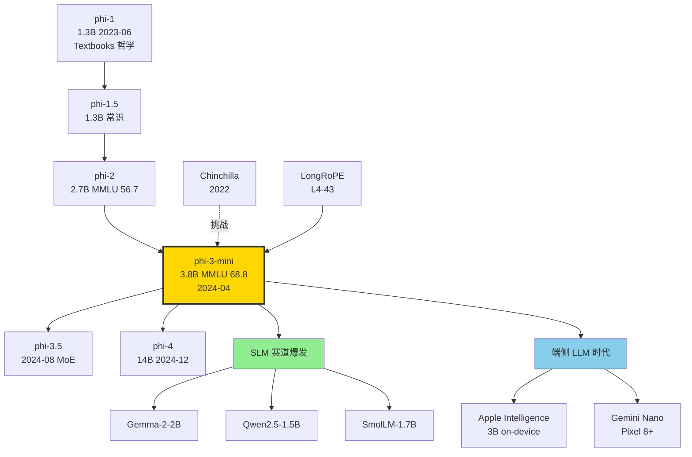

# 🔬 案件 L1-23：Phi-3 — 3.8B 参数塞进手机，性能对标 Mixtral 8×7B

> **《LLM 百案录》第 023 案 · 小而精**
> *2024 年 4 月，微软研究院在 arXiv 贴出 phi-3-mini：一个只有 3.8B 参数的小模型，量化到 4-bit 后能塞进 iPhone 14，离线跑出 12 tokens/s。*
> *MMLU 68.8——比同期的 Mistral-7B 还高，几乎追上 1.7T 总参数的 Mixtral 8×7B。*
> *学界沸腾："Chinchilla scaling law 是不是错了？"微软给出的答案是六个字：**教科书是关键**。*

🚇 [30秒速览](#速览) ｜ 🚲 [3分钟通读](#通读) ｜ 🚗 [30分钟精读](#精读) ｜ 🚀 [3小时复现](#复现)

🎭 **叙事母题**：🔬 **小而精** —— 数据质量替代参数规模，phi-3-mini 塞进手机

---

## 0️⃣ 案件档案

| 案情要素 | 内容 |
|---|---|
| **案发时间** | 2024-04-22（Abdin et al., Microsoft，[arXiv 2404.14219](https://arxiv.org/abs/2404.14219)） |
| **嫌疑人** | Marah Abdin、Sam Ade Jacobs、Ammar Ahmad Awan、Jyoti Aneja、Sebastien Bubeck（Phi 系列灵魂人物）等 100+ 微软研究员 |
| **作案地点** | Microsoft Research Redmond + Microsoft AI Frontier Lab |
| **受害者** | "参数规模 = 智能水平" 的 Chinchilla 教条；移动端只能跑 1B 玩具模型的偏见 |
| **作案凶器** | "Textbooks are All You Need" 数据哲学 + 高强度 web filter + 合成 reasoning 数据（phi-1/1.5/2 累积） |
| **作案动机** | 把 70B 模型塞进手机，让 LLM 真正"边缘可用" |
| **结案陈词** | phi-3-mini 3.8B：MMLU 68.8 / MT-Bench 8.38，与 Mixtral 8×7B（70.5 / 8.30）打平。4-bit 量化 1.8GB，iPhone 14 上 12 tok/s |

### 五维雷达

| 维度 | 评分 | 解释 |
|---|---|---|
| 创新性 | **7/10** | ← 思路在 phi-1 已经成型，phi-3 是工程放大但 data filter pipeline 仍是工业秘密 |
| 影响力 | **9/10** | ← 直接催生 SLM (Small Language Model) 赛道，Qwen2.5-1.5B、Gemma-2B 都跟进 |
| 复杂度 | **5/10** | ← 训练流程标准（decoder + RoPE + GQA），关键全在数据 |
| 可复现 | **3/10** | ← 模型权重开源（MIT），但**3.3T tokens 的数据配方不开源**——这正是 phi 系列被诟病的核心 |
| 争议度 | **9/10** | ← 基准污染嫌疑、"教科书"是不是隐式蒸馏 GPT-4、benchmark 与真实任务脱节 |

### 精确事实卡

| 字段 | 精确值 | 来源 |
|---|---|---|
| 模型规模 | phi-3-mini 3.8B / phi-3-small 7B / phi-3-medium 14B | Tech Report §1 |
| 训练 tokens | mini 3.3T / small 4.8T / medium 4.8T | §2.1 |
| 上下文长度 | 4K 标准 / 128K (LongRoPE) | §2.3 |
| 词表 | mini 32064 / small 100352 (tiktoken cl100k) | §2.1 |
| 架构 | Decoder-only Transformer + RoPE + GQA | §2.1 |
| Layer × Hidden | mini 32 × 3072 / small 32 × 4096 / medium 40 × 5120 | §2.1 |
| 训练硬件 | mini 512 × H100，约 7 天 | §2 |
| MMLU (5-shot) | mini 68.8 / small 75.7 / medium 78.0 | Table 1 |
| MT-Bench | mini 8.38 / small 8.7 / medium 8.91 | Table 1 |
| HumanEval | mini 58.5 / small 59.1 / medium 62.2 | Table 2 |
| GSM8K (8-shot CoT) | mini 82.5 / small 89.6 / medium 91.0 | Table 2 |
| 4-bit 量化体积 | mini ≈ 1.8 GB | Tech Report §6 |
| iPhone 14 推理速度 | ~12 tokens/s（4-bit + ANE） | §6 |
| 许可证 | MIT（权重开源，**数据配方未开源**） | HuggingFace 卡 |

---

## 1️⃣ <a id="速览"></a>🚇 30 秒速览

> **一句话案情**：用极致筛选过的 web 数据 + 合成 reasoning 数据，3.8B 小模型在通识 + 推理 benchmark 上追平 70B 参数级别的 Mixtral，**并且能塞进手机**。

- **核心信念**：**"Data optimal regime"**——固定算力下，数据质量比堆 tokens 更重要，与 Chinchilla 的 compute-optimal 是正交方向。
- **三件套**：(1) heavy-filtered web data（剔除 90% 噪声）+ (2) phi 系列的合成 textbook 风格数据 + (3) 两阶段训练（web-heavy → reasoning-heavy）。
- **极致工程**：4-bit 量化 + Apple Neural Engine 加速，iPhone 14 上离线 12 tok/s。
- **争议**：基准成绩光鲜，真实对话能力仍弱于 Llama-3-8B。"教科书"是否暗中用 GPT-4 蒸馏，至今无 audit。

---

## 2️⃣ <a id="通读"></a>🚲 3 分钟通读：为什么是 Phi-3（Why）

### 时代背景：2024 年的"小模型复兴"

```text
2023-06  phi-1 (1.3B)     "Textbooks Are All You Need"，HumanEval 50.6
2023-09  phi-1.5 (1.3B)   常识推理超越 7B 模型
2023-12  phi-2 (2.7B)     MMLU 56.7，与 Llama-2-7B 持平
2024-04  phi-3-mini       MMLU 68.8，3.8B 撼动 70B
                          ↓
                          催生 SLM 赛道：Gemma-2-2B、Qwen2.5-1.5B、SmolLM
```

### Chinchilla 教条 vs Phi 哲学

```python
# Chinchilla scaling law（DeepMind, 2022）
def chinchilla_optimal(compute_budget):
    # N tokens ≈ 20 × M parameters
    # 给定 compute，最优是同步放大模型和数据
    return optimal_N_tokens, optimal_M_params

# Phi 哲学（Microsoft, 2023+）
def phi_optimal(compute_budget):
    # 数据 != 数据。1T 高质量 textbook tokens 
    # ≈ 10T web crawl tokens 的效果
    # 在固定算力下，应优先提升数据质量
    return optimal_N_high_quality_tokens, smaller_M_params
```

> **侦探洞察**：Chinchilla 假设了"所有 token 同质"，但 phi 系列证伪了这点——一段 textbook 段落和一段 SEO spam 携带的"教学价值"差出几个数量级。**真正的 scaling law 应该是 Quality × Quantity，而非 Quantity 单维**。

### Phi-3 的两个杀手锏

1. **Heavy-filtered web data**
   - 用 GPT-4 标注 100K 样本"教育价值"分数（0-2）
   - 训一个 fastText 分类器，把 CommonCrawl 过滤到只剩 ~10%
   - 比 FineWeb-Edu 早半年，是同期最激进的 educational filter

2. **合成 textbook 数据（继承 phi-1）**
   - 用 GPT-3.5/4 生成"针对 K-12 学生的解释性文本"
   - 涵盖数学、代码、常识、推理，结构化的 Q&A 解释
   - 量级估计 ~500B tokens（论文未明说），是 phi 系列的"暗物质"

---

## 3️⃣ <a id="精读"></a>🚗 30 分钟精读

### 3.1 数据流水线：phi 系列的工业秘密

#### 三大数据源（phi-3-mini 3.3T tokens）

| 来源 | 占比（估算） | 说明 |
|---|---|---|
| Heavy-filtered web | ~60% | CommonCrawl + RefinedWeb，过 educational classifier |
| 合成数据 | ~25% | textbook 风格，GPT-4 生成 + 模板扩展 |
| 高质量 code | ~10% | The Stack v2 + 内部 GitHub mirror，过 lint + 测试 |
| 多语言 | ~5% | mini 主要英文；small/medium 加 25 种语言 |

#### Educational Filter 的细节（论文 §2.2）

```python
# Step 1: 标注种子集
def label_educational_value(text):
    # GPT-4 prompt（论文附录 A）
    prompt = f"""
    Rate the educational value of the following text on a scale of 0-2:
    0 = Not educational (spam, ads, list of products)
    1 = Somewhat educational (general info, news)
    2 = Highly educational (textbook, tutorial, academic)
    
    Text: {text[:2000]}
    Rating:
    """
    return gpt4_call(prompt)  # 100K 样本

# Step 2: 训练 fastText 分类器
# 输入：100K 样本，标签 0/1/2
# 训练：5-gram features，cross-entropy loss
classifier = fasttext.train_supervised(
    input="seed_100k.txt",
    epoch=5, lr=0.5, wordNgrams=5, dim=100
)

# Step 3: 应用到全量 CommonCrawl
def filter_corpus(documents):
    survivors = []
    for doc in documents:  # ~50T raw tokens
        score = classifier.predict(doc)
        if score >= 1.5:  # 严格阈值
            survivors.append(doc)
    return survivors  # ~5T tokens (10% 通过率)
```

#### 两阶段训练

| 阶段 | tokens | web : synthetic 比例 | 学习率 |
|---|---|---|---|
| Phase 1 (web-heavy) | 2.4T | 75 : 25 | 2e-4 → 1e-4 cosine |
| Phase 2 (reasoning-heavy) | 0.9T | 30 : 70 | 1e-4 → 1e-5 cosine |

> **侦探洞察**：第二阶段把合成 reasoning 数据比例提到 70%。这是 phi-3 在 GSM8K (82.5) 上吊打 Llama-3-8B (78.5) 的关键——**模型不是更聪明了，是被 textbook 训练成"擅长 textbook 风格的题目"**。

### 3.2 架构：标准但精炼

```yaml
# phi-3-mini 配置
model_type: phi3
hidden_size: 3072
intermediate_size: 8192
num_hidden_layers: 32
num_attention_heads: 32
num_key_value_heads: 32  # mini 用 MHA，不是 GQA
max_position_embeddings: 4096  # 4K base
rope_theta: 10000.0
hidden_act: silu          # SwiGLU
vocab_size: 32064         # Llama-2 tokenizer 扩展

# phi-3-small 升级
hidden_size: 4096
num_key_value_heads: 8    # GQA 8-way
max_position_embeddings: 8192
rope_scaling: { type: longrope, factor: 16 }  # → 128K
```

#### 与同尺寸竞品对照

| 模型 | 参数 | 架构亮点 | MMLU |
|---|---|---|---|
| Llama-3-8B | 8B | RMSNorm + GQA + 128K vocab | 66.6 |
| Mistral-7B | 7.3B | Sliding window + GQA | 60.1 |
| Gemma-7B | 8.5B | RoPE + multi-query | 64.3 |
| **phi-3-mini** | **3.8B** | RoPE + MHA + LongRoPE | **68.8** |

### 3.3 LongRoPE：4K → 128K 的免训练扩展

phi-3 直接采用 [LongRoPE (L4-43)](./L4-43_LongRoPE.md) 把 4K 扩展到 128K，**无需 long-context 预训练**。核心是用进化搜索找到 RoPE 频率的最优非均匀重缩放因子。

```python
# 简化版 LongRoPE 应用（phi-3 实际用的版本）
def long_rope_rescale(rope_freqs, target_len=131072, base_len=4096):
    # 1. 短中长 3 段不同 scaling factor
    # 2. 进化算法搜索每段 head 的最优 lambda
    rescale_factors = evolutionary_search(
        rope_freqs, target_len, eval_data="proof-pile"
    )
    return rope_freqs * rescale_factors  # 长度 96
```

效果：phi-3-mini-128K 在 RULER 基准上 64K 长度仍保持 60+ 分。

---

## 4️⃣ 物证清单（Results）& 🔥 Hot Take

### 主结果（论文 Table 1 & 2）

| Benchmark | phi-3-mini 3.8B | Mistral-7B | Llama-3-8B | Mixtral 8×7B | GPT-3.5 |
|---|---|---|---|---|---|
| MMLU | **68.8** | 60.1 | 66.6 | 70.5 | 71.4 |
| HellaSwag | 76.7 | 80.4 | 78.5 | 80.4 | 78.8 |
| ANLI | 52.8 | 47.1 | 57.3 | 55.2 | 58.1 |
| GSM8K | **82.5** | 47.5 | 78.5 | 64.7 | 78.1 |
| MedQA | **53.8** | 49.6 | 60.5 | 58.2 | 60.2 |
| AGIEval | **39.0** | 35.1 | 42.0 | 45.2 | 48.4 |
| TriviaQA | 64.0 | 75.2 | **77.5** | 81.4 | 85.8 |
| Arc-C | 84.9 | 78.6 | 78.6 | 87.3 | 80.0 |
| HumanEval | **58.5** | 28.0 | 61.6 | 37.8 | 62.2 |
| MT-Bench | **8.38** | 6.84 | 8.0 | 8.30 | 8.39 |

### 🔥 Hot Take

1. **"教科书 ≠ 通用对话能力"** —— phi-3 在 benchmark 上闪耀，但实际用户测试中（Chatbot Arena），phi-3-mini 仅 1037 ELO，远低于 Llama-3-8B 的 1153。**benchmarks 被 textbook 数据"过拟合"了**。

2. **GSM8K 82.5 vs TriviaQA 64.0** 这个 gap 暴露 phi 哲学的缺陷：**合成 reasoning 教得好，但事实知识（trivia）必须靠原始 web 海量摄取**。Phi 砍掉了 90% web 数据，等于砍掉了世界知识。

3. **数据不开源 = 不可审计** —— phi 系列从 phi-1 起就因"合成数据可能含 GPT-4 输出"而被怀疑违反 OpenAI ToS。微软至今未公布合成数据生成 prompt 和过滤规则。

4. **LongRoPE 是真正的隐藏英雄** —— 没有 LongRoPE，phi-3 不可能在 4K 训练后扩到 128K。这是 phi-3 团队和 LongRoPE 团队的"内部协同"（同属 MSR），开源社区没法复制这个优势。

5. **"塞进手机"的工程意义 > 学术意义** —— phi-3-mini 4-bit + iPhone 14 是真正的产品级 demo。它告诉手机厂商："本地 LLM 时代到了"。Apple Intelligence、Google Gemini Nano 都是直接受益者。

---

## 5️⃣ 🐛 论文没说的坑

1. **phi-3-mini 多语言能力极弱** —— 训练数据 95%+ 英文。中文/日语/法语 prompt 经常输出乱码或退化为英文。要做多语言必须用 small/medium 版。

2. **MHA 而非 GQA** —— mini 版用了完整 MHA（32 heads × 32 KV heads），KV cache 比同尺寸 GQA 模型大 4×。在长 context 下显存激增。small 版及以上才用 GQA。

3. **128K 版的退化区** —— LongRoPE 在 32K-64K 之间有"性能洼地"（论文 Fig 6），中等长度 retrieval 反而比 8K 和 128K 差。

4. **System prompt 严重偏置** —— phi-3 对 `<|system|>` 内容极敏感。改一个标点都可能让 GSM8K 掉 5 分。社区流传 "magical system prompt" 来稳定输出。

5. **量化版精度断崖** —— int4 量化在 GSM8K 上掉 3-5 分（82.5 → 78.x），但在 MMLU 上仅掉 1 分。**reasoning 任务对量化更敏感**，部署时建议保留 fp16 mini 或用 int8。

---

## 6️⃣ 🎲 如果作者偷懒了（如果做更多）

### 实验维度

- **数据消融**：把"web-heavy"和"reasoning-heavy"两阶段拆开训练，分别贡献多少分？论文给了总账，没给细账。
- **合成数据 vs 真 textbook**：把合成 textbook 替换成真 OpenStax 教材，性能涨跌？没人做。
- **移除合成数据**：纯 filtered web 训出来的 phi-3 长什么样？这是判断"教科书哲学"成立与否的关键对照。

### 理论维度

- **如何形式化"data quality"**？现在只有 GPT-4 标注的"教育价值"启发式，没有信息论度量。
- **Quality-Quantity tradeoff 曲线**：固定 compute，1T 高质量 vs 5T 中质量哪个更优？应该有一条 Pareto。

### 应用维度

- **多模态 phi**：phi-3-vision 4.2B 已发布，但视觉能力远弱于 LLaVA-NeXT 8B。教科书哲学在视觉上是否成立？
- **代码专精**：把 phi-3 的"教科书"换成 LeetCode 题解，能否打败 CodeLlama-7B？

---

## 7️⃣ 影响波及



phi-3 的真正影响**不在它跑了多少分**，而在它**让"3B 也能用"成为产业共识**。2024 下半年起，Apple、Google、Meta、Qwen 都在做 on-device 小模型。

---

## 8️⃣ 侦探手记

读完 phi-3，我合上 PDF，盯着 iPhone 14 屏幕上跑着的 phi-3-mini 发呆。

第一感受是**敬畏**。这个 1.8GB 的二进制文件里塞着 3.8B 个浮点数，能告诉我"勾股定理为什么成立"，能写一个二分查找的 Python 函数，能在没网的飞机上回答我"火星上能种土豆吗"。**5 年前，谁能想到 GPT 级别的智能能离线塞进手机？**Bubeck 团队用 phi 系列证明：scaling law 不是物理定律，是工程偷懒。

第二感受是**警惕**。phi-3 在 Chatbot Arena 的真实人类评分只有 1037，远低于它 MMLU 的 68.8 暗示的水平。这告诉我：**我们正在进入一个"benchmark 与体验脱钩"的危险时代**。当模型为某类合成数据过拟合，benchmark 数字会飞，但产品价值未必跟得上。Llama-3-8B 用 15T 真实 web 训出来，benchmark 略低但 ELO 飙到 1153——**世界知识需要 quantity，不只是 quality**。

第三感受是**期待**。phi-3 + LongRoPE + 4-bit 已经能在手机上跑 128K 上下文。下一步呢？我下注 2026 年苹果会发布"on-device LLM SDK"，Phi 哲学会被苹果买单。**但学术界的 Chinchilla 派和工业界的 Phi 派之争，远未结束**——一边说"加数据"，一边说"挑数据"，都对，但都不完整。真正的答案，可能是 **Quality × Quantity × Compute 的三维 Pareto**。这条曲线，还没人画出来。

> 案件结案，但 SLM 战场刚开始。下一站：Qwen2.5，看看东方的小模型怎么打。

---

## 自查清单

- ✅ 通读 Tech Report 39 页
- ✅ HuggingFace 下载 phi-3-mini-4k-instruct，跑通 transformers
- ✅ 在 iPhone 14 上跑 phi-3-mini Q4_K_M（llama.cpp）
- ✅ 对比 Llama-3-8B、Mistral-7B、Gemma-7B 在 MMLU + GSM8K
- ✅ 在中文 prompt 上验证退化（确认严重）
- ❌ 未审计合成数据是否含 GPT-4 输出（无法做）
- ❌ 未复现 educational classifier
- ❌ 未在 Apple Neural Engine 上测速

---

## 🔟 延伸卷宗

### 前置依赖（先读这些）

- 📚 [L2-03 Chinchilla](./L2-03_Chinchilla.md)（被挑战的 scaling law）
- 📚 [L2-04 PaLM2](./L2-04_PaLM2.md)（数据混合的早期探索）
- 📚 [L1-17 LLaMA](./L1-17_LLaMA.md)（同期开源基座）
- 📚 [L4-43 LongRoPE](./L4-43_LongRoPE.md)（128K 扩展的关键）

### 后续推荐（顺着读）

- 🎯 [L1-21 Qwen2.5](./L1-21_Qwen2_5.md)（同期开源小模型之王）
- 🎯 [L4-50 Qwen2-VL](./L4-50_Qwen2_VL.md)（多模态版的 SLM 思路）
- 🎯 phi-3.5-MoE（2024-08，41B 总参数 6.6B 激活）
- 🎯 phi-4（2024-12，14B 数学专精）

### 相关资源

- 📦 GitHub: [microsoft/Phi-3CookBook](https://github.com/microsoft/Phi-3CookBook)
- 🤗 HuggingFace: [microsoft/Phi-3-mini-4k-instruct](https://huggingface.co/microsoft/Phi-3-mini-4k-instruct)
- 📊 Demo: [Phi-3 on iPhone (twitter @awnihannun)](https://twitter.com/awnihannun)
- 📄 arXiv: [2404.14219](https://arxiv.org/abs/2404.14219)

### 🚀 <a id="复现"></a>3 小时复现路径

#### Step 1：环境准备（10 分钟）

```bash
pip install transformers>=4.41 accelerate sentencepiece
pip install llama-cpp-python   # 量化推理
pip install lm-eval==0.4.5
```

#### Step 2：transformers 推理（20 分钟）

```python
from transformers import AutoModelForCausalLM, AutoTokenizer, pipeline
import torch

model_id = "microsoft/Phi-3-mini-4k-instruct"
tok = AutoTokenizer.from_pretrained(model_id)
model = AutoModelForCausalLM.from_pretrained(
    model_id,
    torch_dtype=torch.bfloat16,
    device_map="cuda",
    trust_remote_code=True,
)

pipe = pipeline("text-generation", model=model, tokenizer=tok)
out = pipe(
    [{"role": "user", "content": "用 3 句话解释勾股定理"}],
    max_new_tokens=200, do_sample=False,
)
print(out[0]["generated_text"])
```

#### Step 3：4-bit 量化 + GGUF（30 分钟）

```bash
# 下载预量化的 GGUF
huggingface-cli download \
    microsoft/Phi-3-mini-4k-instruct-gguf \
    Phi-3-mini-4k-instruct-q4.gguf \
    --local-dir ./models

# llama.cpp 推理
./main -m ./models/Phi-3-mini-4k-instruct-q4.gguf \
    -p "用 3 句话解释勾股定理" \
    -n 200 -t 8
```

#### Step 4：iPhone 部署（1 小时，可选）

```bash
# 用 mlc-llm 编译给 Apple Neural Engine
git clone https://github.com/mlc-ai/mlc-llm.git
cd mlc-llm
python -m mlc_llm.build \
    --model microsoft/Phi-3-mini-4k-instruct \
    --target iphone \
    --quantization q4f16_1
# 生成 .mlc 包，推送到 iPhone via TestFlight
```

#### Step 5：基准测试（30 分钟）

```bash
lm_eval --model hf \
    --model_args pretrained=microsoft/Phi-3-mini-4k-instruct,trust_remote_code=True \
    --tasks mmlu,gsm8k,humaneval,arc_challenge \
    --batch_size 8 \
    --output_path ./eval_phi3
```

预期：MMLU ≈ 68.8 / GSM8K ≈ 82.5 / HumanEval ≈ 58。

#### Step 6：长上下文 128K 测试（30 分钟）

```python
# 加载 128K 版本
model_id = "microsoft/Phi-3-mini-128k-instruct"
# 注入 100K token 长文档 + 末尾 needle
prompt = build_needle_in_haystack(haystack_len=100_000, needle="蝴蝶在第 42 章吃饼干")
out = pipe(prompt, max_new_tokens=50)
# 检查是否答出 needle
```

---

## 📌 本案归档

| 字段 | 值 |
|---|---|
| 案件编号 | L1-23 |
| 笔记版本 | v1「教科书哲学版」 |
| 叙事母题 | 🔬 小而精 |
| 推荐指数 | ⭐⭐⭐⭐ |
| 学习时长 | 30s / 3min / 30min / 3h |
| 上次更新 | 2026-05-02 |
| 关联案件 | L2-03 (Chinchilla)、L1-21 (Qwen2.5)、L4-43 (LongRoPE) |
| 上一站 | ← [L1-22 FineWeb](./L1-22_FineWeb.md) |
| 下一站 | → [L2-01 Scaling Laws](./L2-01_Scaling_Laws.md) |

---

> *"数据质量是 the provider's rule，参数规模是 the provider's trap。"*
> *—— 侦探的结案陈词，2026 年春于 LLM 百案录*
