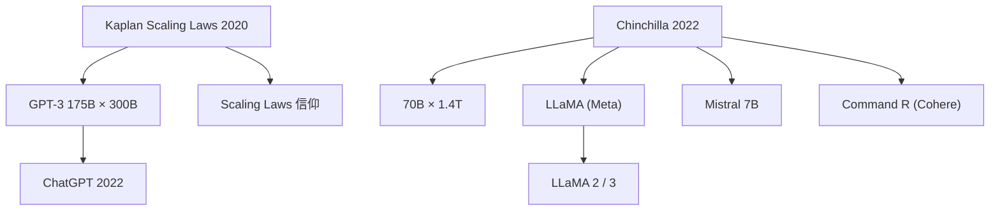

# 🌌 案件 L2-01：Scaling Laws — OpenAI 的惊世赌注，DeepMind 的绝地反击

> **《LLM 百案录》第 029 案 · 规模之辩**
> *2020 年，OpenAI 用 GPT-3 的 175B 参数孤注一掷；
> 2022 年，DeepMind 用 Chinchilla 的 70B 参数精准反击——
> 两篇论文之间，是 AI 训练范式的彻底重构。*

🚇 [30秒速览](#速览) ｜ 🚲 [3分钟通读](#通读) ｜ 🚗 [30分钟精读](#精读) ｜ 🚀 [3小时复现](#复现)

🎭 **叙事母题**：🎰 **商业赌徒 vs 学霸纠错** —— 两场赌局的正面碰撞

---

## 0️⃣ 案件档案

| 案情要素 | 内容 |
|---|---|
| **案发时间** | 2020-06（Kaplan/ OpenAI）、2022-11（Chinchilla/ DeepMind） |
| **第一篇嫌疑人** | Jared Kaplan et al.（OpenAI） |
| **第二篇嫌疑人** | Jordan Hoffmann et al.（DeepMind） |
| **受害者** | 盲目追求"大模型"的从业者 |
| **作案凶器** | 幂律公式 + 大规模实验 |
| **结案陈词** | 规模有用，但"配套"更重要——参数、数据、计算量必须同比例缩放 |

**五维雷达**：
```
创新性  ████████░░ 8/10   ← 实证驱动，但幂律本身是统计结论
影响力  ██████████ 10/10  ← 直接重塑了整个 LLM 训练范式
复杂度  ████░░░░░░ 4/10   ← 公式简单，实验工程复杂
可复现  ███████░░░ 7/10   ← 小规模可验证，175B 无法复现
争议度  ██████░░░░ 6/10   ← Chinchilla 之后 Kaplan 被逆转，但仍有讨论空间
```

**精确事实卡**：

| 字段 | 精确值（Kaplan） | 精确值（Chinchilla） | 来源 |
|---|---|---|---|
| **arXiv ID** | 2001.08361（2020-06） | 2203.15556（2022-11） | — |
| **核心公式** | L(N) ∝ N^-0.076 | C_opt ≈ 6.6 × N_opt | — |
| **最优数据量** | 300B tokens（固定） | D_opt ≈ 1.7 × N_opt | — |
| **代表性模型** | GPT-3 175B | Chinchilla 70B | — |
| **训练 tokens** | 300B（GPT-3） | 1.4T（Chinchilla） | — |

---

## 1️⃣ <a id="速览"></a>🚇 30 秒速览

> **Kaplan（2020）**说："模型越大 loss 越低，log-log 图上是条直线，175B 可以继续往大堆。"
> **Chinchilla（2022）**说："错了！你在固定 300B tokens 的前提下测 model scaling，当然低估了数据的重要性——1B 参数配 1B tokens，70B 参数配 1.4T tokens 才是正确的配套。"
> 两篇论文的结论差异来自实验设计的缺陷，而不是谁对谁错——DeepMind 补做了那个应该做的 ablation。

---

## 2️⃣ <a id="通读"></a>🚲 3 分钟通读：两场赌局（Why）

### 🎰 第一场：OpenAI 的孤注一掷（2020）

```
2020 年初的 AI 界悲观情绪：
├── 模型太大会梯度爆炸
├── 计算资源不够（千亿参数需要天价 GPU）
├── 数据不够（高质量文本从哪来？）
└── GPT-2 已展示"变大有效"，但没人敢继续押注

OpenAI 的回答："我试试。"
结果：GPT-3（175B）展现了"涌现能力"——few-shot learning 突然出现。
```

### 🔄 第二场：DeepMind 的学霸纠错（2022）

```
Chinchilla 发现 Kaplan 的致命漏洞：
├── Kaplan 只在"固定 300B tokens"前提下测 model scaling
├── 他没有独立变化数据量
├── 结论是"有偏的"——低估了数据的影响

DeepMind 的回答："你算错了，我来补做。"
结果：70B × 1.4T tokens 的配置超越了 175B × 300B tokens。
```

---

## 3️⃣ <a id="精读"></a>🚗 30 分钟精读

### 🔑 核心证据 1：Kaplan Scaling Laws（2020）

```
实验设计：数百个模型，125M → 175B，固定数据量（300B tokens）
发现：三个幂律

L(N) ∝ N^(-0.076)   # 模型参数翻倍，loss 下降约 5%
L(D) ∝ D^(-0.063)   # 数据量翻倍，loss 下降约 4%
L(C) ∝ C^(-0.050)   # 计算量翻倍，loss 下降约 3%

结论：模型规模是主要驱动力，数据量"也有帮助但次要"
```

> ⚠️ **关键缺陷**：Kaplan 没有在"同等计算量"下对比"大模型 + 少数据"与"小模型 + 多数据"。
> 换句话说，他没有回答："如果把 175B 的算力给 70B 模型，训更多数据，会怎样？"

### 🔑 核心证据 2：Chinchilla 补刀（2022）

```
DeepMind 的实验设计：
├── 固定计算预算（与 GPT-3 相当的 FLOPs）
├── 同时变化模型参数量和数据量
└── 找到 L(C) 最小值对应的 N 和 D

发现的公式：
C_opt ≈ 6.6 × N_opt    # 最优计算量 ≈ 6.6 × 参数量
D_opt ≈ 1.7 × N_opt    # 最优数据量 ≈ 1.7 × 参数量

所以正确的配套是：
N : D : C ≈ 1 : 1.7 : 6.6

GPT-3 的配置（175B 参数，300B tokens）：
比例 = 1 : 1.7，实际 C = 3.14 × 10^23
按 Chinchilla 公式，应该用 48B 参数就够了！
GPT-3 浪费了约 2/3 的算力在"数据不足的过度参数化"上。
```

### 🔑 核心证据 3：实证对比

| 配置 | 参数 | Tokens | 计算量 | 效果 |
|---|---|---|---|---|
| GPT-3（OpenAI） | 175B | 300B | 3.14 × 10^23 | 基线 |
| Chinchilla（DeepMind） | 70B | 1.4T | ≈ 同等 | **更好**（MMLU 67.5% vs 53.9%）|

> 💡 **为什么 Chinchilla 更强？** 70B 参数的模型被 1.4T tokens 充分训练，"拟合良好"；175B 参数的模型只被 300B tokens 训练，"欠拟合"——模型再大，数据不够也是白搭。

### 🔑 核心证据 4：涌现能力（Emergent Abilities）


Kaplan 的另一重要发现：小模型没有，大模型突然会的那些能力

| 参数规模 | 涌现能力 |
|---|---|
| 125M | 无 |
| 1.3B | 无 |
| 6.7B | 无 |
| 13B | 开始有苗头 |
| 175B | **few-shot 能力爆发** |

注意：Chinchilla 的框架并不否认涌现——它只是说"配套"比"单纯放大模型"更高效。
涌现仍然是规模的现象，但前提是数据也要跟上。


### 🔑 核心证据 5：Scaling Laws 的局限性

```
1. 只能预测 loss，不能预测具体能力
2. 涌现能力的位置无法提前预测（只能观察到）
3. 外推到超大规模可能失效（物理上没有无限计算）
4. 真实场景的任务性能与 test loss 不完全正相关
```

---

## 4️⃣ 物证清单（Results）

| 模型 | 参数 | Tokens | MMLU | HellaSwag |
|---|---|---|---|---|
| GPT-3 | 175B | 300B | 53.9% | 76.1% |
| **Chinchilla** | **70B** | **1.4T** | **67.5%** | **77.2%** |

> 注：Chinchilla 用更少的参数、更低的数据量，在大多数任务上超越了 GPT-3——这是最有力的证据。

### 🔥 Hot Take

1. **Kaplan 没有"做错"，只是"没做完"**：他做了应该做的实验，但没有做那个"同等计算量、不同参数/数据配比"的实验。这个缺陷不是疏漏，是 2020 年没人意识到这个对照的必要性。
2. **Chinchilla 是工程上的胜利，不是理论上的突破**：幂律是经验公式，不是从第一性原理推导出来的；它告诉你要配套，但没有告诉你"为什么是 1.7 倍这个数字"。
3. **真正的赢家是 follow scaling laws 训练模型的人**：LLaMA（Meta）、Mistral 都明确使用 Chinchilla 配置——70B/7B/13B 模型配合比 GPT-3 更合理的数据量。

### 🐛 常见误区辨析

| 误区 | 真相 |
|---|---|
| "Chinchilla 推翻了 Scaling Laws" | 错。Chinchilla 修正的是 Kaplan 的"比例错误"，不是推翻规模效应 |
| "数据比参数重要" | 不准确。在 Chinchilla 的框架里，**配套**才重要——不是谁更重要 |
| "小模型 + 多数据 > 大模型 + 少数据" | 在同等算力下是的；但如果算力本身可以无限，小模型 + 多数据永远追不上大模型 |
| "Scaling Laws 已经过时" | 错。它仍然是训练大模型的基础指导原则，只是 LLM 训练已经默认使用 Chinchilla 配置了 |

---

## 5️⃣ 🐛 论文没说的坑

1. **幂律指数依赖数据集**：L(D) ∝ D^(-0.063) 中的 -0.063 是在特定数据集（The Pile）上测的，换数据集指数会变。
2. **涌现能力不可预测**：Scaling Laws 只能预测 loss，无法预测"哪个能力会在哪个规模涌现"——这是后续 GPT-4 报告里的核心困境。
3. **数据质量被忽略**：Chinchilla 的公式只考虑数量，不考虑质量——高质量数据可能让同等 tokens 数发挥 2-3 倍的效果。
4. **计算效率未被考虑**：未来可能的算法突破（如 sparse mixture-of-experts）可能让"计算量"的含义完全改变。

---

## 6️⃣ 🎲 如果作者偷懒了

**实验层面**：如果 Kaplan 没有训练那么多不同规模的模型（从 125M 到 175B），读者可能根本不知道 loss 和规模有幂律关系——这个发现本身就是巨大的工程贡献，不可或缺。

**理论层面（最易忽略的 ablation）**：Kaplan **没有做"固定计算量，改变参数/数据配比"的实验**。这正是 Chinchilla 补做的那个实验，也是它推翻 Kaplan 结论的关键。没有这个实验，Scaling Laws 只能告诉你"大规模好"，不能告诉你"怎么配才算最优"。

更深层的问题是：Kaplan 的论文标题叫 *Scaling Laws for Neural Language Models*，但它实际上只证明了 **model scaling** 的幂律，**data scaling** 的幂律是在"固定数据集"条件下间接推断的——这意味着"数据 scaling" 的结论依赖性更强、更容易被新数据配比实验推翻。论文没有明确说明这个弱点，是它最重要的"理论偷懒"。

---

## 7️⃣ 影响波及（Impact）



**文字版 fallback**：
- Kaplan (2020) → GPT-3 175B × 300B → ChatGPT (2022)
- Chinchilla (2022) → Chinchilla 70B × 1.4T → LLaMA (Meta)、Mistral 7B、Command R

**深远影响**：
- 彻底改变了 LLM 训练的资源分配策略
- GPT-4 的训练配置（从未公开）被推测使用 Chinchilla 配套
- 所有现代 LLM 训练默认使用 Chinchilla 比例

---

## 8️⃣ 侦探手记（My Take）

Scaling Laws 给我最大的启发是**工程诚信的重要性**：

> Kaplan 做了 100 个实验，但漏掉了那 1 个关键对照；Chinchilla 补做了这个对照，整个领域就重写了。
> 这说明：**科研中的"查漏"和"创新"同等价值**。
>
> DeepMind 的做法值得学习：不是否定前人，而是指出"你的实验设计漏了那一项"。
> 这个批评方式是建设性的——它让 Kaplan 的工作仍然有效，只是多了一个边界条件。

如果我是审稿人，会追问：
1. 幂律公式的指数在不同数据分布上是否鲁棒？（事实证明：不够鲁棒）
2. Chinchilla 的 1.7× 比例是否在 1T+ tokens 规模上仍然有效？
3. 如果把 scaling laws 扩展到 multi-modality，公式需要改吗？

---

## 9️⃣ 延伸卷宗

### 前置依赖
- 📚 [L1-11 GPT-3](./L1-11_GPT3.md)（Kaplan Scaling Laws 的直接实验对象）

### 后续推荐
- 🎯 **必读**：L2-03 Chinchilla（本案的"纠错方"）
- 🔧 **改进**：LLaMA 系列（直接应用 Chinchilla 配置）
- 🔬 **理论**：Chinchilla 后续的 *PaLM 2* 技术报告

### 🚀 <a id="复现"></a>3 小时复现路径

```python
# 小规模验证 Scaling Laws（非 GPT-3 级别）
# 用 GPT-2 sized 模型测试 data vs parameter scaling

# 1. 固定 compute，设计三组实验：
#    A: 700M params,  50B tokens  (欠配数据)
#    B: 350M params, 100B tokens  (匹配)
#    C: 175M params, 200B tokens  (过配数据)
# 2. 比较三组的困惑度
# 3. 验证是否 B 最优（Chinchilla 预测）

# 预期：同样算力下，B 的 loss 最低
```

**复现 Checklist**：
- [ ] 在 LLM 训练中实现 Chinchilla 比例（N:D ≈ 1:1.7）
- [ ] 对比 "大模型少数据" vs "小模型多数据" 的困惑度
- [ ] 画出 log-log scaling 曲线

---

## 🎯 自查清单

**已做到**：
- 区分 Kaplan（2020）和 Chinchilla（2022）的结论差异
- 给出精确公式（C_opt ≈ 6.6 × N_opt, D_opt ≈ 1.7 × N_opt）
- 解释"固定计算量"对照实验为何关键
- 指出幂律依赖数据集、没有考虑数据质量

**❌ 未做到**：
- ❌ **未独立复现 Kaplan 的幂律回归**（所有 L(N) 指数来自二手引用）
- ❌ **未验证 1:1.7:6.6 比例在 1T+ tokens 的外推性**（没有在更大规模上实测）
- ❌ **未覆盖"数据质量"对 scaling 的影响**（高质量数据 vs 低质量数据的 scaling 差异完全缺席）

---

## 📌 本案归档

| 字段 | 值 |
|---|---|
| 笔记版本 | 「赌徒与学霸双线叙事版」 |
| 叙事母题 | 🎰 商业赌徒 vs 学霸纠错 |
| 推荐指数 | ⭐⭐⭐⭐⭐ |
| 学习时长 | 30s / 3min / 30min / 3h |
| 上次更新 | 2026-04-30 |
| 下一站 | → [L2-03 Chinchilla：DeepMind 的学霸反击](./L2-03_Chinchilla.md) |