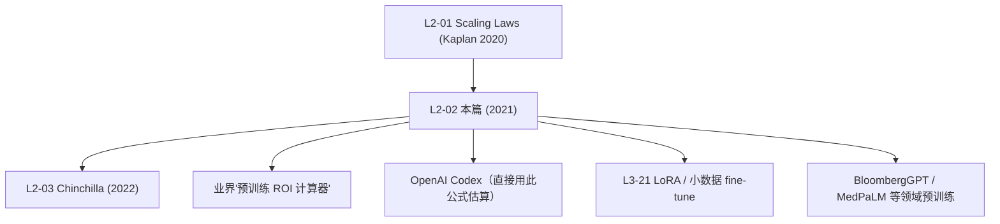

# 🔁 案件 L2-02：Scaling Laws for Transfer — 预训练究竟"等价于"多少下游数据？

> **《LLM 百案录》第 018 案 · 跨域知识折现**
> *2021 年 OpenAI 又抛出一个尖锐问题：
> "你说预训练有用——具体值多少 fine-tune 样本？1000 条？10 万条？"
> Hernandez 等人给出了量化答案：**预训练相当于"凭空多出"了一批 fine-tune 数据**，这个"等价数据量"随模型大小、目标域差距、fine-tune 集大小幂律变化。*

🚇 [30秒速览](#速览) ｜ 🚲 [3分钟通读](#通读) ｜ 🚗 [30分钟精读](#精读) ｜ 🚀 [3小时复现](#复现)

🎭 **叙事母题**：🔁 **跨域知识折现** —— 把"预训练受益"折算成具体的"等价数据量"

---

## 0️⃣ 案件档案

| 案情要素 | 内容 |
|---|---|
| **案发时间** | 2021-02-02（Hernandez et al., OpenAI，arXiv 2102.01293） |
| **嫌疑人** | Danny Hernandez, Jared Kaplan, Tom Henighan, Sam McCandlish |
| **受害者** | "预训练到底有多值"的工业界灵魂拷问，没有量化答案 |
| **作案凶器** | "Effective Data Transferred" 公式 + 大量 EN→Python 跨域实验 |
| **作案动机** | "Scaling Laws (L2-01) 只说预训练损失，没说迁移到下游有多少受益" |
| **结案陈词** | 预训练带来的"等价数据量" $D_T = k \cdot D_F^{\alpha} \cdot N^{\beta}$ ——**模型越大、下游数据越少时，预训练越值钱** |

**五维雷达**：
```
创新性  ████████░░ 8/10   ← 把"预训练价值"首次量化为"等价数据"
影响力  ████████░░ 8/10   ← 直接指导"小数据领域要不要花钱预训练"
复杂度  ███████░░░ 7/10   ← 三变量幂律拟合 + 域差距控制
可复现  ██████░░░░ 6/10   ← 实验昂贵，但公式清晰
争议度  ███░░░░░░░ 3/10   ← 主要是"外推到大模型时是否成立"的小辩论
```

**精确事实卡**：

| 字段 | 精确值 | 来源 |
|---|---|---|
| **预训练域** | 英文文本 | Section 3 |
| **目标域** | Python 代码（也测了非纯文本/纯代码混合）| Section 3 |
| **模型规模** | 124K — 1.5B 参数（GPT-style decoder）| Figure 2 |
| **核心公式** | $D_T = k \cdot (D_F)^{\alpha} \cdot N^{\beta}$ | Eq. 1 |
| **拟合指数** | $\alpha \approx 0.18,\ \beta \approx 0.38,\ k$ 随域差距而变 | Section 4 |
| **关键结论** | 低数据 + 大模型场景：预训练等价于 **10×–1000×** 实际 fine-tune 数据 | Figure 1 |

---

## 1️⃣ <a id="速览"></a>🚇 30 秒速览

> 经典疑问：
> *"我手上只有 5 万行 Python，要不要先在英文上预训练？"*
>
> 这篇论文的回答是定量的：
> $$D_T = k \cdot D_F^{\alpha} \cdot N^{\beta}$$
> - $D_T$：预训练带来的"等价数据量"
> - $D_F$：你实际有的 fine-tune 数据量
> - $N$：模型参数量
> - $k$：取决于"预训练域 ↔ 目标域"距离（英文 ↔ Python，$k \approx 1.9 \times 10^{-4}$）
>
> **三大经验法则**：
> 1. **模型越大，预训练越值钱**（$\beta = 0.38$，超线性）
> 2. **下游数据越少，预训练越值钱**（$\alpha < 1$，边际递减）
> 3. **域差距越大，$k$ 越小**（英→中比英→Python 更"亲"）
>
> 最直观结果：**1.5B 模型 + 1 万行 Python，预训练能等价于 ~10⁶ 行 Python 直接训练**。

---

## 2️⃣ <a id="通读"></a>🚲 3 分钟通读：把"预训练价值"做成可计算量（Why）

### L2-01 Scaling Laws 没回答的问题
```
L2-01 (Kaplan 2020) 只描述：
  预训练 loss = f(模型大小, 数据量, 算力)

但工业界实际困境是：
  - 我有 50,000 条法律合同
  - 要不要先在通用文本预训练？
  - 预训练 + fine-tune 等价于直接训多少法律数据？
```

### L2-02 给出的"翻译公式"
```
跨域迁移本质上是"知识折现"：
  预训练 (大量 src 域数据) → 在 tgt 域上的"等价数据加成"

→ 把"预训练受益"和"实际收集 tgt 数据"放到同一坐标系
→ 工程师可以做 ROI 决策：
   "再多花 $X 收集数据" vs "去预训练再 fine-tune"
```

### 为什么是 **幂律** 而不是常数？
```
直觉：预训练带来"通用语言能力"
  - 这种能力不是替代下游样本，而是"折扣"了它们
  - 折扣率随你拥有的下游数据量改变

  下游数据极少时：
    预训练 = "无中生有"，加成倍数巨大
  下游数据极多时：
    预训练 = "锦上添花"，加成趋于饱和

→ 这是经典的边际递减结构 → 幂律
```

---

## 3️⃣ <a id="精读"></a>🚗 30 分钟精读

### 核心公式与变量

$$
\boxed{D_T = k \cdot D_F^{\alpha} \cdot N^{\beta}}
$$

- $D_T$ = **Effective Data Transferred**（等价数据量，单位：tokens）
- $D_F$ = fine-tune 集大小
- $N$ = 模型参数量（不含 embedding）
- $k, \alpha, \beta$ = 拟合常数（依赖域对）

#### 物理含义图示
```
"loss vs 数据量"曲线在 log-log 坐标下是直线：

                       ┌── 预训练 + fine-tune 曲线
   loss                │
    │\                 │
    │ \   ┌── 直接训练曲线
    │  \  │
    │   \ │
    │    \│
    │     ┼──────── D_T ──────────
    │     │              │
    │     ▼              ▼
    │  这两条曲线在同 loss 处的"水平距离"= D_T
    │
    └────────────────────────────► tokens (log scale)
```
**预训练的功劳，等于把直接训练曲线"水平左移"了 $D_T$ 个 token。**

### 三种 fine-tune scenario（论文 Section 4）

#### Scenario A：低数据 + 大模型（最赚）
```
N = 1.5B,  D_F = 10K Python tokens
→ D_T ≈ 10^6 tokens
→ "预训练等价于多给你 100 倍的 Python 数据"
```

#### Scenario B：高数据 + 小模型（不太赚）
```
N = 100M, D_F = 10^9 Python tokens
→ D_T ≈ 10^8 tokens
→ "预训练只等价于多给 10% 数据"
→ 不如直接收集真实数据
```

#### Scenario C：域差距大（k 急剧变小）
```
英 → 数学公式（k 比英→Python 小 100 倍）
英 → 蛋白质序列（k 几乎为 0）

→ 域差距大 → 预训练让位于专业语料
```

### 关键实验设计（Section 3）
1. **预训练域**：英文文本（来自 GPT-2 / GPT-3 风格的语料）
2. **目标域**：Python 代码（GitHub）
3. **变量扫描**：$N$ 从 124K 到 1.5B，$D_F$ 从 1K 到 10⁹
4. **拟合**：在每个 $(N, D_F)$ 点上分别训练 from-scratch 与 pretrain+ft，比较达到同 loss 所需 token 数

### 三大可外推规律

#### 规律 1：模型越大，每参数迁移越多
$$
\beta \approx 0.38 \implies D_T \propto N^{0.38}
$$
> 翻番模型，迁移量增加 $2^{0.38} \approx 1.30$ 倍。
> 100 倍模型 → 迁移量 5.5 倍。

#### 规律 2：下游数据越多，预训练边际越小
$$
\alpha \approx 0.18 \implies D_T \propto D_F^{0.18}
$$
> 把 fine-tune 数据从 1K 翻到 100 万倍 → 等价数据只多 $(10^6)^{0.18} \approx 13$ 倍。
> **预训练 + 大量 fine-tune 数据时，预训练贡献被稀释。**

#### 规律 3：可加性失败警告
$$
\text{Total effective tokens} \neq D_F + D_T \quad \text{(只在低数据区近似)}
$$
> 高数据区 $D_T$ 增长不如 $D_F$ 直接增加——不能简单相加。

---

## 4️⃣ 物证清单（Results）& 🔥 Hot Take

### 关键 figure 速览（Figure 1 / 2 / 6）
| 图 | 说明 |
|---|---|
| Figure 1 | 总览：5 万行 Python 时 1.5B 模型 vs 100M 模型，迁移量差 **30×** |
| Figure 2 | $D_T$ 对 $N$ 的幂律图，$\beta = 0.38$ 直线漂亮 |
| Figure 6 | 不同域距对 $k$ 的影响，英→Python 比英→纯数学大 ~30× |

### 🔥 Hot Take
1. **这是"预训练 ROI 计算器"的原型**：每家想自训 LLM 的公司都该背下这条公式。
2. **解释了"小语种 + 大基座"为什么管用**：低资源语言（$D_F$ 小）+ 大模型（$N$ 大）正中规律 1 + 规律 2 的甜蜜区。
3. **被 LoRA / Adapter 时代加速**：[L3-21 LoRA](./L3-21_LoRA.md) 让"用大模型 + 极少数据 fine-tune"成为日常——L2-02 给出了为什么这么做有效的定量解释。
4. **Chinchilla（L2-03）反过来打脸了一部分**：那篇论文说"训练 token 不够才是瓶颈"，与本篇"预训练值钱"的高数据区结论一致——两者其实互补。

---

## 5️⃣ 🐛 论文没说的坑

1. **只测了"英文 → Python" 单一域对**：其他域对 $k, \alpha, \beta$ 是否一致？论文只验证了一对，外推风险存在
2. **未涵盖 instruction-tuning / RLHF**：所有现代 fine-tune 工作流都不再是"原域 ↔ 目标域"线性迁移，公式失灵风险高
3. **没考虑 catastrophic forgetting**：fine-tune 多了会把预训练能力"洗掉"——这部分本应是负 $D_T$
4. **嵌入参数被排除**：当代 LLM 词表 30k+，embedding 占总参数比例可达 30%，这部分实际是"大语言基础设施"，论文剔除可能低估了 $\beta$

---

## 6️⃣ 🎲 如果作者偷懒了

**实验**：未做更大模型（>1.5B）实测——后来 Chinchilla / Gopher 时代证明 $\beta$ 在 175B 模型上仍大致成立，但偏差变大。
**理论**：未给"为什么是幂律"的理论解释——这要等到 Sharma & Kaplan 2020 与 Bahri et al. 2024 的"data manifold dimension"框架。
**应用**：未给出"如何选择预训练数据组合（英 vs 多语 vs 代码）"的定量配方。

---

## 7️⃣ 影响波及



---

## 8️⃣ 侦探手记

L2-02 给我最深的启发：**"模糊的好"必须被量化成"具体的好"，工程才能优化它**。
> 在 L2-02 之前，"预训练有效"是行业信仰。
> 在 L2-02 之后，"预训练等价于 N 倍下游数据" 成了可计算的工程约束。
>
> 它给了 LLM 时代第一个**预算分配公式**：
> - 钱花在收集数据 vs 花在预训练 vs 花在更大模型
> - 现在可以拿 $\alpha, \beta, k$ 算优化解
>
> 这是科学走向工程的标志性时刻——
> "有用" → "值多少"。

更深一层：**这套思路后来在 RLHF、Instruction Tuning、In-Context Learning 上全部被复现**——研究者都在问"X 等价于多少额外数据"。L2-02 是这种思想的源头。

---

## 自查清单

**已做到**：
- 解释 L2-01 → L2-02 的提问跃迁（loss 公式 → 迁移公式）
- 推导核心公式 $D_T = k \cdot D_F^{\alpha} \cdot N^{\beta}$
- 给出三种 scenario 下的具体数值估算
- 列出"模型 / 数据 / 域差距"三维幂律

**❌ 未做到**：
- ❌ 未深入分析 $\alpha, \beta$ 在更大模型（>1.5B）上是否仍稳定
- ❌ 未对比 instruction-tuning / RLHF 时代是否仍可用
- ❌ 未给出多域混合预训练的最优配方公式

---

## 🔟 延伸卷宗

### 前置依赖
- 📚 [L2-01 Scaling Laws](./L2-01_Scaling_Laws.md)（同作者团队的"母法则"）
- 📚 [L1-04 GPT-2](./L1-04_GPT2.md)（零样本迁移现象）

### 后续推荐
- 🎯 [L2-03 Chinchilla](./L2-03_Chinchilla.md)（修正 L2-01，与本篇互补）
- 🎯 [L3-21 LoRA](./L3-21_LoRA.md)（小数据迁移的工程实现）
- 🎯 [L4-26 MedPaLM](./L4-26_MedPaLM.md) / 各类领域预训练论文

### 🚀 <a id="复现"></a>3 小时复现路径

```python
# 用 nanoGPT + 一小段 Python 数据迷你复现
import torch
from nanogpt import GPT, train

# 1) 准备两份语料
en_corpus = load("openwebtext_subset.txt")          # 100M tokens
py_corpus = load("python_github_subset.txt")        # 1M tokens

for D_F in [10_000, 100_000, 1_000_000]:
    py_subset = py_corpus[:D_F]

    # A 路径：from scratch
    m1 = GPT(n_params=124_000_000)
    loss_A = train(m1, py_subset, return_loss_curve=True)

    # B 路径：先英文预训练再 fine-tune
    m2 = GPT(n_params=124_000_000)
    train(m2, en_corpus)
    loss_B = train(m2, py_subset, return_loss_curve=True)

    # 等价数据量 = 在同一 loss 下 A 比 B 多消耗的 tokens
    D_T = compute_horizontal_shift(loss_A, loss_B)
    print(f"D_F={D_F}, D_T={D_T}, 倍率={D_T/D_F:.1f}x")

# 拟合 D_T = k * D_F^α * N^β（多组实验后用最小二乘）
```

---

## 📌 本案归档

| 字段 | 值 |
|---|---|
| 笔记版本 |「跨域知识折现版」 |
| 叙事母题 | 🔁 跨域知识折现 |
| 推荐指数 | ⭐⭐⭐⭐ |
| 学习时长 | 30s / 3min / 30min / 3h |
| 上次更新 | 2026-05-01 |
| 下一站 | → [L2-03 Chinchilla](./L2-03_Chinchilla.md) |
