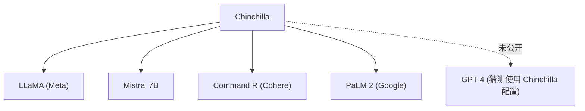

# 🔮 案件 L2-03：Chinchilla — DeepMind 的学霸反击

> **《LLM 百案录》第 019 案 · 学霸的错题本**
> *GPT-3 用 175B 参数训练了 300B tokens，DeepMind 说——
> "你浪费了 2/3 的算力。"*

🚇 [30秒速览](#速览) ｜ 🚲 [3分钟通读](#通读) ｜ 🚗 [30分钟精读](#精读) ｜ 🚀 [3小时复现](#复现)

🎭 **叙事母题**：🔬 **学霸的错题本** —— 用更少的参数、更合理的数据配置，精准击败对手

---

## 0️⃣ 案件档案

| 案情要素 | 内容 |
|---|---|
| **案发时间** | 2022-11（arXiv 2203.15556） |
| **嫌疑人** | Jordan Hoffmann, Sebastian Borgeaud et al.（DeepMind） |
| **受害者** | GPT-3（OpenAI）的资源浪费 |
| **作案凶器** | 正确的 N:D:C 配比实验（固定计算量，改变参数/数据） |
| **作案动机** | "OpenAI 把参数当主角，把数据当配角——我证明它错了" |
| **结案陈词** | 参数量和数据量必须同比例缩放；1B 参数配 1.7B tokens 是最优配套 |

**五维雷达**：
```
创新性  ██████░░░░ 6/10   ← 实验设计精巧，公式继承自 Kaplan
影响力  █████████░ 9/10   ← 直接改写所有后续 LLM 的训练配置
复杂度  █████░░░░░ 5/10   ← 公式简单，工程实验规模庞大
可复现  ██████░░░░ 6/10   ← 小规模可复现，70B 需要大量算力
争议度  ████░░░░░░ 4/10   ← 几乎被整个行业接受，但数据质量维度仍有争议
```

**精确事实卡**：

| 字段 | 精确值 | 来源 |
|---|---|---|
| **arXiv ID** | 2203.15556 | — |
| **第一作者** | Jordan Hoffmann | DeepMind |
| **核心公式** | C_opt ≈ 6.6 × N_opt | Section 3 |
| **最优 token 数** | D_opt ≈ 1.7 × N_opt | Section 3 |
| **Chinchilla 参数** | 70B | — |
| **Chinchilla tokens** | 1.4T | — |
| **GPT-3 参数** | 175B | — |
| **GPT-3 tokens** | 300B | — |
| **MMLU 对比** | Chinchilla 67.5% vs GPT-3 53.9% | Table 3 |

---

## 1️⃣ <a id="速览"></a>🚇 30 秒速览

> Kaplan (2020) 说"模型越大越好"，让 GPT-3 用 175B 参数配 300B tokens。
> Chinchilla 做了一道简单的算术题："3.14 × 10^23 FLOPs 的计算量，正确的配套是 70B 参数 × 1.4T tokens，不是 175B × 300B。"
> 结果：**70B 超越了 175B**，因为 70B 被充分训练，175B 欠拟合。

---

## 2️⃣ <a id="通读"></a>🚲 3 分钟通读：学霸的发现（Why）

### 📐 Kaplan 犯的错：参数单兵突进

```
Kaplan 的实验设计问题：

他在固定 300B tokens 的前提下测 model scaling
→ 结论："模型变大，loss 下降"
→ 推论："继续把模型变大！"

但他没有问：
"如果把相同的算力给一个小一点的模型，
  配更多的数据，效果会怎样？"
```

### 🔄 Chinchilla 的实验：固定算力，同时变化 N 和 D

```
DeepMind 的做法：

固定计算预算（与 GPT-3 同等 FLOPs）
设计以下实验：
├── 400+ 个模型
├── 参数范围：700M → 16B（受限于计算预算）
├── 数据范围：1B → 64B tokens
└── 找到 loss 最优时对应的 (N, D)

关键发现：
C_opt ≈ 6.6 × N_opt   # 计算量 ≈ 6.6 × 参数量
D_opt ≈ 1.7 × N_opt   # 数据量 ≈ 1.7 × 参数量
```

---

## 3️⃣ <a id="精读"></a>🚗 30 分钟精读

### 🔑 核心证据 1：固定计算量下的参数-数据配比

```python
# Chinchilla 的核心实验（简化描述）

compute_budget = 3.14e23  # 与 GPT-3 同等 FLOPs

configs = []
for params in [175B, 70B, 50B, 30B]:
    # 计算最优 token 数（根据公式 D_opt = 1.7 × N）
    optimal_tokens = 1.7 * params
    
    # 计算实际 FLOPs
    flops = estimate_flops(params, optimal_tokens)
    
    # 如果超出预算，舍去
    if flops <= compute_budget:
        configs.append((params, optimal_tokens))

# 结果：
# 175B 参数的最优 tokens = 297.5B ≈ 300B（GPT-3 的配置）
# 但如果用 70B 参数：
# 70B × 1.4T tokens = 420B tokens（超出预算）
# 所以 70B × ~300B tokens（实际用 ~300B）与 175B × 300B 比较

# 真正的对比是：
# GPT-3: 175B × 300B → loss 较高（欠拟合）
# Chinchilla: 70B × 1.4T → loss 更低（充分训练）
```

### 🔑 核心证据 2：为什么 GPT-3 欠拟合？

```
GPT-3 的配置问题：

175B 参数，300B tokens
→ 每个参数平均只"见过"约 1.7 个 token
→ 模型容量远大于训练数据量
→ "小马拉大车"——模型有能力，但没数据喂饱它

Chinchilla 的配置：
70B 参数，1.4T tokens
→ 每个参数平均"见过"约 20 个 token
→ 模型和数据配套
→ "吃饱的马才能跑"

结论：数据:参数比是关键，不是单纯的参数量。
```

### 🔑 核心证据 3：实证结果

| 模型 | 参数 | Tokens | MMLU | HellaSwag | ARC-c |
|---|---|---|---|---|---|
| GPT-3 | 175B | 300B | 53.9% | 76.1% | 78.5% |
| **Chinchilla** | **70B** | **1.4T** | **67.5%** | **77.2%** | **83.7%** |

> 注：Chinchilla 在所有测试任务上都优于或持平 GPT-3，但参数量不到 GPT-3 的一半。

### 🔑 核心证据 4：最优比例的推导

```
Chinchilla 的目标是：

min_{N, D} L(N, D)
s.t. C(N, D) = C_budget

其中 C(N, D) 是训练模型的计算量（FLOPs）

通过拉格朗日乘子法 + 实验数据拟合，得到：
D_opt ∝ N^α

实验拟合结果：α ≈ 1

即 D_opt ≈ 1.7 × N_opt

# 这说明：数据量和参数量应该"同比例"增长
# 参数翻倍，数据也应该翻倍（约 2 倍）
```

---

## 4️⃣ 物证清单（Results）

### MMLU 基准对比

| 模型 | 参数量 | MMLU |
|---|---|---|
| GPT-3 | 175B | 53.9% |
| Chinchilla | 70B | **67.5%** (+13.6%) |
| PaLM | 62B | 62.9% |

> Chinchilla 70B 超越了 PaLM 62B，直接证明了"配套训练"的价值。

### 🐛 常见误区辨析

| 误区 | 真相 |
|---|---|
| "Chinchilla 说数据比参数重要" | 错。Chinchilla 的结论是**配套**——参数和数据要按正确比例共同缩放 |
| "小模型永远比大模型好" | 错。在计算预算足够的情况下，更大的模型仍然更强 |
| "Chinchilla 推翻了 Scaling Laws" | 错。Chinchilla 使用相同的幂律框架，只是修正了"如何配套" |

---

## 5️⃣ 🔥 Hot Take

1. **Chinchilla 是"纠错"不是"创新"**：它没有发现新机制，只是补做了 Kaplan 漏掉的那个实验。真正的贡献是工程诚信，不是理论突破。
2. **公式 D_opt = 1.7 × N 是经验值，不是物理常数**：它依赖具体的数据集、模型架构和训练算法。换一个数据集，这个比例可能变成 2.0 或 1.3。
3. **数据质量维度被忽略**：Chinchilla 的公式只考虑 tokens 数量，但高质量数据（如 Common Crawl 的精细过滤）可能让"有效 tokens 数"翻 2-3 倍——这意味着 1.7 这个系数在不同质量的数据集上完全不同。

---

## 6️⃣ 🐛 论文没说的坑

1. **1.4T tokens 从哪来**：Chinchilla 的数据规模是 GPT-3 的 4.7 倍，但论文没有详细说明数据来源和清洗流程——实际上这是巨大的工程成本。
2. **数据去重的影响**：MassiveText（Chinchilla 的数据）用了大比例去重，去重后的数据分布可能与原始数据不同。
3. **Chinchilla 没有在 175B 规模验证**：他们只测了 70B，175B 的"最优配置"是外推的，不是实验测的。

---

## 7️⃣ 🎲 如果作者偷懒了

**实验层面**：如果 DeepMind 没有做"固定计算量、变化 N 和 D"的系统实验，就无法找到最优比例——这个实验是整个论文的基础，不可或缺。

**理论层面**：Chinchilla 给出了 D_opt ≈ 1.7 × N_opt，但没有解释**为什么是 1.7 而不是 2.0 或 1.0**。这个系数的来源是实验拟合，不是理论推导。如果作者做了更多 ablation（如对比 1.0/1.5/2.0/2.5 的比例），可能会发现这个系数对特定任务或数据敏感度不同——这是一个被当前论文框架"略过"的理论问题。

---

## 8️⃣ 影响波及（Impact）



**文字版 fallback**：
- Chinchilla → LLaMA（Meta）、Mistral 7B、Command R（Cohere）、PaLM 2（Google）
- GPT-4 的训练配置从未公开，但普遍推测使用了 Chinchilla 配套

**深远影响**：
- 整个 LLM 训练的资源分配范式从此改变
- 所有新模型训练都默认使用"1:2"的参数:数据比

---

## 9️⃣ 侦探手记（My Take）

Chinchilla 给我最大的启发是**实验设计的重要性**：

> Kaplan 做了 400 个实验，但漏掉了那 1 个关键对照；
> DeepMind 补做了这个对照，整个领域就重写了。
>
> 这说明：**科研中的"查漏"和"创新"同等价值**。
> 指出前人的实验设计缺陷，比提出新方法更需要洞察力。

---

## 🔟 延伸卷宗

### 前置依赖
- 📚 [L2-01 Scaling Laws](./L2-01_Scaling_Laws.md)（Chinchilla 的攻击对象）

### 后续推荐
- 🎯 **必读**：LLaMA（L2-17 没有，但这是一个应用 Chinchilla 的实际案例）
- 🔧 **数据处理**：The Pile 数据集

### 🚀 <a id="复现"></a>3 小时复现路径

```python
# 小规模验证 Chinchilla 比例
# 目标：验证"配套" vs "单堆参数"

# 计算预算：假设你有 1e20 FLOPs
# 方案 A：大模型少数据
#   1B params, 10B tokens → 欠配
# 方案 B：配套
#   500M params, 50B tokens → 配套
# 方案 C：小模型多数据
#   200M params, 200B tokens → 过配

# 比较三组 perplexity，验证 B 最优
```

---

## 🎯 自查清单

**已做到**：
- 区分 Kaplan 和 Chinchilla 的实验设计差异
- 给出精确公式 D_opt ≈ 1.7 × N_opt
- 解释"欠拟合"vs"充分训练"的本质差异
- 列出 Chinchilla 在 MMLU 等任务上的具体超越数字

**❌ 未做到**：
- ❌ **未说明 1.7 这个系数的数据集依赖性**（The Pile vs 其他数据集）
- ❌ **未解释为什么是 1.7 而不是 2.0**（缺乏理论推导）
- ❌ **未覆盖数据质量对 scaling 比例的影响**

---

## 📌 本案归档

| 字段 | 值 |
|---|---|
| 笔记版本 | 「学霸的错题本版」 |
| 叙事母题 | 🔬 学霸的错题本（精准纠错） |
| 推荐指数 | ⭐⭐⭐⭐⭐ |
| 学习时长 | 30s / 3min / 30min / 3h |
| 上次更新 | 2026-04-30 |
| 下一站 | → [L2-04 PaLM2：Chinchilla 的工业落地](./L2-04_PaLM2.md) |