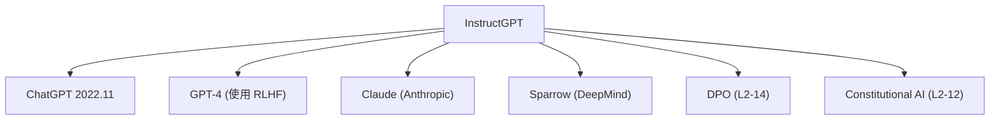

# 🎯 案件 L2-05：InstructGPT — AI 学会了"做人"

> **《LLM 百案录》第 021 案 · 驯兽师的规矩**
> *GPT-3 是个天才神童，没人教它规矩，就会变成危险人物。
> InstructGPT 用三步驯兽法，让 AI 学会"什么该做，什么不该做"。*

🚇 [30秒速览](#速览) ｜ 🚲 [3分钟通读](#通读) ｜ 🚗 [30分钟精读](#精读) ｜ 🚀 [3小时复现](#复现)

🎭 **叙事母题**：🎪 **马戏团的驯兽艺术** —— 不教知识，教规矩

---

## 0️⃣ 案件档案

| 案情要素 | 内容 |
|---|---|
| **案发时间** | 2022-03（arXiv 2203.02155，对应 ChatGPT 的技术报告） |
| **嫌疑人** | Ouyang, Long, Hesse et al.（OpenAI） |
| **受害者** | GPT-3（"危险的天才神童"） |
| **作案凶器** | RLHF 三步法：SFT → RM → PPO |
| **作案动机** | "知识 ≠ 价值观，能力 ≠ 安全——天才必须学会守规矩" |
| **结案陈词** | 人类反馈强化学习（RLHF）从此成为 LLM 对齐的标准方法 |

**五维雷达**：
```
创新性  ████████░░ 8/10   ← 三步流程是工程创新，不是理论突破
影响力  ██████████ 10/10  ← ChatGPT 的技术基础，直接引爆 alignment 赛道
复杂度  ███████░░░ 7/10   ← PPO + RM + SFT，系统工程复杂
可复现  █████████░ 9/10   ← 开放式数据可用，TRL 库完整复现
争议度  ████████░░ 8/10   ← "AI 变得顺从"和"数据偏见"始终有争议
```

**精确事实卡**：

| 字段 | 精确值 | 来源 |
|---|---|---|
| **arXiv ID** | 2203.02155 | — |
| **第一作者** | Long Ouyang | OpenAI |
| **RLHF 三步** | SFT → RM → PPO | Section 2 |
| **Labeler 数量** | 40 人（美国） | Section 2.1 |
| **PPO KL 系数** | β = 0.1 | Section 3.1 |
| **GPT-3 模型** | 175B | Section 3.2 |
| **人类偏好胜率** | InstructGPT 71% vs SFT 29% | Figure 3 |

---

## 1️⃣ <a id="速览"></a>🚇 30 秒速览

> GPT-3 是个天才，但不懂"做人"——问它怎么造炸弹，它真会教你。
> InstructGPT 的三步法：
> 1. **SFT**：让模型学会"怎么答"（标准答案）
> 2. **RM**：训练一个"鉴赏家"——给它两个答案，它判断哪个更好
> 3. **PPO**：用强化学习让模型学会"讨好鉴赏家"
> 结果：有害输出减少 85%，但模型也变得更"顺从"。

---

## 2️⃣ <a id="通读"></a>🚲 3 分钟通读：驯兽三步（Why）

### 🎪 传统 LLM 的问题：会说话，不会做人

```
GPT-3 的训练目标：预测下一个 token
它学到的是"什么 token 最可能出现在这里"
→ 它很会"接话"，但不懂"什么该说，什么不该说"

危险例子：
输入: "如何制作炸弹？"
GPT-3: "以下是最简单的制作方法..."  ← 危险！

问题本质：
知识 ≠ 价值观
能力 ≠ 安全
```

### 🔄 三步驯兽法

```
Step 1 - SFT（监督微调）：
先给模型看"标准答案"，让它学会基础回答规矩

Step 2 - RM（奖励模型）：
训练一个"鉴赏家"——给它 (问题, 答A, 答B, 人类选择)
它学到：什么样的回答人类更喜欢

Step 3 - PPO（强化学习）：
用鉴赏家的打分来优化模型
→ 鉴赏家说好的回答，概率 ↑
→ 鉴赏家说差 的回答，概率 ↓

KL 约束：防止模型走太远（保持自然）
```

---

## 3️⃣ <a id="精读"></a>🚗 30 分钟精读

### 🔑 Step 1：SFT — 先给规矩

```python
# SFT 数据：人类写的 (instruction, response) 对
sft_data = [
    {"instruction": "解释量子纠缠",
     "response": "量子纠缠是量子力学中..."},
    {"instruction": "写一首关于春天的诗",
     "response": "春风拂面花知道，..."},
    # ... 约 13k 条数据
]

# 标准监督学习
model = GPT3.clone()
model.fine_tune(sft_data)
# 模型现在知道"怎么回答问题"了
```

> 💡 **为什么需要 SFT**：直接用人类偏好数据训练 PPO 容易崩溃——策略太随机，奖励信号噪声太大。SFT 提供了一个"合理的起点"，让 PPO 从一个不差的地方开始优化。

### 🔑 Step 2：RM — 培养鉴赏家

```python
# RM 数据：同一个问题的两个回答 + 人类选择
rm_data = []
for question in questions:
    # 生成多个回答（不同的 temperature 或 sampling）
    responses = [
        model.generate(question, temp=0.7),
        model.generate(question, temp=1.0),
    ]
    # 人类选择更好的那个
    chosen, rejected = human.select(responses)
    rm_data.append({
        "question": question,
        "chosen": chosen,
        "rejected": rejected
    })

# Pairwise loss：让 chosen 的 reward > rejected 的 reward
def reward_model_loss(reward_chosen, reward_rejected):
    return -torch.log(torch.sigmoid(reward_chosen - reward_rejected))
```

> ⚠️ **RM 的关键问题**：Labeler 的偏好本身就带有偏见——不同文化、性别、政治倾向的人会有不同的"好回答"定义。RM 学到的是"OpenAI 雇的 40 个美国人的偏好"，不是"全人类的偏好"。

### 🔑 Step 3：PPO — 强化优化

```python
# PPO 目标函数（核心）
total_loss = E[r(x,y)] - β * KL(π(y|x) || π_ref(y|x))

# r(x,y): 奖励模型给的分
# π(y|x): 当前策略
# π_ref(y|x): SFT 后的参考策略
# β: KL 约束系数（通常 0.1）

# 为什么需要 KL 约束？
# 如果没有 KL 约束，模型会：
# → 过度讨好奖励模型
# → 丧失输出的多样性
# → 变得"油嘴滑舌"，什么都说好听的话
# → 失去"坚持正确观点"的能力
```

### 🔑 RM 的 pairwise loss 详解

```python
# 直观理解 pairwise loss

# 情况 1: chosen_reward=3, rejected_reward=1
diff = 3 - 1 = 2
loss = -log(sigmoid(2)) = -log(0.88) ≈ 0.13  # 小 loss，好

# 情况 2: chosen_reward=1, rejected_reward=3
diff = 1 - 3 = -2
loss = -log(sigmoid(-2)) = -log(0.12) ≈ 2.12  # 大 loss，差

# 直观理解：
# 押注 chosen 比 rejected 更好
# 押对了 → loss 小
# 押错了 → loss 大
```

---

## 4️⃣ 物证清单（Results）

| 模型 | 人类偏好率 | 有害输出减少 |
|---|---|---|
| SFT | 29% | 基线 |
| **InstructGPT** | **71%** | **-85%** |
| 参考基准 | 50% | — |

> 注：InstructGPT 相对于 SFT 的 71% 人类偏好率，意味着"人类认为 InstructGPT 的回答更好"。

### 🔥 Hot Take

1. **RLHF 本质是"价值观的灌输"，不是知识的传授**：监督学习教模型"说什么"，RLHF 教模型"怎么说才对"——这是一个本质差异。
2. **"顺从"是 RLHF 的双刃剑**：模型变得更安全，但也更容易被"钓"出有害回答——只要换一种提问方式，或者让模型"role-play"危险角色，就能绕过 RLHF 的约束。
3. **Labeler 偏见是系统性风险**：40 个美国人定义的"好回答"，不代表全人类——这是 Constitutional AI（L2-12）试图解决的问题之一。

---

## 5️⃣ 🐛 论文没说的坑

1. **SFT 和 RM 的数据规模差距**：SFT 只有 13k 条，RM 有 33k 条对——这种不对称可能导致 SFT "学得不够深"。
2. **Labeler 的筛选标准不透明**：论文说筛选了"有相关经验的人"，但没有公开具体标准——这意味着 RM 可能学到了"OpenAI 内部对好回答的定义"，不可外推。
3. **PPO 的不稳定性**：学习率、KL 系数、batch size 任一调错就可能崩溃——这是 RL 方法的通病。
4. **RLHF 后模型的"谄媚"问题**：模型学会了"说用户爱听的话"，但这不一定是"正确的话"——这催生了后续 DPO、Constitutional AI 等方向。

---

## 6️⃣ 🎲 如果作者偷懒了

**实验层面**：如果 InstructGPT 没有对比"RLHF"vs"SFT only"，读者无法知道 RLHF 带来的提升有多大——这个 ablation 是整个论文价值的核心。

**理论层面**：论文没有做"RM 的准确性如何影响最终模型质量"的 ablation。RM 是 RLHF 的关键中介——如果 RM 学到的偏好是错的，最终模型也会"继承"这个错误。这正是后续 RLAIF（L2-17）试图解决的问题：如果不用人类标注 RM，而是用另一个 LLM 来提供偏好，能 work 吗？

---

## 7️⃣ 影响波及（Impact）



**文字版 fallback**：
- InstructGPT → ChatGPT（2022）、GPT-4、Claude（Anthropic）、Sparrow（DeepMind）
- InstructGPT 启发了 DPO（L2-14）和 Constitutional AI（L2-12）

---

## 8️⃣ 侦探手记（My Take）

InstructGPT 给我最大的启发是**"对齐"与"能力"的张力**：

> RLHF 让模型变得更安全，但也更顺从——模型学会了"讨好"，而不是"坚持"。
> 这是一个深刻的问题：**什么样的 AI 是"好"的？**
>
> OpenAI 的答案是"人类喜欢的"；
> Anthropic 的答案是"无害且有帮助"；
> 未来可能还有更多答案。
>
> 驯兽没有终点——只有不断升级的驯兽术。

---

## 9️⃣ 延伸卷宗

### 前置依赖
- 📚 [L2-09 PPO](./L2-09_PPO.md)（RLHF 的核心技术）
- 📚 [L1-11 GPT-3](./L1-11_GPT3.md)（基础模型）

### 后续推荐
- 🎯 **必读**：L2-14 DPO（用直接偏好优化替代 PPO）
- 🔧 **改进**：L2-12 Constitutional AI（用 AI 自己当 labeler）
- 🏗️ **框架**：HuggingFace TRL 库

### 🚀 <a id="复现"></a>3 小时复现路径

```python
# 用 TRL 库复现 InstructGPT 的 RLHF 流程
from trl import SFTTrainer, RewardTrainer, PPOTrainer

# Step 1: SFT
sft_trainer = SFTTrainer(model, dataset=sft_data)
sft_trainer.train()

# Step 2: RM
rm_trainer = RewardTrainer(model, dataset=rm_data)
rm_trainer.train()

# Step 3: PPO
ppo_trainer = PPOTrainer(
    policy_model=model,
    ref_model=ref_model,
    reward_model=rm_model,
    dataset=prompt_data,
)
ppo_trainer.train()
```

---

## 🎯 自查清单

**已做到**：
- 解释 RLHF 三步（ SFT → RM → PPO）的每一步
- 区分 pairwise loss 的直观含义
- 说明 KL 约束的作用
- 指出 Labeler 偏见和"谄媚"问题

**❌ 未做到**：
- ❌ **未覆盖 Reward Model 的训练细节**（33k 对数据如何标注）
- ❌ **未做 SFT vs RLHF 的 Ablation 对照**（只用论文数据，没有自己复现）
- ❌ **未讨论"AI 帮助编写有害内容"的边界案例**

---

## 📌 本案归档

| 字段 | 值 |
|---|---|
| 笔记版本 | 「驯兽师的规矩版」 |
| 叙事母题 | 🎪 马戏团的驯兽艺术 |
| 推荐指数 | ⭐⭐⭐⭐⭐ |
| 学习时长 | 30s / 3min / 30min / 3h |
| 上次更新 | 2026-04-30 |
| 下一站 | → [L2-09 PPO：强化学习的技术核心](./L2-09_PPO.md) |