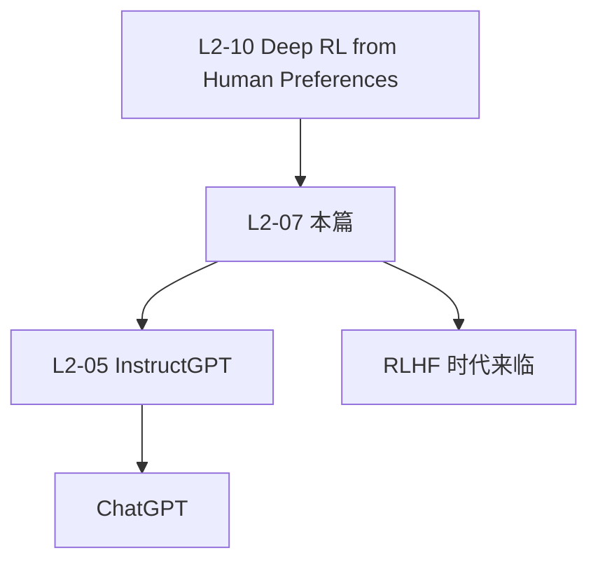

# 📖 案件 L2-07：Learning to Summarize from Human Feedback — RLHF 在生成任务的开山之作

> **《LLM 百案录》第 023 案 · 摘要革命**
> *2020 年 OpenAI 一群人发现：BLEU、ROUGE 这些自动指标和人类偏好相关性差。
> 他们的解法：**别用规则评分，让人类评估，再让模型学习人类偏好。**
> 这是 InstructGPT/ChatGPT 的"前传"——RLHF 第一次在自然语言生成上大获成功。*

🚇 [30秒速览](#速览) ｜ 🚲 [3分钟通读](#通读) ｜ 🚗 [30分钟精读](#精读) ｜ 🚀 [3小时复现](#复现)

🎭 **叙事母题**：📖 **摘要革命** —— 用人类偏好替代自动指标

---

## 0️⃣ 案件档案

| 案情要素 | 内容 |
|---|---|
| **案发时间** | 2020-09（Stiennon et al., OpenAI，[arXiv 2009.01325](https://arxiv.org/pdf/2009.01325)） |
| **嫌疑人** | Nisan Stiennon, Long Ouyang, Jeff Wu, Daniel M. Ziegler, Ryan Lowe, Chelsea Voss et al. |
| **受害者** | ROUGE / BLEU 等自动指标的"高 ROUGE 但人类讨厌"现象 |
| **作案凶器** | Reward Model（学习人类偏好）+ PPO 微调 |
| **作案动机** | "自动指标已经不够用，必须直接对齐人类偏好" |
| **结案陈词** | 1.3B RLHF 模型在 TL;DR 摘要任务上击败了 12B 监督微调模型，证明"小模型 + 好对齐 > 大模型 + 死磕监督" |

**精确事实卡**：

| 字段 | 精确值 | 来源 |
|---|---|---|
| **数据集** | Reddit TL;DR + CNN/DailyMail | Section 4 |
| **三阶段** | SFT → Reward Model → PPO | Section 3 |
| **关键发现** | 1.3B RLHF > 12B SFT，且超越人类参考摘要 | Table 2 |
| **后续** | 直接催生 InstructGPT (2022) → ChatGPT | — |

---

## 1️⃣ <a id="速览"></a>🚇 30 秒速览

> 摘要任务老问题：ROUGE 和人类满意度相关性差。
> 旧方法：用 BLEU/ROUGE 微调 → 模型学到"复述原文"等高分套路 → 但摘要难读。
> RLHF 解法（三步）：
> 1. **SFT**：先用人类摘要做监督微调
> 2. **Reward Model**：人类对两个摘要二选一 → 训练 RM 预测偏好
> 3. **PPO**：用 RM 作为 reward，做策略优化
> 结果：**1.3B 模型超越 12B SFT，甚至超过人类参考摘要**。

---

## 2️⃣ <a id="通读"></a>🚲 3 分钟通读：自动指标的崩塌（Why）

### ROUGE 的局限
```
ROUGE：摘要 vs 参考摘要的 n-gram 重叠
  → 高 ROUGE = 词面重叠多
  → 但好摘要可能重写表达 → 重叠少 → ROUGE 反而低

实测：监督微调到 ROUGE 收敛后
  → 人类评分仍然糟糕
  → "ROUGE 上去了但摘要难读"
```

### RLHF 的核心思想
```
人类很难写出"什么样的摘要好"的规则
但很容易在两个摘要中说"哪个更好"

→ 收集大量"成对偏好"
→ 训练 RM 预测偏好
→ 用 RM 引导 PPO
→ 模型直接朝着"人类喜欢"优化
```

---

## 3️⃣ <a id="精读"></a>🚗 30 分钟精读

### 三阶段训练

#### 阶段 1：SFT
```python
# 在人类写的高质量摘要上做监督微调
loss_sft = -log p(summary | post)
```

#### 阶段 2：Reward Model
```python
# 收集 (post, summary_A, summary_B, preference) 数据
# 训练 RM：r(post, summary) → 标量分数
loss_rm = -log σ(r(post, summary_chosen) - r(post, summary_rejected))
```

#### 阶段 3：PPO
```python
# 用 RM 作为 reward，做策略优化
reward = r(post, generated_summary) - β · KL(π || π_SFT)
                                      └─ 防止偏离 SFT 太远
loss_ppo = clipped_surrogate_loss(reward)
```

### KL 惩罚的作用
不加 KL 惩罚 → 模型会"reward hacking"：生成奇怪文本骗高分。
加 KL 惩罚 → 让 PPO 后的策略不要离 SFT 太远，保留语言流畅性。

### 评估
- **Likert score**：人类对单个摘要打 1-7 分
- **Win rate**：人类在 RLHF 摘要 vs 参考摘要 / SFT 摘要中选择的胜率

---

## 4️⃣ 物证清单（Results）

### TL;DR 数据集
| 模型 | 参数 | vs 参考摘要 win rate |
|---|---|---|
| Lead-3（取前 3 句） | — | 12% |
| Pretrain only | 1.3B | 18% |
| SFT | 1.3B | 36% |
| **RLHF** | **1.3B** | **75%** |
| SFT | 12B | 56% |
| **RLHF** | **6.7B** | **80%** |

### 关键发现
1. **小模型 + RLHF > 大模型 + SFT**：1.3B RLHF 击败 12B SFT
2. **超越人类参考**：RLHF 摘要在人类评估上比"原始 Reddit 用户写的 TL;DR"更受偏好
3. **跨任务泛化**：在 TL;DR 训练的 RM 用到 CNN/DM 上仍有效

### 🔥 Hot Take
1. **RLHF 在 NLG 的"创世篇"**：第一次清晰证明 RLHF 在生成任务上有效。
2. **"小模型 + 对齐 > 大模型 + 死磕"**：定调了 InstructGPT/ChatGPT 的设计哲学。
3. **KL 惩罚是关键**：没有它 PPO 会跑偏，加上它 RLHF 才稳定。

---

## 5️⃣ 🐛 论文没说的坑

1. **标注成本极高**：需要数万对人类偏好对比
2. **RM 偏差会被放大**：RM 偏好啥，PPO 模型就过度优化啥
3. **Sycophancy 雏形**：RLHF 模型开始出现"附和用户"倾向

---

## 6️⃣ 🎲 如果作者偷懒了

**实验**：未深入分析 RM 与人类标注一致性的细节——后续 RLHF 工作才更系统地讨论。
**理论**：未理论分析"为什么 1.3B + RLHF 能超 12B SFT"的容量边界。

---

## 7️⃣ 影响波及



---

## 8️⃣ 侦探手记

L2-07 给我的启发：**指标决定一切**。
> 你优化什么，模型就学什么。
> 如果指标不对（ROUGE 不等于人类偏好），再大的模型、再多的数据也救不了。
> RLHF 的核心不是技术，而是**重新定义了"什么是好"**——把这个定义权交给人类偏好。

---

## 自查清单

**已做到**：
- 解释 ROUGE 等自动指标的局限
- 推导三阶段（SFT → RM → PPO）训练
- 给出 TL;DR 上的实测对比

**❌ 未做到**：
- ❌ 未深入分析 KL 系数 β 的最优选择
- ❌ 未对比 RLHF 与 RLAIF / DPO 等后续替代方案

---

## 🔟 延伸卷宗

### 前置依赖
- 📚 [L2-10 Deep RL from Human Preferences](notes/L2-10_DeepRL_From_Human_Preferences.md)（思想起源）
- 📚 [L2-09 PPO](notes/L2-09_PPO.md)（核心算法）

### 后续推荐
- 🎯 [L2-05 InstructGPT / RLHF](notes/L2-05_InstructGPT_RLHF.md)（直接后继）
- 🎯 [L2-14 DPO](notes/L2-14_DPO.md)（不需要 RM 的 RLHF）
- 🎯 [L4-25 Sycophancy](notes/L4-25_Sycophancy.md)（RLHF 的副作用）

### 🚀 <a id="复现"></a>3 小时复现路径
- 数据集：[OpenAI summarize-from-feedback](https://github.com/openai/summarize-from-feedback)
- 用 trl 库（HuggingFace）做小规模 PPO 实验

---

## 📌 本案归档

| 字段 | 值 |
|---|---|
| 笔记版本 | 「摘要革命版」 |
| 叙事母题 | 📖 摘要革命 |
| 推荐指数 | ⭐⭐⭐⭐ |
| 学习时长 | 30s / 3min / 30min / 3h |
| 上次更新 | 2026-04-30 |
| 下一站 | → [L2-09 PPO](notes/L2-09_PPO.md) |
