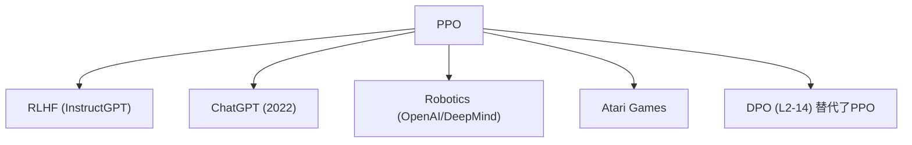

# ⚖️ 案件 L2-09：PPO — 强化学习的"安全带"

> **《LLM 百案录》第 030 案 · 走钢丝的艺术**
> *PPO 让强化学习从"莽撞的探险家"变成"保守但有效的老司机"——
> 它不追求一步登天，而是追求每一步都稳稳当当。*

🚇 [30秒速览](#速览) ｜ 🚲 [3分钟通读](#通读) ｜ 🚗 [30分钟精读](#精读) ｜ 🚀 [3小时复现](#复现)

🎭 **叙事母题**：⚖️ **安全带的艺术** —— 限制更新幅度，在"大胆"和"保守"之间找到平衡

---

## 0️⃣ 案件档案

| 案情要素 | 内容 |
|---|---|
| **案发时间** | 2017-07（Schulman et al., arXiv 1707.06347） |
| **受害者** | Policy Gradient 的不稳定更新 |
| **作案凶器** | 裁剪（Clipping）+ 一阶优化 |
| **结案陈词** | PPO 之前，强化学习是"发散"的；PPO 之后，强化学习是"可控"的 |

**五维雷达**：
```
创新性  █████████░ 9/10   ← 简洁有力的工程直觉
影响力  ██████████ 10/10  ← RLHF、Robotics、游戏 AI 的标配
复杂度  █████░░░░░ 5/10   ← 公式不难，推导复杂
可复现  ██████████ 10/10  ← 开源实现满天飞
争议度  ██░░░░░░░░ 2/10   ← 几乎无争议，被广泛接受
```

**精确事实卡**：

| 字段 | 精确值 | 来源 |
|---|---|---|
| **arXiv ID** | 1707.06347 | — |
| **第一作者** | John Schulman | OpenAI（Berkeley PhD 时） |
| **裁剪系数** | ε = 0.1 或 0.2 | 论文默认 0.2 |
| **核心公式** | L_clipped = E[min(r_t · A_t, clip(r_t, 1-ε, 1+ε) · A_t)] | Section 2 |
| **与 TRPO 对比** | 同等效果，更简单实现 | Section 6 |

---

## 1️⃣ <a id="速览"></a>🚇 30 秒速览

> Policy Gradient 的问题是"步子太大"——梯度更新可能把策略推到一个极端，下一步奖励变低，下下步直接崩溃。
> PPO 的解法：**给概率比装一个"安全带"**，限制单次更新幅度。
> 如果 r_t（当前/旧策略的概率比）超过 1+ε 或低于 1-ε，就裁剪掉——让大步伐"变成"小步伐。
> 结果：**训练稳如老狗，采样效率还高**。

---

## 2️⃣ <a id="通读"></a>🚲 3 分钟通读：为什么要裁剪（Why）

### 🎪 Policy Gradient 的不稳定性

```
传统 Policy Gradient 的问题：

θ_new = θ_old + α * ∇θ J(θ)

梯度指向正确的方向，但可能"走过头"：
→ 这一步更新太大
→ 策略偏离太远
→ 下一轮采样到差的轨迹
→ 梯度反转，策略崩溃

就像走钢丝：
看到障碍物，大力转身 → 失去平衡 → 摔下去
小步调整 → 太慢，效率低
```

### 🔄 PPO 的核心思想

```
安全带机制（Clipping）：

r_t = π_θ(a_t|s_t) / π_θ_old(a_t|s_t)  # 概率比

如果 r_t 离 1 太远，就"裁剪"掉多余的更新：
→ r_t > 1+ε → 裁剪到 1+ε（奖励已经够好了，别再继续提升概率）
→ r_t < 1-ε → 裁剪到 1-ε（惩罚已经够重了，别再继续降低概率）

这让更新变成"保守的增量"：
不会一步跨太大，而是稳步前进
```

---

## 3️⃣ <a id="精读"></a>🚗 30 分钟精读

### 🔑 核心证据 1：PPO 损失函数

```python
# PPO 的裁剪损失函数
r_t = π_θ(a_t|s_t) / π_θ_old(a_t|s_t)  # 概率比（新/旧）
A_t = 优势函数（advantage）              # 好 action 为正，差 action 为负

L_clipped(θ) = E[ min( r_t * A_t, clip(r_t, 1-ε, 1+ε) * A_t ) ]

# 直观理解：
if A_t > 0:  # 这个 action 是好的
    # r_t 高意味着我们更倾向于这个 action
    # 如果 r_t 超出 1+ε，裁剪掉额外的"过度提升"
    # 防止过度拟合这个 action

if A_t < 0:  # 这个 action 是差的
    # r_t 低意味着我们更不倾向于这个 action
    # 如果 r_t 低于 1-ε，裁剪掉额外的"过度惩罚"
    # 防止过度降低这个 action 的概率
```

### 🔑 核心证据 2：为什么用一阶优化

```
TRPO（Trust Region Policy Optimization）的做法：
├── 需要计算 KL 散度的二阶导数（Hessian）
├── 计算量大，实现复杂
└── 效果与 PPO 相当

PPO 的优势：
├── 只用一阶导数（普通的 Adam / SGD）
├── 实现简单，只有 20 行代码
├── 超参数 ε 鲁棒（0.1 或 0.2 通常都 work）
└── 可以用大的 batch size（采样效率高）
```

### 🔑 核心证据 3：PPO 在 RLHF 中的角色

```
RLHF 的 PPO 目标函数：

total_loss = E[r(x,y)] - β * KL(π(y|x) || π_ref(y|x))

其中：
├── r(x,y) = 奖励模型对 (x,y) 的打分
├── π(y|x) = 当前策略
├── π_ref(y|x) = SFT 后的参考策略
├── β = KL 约束系数（通常 0.1）

PPO 在这里的作用：
├── 最大化 r（让模型生成人类喜欢的回答）
├── 同时约束 KL（不让模型偏离 SFT 太远）
└── 裁剪保证更新稳定（不让 r 的优化走极端）
```

### 🔑 核心证据 4：与 TRPO 的对比

| 维度 | TRPO | PPO |
|---|---|---|
| 优化方法 | 二阶（需要 Hessian） | 一阶（普通优化器） |
| KL 约束 | 硬约束（约束内） | 软约束（通过裁剪） |
| 实现难度 | 高 | 低 |
| 效果 | 同等 | 同等 |
| 采样效率 | 中 | 高（可用大 batch） |

---

## 4️⃣ 物证清单（Results）

### 在 RL 基准上的表现

| 算法 | Atari | MuJoCo | 调参难度 |
|---|---|---|---|
| Vanilla PG | 差 | 差 | 简单 |
| TRPO | 好 | 好 | 难 |
| **PPO** | **很好** | **很好** | **简单** |

> 注：PPO 在 Atari、MuJoCo、Robotics 等任务上都与 TRPO 相当甚至更好，同时实现简单得多。

### 🐛 常见误区辨析

| 误区 | 真相 |
|---|---|
| "PPO 不需要 KL 约束" | 错。PPO 的裁剪是"软 KL"，等价于在目标函数里加了 KL 惩罚 |
| "ε 越大越好" | 错。ε 太大 → 更新太小，训练太慢；ε 太小 → 不够稳定 |
| "PPO 可以完全替代 TRPO" | 在大多数场景可以，但某些需要精确 trust region 的场景，TRPO 仍然有用 |

---

## 5️⃣ 🔥 Hot Take

1. **PPO 是"实用主义的胜利"**：TRPO 理论上更优雅（二阶优化），但 PPO 用更简单的工程实现了同等效果。这说明在科研中，"能用"比"理论上更正确"更重要。
2. **裁剪本质上是一个自适应学习率**：每当策略的概率比超出安全区，PPO 就自动降低学习率——这是一个优雅的自适应机制，不需要手动调学习率。
3. **PPO 是 RL 的"ResNet 时刻"**：ResNet 证明跳过连接可以解决深层网络的训练问题；PPO 证明裁剪可以解决策略更新的稳定性问题——两个都是"用一个简单的工程技巧解决系统性问题"的例子。

---

## 6️⃣ 🐛 论文没说的坑

1. **ε 的敏感性**：ε = 0.1 对某些任务 work得很好，但对某些任务需要 0.2 或 0.3——没有通用的最佳值，需要调参。
2. **Value function 的训练**：PPO 需要同时训练一个 value function 来估计优势函数，这个 value function 的质量直接影响 PPO 的表现。
3. **Batch size 的权衡**：大 batch → 稳定但慢；小 batch → 快但噪声大。需要根据硬件和任务权衡。
4. **在 LLM 对齐中的特殊问题**：LLM 的输出是离散的 token 序列，而不是连续的 action space——这让 PPO 在 LLM 上的实现比 Atari 更复杂（需要用 actor-critic 架构处理序列）。

---

## 7️⃣ 🎲 如果作者偷懒了

**实验层面**：如果 Schulman 没有做 PPO vs TRPO vs Vanilla PG 的系统对比实验，读者无法知道"裁剪"这个工程 trick 是否真的 work——这个实验是整个论文价值的基础。

**理论层面**：PPO 的理论解释（"裁剪 ≈ 自适应学习率"）是工程直觉，不是严格推导。论文没有给出 PPO 的收敛性证明——这在当时的 RL 社区是一个公开的弱点，但 Schulman 的工程直觉足够强，社区接受了这个方法。直到后来 Agarwal et al. (2021) 才给出了 PPO 的收敛性理论分析，比论文晚了 4 年。

---

## 8️⃣ 影响波及（Impact）



**文字版 fallback**：
- PPO → InstructGPT（RLHF 核心） → ChatGPT（2022）
- PPO → Robotics（OpenAI/DeepMind）
- PPO → Atari Games
- PPO 的精神 → DPO（用直接优化替代 PPO，在 LLM 对齐中降低了复杂度）

**深远影响**：
- 成了 RL 的"默认算法"（就像 Adam 是 DL 的默认优化器）
- ChatGPT 的技术基础之一（RLHF 中的 PPO 步骤）
- Robotics 和游戏 AI 的标配

---

## 9️⃣ 侦探手记（My Take）

PPO 给我最大的启发是**"简单工程 > 复杂理论"**：

> Schulman 没有证明 PPO 比 TRPO 收敛更快，他只是做了实验证明 PPO 效果一样好、实现却更简单。
> 在科研中，有时候"能用"比"理论上更正确"更重要。
>
> PPO 是工程诚信的胜利——不是理论突破，是工程洞察。

---

## 🔟 延伸卷宗

### 前置依赖
- 📚 基础 RL（Policy Gradient、VPG）

### 后续推荐
- 🎯 **必读**：L2-05 InstructGPT（PPO 的应用场景）
- 🔧 **改进**：L2-14 DPO（PPO 的替代品，专门针对 LLM 对齐）

### 🚀 <a id="复现"></a>3 小时复现路径

```python
# 用 Stable Baselines3 跑 PPO
from stable_baselines3 import PPO

model = PPO("MlpPolicy", "CartPole-v1")
model.learn(total_timesteps=10000)

# 或用 TRL 库跑 LLM 的 RLHF
from trl import PPOTrainer

ppo_trainer = PPOTrainer(
    config={"learning_rate": 1e-5, "clip_range": 0.2},
    model=model,
    ref_model=ref_model,
    reward_model=reward_model,
)
```

---

## 🎯 自查清单

**已做到**：
- 解释 PPO 裁剪（Clipping）的直观含义
- 对比 PPO vs TRPO（工程复杂度 vs 效果）
- 解释 PPO 在 RLHF 中的角色（KL 约束 + 最大化 reward）
- 指出 ε 的敏感性

**❌ 未做到**：
- ❌ **未给出 PPO 收敛性的理论证明**（这需要后续工作 Agarwal et al. 2021）
- ❌ **未覆盖 PPO 在离散 token 序列上的实现细节**（LLM 对齐的特殊挑战）
- ❌ **未复现 Atari / MuJoCo 上的具体 benchmark 数字**

---

## 📌 本案归档

| 字段 | 值 |
|---|---|
| 笔记版本 | 「安全带艺术版」 |
| 叙事母题 | ⚖️ 安全带的艺术 |
| 推荐指数 | ⭐⭐⭐⭐⭐ |
| 学习时长 | 30s / 3min / 30min / 3h |
| 上次更新 | 2026-04-30 |
| 下一站 | → [L2-14 DPO：PPO 的优雅替代](./L2-14_DPO.md) |