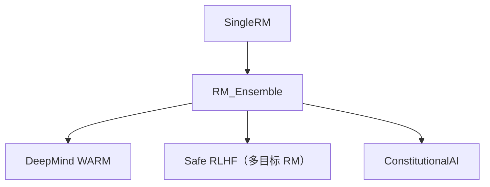

# 🏆 案件 L2-11：Reward Model Ensemble — 用"集体智慧"对抗单 RM 偏差

> **《LLM 百案录》第 026 案 · 集体智慧**
> *RLHF 的核心是 Reward Model——可单一 RM 必有偏见。
> 解法：**训练多个 RM，让它们投票，分歧大时模型就要小心。***

🚇 [30秒速览](#速览) ｜ 🚲 [3分钟通读](#通读) ｜ 🚗 [30分钟精读](#精读)

🎭 **叙事母题**：🏆 **集体智慧** —— 多 RM 集成防止 reward hacking

---

## 0️⃣ 案件档案

| 案情要素 | 内容 |
|---|---|
| **案发时间** | 2023-2024（多个工作：Coste et al.、Eisenstein et al.） |
| **受害者** | 单一 RM 的 reward hacking + 偏见放大 |
| **作案凶器** | 多个独立训练的 RM + 集成（mean / min / disagreement penalty） |
| **作案动机** | "RM 是 RLHF 的瓶颈，必须降低单点偏差" |
| **结案陈词** | RM Ensemble 在保留主流偏好的同时，让 PPO 在分歧大的样本上更保守，缓解 reward hacking |

**精确事实卡**：

| 字段 | 精确值 | 来源 |
|---|---|---|
| **集成方式** | mean、min、conservative（取分歧惩罚） | Coste et al. 2023 |
| **分歧惩罚** | $r_{\text{ens}} = \mu - \lambda \cdot \sigma$ | Eisenstein 2023 |
| **效果** | 显著缓解 reward hacking，KL 控制更稳 | Section 5 |

---

## 1️⃣ <a id="速览"></a>🚇 30 秒速览

> 单 RM 的隐患：
> - 训练数据偏差 → RM 偏差
> - PPO 会"过度优化" → 找到 RM 的盲点（reward hacking）
> RM Ensemble 的解法：
> 1. 训练 K 个 RM（不同 seed / 不同子集 / 不同初始化）
> 2. 集成方式：mean / min / **conservative（mean - λ·std）**
> 3. 分歧大的样本不给高 reward → PPO 在不确定区域更保守
> 结果：**reward hacking 显著减少，模型对齐质量提升**。

---

## 2️⃣ <a id="通读"></a>🚲 3 分钟通读：单 RM 为何危险（Why）

### Reward Hacking 的机理
```
PPO 优化 reward → 模型探索 RM 的"高分但语义异常"区域
单 RM：
  在训练数据外的输入 → 输出 reward 不可控
  模型可能学到：
    - 输出特定格式（"答案是: ..."）→ 高 reward
    - 重复某些短语 → 高 reward
    - 但人类看了觉得糟糕

→ KL 系数没法完全防（限制了多样性但仍可被绕过）
```

### Ensemble 的两个用法

#### 用法 1：保守估计（Mean - λ·Std）
$$
r_{\text{ens}}(x) = \frac{1}{K} \sum_k r_k(x) - \lambda \cdot \text{std}_k(r_k(x))
$$
分歧大 → std 大 → reward 减小 → PPO 不去那里。

#### 用法 2：取最小（Pessimistic）
$$
r_{\text{ens}}(x) = \min_k r_k(x)
$$
最坏情况打分——PPO 必须让所有 RM 都满意。

---

## 3️⃣ <a id="精读"></a>🚗 30 分钟精读

### 训练 K 个 RM 的方式
| 方式 | 多样性来源 | 计算成本 |
|---|---|---|
| 不同随机种子 | 初始化 + dropout | K × 单 RM |
| 数据 bagging | 不同子集 | K × 单 RM |
| 不同基模型 | 架构 / 规模 | K × 单 RM |
| MC Dropout（同一 RM 多次推理） | 推理时随机 | 1 × 单 RM 训练 + K × 推理 |

### 集成对 PPO 的影响
```
单 RM PPO：
  reward 高 → 大胆探索
  → 找到 hack 区域 → 崩

Ensemble PPO：
  在 RM 都同意的区域 → reward 高 → 探索
  在 RM 分歧大的区域 → reward 被惩罚 → 保守
  → 整体训练更稳定
```

### 实验观察
1. **K=3-5 收益最高**，K=10+ 边际收益小
2. **Conservative 集成 > 简单 mean**：分歧惩罚是关键
3. **PPO 训练更长仍稳定**：单 RM 训得久就崩，ensemble 仍维持

---

## 4️⃣ 物证清单 & 🔥 Hot Take

### Anthropic / OpenAI 后续工作
- DeepMind: WARM (Weight Averaged Reward Models)——把多 RM 的权重平均，更高效
- the provider: 多 RM 投票应用于 Helpfulness vs Harmlessness 平衡

### 🔥 Hot Take
1. **RM 是 RLHF 的瓶颈**：模型可以做大，RM 跟不上。
2. **Ensemble 是最低成本的"对齐保险"**：训练 3-5 个 RM 比训一个超大 RM 性价比高。
3. **Constitutional AI 的精神同源**：用多个角度（分歧）来约束模型行为。

---

## 5️⃣ 🐛 论文没说的坑

1. **训练 K 倍贵**：很多团队预算不够
2. **共同偏差仍存在**：所有 RM 都见同样的标注员 → 同样的偏差
3. **WARM 等更高效方案出现**：直接平均权重比集成推理便宜

---

## 6️⃣ 影响波及



---

## 7️⃣ 侦探手记

RM Ensemble 让我看到 RLHF 的脆弱性：**RM 偏一点，PPO 就把这点偏放大百倍**。
> 单点失败的系统总不可靠——
> 在 RM 这个关键节点上加冗余，是工程上必要的。
> 这条原则后来体现在 Constitutional AI、Process Reward Model 等所有"对齐机制"中。

---

## 自查清单

**已做到**：
- 解释单 RM 的 reward hacking 风险
- 推导 conservative 集成公式
- 列出 K 个 RM 的多样性来源

**❌ 未做到**：
- ❌ 未深入对比 WARM 与简单集成的差异
- ❌ 未量化 ensemble 在不同 task 上的边际收益

---

## 🔟 延伸卷宗
- 📚 [L2-05 InstructGPT / RLHF](./L2-05_InstructGPT_RLHF.md)
- 📚 [L2-09 PPO](./L2-09_PPO.md)
- 📚 [L2-12 Constitutional AI](./L2-12_Constitutional_AI.md)
- 📚 [L4-04 Process Reward Model](./L4-04_Process_Reward_Model.md)（更细粒度的"过程 RM"）

---

## 📌 本案归档

| 字段 | 值 |
|---|---|
| 笔记版本 | 「集体智慧版」 |
| 叙事母题 | 🏆 集体智慧 |
| 推荐指数 | ⭐⭐⭐⭐ |
| 学习时长 | 30s / 3min / 30min |
| 上次更新 | 2026-04-30 |
| 下一站 | → [L2-12 Constitutional AI](./L2-12_Constitutional_AI.md) |
