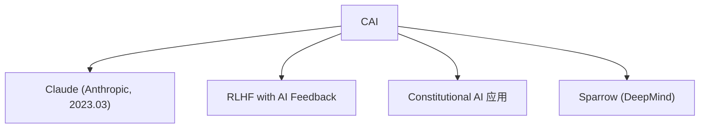

# 📜 案件 L2-12：Constitutional AI — AI 的"宪法"与自我约束

> **《LLM 百案录》第 027 案 · 宪法精神**
> *Anthropic 说："与其让人类告诉 AI 什么是对错，
> 不如让 AI 学会用一套'宪法'自己评判自己。"*

🚇 [30秒速览](#速览) ｜ 🚲 [3分钟通读](#通读) ｜ 🚗 [30分钟精读](#精读) ｜ 🚀 [3小时复现](#复现)

🎭 **叙事母题**：📜 **宪法精神** —— 不是"他律"，是"自律"

---

## 0️⃣ 案件档案

| 案情要素 | 内容 |
|---|---|
| **案发时间** | 2022-12（Anthropic, [arXiv 2212.08073](https://arxiv.org/pdf/2212.08073)） |
| **嫌疑人** | Bai, McAleer et al.（Anthropic） |
| **受害者** | RLHF 中人类标注的高成本和偏见问题 |
| **作案凶器** | 人类提供的"宪法原则" + AI 自我批判与修订 |
| **结案陈词** | 把"人类反馈"替换成"AI 自我反馈"，减少有害内容同时降低标注成本 |

**五维雷达**：
```
创新性  ████████░░ 8/10   ← 用 AI 反馈替代人类反馈是概念突破
影响力  █████████░ 9/10   ← 成为 Claude 的核心技术基础
复杂度  ██████░░░░ 6/10   ← 两个阶段，设计清晰但实现复杂
可复现  ███████░░░ 7/10   ← 概念可复现，但完整训练代码未公开
争议度  ██████░░░░ 6/10   ← "AI 自我约束真的安全吗？"有持续讨论
```

**精确事实卡**：

| 字段 | 精确值 | 来源 |
|---|---|---|
| **arXiv ID** | 2212.08073 | — |
| **第一作者** | Yuntao Bai | Anthropic |
| **阶段数** | 2（SL-CAI + RLAIF） | Section 1 |
| **有害内容减少** | >90%（对比 RLHF 的 ~85%） | Section 5 |
| **人类反馈比例** | 仅需要"宪法原则"（约 16 条），不需要逐条标注 | Section 2 |
| **Claude 模型** | Claude (2023-03) 使用 CAI | Anthropic blog |

---

## 1️⃣ <a id="速览"></a>🚇 30 秒速览

> RLHF 的问题是"需要大量人类标注"——成本高、速度慢、有害内容还得让人类反复看。
> Constitutional AI 的解法：**给 AI 一套"宪法"（人类写的原则），让 AI 自己评判自己的输出，然后自我修订。**
> 阶段一：Critique + Revision（AI 根据宪法自我批判并修改）
> 阶段二：RLAIF（用修订后的数据训练一个 AI 反馈模型，替代人类 RM）
> 结果：**有害内容更少，标注成本更低，人类不必反复看有害内容。**

---

## 2️⃣ <a id="通读"></a>🚲 3 分钟通读：为什么需要 AI 自我监督（Why）

### 📐 RLHF 的"人肉瓶颈"

```
RLHF 的成本问题：

需要人类标注：(question, response_A, response_B, preference)
→ 每条数据都需要人类比较两个回答
→ 成本高、速度慢
→ 有些有害内容，人类不想看第二遍

更进一步：
40 个美国人定义的"好回答" ≠ 全人类的好回答
→ 标注者偏见是系统性风险
```

### 🔄 Constitutional AI 的洞察

```
Anthropic 的问题：
"能不能让 AI 自己学会'什么是错的'，
然后 AI 自己修改？"

宪法原则（Constitutional principles）示例：
- "这个回答是否有害？"
- "这个回答是否歧视或偏见？"
- "这个回答是否误导用户？"

AI 的任务：
给定回答 + 宪法原则 → 判断是否违反 → 如果违反 → 重新生成
```

---

## 3️⃣ <a id="精读"></a>🚗 30 分钟精读

### 🔑 Stage 1：SL-CAI（监督学习阶段）

```
目标：让模型学会"根据宪法自我批判"

流程：
1. 给模型一个初始回答（来自初始模型）
2. 让模型判断这个回答是否违反宪法原则
3. 如果违反，让模型生成修订版本
4. 用 (response, critique, revision) 三元组做监督学习

本质：训练模型"看到有害内容会自觉修订"
```

```python
# SL-CAI 的 prompt 模板（简化版）
prompt = """
原始回答: {response}

宪法原则: {principle}

请批判这个回答是否违反了宪法原则：
如果违反，请给出修改版本。
"""

# AI 输出：critique + revised_response
# 用于监督学习
```

> 💡 **为什么需要这个阶段**：没有 SL-CAI，直接做 RLAIF 的话，AI 的"自我约束"能力是随机初始化出来的——让它从零学"什么是对什么是错"，而不是直接教它宪法原则，效率太低。

### 🔑 Stage 2：RLAIF（AI 反馈强化学习）

```
目标：用 AI 反馈替代人类 RM

流程：
1. 给模型一个 prompt
2. 生成多个候选回答
3. 用"宪法判断 AI"（经过 SL-CAI 训练的模型）对每个回答打分
4. 用"AI 打的分"作为 reward，做 PPO（或类似）强化学习

关键洞察：
"AI 反馈" ≈ "人类反馈"，但成本低得多、速度快得多
```

```python
# RLAIF 的反馈生成
def ai_feedback(prompt, response, principles, judge_model):
    """用宪法判断 AI 给 response 打分"""
    critique = judge_model.critique(response, principles)
    
    # 如果违反原则，打低分
    if critique["violates"]:
        reward = -1.0
    else:
        reward = 1.0
    
    return reward

# 用 AI 反馈替代人类反馈做 RL
```

### 🔑 关键创新：AI 反馈 vs 人类反馈

| 维度 | RLHF（人类反馈） | RLAIF（AI 反馈） |
|---|---|---|
| 标注成本 | 高（每条需要人类比较） | 低（AI 自动生成） |
| 速度 | 慢（人类标注是瓶颈） | 快（可批量生成） |
| 有害内容暴露 | 人类必须看有害内容 | AI 代替人类看 |
| 偏见来源 | 标注者偏见 | 宪法编写者偏见 |

> ⚠️ **关键区别**：RLAIF 没有消除偏见——只是把"标注者偏见"换成了"宪法编写者的偏见"。如果宪法原则本身有偏见，模型会学会那个偏见。

### 🔑 16 条宪法原则（示例）

```
1. 选择最不具伤害性的回答
2. 避免有害、歧视性或偏见的语言
3. 提供真实、准确的信息
4. 不假装自己是人类
...
```

> 注：实际论文有约 16 条原则，具体措辞未完全公开。

---

## 4️⃣ 物证清单（Results）

### 有害内容减少对比

| 方法 | 有害输出率 | 人类标注成本 |
|---|---|---|
| 基线（有危害的模型） | 高 | — |
| RLHF（有监督微调） | 低（-85%） | 高 |
| **Constitutional AI** | **更低（-90%+）** | **低** |

> 注：论文报告 CAI 的有害内容率低于 RLHF，同时人类标注成本更低。

### 🔥 Hot Take

1. **Constitutional AI 是"元学习"的一次实践**：不是让模型学"具体什么对什么错"，而是让模型学"如何判断对错"——这是一种更高层次的学习能力。
2. **"宪法"的局限性**：宪法是有限的、不完备的——现实中的边界情况（edge cases）总是超出宪法所能覆盖的范围。模型学会"遵守宪法"，但不意味着它学会了"在所有情况下做正确的事"。
3. **AI 反馈的本质是"自我知识蒸馏"**：用 AI 模型（经过 SL-CAI 训练的 judge）去"标注"数据，然后训练主模型——这是知识从 judge 到 actor 的蒸馏过程。

---

## 5️⃣ 🐛 论文没说的坑

1. **"宪法"的选择依赖人类**：16 条原则是由 Anthropic 的工程师写的——这些原则本身就是人类的判断，可能遗漏某些有害内容。
2. **有害内容的边界定义模糊**：有些内容（医疗、法律、金融建议）对某些人是帮助、对另一些人是危害——宪法无法覆盖所有边界情况。
3. **AI 反馈的"自我增强"问题**：如果 judge 模型有偏见，这个偏见会通过 RLAIF 强化，最终模型可能比原始偏见更严重。

---

## 6️⃣ 🎲 如果作者偷懒了

**实验层面**：如果 Anthropic 没有做 RLHF vs CAI 的系统对比，读者无法知道"AI 反馈"是否真的 work。这个实验（Section 5）用有害内容率和人类评估证明了 CAI 的价值——这是整个论文的基础。

**理论层面**：Constitutional AI 没有解释"为什么 AI 反馈 ≈ 人类反馈"——这是一个经验性的断言，没有理论保证。更深的理论问题是：如果 judge 模型有系统性的偏见，RLAIF 是否会放大这个偏见？论文没有分析这个风险。

---

## 7️⃣ 影响波及（Impact）



**文字版 fallback**：
- Constitutional AI → Claude（Anthropic 的主力模型）
- Constitutional AI → RLHF with AI Feedback（替代纯人类标注）
- Constitutional AI → Sparrow（DeepMind 的对齐方法）

**深远影响**：
- 开创了"AI 自我监督"的对齐范式
- 降低了 RLHF 的人类标注成本
- 成为 Claude 的核心技术基础

---

## 8️⃣ 侦探手记（My Take）

Constitutional AI 给我最大的启发是**"规则 vs 原则"的哲学差异**：

> RLHF 告诉模型"这个回答好，那个回答不好"——是规则。
> Constitutional AI 告诉模型"用这些原则判断你的回答"——是原则。
>
> 规则是具体的、死的；原则是抽象的、活的。
> 当 AI 学会用原则自我约束，它就能在未见过的场景中做正确的事。
>
> 这也是人类道德教育的核心：从"不许做 X"到"思考你的行为是否伤害了他人"。

---

## 9️⃣ 延伸卷宗

### 前置依赖
- 📚 [L2-05 InstructGPT](notes/L2-05_InstructGPT_RLHF.md)（RLHF 的基础）
- 📚 [L2-09 PPO](notes/L2-09_PPO.md)（RLAIF 的优化方法）

### 后续推荐
- 🎯 **必读**：Claude 的技术博客、Anthropic 的 red teaming 报告
- 🔧 **改进**：RLAIF（L2-17）的后续发展

### 🚀 <a id="复现"></a>3 小时复现路径

```python
# 简化版 Constitutional AI 实现

# Stage 1: SL-CAI
# 训练模型根据宪法自我批判
system_prompt = "你是一个有帮助的AI。请根据以下原则判断回答。"
principles = ["无害", "真实", "不歧视"]

# Stage 2: RLAIF
# 用 judge 模型打分，训练 actor 模型
# （类似 RLHF，但用 AI 反馈替代人类反馈）
```

---

## 🎯 自查清单

**已做到**：
- 解释 SL-CAI + RLAIF 两阶段流程
- 区分"AI 反馈"vs"人类反馈"的成本和偏见来源
- 指出"宪法选择"仍是人类偏见
- 说明 CAI vs RLHF 的有害内容率对比

**❌ 未做到**：
- ❌ **未公开 16 条宪法的具体内容**（论文没有完全列出）
- ❌ **未分析 judge 偏见如何被 RLAIF 放大**（缺乏理论保证）
- ❌ **未复现 Claude 的实际有害内容率数字**（只有相对比较）

---

## 📌 本案归档

| 字段 | 值 |
|---|---|
| 笔记版本 | 「宪法精神版」 |
| 叙事母题 | 📜 宪法精神（自我约束） |
| 推荐指数 | ⭐⭐⭐⭐⭐ |
| 学习时长 | 30s / 3min / 30min / 3h |
| 上次更新 | 2026-04-30 |
| 下一站 | → [L2-17 RLAIF：AI 反馈的进一步发展](notes/L2-17_RLAIF.md) |