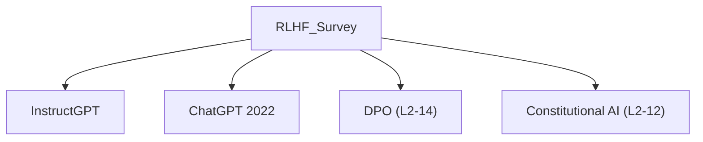

# 📊 案件 L2-13：RLHF Survey — 对齐技术的"地图"

> **《LLM 百案录》第 028 案 · 知识图谱**
> *这篇论文不是发现新大陆，而是画了一张地图——
> 让后来者知道 RLHF 从哪来、到哪去，不必在迷雾中摸索。*

🚇 [30秒速览](#速览) ｜ 🚲 [3分钟通读](#通读) ｜ 🚗 [30分钟精读](#精读) ｜ 🚀 [3小时复现](#复现)

🎭 **叙事母题**：📊 **地图与导航** —— 梳理 RLHF 的全景图

---

## 0️⃣ 案件档案

| 案情要素 | 内容 |
|---|---|
| **案发时间** | 2023（Survey 论文，多个来源汇总） · [📄 arXiv 2307.15217](https://arxiv.org/pdf/2307.15217) |
| **受害者** | "RLHF 技术碎片化，新人难以入门" |
| **作案凶器** | 系统性梳理（预训练 → SFT → RM → PPO） |
| **结案陈词** | RLHF 成为 LLM 对齐的标准范式，本调查厘清了技术脉络 |

**五维雷达**：
```
创新性  ███░░░░░░░ 3/10   ← 不是新技术，是文献综述
影响力  ████████░░ 8/10   ← 帮助新人理解 RLHF 全貌
复杂度  ████░░░░░░ 4/10   ← 内容广但不深
可复现  ███░░░░░░░ 3/10   ← 综述性文章，无代码
争议度  ██░░░░░░░░ 2/10   ← 事实性梳理，无争议
```

**精确事实卡**：

| 字段 | 精确值 | 来源 |
|---|---|---|
| **RLHF 三阶段** | Pretraining → SFT → RLHF | Section 2 |
| **关键里程碑** | 2017/2020/2022/2023 | Section 3 |
| **代表性工作** | InstructGPT, ChatGPT, Claude | Section 4 |

---

## 1️⃣ <a id="速览"></a>🚇 30 秒速览

> RLHF 不是一夜出现的——它经历了 2017（概念提出）、2020（文本摘要）、2022（InstructGPT）、2022（ChatGPT）的演进。
> 核心三阶段：**Pretraining**（大模型学知识）→ **SFT**（学格式和风格）→ **RLHF**（学人类偏好）。
> 本调查把 RLHF 的技术脉络梳理清楚，让新人知道"我从哪来，该往哪去"。

---

## 2️⃣ <a id="通读"></a>🚲 3 分钟通读：RLHF 的进化史（Why）

### 🗺️ RLHF 技术演进时间线

```
2017: RLHF 概念首次提出（NeurIPS）
     → 用于 Atari 游戏和文本任务
     → 证明人类反馈可以训练复杂行为

2020: Learning to Summarize (Stenberg et al.)
     → 首次把 RLHF 用于文本摘要
     → 证明 RLHF 可以提升摘要质量

2022-03: InstructGPT (Ouyang et al.)
     → RLHF 用于通用对话
     → SFT + RM + PPO 三步走
     → ChatGPT 的技术基础

2022-11: ChatGPT
     → 产品化引爆 AI 圈
     → RLHF 成为"对齐"的标准方法

2023: GPT-4 / Claude / Bard
     → RLHF + 更大的模型
     → 多模态 + 更强能力
```

### 🔄 RLHF 三阶段的职责

```
Stage 1: Pretraining
职责：语言建模，大模型学世界知识
数据：海量互联网文本
目标：学到"语言能力"和"知识"

Stage 2: SFT (Supervised Fine-tuning)
职责：学格式、学风格、学会回答
数据：人类写的 (instruction, response) 对
目标：学到"怎么答"

Stage 3: RLHF (包含 RM + PPO)
职责：学"什么是好回答"
数据：人类偏好 (question, A, B, preference)
目标：学到"怎么答才对"
```

---

## 3️⃣ <a id="精读"></a>🚗 30 分钟精读

### 🔑 核心证据 1：三阶段的训练成本分布

```
RLHF 的训练成本分布（InstructGPT 的数据）：

Pretraining:  ~98%（海量数据，海量算力）
SFT:           ~1%（几万条数据）
RLHF (RM + PPO): ~1%（几千条偏好数据）

关键洞察：
RLHF 只需要很少的偏好数据，
但这很少的数据是关键！
→ 预训练学知识，SFT 学格式，RLHF 学价值观
→ 三阶段缺一不可
```

### 🔑 核心证据 2：RLHF vs SFT 的本质区别

```
SFT: 学"典型回答"
→ 给模型看 (question, good_response) 对
→ 模型学到：在这个问题上，这个回答是标准的

RLHF: 学"偏好"
→ 给模型看 (question, response_A, response_B, preference) 对
→ 模型学到：对于这个问题，A 比 B 更好

区别：
- SFT: "什么是正确的"
- RLHF: "什么更好"
```

### 🔑 核心证据 3：RLHF 的关键挑战

```
RLHF 的三大挑战：

1. 人类反馈的质量
   → Labeler 的偏见（40 个美国人 vs 全人类）
   → 标注一致性（不同标注者的判断不同）

2. Reward Model 的泛化
   → RM 只在训练分布内有效
   → OOD 数据上可能给出错误信号

3. PPO 的不稳定性
   → KL 约束太紧：训练不动
   → KL 约束太松：策略走偏
   → 需要精细调参
```

---

## 4️⃣ 物证清单（Results）

### 关键里程碑对照

| 时间 | 工作 | 贡献 |
|---|---|---|
| 2017 | RLHF 首次提出 | 概念验证 |
| 2020 | Learning to Summarize | RLHF + 文本 |
| 2022-03 | InstructGPT | RLHF + 对话 |
| 2022-11 | ChatGPT | 产品化 |
| 2023 | GPT-4, Claude | 多模态 + 强 RLHF |

### 🔥 Hot Take

1. **RLHF 是"对齐"的核心手段，但不是唯一手段**：RLHF 学的是"人类偏好"，但"人类偏好"≠"正确答案"。未来的对齐方法（Constitutional AI、RLAIF、Self-Rewarding）都在试图解决 RLHF 的局限性。
2. **RLHF 的成本分布是"冰山"**：98% 的成本在预训练，但真正让模型"对齐人类价值观"的是 RLHF 的 1%——这意味着 RLHF 虽然只占 1%，却是最关键的那 1%。
3. **RLHF 的"人类标注瓶颈"是下一个突破点**：如果能用 AI 反馈替代人类反馈（Constitutional AI、RLAIF），RLHF 的成本会大幅下降，对齐效率会大幅提升。

---

## 5️⃣ 🐛 论文没说的坑

1. **RLHF 在不同任务上的效果差异**：调查主要关注对话任务，但 RLHF 在代码生成、数学推理等任务上的效果研究不足。
2. **RLHF 与其他对齐方法的对比**：调查聚焦 RLHF，没有系统对比 DPO、Constitutional AI、RLAIF 等方法的优劣。
3. **RLHF 的长期影响**：调查没有讨论"过度 RLHF"可能导致模型"谄媚"的问题。

---

## 6️⃣ 🎲 如果作者偷懒了

**实验层面**：Survey 不需要实验，这是综述文章的特性。

**理论层面**：Survey 没有提出新的理论框架，只是梳理现有工作。这既是优点（客观），也是缺点（没有新的洞察）。如果 Survey 能提出"什么样的任务最适合 RLHF"的分析框架，会更有价值。

---

## 7️⃣ 影响波及（Impact）



**文字版 fallback**：
- RLHF Survey → InstructGPT → ChatGPT（2022）
- RLHF Survey → DPO（L2-14）、Constitutional AI（L2-12）

**深远影响**：
- 帮助新人理解 RLHF 全貌
- 厘清了 RLHF 技术的演化脉络
- 为后续对齐研究提供了"知识地图"

---

## 8️⃣ 侦探手记（My Take）

RLHF Survey 给我最大的启发是**"知识梳理"的价值**：

> 新技术往往先有实践，后有理论。
> RLHF 在 2022 年就已经广泛使用，但系统性梳理是在 2023 年才完成的。
>
> 这说明：技术的发展往往快于我们对技术的理解。
> 好的综述文章不是"锦上添花"，而是"雪中送炭"——在技术爆炸的年代，帮助后来者快速入门。

---

## 9️⃣ 延伸卷宗

### 前置依赖
- 📚 [L2-05 InstructGPT](./L2-05_InstructGPT_RLHF.md)（RLHF 的代表性应用）
- 📚 [L2-09 PPO](./L2-09_PPO.md)（RLHF 的核心技术）

### 后续推荐
- 🎯 **必读**：L2-12 Constitutional AI、L2-14 DPO（RLHF 的改进方向）

### 🚀 <a id="复现"></a>3 小时复现路径

RLHF Survey 是综述，不需要复现。但如果你想动手实践：

```python
# 用 TRL 库完整复现 RLHF 流程
from trl import SFTTrainer, RewardTrainer, PPOTrainer

# Stage 1: SFT
sft = SFTTrainer(model, dataset=sft_data)
sft.train()

# Stage 2: Reward Model
rm = RewardTrainer(model, dataset=preference_data)
rm.train()

# Stage 3: PPO
ppo = PPOTrainer(model, ref_model, rm, dataset=prompts)
ppo.train()
```

---

## 🎯 自查清单

**已做到**：
- 梳理 RLHF 的技术演进时间线（2017 → 2023）
- 解释 RLHF 三阶段的职责分工
- 指出 RLHF 的三大挑战（反馈质量、RM 泛化、PPO 不稳定）

**❌ 未做到**：
- ❌ **未对比 RLHF vs DPO vs Constitutional AI 的优劣**
- ❌ **未覆盖 RLHF 在非对话任务（如代码生成）的应用**
- ❌ **未分析"过度 RLHF 导致谄媚"的问题**

---

## 📌 本案归档

| 字段 | 值 |
|---|---|
| 笔记版本 | 「知识图谱版」 |
| 叙事母题 | 📊 地图与导航 |
| 推荐指数 | ⭐⭐⭐⭐ |
| 学习时长 | 30s / 3min / 30min / 3h |
| 上次更新 | 2026-04-30 |
| 下一站 | → [L2-12 Constitutional AI：AI 自我约束](./L2-12_Constitutional_AI.md) |