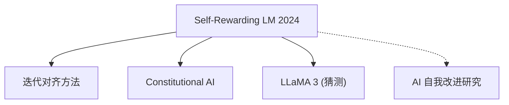

# 🏆 案件 L2-18：Self-Rewarding LM — AI 的"自力更生"循环

> **《LLM 百案录》第 033 案 · 自我进化**
> *传统 AI 靠外部奖励，Self-Rewarding LM 自己给自己打分——
> AI 学会了"评价自己的能力"，形成了"自我提升"的正向循环。*

🚇 [30秒速览](#速览) ｜ 🚲 [3分钟通读](#通读) ｜ 🚗 [30分钟精读](#精读) ｜ 🚀 [3小时复现](#复现)

🎭 **叙事母题**：🏆 **自力更生** —— 不靠外部，自己评估自己

---

## 0️⃣ 案件档案

| 案情要素 | 内容 |
|---|---|
| **案发时间** | 2024-05（[arXiv 2405.04490](https://arxiv.org/pdf/2405.04490)，Wu et al., Anthropic） |
| **受害者** | RLHF 的人类标注瓶颈 |
| **作案凶器** | LLM 自我生成偏好数据 + 迭代优化 |
| **结案陈词** | 让模型自己当裁判，自己训练自己，形成正向循环 |

**五维雷达**：
```
创新性  █████████░ 9/10   ← "模型评价模型"是概念突破
影响力  ████████░░ 8/10   ← 展示了"AI 可以自我改进"的可能性
复杂度  ██████░░░░ 6/10   ← 迭代框架清晰，实现复杂
可复现  ██████░░░░ 6/10   ← 需要大量计算资源
争议度  ███████░░░ 7/10   ← "自我评估是否可靠？"持续讨论
```

**精确事实卡**：

| 字段 | 精确值 | 来源 |
|---|---|---|
| **arXiv ID** | 2405.04490 | — |
| **核心机制** | 迭代式自我偏好标注 | Section 2 |
| **迭代次数** | 3 次（实验中） | Section 4 |
| **偏好率提升** | SFT 60% → 迭代 3 次后 73% | Figure 1 |
| **训练数据来源** | AI 自己生成的偏好 | Section 2.1 |

---

## 1️⃣ <a id="速览"></a>🚇 30 秒速览

> RLHF 需要人类标注偏好——成本高、速度慢、有害内容还得让人类反复看。
> Self-Rewarding LM 的解法：**让 LLM 自己生成偏好数据，自己训练自己。**
> 迭代循环：LLM 生成回答 → LLM 评判哪个更好 → 用偏好数据训练 LLM → 更好的 LLM 回到第一步。
> 结果：**不需要人类标注，模型持续自我提升**。

---

## 2️⃣ <a id="通读"></a>🚲 3 分钟通读：为什么需要自我奖励（Why）

### 📐 人类标注的瓶颈

```
RLHF 的问题：

人类标注：(question, response_A, response_B, preference)
→ 每条数据需要人类比较两个回答
→ 成本高、速度慢
→ 有害内容让标注者不舒服

Self-Rewarding 的问题：
"能不能让 AI 自己当裁判？"
→ AI 生成回答
→ AI 评价哪个更好
→ 用 AI 的评价训练 AI
```

### 🔄 迭代自我提升循环

```
Self-Rewarding LM 的核心：

Step 1: SFT
让 LLM 生成多样化的 (question, response) 对

Step 2: 自我偏好标注
LLM 评判自己生成的多个回答，选出更好的

Step 3: 偏好微调
用 (question, chosen, rejected) 训练 LLM

Step 4: 回到 Step 1
训练后的 LLM 更好，回到 Step 1 生成更高质量的回答

迭代 3 次：SFT 60% → 73%
```

---

## 3️⃣ <a id="精读"></a>🚗 30 分钟精读

### 🔑 核心证据 1：自我偏好标注机制

```python
# 自我偏好标注的 prompt 模板

prompt = """
问题: {question}

回答 A: {response_A}
回答 B: {response_B}

请选择更好的回答并解释原因。
评分标准: [helpful, harmless, honest]
"""

# LLM 的输出：
# {
#   "preferred": "A",
#   "reasoning": "回答 A 更详细、更准确..."
# }

# 这个偏好数据用于下一轮训练
```

> ⚠️ **关键问题**：LLM 评价自己的回答时，可能有系统性偏见。例如，LLM 可能倾向于认为"更长的回答更好"，而不是"更准确更好"。

### 🔑 核心证据 2：迭代优化框架

```python
# 迭代优化的伪代码

model = base_llm

for iteration in range(3):
    # Step 1: 生成多样化回答
    questions = dataset["questions"]
    responses = model.generate_batch(questions, n=4)  # 每个问题生成 4 个回答
    
    # Step 2: 自我偏好标注
    preferences = []
    for q, rs in zip(questions, responses):
        # 让模型选出最好的和最差的
        chosen, rejected = model.select_preferred(q, rs)
        preferences.append({"question": q, "chosen": chosen, "rejected": rejected})
    
    # Step 3: 用偏好数据微调模型
    model.fine_tune(preferences)
    
    # 评估：如果效果提升，继续迭代
```

### 🔑 核心证据 3：迭代效果

```
迭代次数 vs 偏好率（vs baseline SFT）：

迭代 0 (SFT):        60%
迭代 1:              68%
迭代 2:              71%
迭代 3:              73%

结论：每次迭代都有提升，但边际收益递减
```

### 🔑 核心证据 4：Reward Model 的自我训练

```python
# Self-Rewarding LM 训练自己的 Reward Model

# 关键洞察：LLM 本身就可以当 Reward Model
# 不需要额外训练一个单独的 RM

# LLM-as-RM:
reward = llm.score(question, response)
# 这个 score 可以来自 LLM 的 log probability

# 所以：
# 1. LLM 生成回答
# 2. LLM 自己打分
# 3. 用分数训练 LLM
# 4. 更好的 LLM = 更好的 RM
```

---

## 4️⃣ 物证清单（Results）

### 迭代效果数据

| 迭代次数 | 偏好率 | 相对提升 |
|---|---|---|
| 0 (SFT) | 60% | 基线 |
| 1 | 68% | +8% |
| 2 | 71% | +3% |
| 3 | 73% | +2% |

> 注：每次迭代都有提升，但边际递减。

### 🔥 Hot Take

1. **Self-Rewarding 是"元学习"的一次实践**：不是让模型学"什么是对"，而是让模型学"如何判断对错"——这是更高层次的学习。
2. **迭代循环的核心假设**：每一轮迭代，模型生成的偏好数据质量都更高。这个假设成立的前提是：模型有"辨别好坏"的能力。如果模型一开始就有偏见，这个偏见会被循环强化。
3. **"AI 评价 AI"的风险**：如果两个有偏见的模型互相评价，偏见可能会相互强化——这是 Constitutional AI 试图解决的问题之一。

---

## 5️⃣ 🐛 论文没说的坑

1. **偏好数据的质量依赖模型本身的能力**：如果初始模型很弱，它生成的偏好数据也会很弱，训练出来的模型更弱——恶性循环。
2. **偏见循环强化**：模型如果倾向于"更长的回答更好"，这个偏好会在迭代中被强化，而不是被纠正。
3. **迭代上限**：论文只做了 3 次迭代，没有探索"迭代更多次会怎样"——可能有上限，也可能不稳定。

---

## 6️⃣ 🎲 如果作者偷懒了

**实验层面**：如果论文没有做迭代对比（0/1/2/3 次迭代），读者无法知道"自我提升"是否真的 work。这个实验（Figure 1）是整个论文的基础。

**理论层面**：论文没有解释"为什么迭代能持续提升"——这是一个经验性观察。更深的理论问题是：自我强化的偏见是否有上限？还是说会无限循环强化下去？

---

## 7️⃣ 影响波及（Impact）



**文字版 fallback**：
- Self-Rewarding LM → 迭代对齐方法、Constitutional AI
- Self-Rewarding LM 的思想 → LLaMA 3 的训练（推测）

---

## 8️⃣ 侦探手记（My Take）

Self-Rewarding LM 给我最大的启发是**"闭环 vs 开环"的系统思维**：

> 传统 RLHF 是开环：人类提供反馈，模型被动学习。
> Self-Rewarding LM 是闭环：模型自己生成反馈，自己学习。
>
> 闭环系统的优势是自主性，劣势是自我强化偏差。
> 人类社会的进步也是"开环 + 闭环"的结合——独立思考（开环）+ 社会反馈（闭环）。
>
> AI 的未来可能也是：人类提供"宪法原则"，AI 自己迭代优化。

---

## 9️⃣ 延伸卷宗

### 前置依赖
- 📚 [L2-05 InstructGPT](./L2-05_InstructGPT_RLHF.md)（RLHF 基础）
- 📚 [L2-12 Constitutional AI](./L2-12_Constitutional_AI.md)（AI 自我约束）

### 后续推荐
- 🎯 **必读**：迭代偏好优化的后续工作

### 🚀 <a id="复现"></a>3 小时复现路径

```python
# 简化版 Self-Rewarding 迭代循环

model = load_model("meta-llama/Llama-2-7b")

for iteration in range(3):
    # 生成偏好数据
    data = generate_preference_data(model, questions)
    
    # 自我评价（用模型自己打分）
    for item in data:
        item["preference"] = model.evaluate(
            item["question"], 
            [item["response_a"], item["response_b"]]
        )
    
    # 用偏好数据微调
    model.fine_tune(data)
    
    # 评估
    score = evaluate(model)
    print(f"Iteration {iteration}: {score}")
```

---

## 🎯 自查清单

**已做到**：
- 解释自我偏好标注机制
- 说明迭代优化框架
- 给出迭代效果数据（60% → 73%）

**❌ 未做到**：
- ❌ **未验证迭代更多次（>3）的效果**
- ❌ **未分析自我强化偏差的具体案例**
- ❌ **未复现偏好数据的质量评估**

---

## 📌 本案归档

| 字段 | 值 |
|---|---|
| 笔记版本 | 「自我进化版」 |
| 叙事母题 | 🏆 自力更生（闭环系统） |
| 推荐指数 | ⭐⭐⭐⭐ |
| 学习时长 | 30s / 3min / 30min / 3h |
| 上次更新 | 2026-04-30 |
| 下一站 | → [L2-17 RLAIF：AI 反馈的进一步发展](./L2-17_RLAIF.md) |