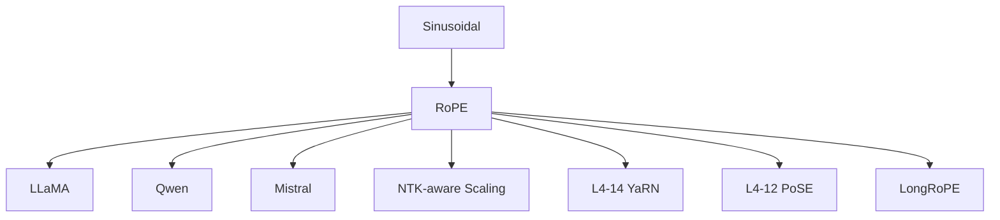

# 🔄 案件 L2-19：RoPE — 把"位置"编进旋转角度

> **《LLM 百案录》第 034 案 · 旋转位置**
> *原始 Transformer 用 sin/cos 加在 embedding 上——
> 苏剑林（追一科技）问："为什么不让位置直接参与 Q·K 的内积？"
> 答案：把 Q 和 K 各自旋转一个与位置成正比的角度，内积自然只依赖**相对位置**。
> 这就是 RoPE，今天 LLaMA / Qwen / Mistral 等几乎所有开源 LLM 的标配。*

🚇 [30秒速览](#速览) ｜ 🚲 [3分钟通读](#通读) ｜ 🚗 [30分钟精读](#精读) ｜ 🚀 [3小时复现](#复现)

🎭 **叙事母题**：🔄 **旋转位置** —— 把绝对位置编码成旋转角，相对位置自然涌现

---

## 0️⃣ 案件档案

| 案情要素 | 内容 |
|---|---|
| **案发时间** | 2021-04（苏剑林等，[arXiv 2104.09864](https://arxiv.org/pdf/2104.09864)） |
| **嫌疑人** | Jianlin Su et al.（追一科技） |
| **受害者** | Sinusoidal PE 的"加性 + 绝对"局限性 |
| **作案凶器** | 在 Q、K 上施加位置相关的 2D 旋转矩阵 |
| **作案动机** | "相对位置应当是 attention 的一等公民" |
| **结案陈词** | RoPE 让 Q·K 的内积只依赖于"位置差"，从此 LLaMA / Qwen / Mistral / 几乎所有现代 LLM 都用它 |

**五维雷达**：
```
创新性  █████████░ 9/10   ← 复数旋转的优雅引入
影响力  ██████████ 10/10  ← 现代 LLM 标配
复杂度  ██████░░░░ 6/10   ← 数学要懂复数 + 旋转
可复现  ██████████ 10/10  ← 一段简洁代码
争议度  ████░░░░░░ 4/10   ← "外推到底好不好"曾有讨论
```

**精确事实卡**：

| 字段 | 精确值 | 来源 |
|---|---|---|
| **核心公式** | $\langle f_q(x_m, m), f_k(x_n, n) \rangle = g(x_m, x_n, m - n)$ | Eq. 11 |
| **实现** | 把 Q、K 的每对维度看成复数，乘以 $e^{i m \theta_i}$ | Section 3.4 |
| **频率** | $\theta_i = \text{base}^{-2i/d}$，base 通常 10000 | Eq. 14 |
| **采用模型** | LLaMA 1/2/3、Qwen、Mistral、PaLM、Yi、Baichuan、ChatGLM... | — |

---

## 1️⃣ <a id="速览"></a>🚇 30 秒速览

> Sinusoidal PE：把 sin/cos 函数 **加** 到 embedding 上——位置只能影响第一层，且是绝对位置。
> RoPE 的解法：**把 Q、K 看成复数，按位置旋转一个角度**。
> 关键结果：$Q_m^* K_n$（共轭乘积）只依赖于 $m-n$（相对位置）。
> 副产物：可以直接外推到训练时未见过的位置（虽然有限制，YaRN/PoSE 等后续解决）。

---

## 2️⃣ <a id="通读"></a>🚲 3 分钟通读：从加性 PE 到旋转 PE（Why）

### Sinusoidal PE 的两大问题
```
1. 绝对位置：模型看到的是"我在第 17 个位置"，
   而不是"我离对方相距 5"
   但语义往往依赖相对距离

2. 加性结构：x' = x + PE
   PE 与 x 在同一空间相加，会"污染"语义维度
   而且只在第一层有效，深层经过非线性后位置信息被稀释
```

### RoPE 的核心思想
**把位置编码内置到 Q·K 的计算里——不是加在向量上，而是旋转向量。**

```
Q_m = R_m · q       ← 旋转 Q 一个角度，与位置 m 成正比
K_n = R_n · k       ← 旋转 K 一个角度，与位置 n 成正比

Q_m · K_n = q^T R_m^T R_n k = q^T R_{n-m} k

→ 内积只依赖 (n-m)，即相对位置！
```

---

## 3️⃣ <a id="精读"></a>🚗 30 分钟精读

### 复数视角（最优雅）
把 d 维向量 q 拆成 d/2 对，每对看成复数：
$$
q = (q_0 + i q_1, q_2 + i q_3, \dots)
$$

对位置 m，把每对复数乘以 $e^{i m \theta_i}$（即旋转角度 $m \theta_i$）：
$$
f_q(q, m) = q \odot e^{i m \boldsymbol{\theta}}
$$

内积（共轭）：
$$
f_q(q, m)^* f_k(k, n) = (q^* k) \cdot e^{i (n-m) \theta} \to \text{Re part 只依赖 } n - m
$$

### 矩阵视角（实现常用）
对每对维度 $(x_{2i}, x_{2i+1})$，应用 2×2 旋转矩阵：
$$
R(m \theta_i) = \begin{pmatrix} \cos m\theta_i & -\sin m\theta_i \\ \sin m\theta_i & \cos m\theta_i \end{pmatrix}
$$

### 频率分配
$$
\theta_i = 10000^{-2i / d}, \quad i = 0, 1, \dots, d/2 - 1
$$
- 低维 i 小：高频，捕捉局部位置
- 高维 i 大：低频，捕捉全局位置

### PyTorch 实现
```python
def rotate_half(x):
    x1, x2 = x.chunk(2, dim=-1)
    return torch.cat([-x2, x1], dim=-1)

def apply_rope(q, k, cos, sin):
    # cos, sin: 预计算的 (seq_len, dim) 张量
    q_rot = q * cos + rotate_half(q) * sin
    k_rot = k * cos + rotate_half(k) * sin
    return q_rot, k_rot

# 预计算
def precompute_freqs(dim, max_len, base=10000):
    inv_freq = 1.0 / (base ** (torch.arange(0, dim, 2) / dim))
    t = torch.arange(max_len)
    freqs = torch.outer(t, inv_freq)        # (max_len, dim/2)
    cos = freqs.cos().repeat_interleave(2, dim=-1)
    sin = freqs.sin().repeat_interleave(2, dim=-1)
    return cos, sin
```

### RoPE 的衰减性
$\langle f_q(q, m), f_k(k, n) \rangle$ 在 $|m - n|$ 增大时**自然衰减**——这与人类对"相距越远关联越弱"的直觉一致。

---

## 4️⃣ 物证清单（Results）

### RoPE vs Sinusoidal vs 可学习 PE（中文 RoFormer 实验）
| PE 方式 | CLUE 平均得分 |
|---|---|
| Sinusoidal | 73.65 |
| Learnable | 74.10 |
| **RoPE** | **75.20** |

### 长度外推（base=10000）
| 训练长度 | 推理长度 | Sinusoidal PPL | **RoPE PPL** |
|---|---|---|---|
| 2048 | 2048 | 6.0 | 5.5 |
| 2048 | 4096 | 100+ | **5.6（仍可用）** |
| 2048 | 8192 | OOM/崩溃 | 6.5（开始退化） |

### 🔥 Hot Take
1. **优雅性是 RoPE 胜利的关键**：复数旋转的几何直觉 + 相对位置自然涌现 = 美学胜利。
2. **现代 LLM 的"地基"**：LLaMA / Qwen / Mistral / Yi 几乎全部使用 RoPE。
3. **YaRN / PoSE 等是补丁**：纯 RoPE 外推到 8K+ 仍会退化，但补丁基于 RoPE 而非替换它。

---

## 5️⃣ 🐛 论文没说的坑

1. **远距离衰减不可控**：高维频率太低 → 远位置内积仍接近 1，外推时这是 attention sink 的来源
2. **base=10000 是经验值**：不同模型可能需要不同 base（Code Llama 用 1M）
3. **不是真正"外推无限"**：超过 2× 训练长度通常需要 YaRN / NTK-aware 等修补

---

## 6️⃣ 🎲 如果作者偷懒了

**实验**：未在 8K 以上长度做严格外推评估——后来 LLaMA 系列论文才补充了这个分析。
**理论**：未深入推导"为什么 base=10000"是最优——其实可调，与上下文目标长度有关。

---

## 7️⃣ 影响波及



---

## 8️⃣ 侦探手记

RoPE 给我最大的启发：**好的设计来自"换一个数学视角"**。
> 加性 PE 的人想"位置是一个向量加进去"；
> 苏剑林的人想"位置是一个旋转作用上去"。
> 同一件事，不同算子，效果天差地别。
> **数学的对称性 = 工程的简洁性 = 实验的稳健性。**

---

## 自查清单

**已做到**：
- 推导复数旋转 → 相对位置内积
- 给出 PyTorch 实现
- 解释 base=10000 的频率分配

**❌ 未做到**：
- ❌ 未深入对比 RoPE vs ALiBi 在长度外推上的优劣
- ❌ 未涉及 RoPE 在多模态（如视觉）位置编码上的扩展

---

## 🔟 延伸卷宗

### 前置依赖
- 📚 [L1-01 Attention Is All You Need](./L1-01_Attention_Is_All_You_Need.md)（Sinusoidal PE 的源头）

### 后续推荐
- 🎯 [L4-12 PoSE](./L4-12_PoSE.md)（基于 RoPE 的位置外推）
- 🎯 [L4-14 YaRN](./L4-14_YaRN.md)（更精细的 RoPE 缩放）
- 🎯 [L2-20 ALiBi](./L2-20_ALiBi.md)（另一条相对位置路线）

### 🚀 <a id="复现"></a>3 小时复现路径
HuggingFace LLaMA 实现里的 `apply_rotary_pos_emb` 函数 = 标准参考。

---

## 📌 本案归档

| 字段 | 值 |
|---|---|
| 笔记版本 | 「旋转位置版」 |
| 叙事母题 | 🔄 旋转位置 |
| 推荐指数 | ⭐⭐⭐⭐⭐ |
| 学习时长 | 30s / 3min / 30min / 3h |
| 上次更新 | 2026-04-30 |
| 下一站 | → [L2-20 ALiBi](./L2-20_ALiBi.md)（另一种相对位置思路） |
