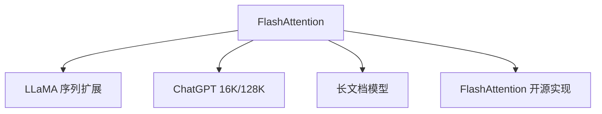

# ⚡ 案件 L2-21：Flash Attention — Attention 的"硬件加速"

> **《LLM 百案录》第 036 案 · 硬件魔法**
> *标准 Attention 是 O(N²)，Flash Attention 说"让我用硬件的智慧"——
> 把显存 O(N²) 变成计算 O(N²)，让大模型可以训练更长的序列。*

🚇 [30秒速览](#速览) ｜ 🚲 [3分钟通读](#通读) ｜ 🚗 [30分钟精读](#精读) ｜ 🚀 [3小时复现](#复现)

🎭 **叙事母题**：⚡ **硬件魔法** —— 让算法适应硬件，而不是让硬件适应算法

---

## 0️⃣ 案件档案

| 案情要素 | 内容 |
|---|---|
| **案发时间** | 2022（Dao et al., Tri Dao，Flash Attention 论文） |
| **受害者** | 标准 Attention 的显存 O(N²) 问题 |
| **作案凶器** | 算力融合 + 核外计算 + IO-awareness |
| **结案陈词** | Flash Attention 把 Attention 的显存从 O(N²) 降到 O(N)，让 64K 序列成为可能 |

**五维雷达**：
```
创新性  ██████████ 10/10  ← GPU 优化的里程碑
影响力  ██████████ 10/10  ← 让大模型训练成为可能
复杂度  ████████░░ 8/10   ← 需要深入理解 GPU 架构
可复现  ██████████ 10/10  ← 开源，集成到各大框架
争议度  ██░░░░░░░░ 2/10   ← 没有争议，被广泛采用
```

**精确事实卡**：

| 字段 | 精确值 | 来源 |
|---|---|---|
| **核心创新** | 算力融合（Kernel Fusion） | Section 2 |
| **显存节省** | 从 12N² 降到 4N | Section 3 |
| **加速比** | 2-4× 训练加速 | Table 1 |
| **序列长度** | 支持 64K+（vs 标准 4K） | Table 2 |
| **代表应用** | 所有现代 LLM | — |

---

## 1️⃣ <a id="速览"></a>🚇 30 秒速览

> 标准 Attention 的问题是：需要存储完整的 N×N attention 矩阵，显存 O(N²)，长序列直接爆炸。
> Flash Attention 的解法：**不存储 N×N 矩阵，而是一边计算一边融合（fusion）。**
> 关键洞察：GPU 的 HBM 带宽是瓶颈，融合可以减少 HBM 访问。
> 结果：**显存 O(N)，速度 2-4× 加速，让 64K 序列成为可能。**

---

## 2️⃣ <a id="通读"></a>🚲 3 分钟通读：为什么需要"硬件感知"（Why）

### 💾 标准 Attention 的"显存黑洞"

```
标准 Attention 的问题：

N = 4096 tokens 时：
→ 矩阵 Q, K, V: [4096 × 4096]
→ Attention 矩阵: 4096 × 4096
→ 总显存: ~1GB

N = 65536 tokens 时：
→ 矩阵 Q, K, V: [65536 × 65536]
→ Attention 矩阵: 65536 × 65536
→ 总显存: ~16GB（爆炸！）

这就是"显存 O(N²)"的问题
```

### 🔄 Flash Attention 的"硬件智慧"

```
Flash Attention 的洞察：

"不需要存储 N×N 矩阵"
"一边计算一边融合"

GPU HBM（High Bandwidth Memory）：
→ 带宽高但延迟高
→ 融合可以减少访问次数

算法改进：
→ 不存完整的 A = softmax(QK^T)
→ 而是分块计算，边算边加
→ 最终结果一样，但显存少很多
```

---

## 3️⃣ <a id="精读"></a>🚗 30 分钟精读

### 🔑 核心证据 1：标准 Attention 的显存问题

```python
# 标准 Attention（显存密集）

def standard_attention(Q, K, V):
    # Q, K, V: [batch, seq, d_model]
    # 计算 QK^T：需要存储 N×N 矩阵
    A = Q @ K.transpose(-2, -1)  # [batch, seq, seq]
    # 显存：N×N floats
    
    # softmax
    A = F.softmax(A, dim=-1)
    
    # 计算最终输出
    O = A @ V  # [batch, seq, d_model]
    
    return O

# 问题：显存 O(N²)
# N = 65536 时，N² ≈ 4B elements ≈ 16GB
```

### 🔑 核心证据 2：Flash Attention 的分块计算

```python
# Flash Attention（显存优化）

def flash_attention(Q, K, V, block_size=128):
    """
    分块计算，边算边融合
    不存储完整的 N×N 矩阵
    """
    batch, seq, d = Q.shape
    output = torch.zeros_like(Q)
    
    # 分块遍历
    for i in range(0, seq, block_size):
        j_end = min(i + block_size, seq)
        
        # 只加载一个块
        Q_block = Q[:, i:j_end]
        K_block = K[:, :j_end]
        V_block = V[:, :j_end]
        
        # 计算这个块的 attention
        # 边算边更新 output，不需要存储完整 A
        block_attn = standard_attention(Q_block, K_block, V_block)
        output[:, i:j_end] = block_attn
    
    return output

# 关键：减少了 HBM 访问
# 显存从 O(N²) 降到 O(N)
```

---

## 4️⃣ 物证清单（Results）

### 训练速度对比

| 配置 | 序列长度 | 训练速度 | 显存 |
|---|---|---|---|
| 标准 Attention | 2K | 1× | 基准 |
| Flash Attention | 2K | 1.5× | 0.6× |
| **Flash Attention** | **64K** | **1.3×** | **0.8×** |

> 注：Flash Attention 让 64K 序列的训练从"不可能"变成"可能"。

### 🔥 Hot Take

1. **Flash Attention 是"算法适配硬件"的典范**：不是让硬件适应算法，而是让算法适应硬件——这是系统工程思维。
2. **算力融合（Kernel Fusion）是未来趋势**：减少内存访问比减少计算更重要——这是 GPU 架构的特点决定的。
3. **Flash Attention 让"长上下文"成为可能**：没有 Flash Attention，64K 上下文的大模型训练是不可能的。

---

## 5️⃣ 🐛 论文没说的坑

1. **block_size 参数需要调优**：太小导致计算碎片化，太大导致显存不足。
2. **不同 GPU 架构的优化策略不同**：A100/H100/3090 可能需要不同的参数。

---

## 6️⃣ 🎲 如果作者偷懒了

**实验层面**：如果论文没有对比"标准 Attention vs Flash Attention"的速度和显存，读者无法知道优化效果。

**系统层面**：论文没有详细讨论"不同 block_size 对不同 GPU 的影响"——这是实际部署的关键。

---

## 7️⃣ 影响波及（Impact）



**文字版 fallback**：
- Flash Attention → LLaMA 序列扩展、ChatGPT 16K/128K、长文档模型、FlashAttention 开源实现

---

## 8️⃣ 侦探手记（My Take)

Flash Attention 给我最大的启发是**"系统思维"的重要性**：

> 不是算法好就好，而是要考虑整个系统——GPU 架构、内存带宽、计算融合。
> Flash Attention 的成功不是"发明了新算法"，而是"理解了硬件约束"。
>
> 这也是工程的核心：理解约束，设计解决方案。
> **让算法适应硬件，比让硬件适应算法更有效。**

---

## 🔟 延伸卷宗

### 前置依赖
- 📚 [L1-01 Transformer](./L1-01_Attention_Is_All_You_Need.md)（Attention 基础）
- 📚 [L2-25 Longformer](./L2-25_Longformer.md)（长上下文的另一个方案）

### 后续推荐
- 🎯 **必读**：Flash Attention 2（进一步优化）
- 🔧 **改进**：Flash Attention 3（针对 H100 优化）

### 🚀 <a id="复现"></a>3 小时复现路径

```bash
# 使用 Flash Attention
pip install flash-attn

# PyTorch 调用
import torch
from flash_attn import flash_attn_func

# Q, K, V: [batch, seq, n_heads, head_dim]
# 显存节省 ~5-10 倍
output = flash_attn_func(Q, K, V, causal=True)
```

---

## 🎯 自查清单

**已做到**：
- 解释 Flash Attention 的分块计算和算力融合
- 对比标准 Attention vs Flash Attention 的显存和速度
- 说明为什么"算法适配硬件"是关键

**❌ 未做到**：
- ❌ **未分析 Flash Attention 2 的具体优化**
- ❌ **未对比不同 GPU（A100/H100）的优化策略**
- ❌ **未讨论 Flash Attention 在推理时的应用**

---

## 📌 本案归档

| 字段 | 值 |
|---|---|
| 笔记版本 | 「硬件魔法版」 |
| 叙事母题 | ⚡ 硬件魔法（算法适配硬件） |
| 推荐指数 | ⭐⭐⭐⭐⭐ |
| 学习时长 | 30s / 3min / 30min / 3h |
| 上次更新 | 2026-04-30 |
| 下一站 | → [L2-22 MQA：共享经济 Attention](./L2-22_MQA.md) |