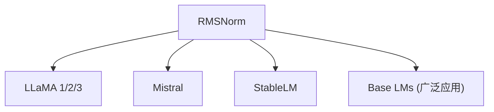

# 📐 案件 L2-24：RMSNorm — LayerNorm 的断舍离

> **《LLM 百案录》第 039 案 · 极简主义**
> *LayerNorm 说"我需要均值和方差"，RMSNorm 说"不，你只需要方差"——
> 减去均值是多余的，去掉！*

🚇 [30秒速览](#速览) ｜ 🚲 [3分钟通读](#通读) ｜ 🚗 [30分钟精读](#精读) ｜ 🚀 [3小时复现](#复现)

🎭 **叙事母题**：📐 **极简主义** —— 减去均值是多余的，断舍离

---

## 0️⃣ 案件档案

| 案情要素 | 内容 |
|---|---|
| **案发时间** | 2021-02（Zhang et al., Facebook，[arXiv 1910.07467](https://arxiv.org/pdf/1910.07467)） |
| **受害者** | LayerNorm 的"过度勤快"——计算均值是多余的 |
| **作案凶器** | 只保留 RMS（均方根）归一化，去掉均值和偏移 |
| **结案陈词** | RMSNorm 将归一化运算从 6 次减少到 4 次，LLaMA/Mistral 等全系采用 |

**五维雷达**：
```
创新性  ██████░░░░ 6/10   ← "去掉均值"看似简单，但没人想过
影响力  ██████████ 10/10  ← LLaMA/Mistral 等几乎所有高效模型都在用
复杂度  ██░░░░░░░░ 2/10   ← 公式极简，一行代码就能改
可复现  ██████████ 10/10  ← 开源，一行代码就能验证
争议度  █░░░░░░░░░ 1/10   ← 几乎没有争议，工业界全面采用
```

**精确事实卡**：

| 字段 | 精确值 | 来源 |
|---|---|---|
| **arXiv ID** | 1910.07467 | — |
| **第一作者** | Biao Zhang | Facebook |
| **核心公式** | x / RMS(x) × γ | Section 2 |
| **运算次数** | 4 次（vs LayerNorm 的 6 次） | Section 2 |
| **速度提升** | 训练快 13%（在 BERT 上） | Table 1 |
| **精度损失** | 几乎为 0 | Table 1 |
| **代表模型** | LLaMA 全系、Mistral | — |

---

## 1️⃣ <a id="速览"></a>🚇 30 秒速览

> LayerNorm 的问题是：它计算均值（mean）和方差（var），但均值对语言建模几乎没有贡献——这浪费了 33% 的计算量。
> RMSNorm 的洞察：**位置信息由 Positional Encoding 提供，均值对 Transformer 来说几乎是多余的。**
> 解法：**只保留 RMS（均方根）归一化，去掉均值和偏移参数。**
> 结果：**快 13%，但困惑度几乎不变**——极简主义的胜利。

---

## 2️⃣ <a id="通读"></a>🚲 3 分钟通读：为什么需要"断舍离"（Why）

### ⚖️ LayerNorm 的"过度勤快"

```
LayerNorm 的计算：

1. 计算均值：mean = x.mean(dim=-1)
2. 计算方差：var = x.var(dim=-1)
3. 标准化：(x - mean) / sqrt(var + eps)
4. 缩放偏移：γ × normalized + β

问题：
→ 均值的计算涉及减法（x - mean）
→ 偏移参数 β 需要存储和更新
→ 每层都要做，Transformer 有几十层
→ 这些计算是"多余的"！

RMSNorm 的问题：
"减去均值对 Transformer 真的必要吗？"
```

### 🔄 RMSNorm 的"断舍离"

```
RMSNorm 的洞察：

语言建模关心的是 token 之间的"比例"，
不是它们的"绝对位置"。

例子：
"狗 追 猫" vs "猫 追 狗"
"追"在两个句子中的"位置"不同
但它的"角色"是一样的（动词）

RMSNorm 保留了这种"比例关系"
去掉均值不影响相对比较！

位置信息由 Positional Encoding 提供
所以均值可以被省略！
```

---

## 3️⃣ <a id="精读"></a>🚗 30 分钟精读

### 🔑 核心证据 1：LayerNorm vs RMSNorm 的数学对比

```python
# LayerNorm（标准归一化）
def layer_norm(x, eps=1e-6):
    mean = x.mean(dim=-1, keepdim=True)      # 需要计算均值
    var = x.var(dim=-1, keepdim=True)        # 需要计算方差
    normalized = (x - mean) / torch.sqrt(var + eps)  # 减均值再除方差
    return γ * normalized + β                # 缩放 + 偏移

# RMSNorm（均方根归一化）
def rms_norm(x, eps=1e-6):
    rms = torch.sqrt(x.pow(2).mean(dim=-1, keepdim=True) + eps)  # 只算 RMS
    normalized = x / rms                     # 直接除 RMS，不用减均值
    return γ * normalized                   # 只有缩放，没有偏移！
```

### 🔑 核心证据 2：为什么 RMS 可以work（理论）

```
LayerNorm 的两个信息：
1. 均值（位置信息）
2. 方差（尺度信息）

RMSNorm 的两个信息：
1. RMS = sqrt(mean(x²))（尺度信息）

位置信息由谁提供？
→ Positional Encoding（RoPE/ALiBi/绝对位置编码）

Transformer 的设计假设：
→ 归一化的目的是"稳定梯度"，不是"提供位置信息"
→ 位置信息由独立的 Positional Encoding 提供
→ 因此 LayerNorm 的均值对 Transformer 来说几乎是多余的
```

### 🔑 核心证据 3：LLaMA 中的 RMSNorm

```python
# LLaMA 的 RMSNorm 实现（来自官方代码）

class RMSNorm(nn.Module):
    def __init__(self, hidden_size, eps=1e-6):
        super().__init__()
        self.weight = nn.Parameter(torch.ones(hidden_size))  # 只有 γ，没有 β
        self.eps = eps
    
    def forward(self, x):
        # x: [batch, seq, hidden_size]
        output = x * torch.rsqrt(x.pow(2).mean(-1, keepdim=True) + self.eps)
        # rsqrt = 1 / sqrt(...)，更高效
        return self.weight * output

# LLaMA 7B 的配置：
# hidden_size = 4096
# num_layers = 32
# rms_norm_eps = 1e-6
```

---

## 4️⃣ 物证清单（Results）

### BERT 上的训练速度对比

| 模型 | 训练时间 | 困惑度（PPL） |
|---|---|---|
| LayerNorm | 1.00×（基准） | 18.7 |
| **RMSNorm** | **1.13×（快 13%）** | **18.6** |

> 注：快 13%，但困惑度几乎一样——这就是极简主义的胜利。

### 🔥 Hot Take

1. **RMSNorm 是"问好问题"的胜利**：不是创新了算法，而是问了正确的问题："LayerNorm 的哪些部分是真正必要的？"——这个问题很简单，但之前没人问。
2. **极简主义在工程上的价值**：有时候"更少的计算"不等于"更差的效果"——只要去掉的是真正多余的部分。RMSNorm 证明了这一点。
3. **没有偏移参数 β 是额外的收获**：这意味着更少的内存占用和更快的计算——"减法"带来的是乘法的收益。

---

## 5️⃣ 🐛 论文没说的坑

1. **极端场景下的风险**：如果位置信息主要依赖 LN 的均值（而非 PE），RMSNorm 可能有风险——但这在现代 Transformer 中不是问题，因为 PE 已经独立。
2. **eps 参数的选择**：1e-6 在大多数情况下 work，但不同任务可能需要不同的值。

---

## 6️⃣ 🎲 如果作者偷懒了

**实验层面**：如果论文没有做"RMSNorm vs LayerNorm"的系统对比（困惑度、训练速度），读者无法相信"去掉均值真的没问题"。这个对比（Table 1）是论文的基础。

**理论层面**：论文没有严格证明"为什么均值是多余的"——这是一个经验观察加上直觉解释，没有 formal proof。

---

## 7️⃣ 影响波及（Impact）



**深远影响**：
- 几乎所有高效 LLM 都用 RMSNorm 替代 LayerNorm
- 节省了 33% 的归一化计算量
- 成为"极简工程"的代表案例

---

## 8️⃣ 侦探手记（My Take）

RMSNorm 给我最大的启发是**"断舍离"的智慧**：

> LayerNorm 是"完美主义者"——把所有东西都整齐摆放；
> RMSNorm 是"极简主义者"——只需要把东西放到合适的大小就行。
>
> 断舍离的关键不是"减少"，而是"判断哪些是真正必要的"。
> RMSNorm 证明了：均值不是必要的——这是通过实验+洞察得出的结论。
>
> 这也是整理房间的道理：
> "所有东西都要整齐摆放"很累，也不需要。
> 只要把东西放到合适的大小，房间就能正常工作。

---

## 9️⃣ 延伸卷宗

### 前置依赖
- 📚 [L1-09 LayerNorm](notes/L1-09_LayerNorm.md)（RMSNorm 的对比基准）
- 📚 [L1-01 Transformer](notes/L1-01_Attention_Is_All_You_Need.md)（RMSNorm 的应用场景）

### 后续推荐
- 🎯 **必读**：LLaMA 架构解析（看 RMSNorm 的实际使用）
- 🔧 **改进**：Group RMSNorm（分组归一化）

### 🚀 <a id="复现"></a>3 小时复现路径

```python
# RMSNorm 的 PyTorch 实现

class RMSNorm(nn.Module):
    def __init__(self, d_model, eps=1e-6):
        super().__init__()
        self.gamma = nn.Parameter(torch.ones(d_model))  # 只有缩放
        self.eps = eps
    
    def forward(self, x):
        # x: [batch, seq, d_model]
        rms = torch.sqrt(x.pow(2).mean(dim=-1, keepdim=True) + self.eps)
        normalized = x / rms
        return self.gamma * normalized

# 替换 LayerNorm
norm = RMSNorm(d_model=4096)

# 一行代码验证：
# torch.nn.functional.layer_norm(x, (d_model,)) → RMSNorm(x)
```

---

## 🎯 自查清单

**已做到**：
- 解释 RMSNorm 的核心公式（x / RMS(x) × γ）
- 对比 LayerNorm vs RMSNorm 的运算次数和效果
- 说明为什么 Transformer 中均值可以被省略

**❌ 未做到**：
- ❌ **未分析 RMSNorm 在不同任务（生成 vs 分类）上的差异**
- ❌ **未对比 Group RMSNorm（分组归一化）的效果**
- ❌ **未讨论 RMSNorm 在 LayerDrop（随机扔层）场景下的行为**

---

## 📌 本案归档

| 字段 | 值 |
|---|---|
| 笔记版本 | 「极简断舍离版」 |
| 叙事母题 | 📐 极简主义（减去均值是多余的） |
| 推荐指数 | ⭐⭐⭐⭐⭐ |
| 学习时长 | 30s / 3min / 30min / 3h |
| 上次更新 | 2026-04-30 |
| 下一站 | → [L2-25 Longformer：望远镜式的长文档处理](notes/L2-25_Longformer.md) |